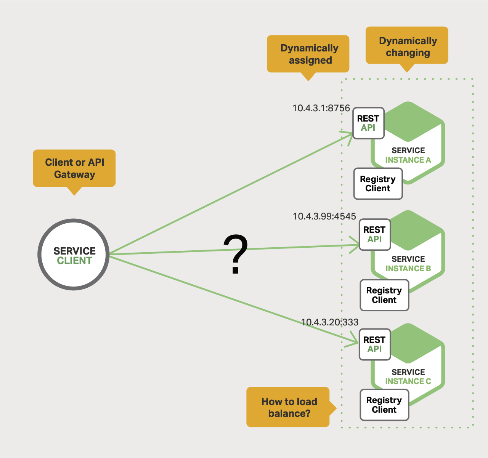
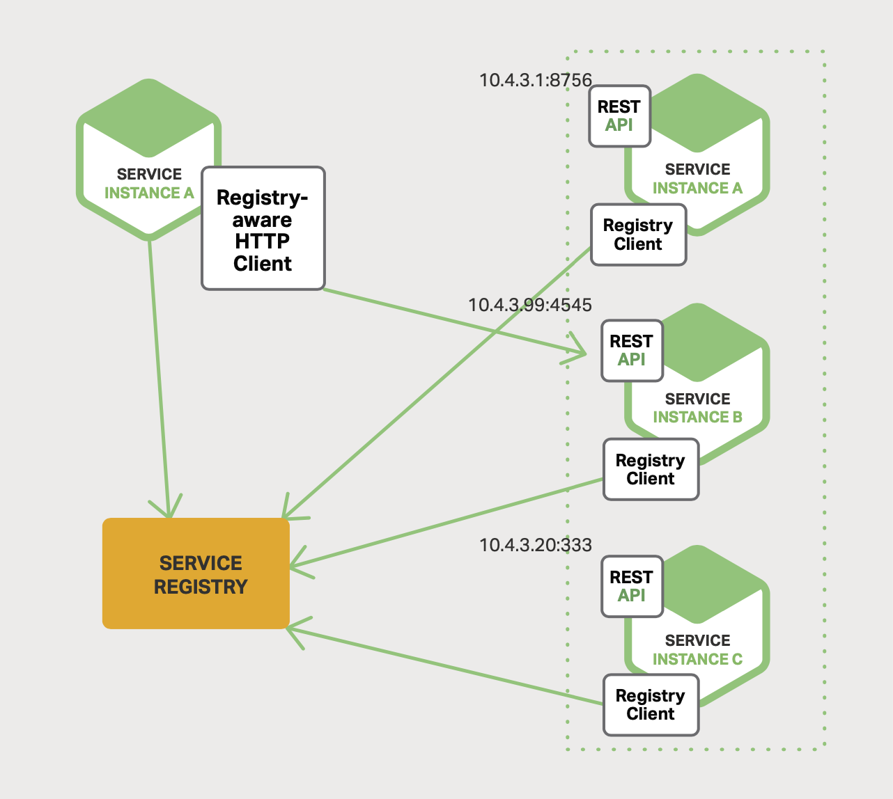
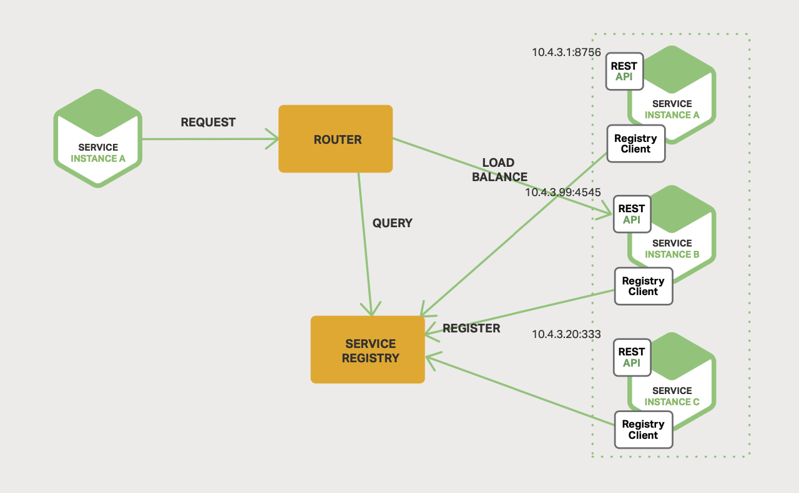
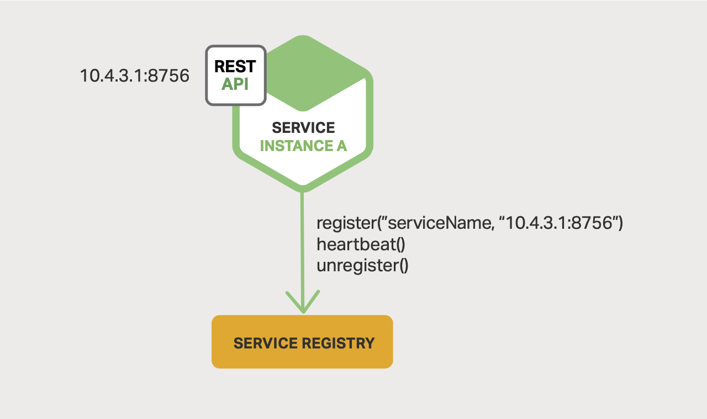
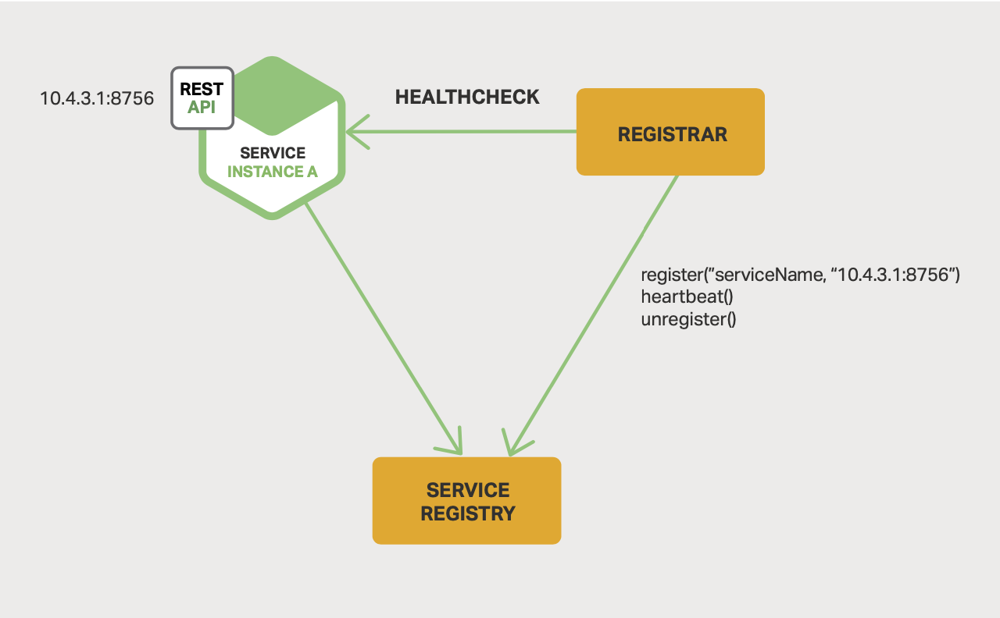

# 4 Service Discovery

- [4 Service Discovery](#4-service-discovery)
  - [Why Use Service Discovery?](#why-use-service-discovery)
  - [The Client-Side Discovery Pattern](#the-client-side-discovery-pattern)
  - [The Server-Side Discovery Pattern](#the-server-side-discovery-pattern)
  - [The Service Registry](#the-service-registry)
  - [Service Registration Options](#service-registration-options)
  - [The Self-Registration Pattern](#the-self-registration-pattern)
  - [The Third-Party Registration Pattern](#the-third-party-registration-pattern)

## Why Use Service Discovery?

*Figure 4-1. A client to API Gateway need help finding services*.

In a modern, cloud-based microservices application, service instances have
dynamically assigned network locations. Moreover, the set of service instances
changes dynamically because of autoscaling, failures, and upgrades.

There are two main service discovery patterns: client-side discovery and
service-side discovery,

## The Client-Side Discovery Pattern

The client queries a **service registry**, which is a database of available
service instances. The client then uses a load-balancing algorithm to select
one of the available service instances and makes a request.

*Figure 4-2. Clients can take on the task of discovering services*.

The network location of a service instance is registered with the service
registry when it starts up. It is removed from the service registry when the
instance terminates. The service instance's registration is typically refreshed
periodically using a heartbeat mechanism.

Benefits:

- This pattern is straightforward
- There are no other moving parts except for the service registry
- Clients can make load-balancing decisions by themselves.

Drawbacks:

- It couples the client with the service discovering code.

## The Server-Side Discovery Pattern

*Figure 4-3. Service discovery can also be handled among servers*.

The client makes a request to a service via a load balancer. The load balancer
queries the service registry and routes each request to an available service
instance.

Examples:

- ELB (AWS Elastic Load Balancer)
- NGINX PLUS or NGINX with `Consul Template` and `Consul service registry`
- Deployment environments such as `Kubernetes` and `Marathon` run a proxy which
  plays the role of a server-side discovery load balancer on each host in the
  cluster.

Benefits:

- Datails of discovery are abstracted away from the client.

Drawbacks:

- It is yet another highly available system component that needs to be managed
  unless the service registry is provided by the deployment environment.

## The Service Registry

A service registry needs to be highly available and up to date.

`Netflix Eureka` provides a REST API for registering (`POST`) and querying
(`GET`) service instances. Every 30 seconds it refreshes (`PUT`) its
registration and remove (`DELETE` or a `timeout`) a registration.

Other examples of service registries:

- `etcd` (used by `Kubernetes` and `Cloud Foundry`)
- `Consul`
- `Apache ZooKeeper`

## Service Registration Options

- **Self-registration pattern**: Service instances register themselves.
- **Third-party registration pattern**: Other system component manages the
  registration.

## The Self-Registration Pattern

In this pattern, services are responsible for registering and unregistering
itself with the service registry. It might send heartbeat requests to prevent
its registration expiring.

*Figure 4-4. Services can handle their own registration*.

Benefits:

- It is relatively simple and does not require any other system components

Drawbacks:

- It couples the service instances to teh service registry.

## The Third-Party Registration Pattern

In this pattern, services are not responsible for registering themselves with
the service registry. Instead, another system component known as the
**service registrar** handles the registration. It tracks changes to the set of
running instances by either polling the deployment environment or subscribing to
events.

*Figure 4-5. A separate registrar service can be responsible for registering
others*.

Examples:

- `Registrator`: Automatically manages services that are deployed as Docker
  containers.
- `NetflixOSS Prana`
- As a built-in component in some deployment environments.
  - Kubernetes
  - Amazon ELB

Benefits:

- Services are decoupled from the service registry.
- Service registration is handled in a centralized manner withn a dedicated
  service.

Drawbacks:

- It is yet another highly available system component that needed to be managed.
