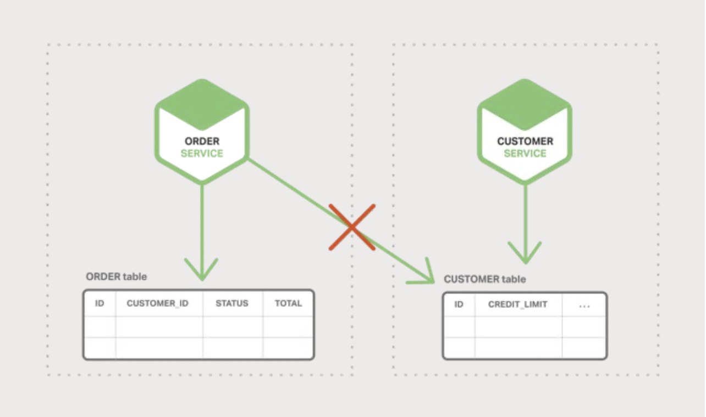
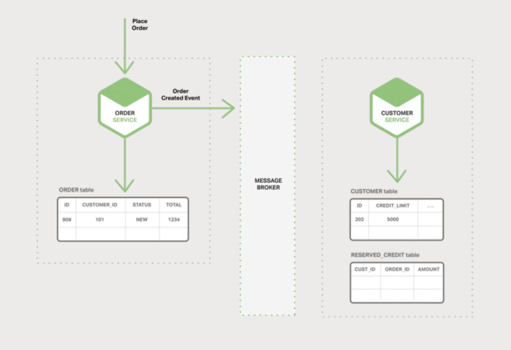
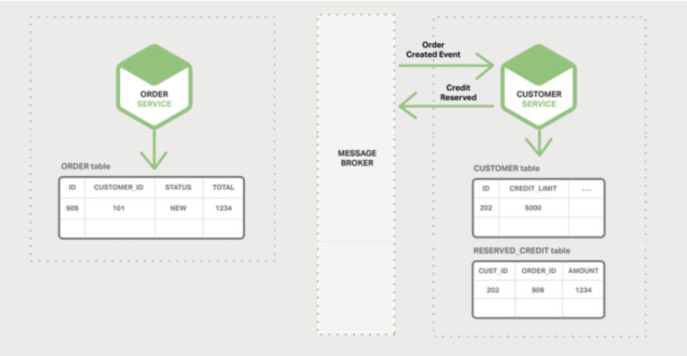
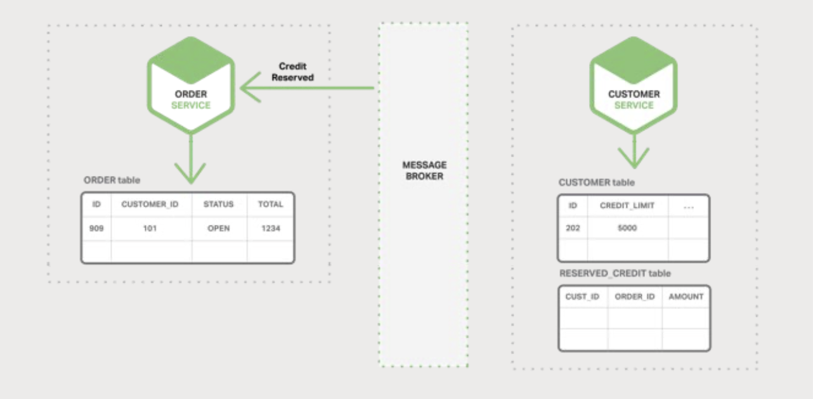
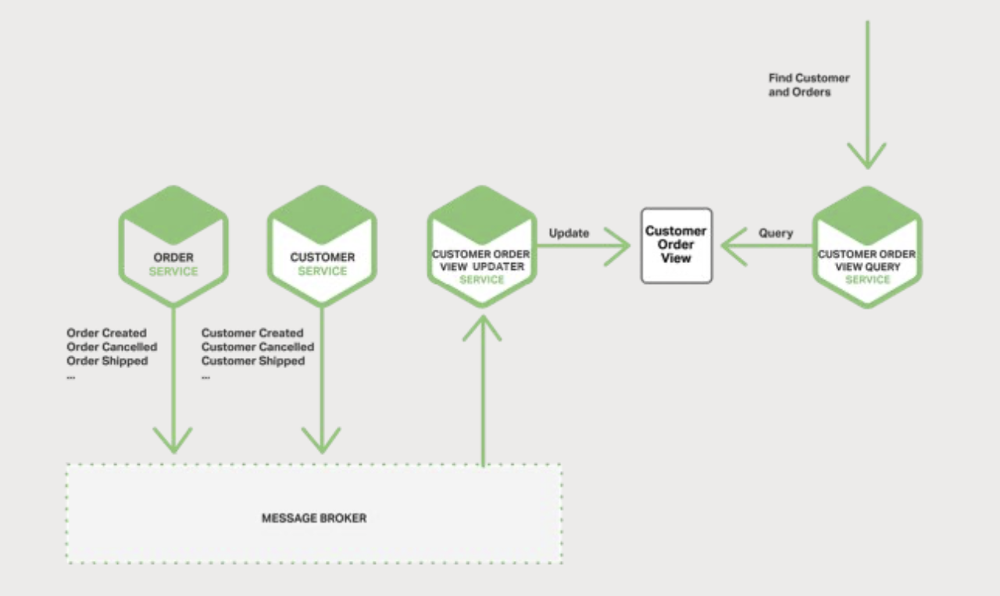
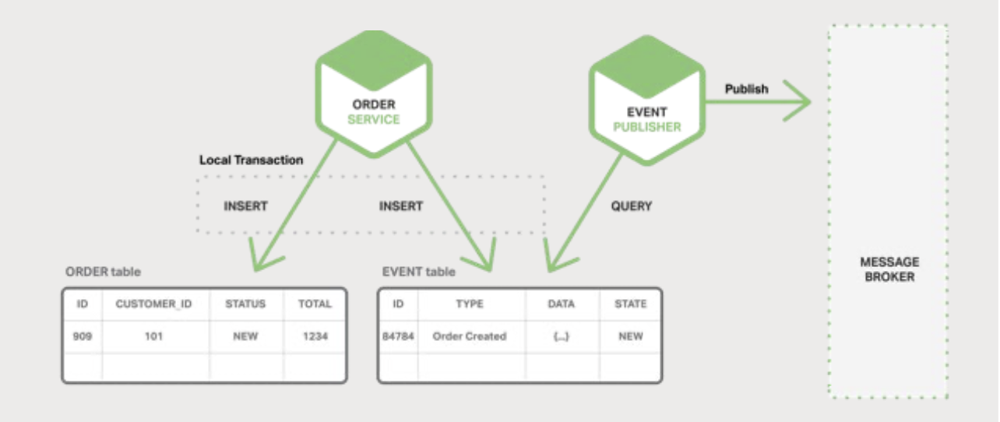
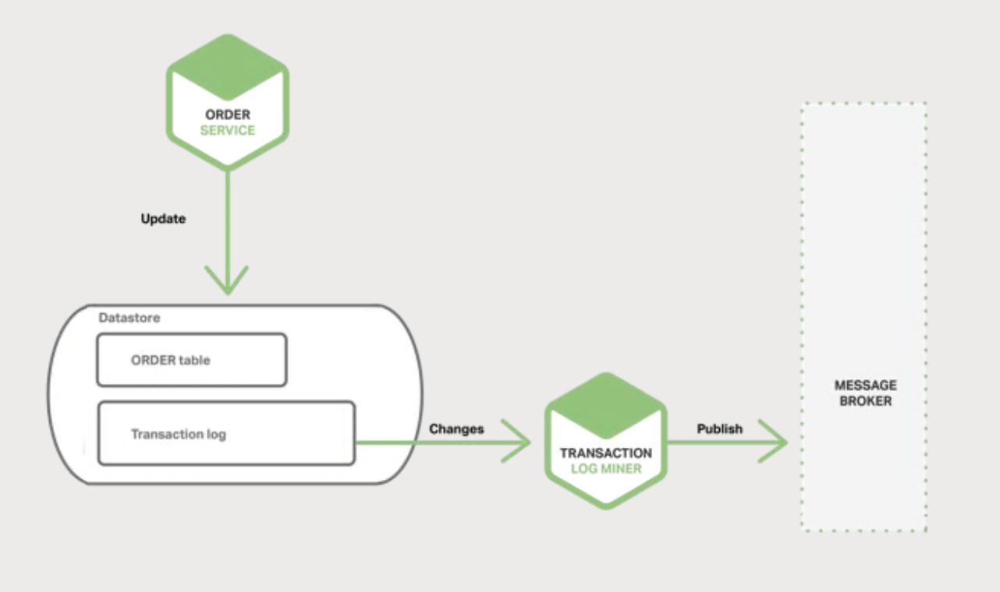
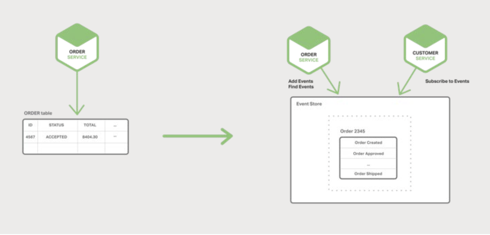

# 5 Event-Driven Data Management for Microservices

- [5 Event-Driven Data Management for Microservices](#5-event-driven-data-management-for-microservices)
  - [Microservices and the Problem of Distributed Data Management](#microservices-and-the-problem-of-distributed-data-management)
  - [Event-Driven Architecture](#event-driven-architecture)
  - [Achieving Atomicity](#achieving-atomicity)
  - [Publishing Events Using Local Transactions](#publishing-events-using-local-transactions)
  - [Mining a Database Transaction Log](#mining-a-database-transaction-log)
  - [Using Event Sourcing](#using-event-sourcing)

## Microservices and the Problem of Distributed Data Management

A key benefit of using a relational database in a monolithic application is that
it can use `ACID transactions`:

- **Atomicity**: Changes are made atomically.
- **Consistency**: The state of the database is always consistent.
- **Isolation**: Even though transactions are executed concurrently, it appears
  they are executed serially.
- **Durable**: Once a transaction has committed, it is not undone.

Data access becomes much more complex in microservices architecture.
Microservices-based applications often use a mixture of SQL and NoSQL databases,
the so-called **polyglot persistence** approach. It introduces some distributed
data management challenges.

The first: How to implement business transactions that maintain consistency
across multiple services.

*Figure 5-1. Microservices each have their own data*.

2PC (two-phase commit, distributed transactions) is usually not a viable option
in modern applications. The CAP theorem requires you to choose between
availability and ACID-style consistency. Many modern technologies do not support
2PC.

The second: How to implement queries that retrieve data from multiple services.

If a service's data only support the lookup of orders by their primary key,
there is no obvious way to retrieve the needed data.

## Event-Driven Architecture

In this architecture, a microservice publishes an event when something notable
happens, such as when it updates a business entity. Other microservices
subscribe to those events.

A business transaction consists of a series of steps. Each step consists of a
microservice **updating a business entity** and
**publishing an event that triggers the next step**.

Examples:

- The Order Service creates an Order with status `NEW` and publishes an
  `Order Created` event.

*Figure 5-2. The Order Service publishes an event*.

- The Customer Service consumes the `Order Created` event, reserves credit for
  the order, and publishes a `Credit Reserved` event.

*Figure 5-3. The Customer Service responds*.

- The Order Service consumes the `Credit Reserved` event and changes the status
  of the order to `OPEN`.

*Figure 5-4. The Order Service acts on the response*.

You can also use events to maintain **materialized views (物化视图)** that
pre-join data owned by multiple microservices. The service that maintains the
view subscribes to the relevant events and updates the view.

*Figure 5-5. The Customer Order View is accessed by two services*.

Benefits:

- It enables the implementation of transactions that span multiple services and
  provide eventual consistency.
- It also enables an application to maintain materialized views.

Drawbacks:

- The programming model is more complex than when using ACID transactions. You
  must implement compensating transactions to recover from application-level
  failures.
- Subscribers must detect and ignore duplicate events.

## Achieving Atomicity

The Order Service must insert a row into the ORDER table and publish an Order
Created event. It is essential that these two operations are done atomically.

The standard way to ensure atomicity is to use a distributed transaction
involving the database and the Message Broker.

However, for the reasons described above, such as the CAP theorem, this is
exactly what we do not want to do.

## Publishing Events Using Local Transactions

One way to achieve atomicity is for the application to publish events using a
**multi-step process involving only local transactions**. The trick is to have
an EVENT table, which functions as a message queue, in the database that stores
the state of the business entities. The application begins a (local) database
transaction, updates the state of the business entities, inserts an event into
the EVENT table, and commits the transaction. A separate application thread or
process queries the EVENT table, publishes the events to the Message Broker, and
then uses a local transaction to mark the events as published.

*Figure 5-6. Achieving atomicity with local transactions*.

Benefits:

- It guarantees an event is published for each update without relying on 2PC.
- The application publishes business-level events, which eliminates the need to
  infer them.

Drawbacks:

- It is potentially error-prone since the developer must remember to publish
  events.
- It is challenging to implement when using some NoSQL databases because of
  their limited transaction and query capabilities.

## Mining a Database Transaction Log

The application updates the database, so changes are recorded in the database's
transaction log. The Transaction Log Miner thread or process read the
transaction log and publishes events to the Message Broker.

*Figure 5-7. A Message Broker can arbitrate data transactions*.

Benefits:

- It guarantees that an event is published for each update without using 2PC.
- It simplifies the application by separating event publishing from the
  application's business logic.

Drawbacks:

- The format of the transaction log is proprietary to each database and can even
  change between database versions.
- It can be difficult to reverse engineer the high-level business events from
  the low-level updates recorded in the transaction log.

## Using Event Sourcing

**Event Sourcing (事件溯源)** achieves atomicity without 2PC by using a radically
different, event-centric approach to persisting business entities. Rather than
store the current state of an entity, the application stores a sequence of
state-changing events. The application reconstructs an entity's current state
by replaying the events. Whenever the state of a business entity changes, a new
event is appended to the list of events. Since saving an event is a single
operation, it is inherently atomic.

In a traditional approach, each order maps to a row in an ORDER table and to
rows in an ORDER_LINE_ITEM table.

When using event sourcing, the Order Service stores an Order in the form of its
state-changing events: `Created`, `Approved`, `Shipped`, `Cancelled`. Each event
contains sufficient data to reconstruct the Order's state.

*Figure 5-8. Events can have complete recovery data*.

Event persist in an Event Store, which is a database of events. The store has an
API for adding and retrieving an entity's events. The Event Store also behaves
like the Message Broker in the architectures we described previously. It
provides an API that enables services to subscribe to events. The Event Store
delivers all events to all interested subscribers. The Event Store is the
backbone of an event-driven microservices architecture.

Benefits:

- It solves one of the key problems in implementing an event-driven achitecture
  and makes it possible to reliably publish events whenever state changes.
- It solves data consistency issues in a microservice architecture.
- It persists events rather than domain objects, it mostly avoid the
  **object-relational impedance mismatch problem**.
- It provides a 100% reliable audit log of the changes made to a business entity
  and makes it possible to implement temporal queries that determine the state
  of an entity at any point in time.
- Business logic consists of loosely coupled business entities that exchange
  events.

Drawbacks:

- It is a different and unfamiliar style of programming and so there is a
  learning curve.
- The event store only directly supports the lookup of business entities by
  primary key.
