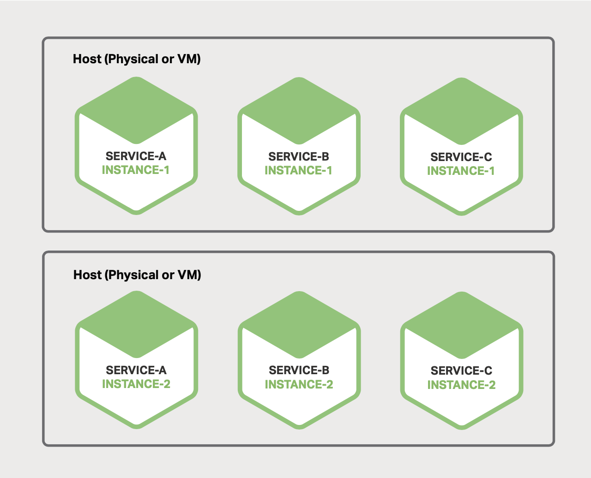

# 6 Choosing a Microservices Deployment Strategy

- [6 Choosing a Microservices Deployment Strategy](#6-choosing-a-microservices-deployment-strategy)
  - [Motivations](#motivations)
  - [Multiple Service Instances Per Host Pattern](#multiple-service-instances-per-host-pattern)
  - [Service Instance per Host Pattern](#service-instance-per-host-pattern)
    - [Service Instance per Virtual Machine Pattern](#service-instance-per-virtual-machine-pattern)
  - [Service Instance per Container Pattern](#service-instance-per-container-pattern)
  - [Serverless Deployment](#serverless-deployment)

## Motivations

A microservices application consists of tens or even hundreds of services.
Services are written in a variety of languages and frameworks. Each one is a
mini-application with its own specific deployment, resource, scaling, and
monitoring requirements.

## Multiple Service Instances Per Host Pattern

Each service instance runs at a well-known port on one or more hosts.

*Figure 6-1. Hosts can each support multiple service instances*.

Benefits:

- Its resource usage is relatively efficient.
- Deploying a service instance is relatively fast.
- Starting a service is usually very fast.

Drawbacks:

- There is little or no isolation of the service instances.
- You cannot limmit the resources each instance uses.
- The opeations team has to know the specific details of how to do deployment.

## Service Instance per Host Pattern

### Service Instance per Virtual Machine Pattern

Each service is packaged as a virtual machine (VM) image.

*Figure 6-2. Services can each live in their own virtual machine*.

Benefits:

- Each service instance runs in complete isolation.
- You can leverage mature cloud infrastructure.
- It encapsulates your service's implementation technology.

Drawbacks:

- Less efficient resource utilization.
- You have to overprovision VMs for autoscaling vm is relatively slow. This
  increases the cost of deployment.
- Deploying a new version of a service is usually slow.

## Service Instance per Container Pattern

A container consists of one or more processes running in a sandbox.

*Figure 6-3. Services can each live in their own container*.

Benefits:

- It isolate service instances from each other.
- Containers encapsulate the technology used to implement services.
- Fast to build.
- Fast to start.

Drawbacks:

- It is not as mature as the infrastructure for VMs.
- Containers are not as secure as VMs.
- It likely incur the extra cost of overprovisioning VMs in order to handle
  spikes in load.

## Serverless Deployment

To deploy a microservice in *AWS Lambda*, you package it as a ZIP file and
upload it to AWS Lambda. And supply metadata, which among other things specifies
the name of the function that is invoked to handle a request.

A Lambda function* is a stateless service. It typically handles requests by
invoking AWS services.
