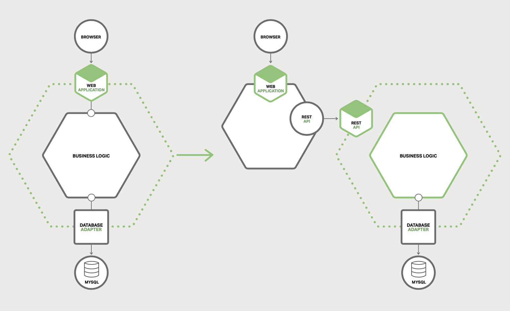
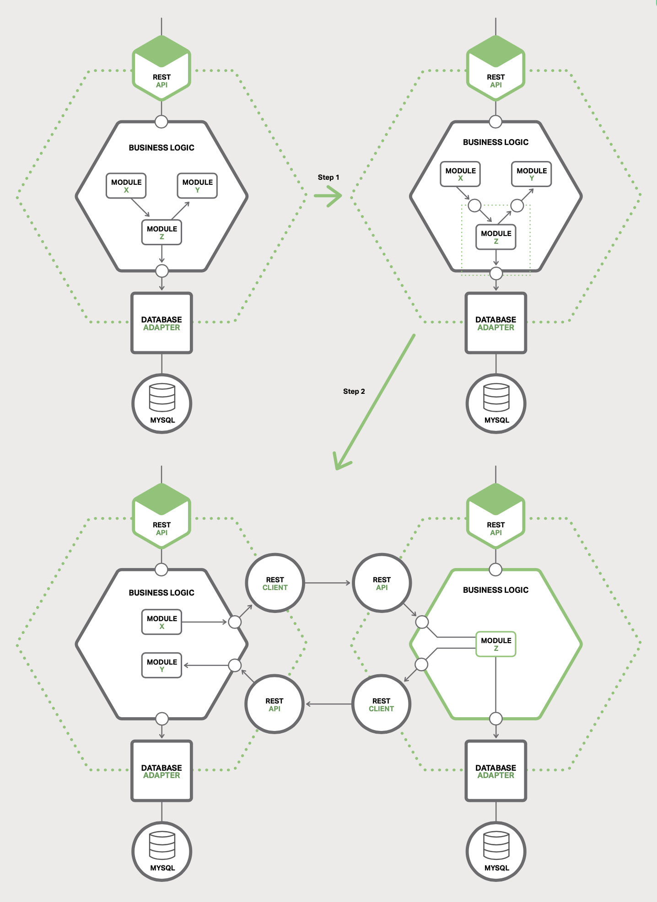

# 7 Refactoring a Monolith into Microservices

- [7 Refactoring a Monolith into Microservices](#7-refactoring-a-monolith-into-microservices)
  - [Overview of Refactoring to Microservices](#overview-of-refactoring-to-microservices)
  - [Strategy 1 - Stop Digging](#strategy-1---stop-digging)
  - [Strategy 2 - Split Frontend and Backend](#strategy-2---split-frontend-and-backend)
  - [Strategy 3 - Extract Services](#strategy-3---extract-services)
    - [Prioritizing Which Modules to Convert into Services](#prioritizing-which-modules-to-convert-into-services)
    - [How to Extract a Module](#how-to-extract-a-module)

## Overview of Refactoring to Microservices

One strategy not to use is the "Big Bang" rewrite. That is when you focus all of
your development efforts on building a new microservices-based application from
scratch. It is extremely risky and will likely end in failure.

Instead of a Big Bang rewrite, you should incrementally refactor your monolithic
application.

## Strategy 1 - Stop Digging

*Figure 7-1. Implementing new functionality as a separate service instead of
adding a module to the monolith*.

There are two other components:

1. Request router: sends requests to the new service and to the monolith.
2. Glue code: is responsible for the data integration, it integrates the
   services with the monolith.

There are three strategies that a service can use to access the monolith's data:

- Invoke a remote API provided by the monolith.
- Access the monolith's database directly.
- Maintain its own copy of the data, which is synchronized with the monolith's
  database

The glue code prevents the service from being polluted by concepts from the
legacy monolith's domain model. The glue code translates between the two
different models.

However, this approach does nothing to address the problems with the monolith.

## Strategy 2 - Split Frontend and Backend

A strategy that shrinks the monolithic application is to split the presentation
layer from the business logic and data access layers. A typical enterprise
application consists of at least three different types of components.

- **Presentation layer**: Components that handle HTTP requests and implement
  either a (REST) API or an HTML-based web UI.
- **Business logic layer**: Components that are the core of the application and
  implement the business rules.
- **DAta-access layer**: Components that access infrastructure components, such
  as databases and message brokers.

*Figure 7-2. Refactoring an existing app*.

Benefits:

- It enables you to develop, deploy, and scale the two applications
  independently.
- It exposes a remote API that can be called by the microservices that you
  develop.

## Strategy 3 - Extract Services

The third refactoring strategy is to turn existing modules within the monolith
into standalone microservices.

### Prioritizing Which Modules to Convert into Services

- It is usually beneficial to extract modules that change frequently.
- It is also beneficial to extract modules that have resource requirements
  significantly different from those of the rest of the monolith. For example,
  to turn a module that has an in-memory database into a service.

### How to Extract a Module

The first step of extracting a module is to define a coarse-grained interface
between the module and the monolith. The monolith will need data owned by the
service and vice versa.

*Figure 7-3. A module from a monolith can become a microservice*.

Once you implement the coarse-grained interface, you then turn the module into
a freestanding service.
