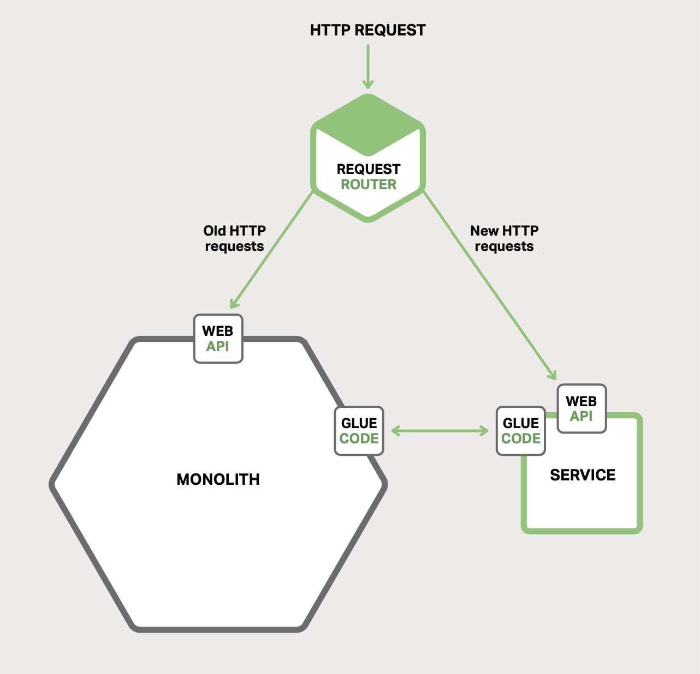

# 7 Refactoring a Monolith into Microservices

- [7 Refactoring a Monolith into Microservices](#7-refactoring-a-monolith-into-microservices)
  - [Overview of Refactoring to Microservices](#overview-of-refactoring-to-microservices)
  - [Strategy 1 - Stop Digging](#strategy-1---stop-digging)
  - [Strategy 2 - Split Frontend and Backend](#strategy-2---split-frontend-and-backend)

## Overview of Refactoring to Microservices

One strategy not to use is the "Big Bang" rewrite. That is when you focus all of
your development efforts on building a new microservices-based application from
scratch. It is extremely risky and will likely end in failure.

Instead of a Big Bang rewrite, you should incrementally refactor your monolithic
application.

## Strategy 1 - Stop Digging

*Figure 7-1. Implementing new functionality as a separate service instead of
adding a module to the monolith*.

There are two other components:

1. Request router: sends requests to the new service and to the monolith.
2. Glue code: is responsible for the data integration, it integrates the
   services with the monolith.

There are three strategies that a service can use to access the monolith's data:

- Invoke a remote API provided by the monolith.
- Access the monolith's database directly.
- Maintain its own copy of the data, which is synchronized with the monolith's
  database

The glue code prevents the service from being polluted by concepts from the
legacy monolith's domain model. The glue code translates between the two
different models.

However, this approach does nothing to address the problems with the monolith.

## Strategy 2 - Split Frontend and Backend

>>>>> progress
