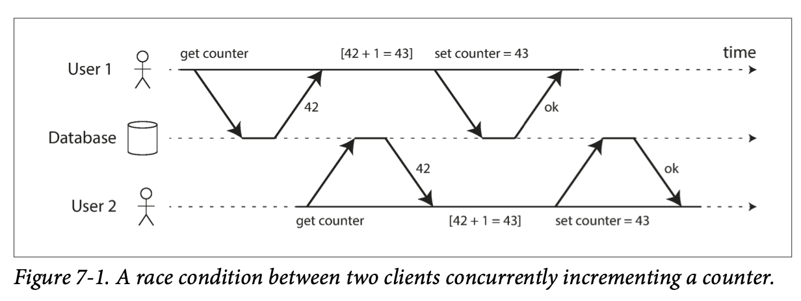
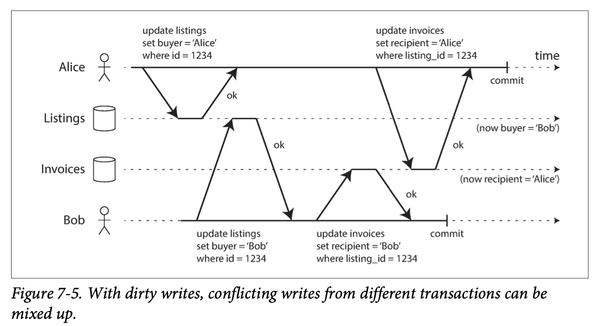
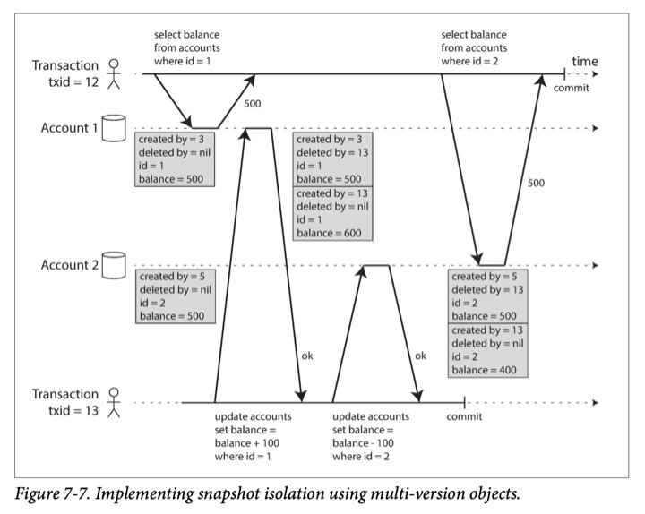
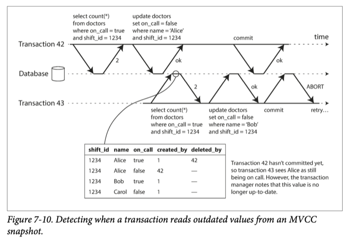
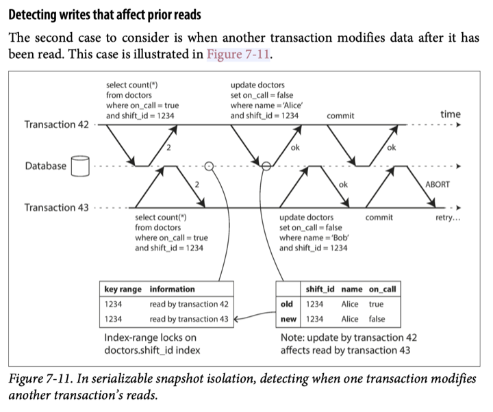

# 7. Transactions

> Some authors have claimed that general two-phase commit is too expensive to
> support, because of the performance or availability problems that it brings.
> We believe it is better to have application programmers deal with performance
> problems due to overuse of transactions as bottlenecks arise, rather than
> always coding around the lack of transactions.
>
> —James Corbett et al., Spanner: Google’s Globally-Distributed Database (2012)

- [7. Transactions](#7-transactions)
  - [The Slippery Concept of a Transaction](#the-slippery-concept-of-a-transaction)
    - [The Meaning of ACID](#the-meaning-of-acid)
      - [Atomicity](#atomicity)
      - [Consistency](#consistency)
      - [Isolation](#isolation)
      - [Durability](#durability)
      - [Replication and Durability](#replication-and-durability)
    - [Single-Object and Multi-Object Operations](#single-object-and-multi-object-operations)
      - [Single-object writes](#single-object-writes)
      - [The need for multi-object transactions](#the-need-for-multi-object-transactions)
      - [Handling errors and aborts](#handling-errors-and-aborts)
  - [Weak Isolation Levels](#weak-isolation-levels)
    - [Read Committed](#read-committed)
      - [No dirty reads](#no-dirty-reads)
      - [No dirty writes](#no-dirty-writes)
      - [Implementing read committed](#implementing-read-committed)
    - [Snapshot Isolation and Repeatable Read](#snapshot-isolation-and-repeatable-read)
      - [Implementing snapshot isolation](#implementing-snapshot-isolation)
      - [Visibility rules for observing a consistent snapshot](#visibility-rules-for-observing-a-consistent-snapshot)
      - [Indexes and snapshot isolation](#indexes-and-snapshot-isolation)
      - [Repeatable read and naming confusion](#repeatable-read-and-naming-confusion)
    - [Preventing Lost Updates](#preventing-lost-updates)
      - [Atomic write operations](#atomic-write-operations)
      - [Explicit locking](#explicit-locking)
      - [Automatically detecting lost updates](#automatically-detecting-lost-updates)
      - [Compare-and-set](#compare-and-set)
      - [Conflict resolution and replication](#conflict-resolution-and-replication)
    - [Write Skew and Phantoms](#write-skew-and-phantoms)
      - [Characterizing write skew](#characterizing-write-skew)
      - [More examples of write skew](#more-examples-of-write-skew)
      - [Phantoms causing write skew](#phantoms-causing-write-skew)
      - [Materializing conflicts](#materializing-conflicts)
  - [Serializability](#serializability)
    - [Actual Serial Execution](#actual-serial-execution)
      - [Encapsulating transactions in stored procedures](#encapsulating-transactions-in-stored-procedures)
      - [Pros and cons of stored procedures](#pros-and-cons-of-stored-procedures)
      - [Partitioning](#partitioning)
      - [Summary of serial execution](#summary-of-serial-execution)
    - [Two-Phase Locking (2PL)](#two-phase-locking-2pl)
      - [Implementation of two-phase locking](#implementation-of-two-phase-locking)
      - [Performance of two-phase locking](#performance-of-two-phase-locking)
      - [Predicate locks](#predicate-locks)
      - [Index-range locks](#index-range-locks)
    - [Serializable Snapshot Isolation (SSI)](#serializable-snapshot-isolation-ssi)
      - [Pessimistic versus optimistic concurrency control](#pessimistic-versus-optimistic-concurrency-control)
      - [Decisions based on an outdated premise](#decisions-based-on-an-outdated-premise)
      - [Detecting stale MVCC reads](#detecting-stale-mvcc-reads)
      - [Detecting writes that affect prior reads](#detecting-writes-that-affect-prior-reads)
      - [Performance of serializable snapshot isolation](#performance-of-serializable-snapshot-isolation)
  - [Summary](#summary)
    - [Isolation Levels](#isolation-levels)
    - [Race Conditions](#race-conditions)
    - [Serializable Transactions](#serializable-transactions)

A ***transaction*** is a way for an application to group several reads and
writes together into a logical unit. All the reads and writes in a transaction
are executed as one operation: either the entire transaction succeeds (`commit`)
or it fails (`abort`, `rollback`).

Transactions were created to simplify the programming model for applications
accessing a database. By using transactions, the application is free to ignore
certain potential error scenarios and concurrency issues, because the database
takes care them instead.

Sometimes there are advantages to weakening transactional guarantees or
abandoning them entirely.

## The Slippery Concept of a Transaction

In the late 2000s, nonrelational (NoSQL) databases started gaining popularity.
Many of this new generation of databases abandoned transactions entirely, or
redefined the word to describe a much weaker set of guarantees than had
previously been understood.

### The Meaning of ACID

The safety guarantees provided by transactions are described by the well-known
acronym ***ACID***.

- Atomicity
- Consistency
- Isolation (there is a lot of ambiguity around the meaning)
- Durability

Systems that do not meet the ACID critera are sometimes called *BASE*, even more
vague than the definition of ACID:

- Basically Available
- Soft state
- Eventual consistency

#### Atomicity

In the context of ACID, atomicity is **not** about concurrency. It does not
describe what happens if several processes try to access the same data at the
same time, which is covered under **Isolation**.

Rather, atomicity describes what hapeens if a client wants to make several
writes, but a fault occurs after some of the writes have been processed.

Perhaps ***abortability*** would have neem a better term than *atomicity*.

#### Consistency

In the context of ACID, ***consistency*** refers to an application-specific
notion of the database being in a "good state".

The idea of *consistency* is that you have certain statements about your data
that must always be true.

This idea of consistency depends on the application's notion of invariants, and
it's the application's responsibility to define its transactions correctly.

***Atomicity***, ***isolation***, and ***durability*** are properties of the
database, whereas consistency is a property of the application. The application
may rely on the database's atomicity and isolation properties to achieve
consistency. The letter C doesn't really belong in ACID.

#### Isolation



***Isolation*** means that concurrently executing transactions are isolated from
each other.

The classic database textbooks formalize isolation as ***serializability***,
which means that each transaction can pretend that it is the only transaction
running on the entire database. The database ensures that when the transactions
have commited, the result is the same as if they had run *serially*.

实际上 `serializable isolation` 很少被使用，因为它会带来比较大的性能开销。In Oracle
there is an isolation level called "serializable", but it actually implements
something called ***snapshot isolation***, which is a weaker guarantee than
serializability.

#### Durability

***Durability*** is the promise that once a transaction has committed
successfully, any data it has written will not be forgotten.

In a single-node database, durability means that the data has been written to
nonvolatile storage. It usually involves a write-ahead log or similar, which
allows recovery in the event that the data structures on disk are corrupted.

In a replicated database, durability may mean that the data has been
successfully copied to some number of nodes.

#### Replication and Durability

Recently, durability has been adapted to mean replication.

### Single-Object and Multi-Object Operations

In ACID, atomicity and isolation describe what the database should do if a
client makes several writes within the same transaction:

- Atomicity: giving an all-or-nothing guarantee
- Isolation: if one transaction makes several writes, then another transaction
  should see either all or none of those writes, but not some subset.

***Dirty read***: one transaction reads another transaction's uncommitted
writes.

Multi-object transactions require some way of determining which read and write
operations belong to the same transaction.

#### Single-object writes

Atomicity and isolation also apply when a single object is being changed.
Because it also takes a period of time to write a single object. storage engines
almost universally aim to provide atomiticy and isolation on the level of a
single object on one node.

- Atomicity can be implemented using a log for crash recovery.
- Isolation can be implemented using a lock on each object, allowing only one
  thread to access an object at any one time.

These single-object operations are useful, however, they are not transactions in
the usual sense of the word. Compare-and set (which allows a write to happen
only if the value has not been concurrently changed by someone else) and other
single-object operations have been dubbed "*lightweight-transactions".

#### The need for multi-object transactions

Many distributed datastores have abandoned multi-object transactions becuase
they are difficult to implement across partitions, and they can be a problem in
some scenarios where very high availability or performance is required.

Is multi-object transactions necessary? Is it possible to implement any
application with only a key-value data model and single-object operation?

- In a relational data model, multi-object transactions allow you to ensure that
  a row which has a foreign key reference to a row in another table remain
  valid.
- In a document data model, fields within the same document are treated as a
  single object. However, when denormalized information needs to be updated, you
  need to update several documents in one go.
- In databases with secondary indexes, the indexes also need to be updated every
  time you change a value.

Such applications can still be implemented without transactions with much more
complicated error handling.

#### Handling errors and aborts

In particular, datastores with leaderless replication work much more on a
"best effort" basis, so it's the application's responsibility to recover from
errors.

The whole point of aborts is to enable safe retries (in my opinion, prompt the
errors to the user is acceptable).

Auto-retrying could be a problem:

- The transaction actually succeeded, but a network failure makes it a false
  failure in the client's view.
- If the error is due to overload, retrying the transaction will make the
  problem worse. Limiting the numebr of retries is needed.
- Retrying a permanent error is pointless.
- If the transaction has side effects outside of the database (e.g. sending an
  email), those side effects may happen again when retrying the transaction.
  If you want to make sure that several different systems either commit or abort
  together, two-phase commit can help.

## Weak Isolation Levels

Concurrency issues (race conditions) only come into play when one transaction
reads data that is concurrently modified by another transaction, or when two
transactions try to simultaneously modify the same data.

Concurrency bugs are hard to find by testing, because such bugs are only
triggered when you get unlucky with the timing.

***Serializable*** isolation means that the database guarantees that
transactions have the same effect as if they ran *serially*.

In practice however, isolation is not that simple. Serializable isolation has a
performance cost. Many databases (even relational) use weaker levels of
isolation, which protect against *some* concurrency issues, but not all. Those
levels of isolation are harder to understand and more easily lead to subtle
bugs.

### Read Committed

最基本的事务隔离是 ***read committed***. It makes two guarantees:

1. When reading from the database, you will only see data that has been
   committed (no ***dirty reads***)
2. When writing to the database, you will only overwrite data that has been
   committed (no ***dirty writes***)

#### No dirty reads

***Dirty read***: a transaction can see uncommitted data changed by another
transaction.

Any writes by a transaction only become visible to others when that transaction
commits.

Why prevent dirty reads:

- Seeing the database in a partially updated state is confusing to users and may
  cause other transactions to take incorrect decisions.
- A transaction may see data that is later rolled back.

#### No dirty writes

We normally assume that a later write overwrites an earlier write.

***Dirty write***: if the earlier write is part of a transaction that has not
yet committed, and the later write overwrites an uncommitted value.



Transactions running at the read committed isolation level must prevent dirty
writes, usually by delaying the second write until the first write's transaction
has committed or aborted.

Why prevent dirty writes:

- Conflicting writes on different objects from different transactions can be
  mixed up.
  - 不同事务中多个写结果出现混杂，比如 [B1 + A2]，而正确的结果应该是 [A1 + A2] 或 [B1 + B2]
- `read committed` 不能避免 `lost update`（如自增操作），它和 `dirty write` 不一样。
  在 `lost update` 中，`事务1` 已经提交，而 `事务2` 读取并使用了 `事物1` 提交前的旧值。

#### Implementing read committed

Read committed is the default setting in Oracle 11g, PostgreSQL, and many other
databases.

Most commonly, databases prevent dirty writes by using row-level locks: when a
transaction wants to modify a particular object (row or document), it must hold
a lock on that object until the transaction is over. If another transaction
wants to write to the same object, it must wait until it can acquire the lock.

How to prevent dirty reads?

- One option would be to use the same lock, and to require any transaction that
  wants to read an object to brifly acquire the lock and then release it again
  after reading.
  - This approach does not work well in practice, because one long-running write
    transaction can force many read-only transactions to wait.
- Most databases prevent dirty reads using this approach:
  - for every object that is written, the database remembers both the old
    committed value and the new value set by the one holding the lock,
  - while the transaction is ongoing, any other transactions are simply given
    the old value.

In around 2017, the only mainstream databases that use locks for read committed
isolation are IBM DB2 and Microsoft SQL Server in the
`read_committed_snapshot=off` configuration.

### Snapshot Isolation and Repeatable Read

`Read committed isolation` is not enough:

- Alice's Account 1: `balance = 500`
- Alice's Account 2: `balance = 500`
- Alice (transaction 1):
  - `select balance from accounts where id = 1;` returns `500`
- Transfer (transaction 2):
  - `update accounts set balance = balance + 100 where id = 1;`
  - Account 1: `balance = 600`
  - `update accounts set balance = balance - 100 where id = 2;`
  - Account 2: `balance = 400`
  - `commit`
- Alice (transaction 1):
  - `select balance from accounts where id = 2;` returns `400`
  - `commit`

The anomaly above is called a ***nonrepeatable read*** or ***read skew***.

Some situations cannot tolerate such temporary inconsistency:

- Backups: taking a backup requires making a copy of the entire database. During
  the time that the backup process is running, write will continue to be made to
  the database. Thus, you could end up with some parts of the backup containing
  an older version of the data, and other parts containing a newer version.
- Analytic queries and integrity checks: these queries are likely to return
  nonsensical results if they observe parts of the database at different points
  in time.

***Snapshot isolation*** is the most common solution to nonrepeatable read. The
idea is that each transaction reads from a ***consistent snapshot*** of the
database -- that is, the transaction sees all the data that was committed in the
database at the start of the transaction. Each transaction sees only the old
data from that particular point in time.

Snapshot isolation is a boon for long-running, read-only queries such as backups
and analytics.

#### Implementing snapshot isolation

Implementations of snapshot isolation typically use write locks to prevent dirty
writes, which means that a transaction that makes a write can block the progress
of another transaction that writes to the same object.

However, reads do not require any locks.

A key principle of snapshot isolation is *readers never block writers*, and
*writers never block readers*.

To implement snapshot isolation, databases use a generalization of the mechanism
for preventing dirty reads. The database must potentially keep several different
committed versions of an object, because various in-progress transactions may
need to see the state of the database at different points in time.

- Because it maintains several versions of an object side by side, this
  technique is known as ***multi-version concurrency control (MVCC)***.

For read committed isolation, it would be sufficient to keep two versions of an
object: the committed version and the overwritten-but-not-yet-committed version.

- 💡 However, storage engines that support snapshot isolation typically use MVCC
  for their read committed isolation level as well.
- A typical approach is that
  - read committed uses a separate snapshot for each query, while
  - snapshot isolation uses the same snapshot for an entire transaction.

How to implement MVCC-based snapshot isolation (PostgreSQL):

- When a transaction is started, it is given a unique, increasing transacion ID
- Whenever a transaction writes anything to the database, the data it writes is
  tagged with the transaction ID of the writer.



- A garbage collection process in the database removes any rows marked for
  deletion and frees their space.
- An update is internally transalated into a delete and a create.

#### Visibility rules for observing a consistent snapshot

Transaction IDs are used to decide which objects it can read. Visibility rules
are as follows:

1. At the start of each transactions, the database makes a list of all the other
   transactions that are in progress at that time. Any writes that those
   transactions have made are ignored, even if the transactions subsequently
   commit.
2. Any writes made by aborted transactions are ignored.
3. Any writes made by transactions with a later transaction ID are ignored,
   regardless of whether those transactions have committed.
4. All other writes are visible to the application's queries.

These rules apply to both creation and deletion of objects. Put another way, an
object is visible if both of the following conditions are true:

- At the time when the reader's transaction started, the transaction that
  created the object had already committed.
- The object is not marked for deletion, or if it is, the transaction that
  requested deletion had not yet committed at the time when the reader's
  transaction started.
  - e.g. in the snapshot isolation figure, the

    ```txt
    created by = 3
    deleted by = 13
    id = 1
    balance = 500
    ```

    can be seen by transaction 12.

By never updating values in place but instead creating a new version every time
a value is changed, the database can provide a consistent snapshot while
incurring only a small overhead.

#### Indexes and snapshot isolation

How do indexes work in a multi-version database?

- One option is to have the index simply point to all versions of an object and
  require an index query to filter out any object versions that are not visible
  to the current transaction.
  - When garbage collection removes old object versions that are no longer
    visible to any transactoin, the corresponding index entries can also be
    removed.
- Another approach is used in CouchDB and others. Although they also use
  B-trees, they use an *append-only/copy-on-write* variant that does not
  overwrite pages of the tree when they are updated, but instead creates a new
  copy of each modified page. Parent pages up to the root are copied and updated
  to point to the new versions of their child pages.

With append-only B-trees, every write transaction creates a new B-tree root, and
a particular root is a consistent snapshot of the database at the point in time
when it was created.

- There is not need to filter out objects based on transaction IDs because
  subsequent writes cannot modify an existing B-tree; they can only create new
  tree roots.

#### Repeatable read and naming confusion

Snapshot isolation is useful especially for read-only transactions. Many
databases call it by different names. In Oracle it is called *serializable*, and
in PostgreSQL and MySQL it is called *repeatable read*.

System R's 1975 defined *repeatable read*, which looks superficially similar to
snapshot isolation.

| Database        | Default         | Maximum            |
| --------------- | --------------- | ------------------ |
| MySQL 5.6       | Repeatable Read | Serializability    |
| SQL Server 2012 | Read Committed  | Serializability    |
| Oracle 11g      | Read Committed  | Snapshot Isolation |
| Postgres 9.2.2  | Read Committed  | Serializability    |
| VoltDB          | Serializability | Serializability    |

Isolation levels:

- `RC`: Read Committed
- `RR`: Repeatable Read
- `SI`: Snapshot Isolation
- `S`: Serializability
- `CS`: Cursor Stability
- `CR`: Consistent Read

### Preventing Lost Updates

The `lost update` problem can occur if an application reads some value from the
database, modifies it, and writes back the modified value
(a `read-modify-write` style). It occurs in various different scenarios:

- Incrementing a counter or updating an account balance (requires reading the
  current value, calculating the new value, and writing back the updated value)
- Making a local change to a complex value (requires parsing the document,
  making the change, and writing back the modified document)
- Two users editing a wiki page at the same time, where each user saves their
  changes by sending the entire page contents to the server, overwriting
  whatever is currently in the database

#### Atomic write operations

Many databases provide atomic update operations, which remove the need to
implement `read-modify-write` cycles in application code. The following
instruction is concurrency-safe in most relational databases:

```sql
UPDATE counters SET value = value + 1 WHERE key = 'foo';
```

Document databases such as MongoDB provide atomic operations for making local
modifications to a part of a JSON document, and Redis provides atomic operations
for modifying data structures such as priority queues.

Atomic operations are usually implemented by

- ***cursor stability***: taking an exclusive lock on the object when it is
  read so that that no other transaction can read it until the update has been
  applied.
- another option is to simply force all atomic operations to be executed on a
  single thread.

⚠️ Object-relational mapping frameworks make it easy to accidentally write code
that performs unsafe read-modify-write cycles instead of using atomic operations
provided by the database.

#### Explicit locking

The application can explicitly lock objects that are going to be updated to
prevent lost updates. Then the application can perform a `read-modify-write`
cycle, any other transaction trying to read the same object is forced to wait
until the lock is freed.

For some cases that need to do some checks on data returned by a query in the
same transaction, an atomic operation is not sufficient:

```sql
BEGIN TRANSACTION;

SELECT * FROM figures
  WHERE name = 'robot' AND game_id = 222
  FOR UPDATE; -- This FOR UPDATE clause indicates that the database should take
              --  a lock on all rows returned by this query.

-- Check whether move is valid, then update the position of the piece that was
--  returned by the previous SELECT.

UPDATE figures SET position = 'c4' WHERE id = 1234;

COMMIT;
```

#### Automatically detecting lost updates

An alternative is to allow *read-modify-write* cycles to execute in parallel
and, if the transaction manager detects a lost update, abort the transaction and
force it to retry.

An advantage of this approach is that databases can perform this check
efficiently in conjunction with snapshot isolation.

- PostgreSQL's repeatable read, Oracle's serializable, and SQL Server's snapshot
  isolation levels automatically detect when a lost update has occurred and
  abort the offending transaction.
- MySQL InnoDB's repeatable read does not detect lost updates.

#### Compare-and-set

In databases that don't provide transaction, there is an atomic
`compare-and-set` operation. It avoids lost updates by allowing an update to
happen only if the value has not changed since you last read it. If the current
value does not match what was previously read, the update has not effect, and
the `read-modify-write` cycle must be retried. e.g.

```sql
-- This may or may not be safe, depending on the database implementation
UPDATE wiki_pages SET content = 'new content'
  WHERE id = 1234 AND content = 'old content';
```

You need to check whether the update took effect and retry if necessary.

- ⚠️ If the database allows the `WHERE` clause to read from an old snapshot,
  this statement may not prevent lost updates, because the condition may be true
  even though another concurrent write is occurring.

#### Conflict resolution and replication

In replicated databases, they have copies of the data on multiple nodes, and the
data can potentially be modified concurrently on different nodes, some
additional steps need to be taken to prevent lost updates.

Locks and compare-and-set operations assume that there is a single up-to-date
copy of the data. However, Databases with multi-leader or leaderless usually
allow several writes to happen concurrently and replicate them asynchronously,
so they cannot guarantee that there is a single up-to-date copy of the data.
Thus, techniques based on locks or compare-and-set do not apply in this context.

A common approach in such replicated databases is to allow concurrent writes to
create several conflicting versions of a value (know as *siblings*), and to use
application code or special data structures to resolve and merge these versions
after the fact.

Atomic operations can work well in a replicated context, especially if they are
commutative in order (e.g. incrementing a counter).

- When a value is concurrently updated by different clients, Riak automatically
  merges together the updates in such a way that no updates are lost.

⚠️ The *last write wins* conflict resolution method is prone to lost updates.
But unfortunately, it is the default in many replicated databases.

### Write Skew and Phantoms

e.g. Alice and Bob are two on-call doctors for a shift. They happen to click the
button to go off call at the same time. What happens next?

Alice:

```sql
begin transacton;

currently_on_call = (
  select count(*) from doctors
  where on_call = true
  and shift_id = 1234
); -- Now current_on_call = 2

if (currently_on_call >= 2) (
  update doctors
  set on_call = false
  where name = 'Alice'
  and shift_id = 1234
);

commit transaction;
```

Bob:

```sql
begin transacton;

currently_on_call = (
  select count(*) from doctors
  where on_call = true
  and shift_id = 1234
); -- Now current_on_call = 2

if (currently_on_call >= 2) (
  update doctors
  set on_call = false
  where name = 'Bob'
  and shift_id = 1234
);

commit transaction;
```

Now it ends up unexpectedly that no doctor is on call.

This is called ***write skew***. It is neither a `dirty write` nor a
`lost update`, because the two transactions are updating two different objects.
But it's definitely a race condition: if the two transaction had run one after
another, the second doctor would have been prevented from going off call.

#### Characterizing write skew

Write skew can be treated as a generalization of the lost update problem. Write
skew can occur if two transactions read the same objects, and then update some
of those objects.

- In the special case where different transactions update the same object, you
  get a dirty write or lost update.

With write skew:

- Atomic single-object operations don't help, as multiple objects are involved.
- The automatic detection of lost updates in snapshot isolation doesn't help
  either: Automatically preventing write skew requires true serializable
  isolation.
- Most databases do not have built-in support for a constraint that involves
  multiple objects. You may have to implement them with triggers or materialized
  views.
- If you can't use a serializable isolation level, the second-best option in
  this case is probably to explicitly lock the rows that the transaction depends
  on:

  ```sql
  BEGIN TRANSACTION;
  
  SELECT * FROM doctors
    WHERE on_call = true
    AND shift_id = 1234 FOR UPDATE;
    -- FOR UPDATE tells the database to lock all rows returned by this query.

  UPDATE doctors
    SET on_call = false
    WHERE name = 'Alice'
    AND shift_id = 1234;

  COMMIT;
  ```

#### More examples of write skew

- Meeting room booking system: there cannot be two bookings for the same meeting
  room at the same time.

  e.g. A meeting room booking system tries to avoid double-booking (not safe
  under snapshot isolation)

  ```sql
  BEGIN TRANSACTION;

  -- Check for any existing bookings that overlap with the period of noon-1pm
  SELECT COUNT(*) FROM bookings WHERE
    room_id = 123 AND
      end_time > '2015-01-01 12:00' AND start_time < '2015-01-01 13:00';

  -- If the previous query returned zero:
  INSERT INTO bookings
    (room_id, start_time, end_time, user_id)
    VALUES (123, '2015-01-01 12:00', '2015-01-01 13:00', 666);

  COMMIT;
  ```

  Snaphot isolation does not prevent another user from concurrently inserting a
  conflicting meeting. Serializable isolation can solve this.
- Multiplayer game: the lock on the same figure doesn't prevent players from
  moving two different figures to the same position.
- Claiming a username: using a trasaction to check whether a name is taken and,
  if not, create an account with that name is not safe under snapshot isolation.
  - But a unique constraint is a simple solution here.
- Preventing double-spending: with write skew, it oculd happen that two spending
  items are inserted concurrently that together cause the balance to go
  negative, but that neither trasaction notices the other.

#### Phantoms causing write skew

幻读是原因，写入偏差是结果。

The examples above follow a similar pattern:

1. A `SELECT` query checks whether some requirement is satisfied by searching
   for rows that match some search condition.
2. Depending on the result of the first query, the application code decides how
   to continue.
3. If the application decides to go ahead, it makes a write (`INSERT`, `UPDATE`,
   or `DELETE`) to the database and commits the transaction.

The effect of `3.` changes the precondition (`1.`) of the decision of `2.`.

This effect, where a write in one trasaction changes the result of a search
query in another transaction, is called a ***phantom***. Snapshot isolation
avoids phantoms in read-only queries, but in read-write trasactions like the
examples above, phantoms can lead to particularly tricky cases of write skew.

#### Materializing conflicts

We can artificially introduce a lock object into the database. (weird)

For example, in the meeting room booking case you could create a table of time
slots and rooms. Each row in this table corresponds to a particular room for a
particular time period. You create rows for all possible combinations of rooms
and time periods ahead of time, e.g. for the next six months.

Now a transaction that wants to create a booking can lock (`SELECT FOR UPDATE`)
the rows in the table that correspond to the desired room and time period. After
it has acquired the locks, it can check for overlapping bookings and insert a
new booking as before.

This approach is called ***materializing conflicts***, because it takes a
phantom and turns it into a lock conflict on a concrete set of rows that exist
in the database. Unfortunately, it can be hard and error-prone to figure out
how to materialize conflicts, and it‘s ugly to let a concurrency control
mechanism leak into the application data model.

For those reasons, materializing conflicts should be considered a last resort
if no alternative is possible. A serializable isolation level is much preferable
in most cases.

## Serializability

- Isolation levels are hard to understand, and inconsistently implemented in
  different databases.
- It's difficult to tell whether the application code is safe to run
  concurrently at a particular isolation level.
- There are no good tools to help with detecting race conditions. Static
  analysis may help but research techniques have not yet found their way into
  practical use. And testing for concurrency issues is hard.

All along, the answer from researchers has been simple: use
***serializable isolation***!

`Serializable isolation` is usually regarded as the strongest isolation level.
It guarantees that even though transactions may execute in parallel, the end
result is the same as if they had executed one at a time, serially, without any
concurrency. Thus, the database guarantees that if the transactions behave
correctly when run individually, they continue to be correct when run
concurrently — in other words, the database prevents ***all*** possible race
conditions.

Most databases that provide serializability today use one of these three
techniques:

- Literally executing transactions in a serial order
- Two-phase locking, which for several decades was the only viable option
- Optimistic concurrency control techniques such as serializable snapshot
  isolation

### Actual Serial Execution

The simplest way of avoiding concurrency problems is to remove the concurrency
entirely: to execute only one transaction at a time on a single thread.

Around 2007, database designers finally decided that a single-threaded loop for
executing transactions was feasible. What changed to make single-threaded
execution possible?

Two developments caused this rethink:

- RAM became cheap enough that for many use cases is now feasible to keep the
  entire active dataset in memory. Transactions can execute much faster with all
  data in memory.
- Database designers realized that OLTP transactions are usually short and only
  make a small number of reads and writes.
  - By contrast, long-running analytic queries are typically readonly, so they
    can be run on a consistent snapshot outside of the serial execution loop.

This approach is implemented in VoltDB/H-store, Redis, and Datomic.

A system designed for single-threaded execution can sometimes perform better
than a system that supports concurrency, because it can avoid the coordination
overhead of locking. In order to make the most of a single thread, transactions
need to be structured differently from their traditional form.

#### Encapsulating transactions in stored procedures

In the early days of databases, the intention was that a database transaction
could encompass an entire flow of user activity.

But, if a database transaction needs to wait for input from a user, the database
needs to support a potentially huge number of concurrent transactions.

Most databases cannot do that efficiently, so almost all OLTP applications keep
transactions short by avoiding interactively waiting for a user within a
transaction.

Systems with single-threaded serial transaction processing don't allow
interactive multi-statement transactions. The application must submit the entire
transaction code to the database ahead of time, as a *stored procedure*.

#### Pros and cons of stored procedures

Stored procedures have gained a somewhat bad reputation:

- Each database vendor has its own language for stored procedures. These
  languages look ugly and archaic compared to programming languages.
- Code running in a database is difficult to manage, hard to debug, awkward to
  keep in version control and deploy, tricky to test, and difficult to integrate
  with a metrics collection system for monitoring.
- Databases are performance-sensitive. A badly written stored procedure in a
  database can cause much more trouble.

However, modern implementations of stored procedures have abandoned PL/SQL and
use existing general-purpose programming languages instead.

- VoltDB uses Java or Groovy
- Datomic uses Java or Clojure
- Redis uses Lua

💡 With stored procedures and in-memory data, executing all transactions on a
single thread becomes feasible.

- they don't need to wait for I/O
- they avoid the overhead of other concurrency control mechanisms
- they can achieve quite good throughput on a single thread

VoltDB also uses stored procedures for replication: instead of copying a
transaction's writes from one node to another, it executes the same stored
procedure on each replica.

- therefore it requires that stored procedures are *deterministic*

#### Partitioning

Read-only transactions may execute elsewhere, using snapshot isolation, but for
applications with high write throughput, the single-thread transaction processor
can become a serious bottleneck.

In order to scale to multiple nodes, you can partition your data, which is
supported in VoltDB. If you can find a way of partitioning your dataset so that
each transaction only needs to read and write data within a single partition,
then each partition can have its own transaction processing thread.

For any transaction that needs to access multiple partitions, the database must
coordinate the transaction across all the partitions that it touches. The stored
procedure needs to be performed in lock-step across all partitions to ensure
serializability across the whole system.

Since cross-partition transactions have additional coordination overhead, they
are vastly slower than single-partition transactions.

Simple key-value data can often be partitioned very easily, but data with
multiple secondary indexes is likely to require a lot of cross-parition
coordination.

#### Summary of serial execution

Serial execution of transactions is feasible with certain constraints:

- Every transaction must be small and fast.
- It is limited to use cases where the active dataset can fit in memory.
  - If a transaction needs to access data that's not in memory, the best
    solution may be to abort the transaction, and fetch the data into memory
    while continuing to process other transactions, and then restart the
    transaction when the data has been loaded. This is known as
    ***anti-caching***.
- Write throughput must be low enough to be handled on a single CPU core, or
  else transactions need to be partitioned without requiring cross-partition
  coordination.
- Cross-partition transactions are possible, but there is a hard limit to the
  extent to which they can be used.

### Two-Phase Locking (2PL)

For around 30 years, there was only one widely used algorithm for
serializability in databases: ***two-phase locking (2PL)***. Sometimes it is
also called strong strict two-phase locking (SS2PL) to distinguish it from
other variants of 2PL.

⚠️ 2PL is not 2PC (two-phase commit).

Two-phase locking makes the lock requirements much stronger.

- Several transactions are allowed to concurrently read the same object as long
  as nobody is writing to it.
- But as soon as anyone wants to write an object, exclusive access is required:
  - If `transaction A` has read an object and `transaction B` wants to write to
    that object, `B` must wait until `A` commits or aborts before it can
    continue. (This ensures that `B` can't change the object unexpectedly
    behind `A`'s back.)
  - If `transaction A` has written an object and `transaction B` wants to read
    that object, `B` must wait until `A` commits or aborts before it can
    continue. (Reading an old version of the object is not acceptable in 2PL.)

In 2PL, writers don't just block other writers; they also block readers and vice
versa.

Snapshot isolation has the mantra *readers never block writers, and writers
never block readers*, which captures this key difference between snapshot
isolation and two-phase locking.

Because 2PL provides serializability, it protects against all the race
conditions above, including lost updates and write skew.

#### Implementation of two-phase locking

2PL is used by the serializable isolation level in MySQL (InnoDB) and SQL
Server, and the repeatable read isolation in DB2.

The blocking of readers and writers is implemented by having a lock on each
object. The lock can either be in *shared mode* or in *exclusive mode*. The lock
is used as follows:

- If a transaction wants to read an object, it must first acquire the lock in
  shared mode.
  - Several transactions are allowed to hold the lock in shared mode
    simultaneously.
  - If another transacation already has an exclusive lock on the object,
    these transactions must wait.
- If a transaction wants to write to an object, it must first acquire the lock
  in exclusive mode.
  - No other transaction may hold the lock at the same time.
  - If there is any existing lock on the object, this write transaction must
    wait.
- If a transaction first reads and then writes an object, it may upgrade its
  shared lock to an exclusive lock. The upgrade works the same as getting an
  exclusive lock directly.
- After a transaction has acquired the lock, it must continue to hold the lock
  until the end of the transaction.
  - This is where the name "two-phase" comes from:
    - the first phase (while the transaction is executing) is when the locks
      are acquired
    - the second phase (at the end of the transaction) is when all the locks
      are released

It can happen quite easily that transaction A is stuck waiting for transaction B
to release its lock, and vice versa at the same time. This situation is called
***deadlock***.

- The database automatically detects deadlocks between transactions and aborts
  one of them.
- The aborted transaction needs to be retried by the application.

#### Performance of two-phase locking

The big downside of two-phase locking is performance: transaction throughput and
response times of queries are significantly worse under two-phase locking than
under weak isolation.

- This is partly due to the overhead of locks, but more importantly due to
  reduced concurrency.
- A transaction may have to wait for several others to complete.

For this databases running 2PL can have quite unstable latencies.

Although deadlocks can happen with the lock-based read committed isolation
level, they occur much more frequently under 2PL serializable isolation.

#### Predicate locks

A ***predicate lock*** works similarly to the shared/exclusive lock, but rather
than belonging to a particular object, it belongs to all objects that match some
search condition, such as:

```sql
SELECT * FROM bookings
  WHERE room_id = 123 AND
    end_time > '2018-01-01 12:00' AND
    start_time < '2018-01-01 13:00';
```

A predicate lock resticts access as follows:

- If transaction A wants to read objects matching some condition, like in that
  `SELECT` query, it must acquire a shared-mode predicate lock on the conditions
  of the query.
  - If another transaction B currently has an exclusive lock on any object
    matching those conditions, A must wait until B releases its lock.
- If transaction A wants to write any object, it must first check whether either
  the old or the new value matches any existing predicate lock.
  - If there is a matching predicate lock held by transaction B, then A must
    wait until B is done.

💡 The key idea here is that a predicate lock applies even to objects that do
not yet exist in the database, but which might be added in the future
(phantoms).

- If two-phase locking includes predicate locks, the database prevents all forms
  of write skew and other race conditions, and so its isolation becomes
  serializable.

Predicate locks do not perform well: if there are many locks, checking for
matching locks becomes time-consuming.

#### Index-range locks

For predicate's performance issue, most databases with 2PL actually implement
***index-range locking*** (also known as *next-key locking*), which is a
simplified approximation of predicate locking.

It's safe to simplify a predicate by making it match a greater set of objects.

e.g.

- Say your index is on `room_id` and the database uses this index to find
  existing bookings from `123`. The database can simply attach a shared lock to
  this index entry.
- If the database uses a time-based index to find existing bookings, it can
  attach a shared lock to a range of values in that index.

Either way, an approximation of the search condition is attached to one of the
indexes. Now,

- If another transaction wants to write a booking for the same room and/or an
  overlapping time period, it will have to update the same part of the index.
- It will encounter the shared lock, and it will be forced to wait until the
  lock is released.

Index-range locks are not as precise as predicate locks would be, but since they
have much lower overheads, they are a good compromise.

If there is no suitable index where a range lock can be attached, the database
can fall back to a shared lock on the entire table.

### Serializable Snapshot Isolation (SSI)

Serializable isolation and good performance aren't necessarily fundamentally
at odds with each other:

An algorithm called ***serializable snapshot isolation (SSI)*** is very
promising.

- It provides full serializability
- It has only a small performance penalty compared to snapshot isolation

Today, SSI is used both in single-node databases (the serializable isolation
level in PostgreSQL) and distributed databases (FoundationDB uses a similar
algorithm).

#### Pessimistic versus optimistic concurrency control

Two-phase locking is a so-called ***pessimistic*** concurrency control
mechanism:

- It is based on the principle that if anything might possibly go wrong, it's
  better to wait until the situation is safe again before doing anthing.
- It is like *mutual exclusion*, which is used to protect data structures in
  multi-threaded programming.

Serial execution is pessimistic to the extreme. By contrast, *serializable
snapshot isolation* is an ***optimisitc*** concurrency control technique.

- Optimistic in this context means that instead of blocking if something
  potentially dangerous happens, transactions continue anyway, in the hope that
  everything will turn out all right.
- When a transaction wants to commit, the database checks whether isolation was
  violated, if so, the transaction is aborted and has to be retried.
- It performs badly if there is high contention, as this leads to a high
  proportion of transactions needing to abort.
- It tends to perform better than pessimistic ones if contention is not too
  high.

Contention can be reduced with commutative atomic operations:

- if several transactions concurrently want to increment a counter, it doesn't
  matter in which order the increments are applied.

SSI is based on snapshot isolation:

- All reads within a transaction are made from a consistent snapshot of the
  database.
- On top of snapshot isolation, SSI adds an algorithm for detecting
  serialization conflicts among writes and determining which transactions to
  abort.

#### Decisions based on an outdated premise

In snapshot isolation, the transaction may take an action based on a *premise*
(a fact that was true at the beginning of the transaction). Later, when the
transaction wants to commit, the original data may have changed -- the premise
may no longer be true.

To be safe, the database needs to assume that any change in the query result
(the premise) means that writes in that transaction may be valid.

- In order to provide serialization isolation, the database must detect
  situations in which a transaction may have acted on an outdated premise and
  abort the transaction in that case.

How does the database know if a query result might have changed? There are two
cases to consider:

- Detecting reads of a stale MVCC object version (uncommitted write occurred
  before the read)
  - MVCC: multi-version concurrency control
- Detecting writes that affect prior reads (the write occurs after the read)

#### Detecting stale MVCC reads



In order to prevent this anomaly, the database needs to track when a transaction
ignores another transaction's writes due to MVCC visibility rules.

- When the transaction wants to commit, the database checks whether any of the
  ignored writes have now been committed.
- If so, the transaction must be aborted.

Why not immediately abort those transactions when the stale read is detected?

- If transaction 43 was read-only, it wouldn't need to be aborted.
- At the time when transaction 43 makes its read, the database doesn't yet know
  whether that transaction is going to later perform a write.
- Transaction 42 may yet abort or may still be uncommitted at the time when
  transaction 43 is committed, and so the read may turn out not to have been
  stale after all.

By avoiding unnecessary aborts, SSI preserves snapshot isolation's support for
long-running reads from a consistent snapshot.

#### Detecting writes that affect prior reads



SSI locks access to all row matching some search query like two-phase locking,
except that it doesn't block other transactions.

The database records the fact that transaction 42 and 43 read the shift `1234`.
This information only needs to be kept for a while: after a transaction has
finished, and all concurrent transactions have finished, the database can forget
the data.

When a transaction writes to the database, it must look in the indexes for any
other transactions that have recently read the affected data.

- This process is similar to acquiring a write lock on the affected key range,
  but rather than blocking until the readers have committed, the lock acts as
  a tripwire: it simply notifies the transactions that the data they read may
  no longer be up to date.

#### Performance of serializable snapshot isolation

If the database keeps track of each transaction's activity

- in great detail, it can be precise about which to abort, but the bookkeeping
  overhead can become significant.
- less detailed is faster, but may lead to more aborts than necessary.

Sometimes it's possible to prove that the result of the execution is
nevertheless serilizable. PostgreSQL uses this theory to reduce the number of
aborts.

Compared to two-phase locking, the big advantage of serializable snapshot
isolation is that one transaction doesn't need to blcok waiting for locks held
by others.

- Like under snapshot isolation, writers don't blcok readers and vice versa.
- Read-only queries can run on a consistent snapshot without locks.

Compared to serial execution, SSI is not limited to the throughput of a single
CPU core.

- FoundationDB distributes the detection of serialization conflicts across
  multiple machines.

## Summary

### Isolation Levels

- **Read committed**
- **Snapshot isolation (repeatable read)**
- **Serializable**

### Race Conditions

- **Dirty reads**: One client reads another client's writes before they have
  been committed.
  - The read committed isolation level and stronger levels prevent dirty
    reads.
- **Dirty writes**: One client overwrites data that another client has written,
  but not yet committed.
  - Almost all transaction implementations prevent dirty writes.
- **Read skew (nonrepeatable reads)**: A client sees different parts of the
  database at different points in time.
  - This issue is most commonly prevented with snapshot isolation, which allows
    a transaction to read from a consistent snapshot at one point in time.
  - It is usually implemented with multi-version concurrency control (MVCC).
- **Lost updates**: Two clients concurrently perform a read-modify-write cycle.
  One overwrites the other’s write without incorporating its changes, so data is
  lost.
  - Some implementations of snapshot isolation prevent this anomaly
    automatically, while others require a manual lock (`SELECT FOR UPDATE`).
- **Write skew**: A transaction reads something, makes a decision based on the
  value it saw, and writes the decision to the database. However, by the time
  the write is made, the premise of the decision is no longer true.
  - Only serializable isolation prevents this anomaly.
- **Phantom reads**: A transaction reads objects that match some search
  condition. Another client makes a write that affects the results of that
  search.
  - Snapshot isolation prevents straightforward phantom reads, but phantoms in
    the context of write skew require special treatment, such as index-range
    locks.

### Serializable Transactions

- **Literally executing transactions in a serial order**
- **Two-phase locking**
- **Serializable snapshot isolation (SSI)**
