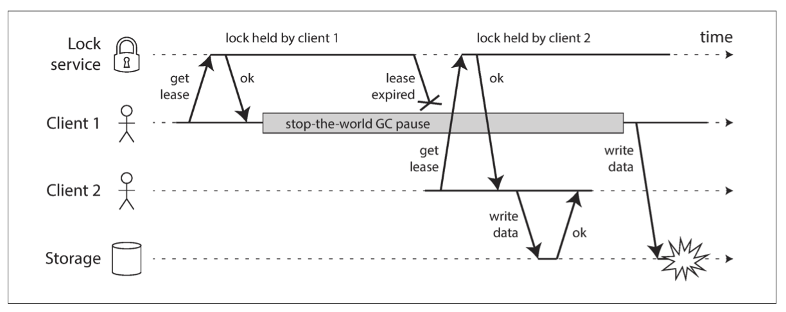
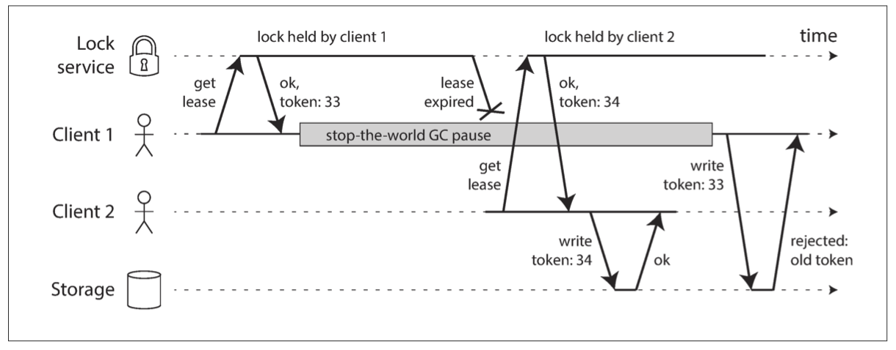

# 8. The Trouble with Distributed Systems

- [8. The Trouble with Distributed Systems](#8-the-trouble-with-distributed-systems)
  - [Faults and Partial Failures](#faults-and-partial-failures)
    - [Cloud Computing and Supercomputing](#cloud-computing-and-supercomputing)
    - [Building a Reliable System from Unreliable Components](#building-a-reliable-system-from-unreliable-components)
  - [Unreliable Networks](#unreliable-networks)
    - [Network Faults in Practice](#network-faults-in-practice)
      - [Network partitions](#network-partitions)
    - [Detecting Faults](#detecting-faults)
    - [Timeouts and Unbounded Delays](#timeouts-and-unbounded-delays)
      - [Network congestion and queueing](#network-congestion-and-queueing)
      - [TCP Versus UDP](#tcp-versus-udp)
    - [Synchronous Versus Asynchronous Networks](#synchronous-versus-asynchronous-networks)
      - [Can we not simply make network delays predictable?](#can-we-not-simply-make-network-delays-predictable)
      - [Latency and Resource Utilization](#latency-and-resource-utilization)
  - [Unreliable Clocks](#unreliable-clocks)
    - [Monotonic Versus Time-of-day Clocks](#monotonic-versus-time-of-day-clocks)
      - [Time-of-day clocks](#time-of-day-clocks)
      - [Monotonic clocks](#monotonic-clocks)
    - [Clock Synchronization and Accuracy](#clock-synchronization-and-accuracy)
    - [Relying on Synchronized Clocks](#relying-on-synchronized-clocks)
      - [Timestamps for ordering events](#timestamps-for-ordering-events)
      - [Clock readings have a confidence interval](#clock-readings-have-a-confidence-interval)
      - [Synchronized clocks for global snapshots](#synchronized-clocks-for-global-snapshots)
    - [Process Pauses](#process-pauses)
      - [Response time guarantees](#response-time-guarantees)
        - [Is real-time really real?](#is-real-time-really-real)
      - [Limiting the impact of garbage collection](#limiting-the-impact-of-garbage-collection)
  - [Knowledge, Truth, and Lies](#knowledge-truth-and-lies)
    - [The Truth Is Defined by the Majority](#the-truth-is-defined-by-the-majority)
      - [The leader and the lock](#the-leader-and-the-lock)
      - [Fencing tokens](#fencing-tokens)
    - [Byzantine Faults](#byzantine-faults)
      - [The Byzantine Generals Problem](#the-byzantine-generals-problem)
      - [Weak forms of lying](#weak-forms-of-lying)
    - [System Model and Reality](#system-model-and-reality)
      - [Correctness of an algorithm](#correctness-of-an-algorithm)
      - [Safety and liveness](#safety-and-liveness)
      - [Mapping system models to the real world](#mapping-system-models-to-the-real-world)
  - [Summary](#summary)

## Faults and Partial Failures

On a single computer, if an internal fault occurs, we prefer a computer to
crash completely rather than returning a wrong result, because wrong results
are difficult and confusing to deal with. Computers present an idealized system
model that operates with mathematical perfection.

In distributed systems, we are no longer operating in an idealized system model.

**Partial failures** are ***nondeterministic***. The nondeterminism and
possibility of partial failures is what makes distributed systems hard to work
with.

### Cloud Computing and Supercomputing

A supercomputer is more like a single-node computer than a distributed system:
it deals with partial failure by letting it escalate into total failure.

Even in a small system, sooner or later, some part of the system will become
faulty, and the software will have to somehow handle it. The fault handling must
be part of the software design.

### Building a Reliable System from Unreliable Components

For example:

- Error-correcting codes allow digital data to be transmitted accurately across
  communication channel that occasionally gets some bits wrong.
- The IP Protocol is unreliable: it may drop, delay, duplicate, or reorder
  packets. TCP provides a more reliable transport layer on top of IP: it ensures
  that missing packets are retransmitted, duplicates are eliminated, and packets
  are reassembled into the order in which they were sent.

## Unreliable Networks

Shared-nothing has become the dominant approach for building internet services:

- it's comparatively cheap because it requires no special hardware
- it can make use of commoditized cloud computing services
- it can achieve high reliability through redundancy across multiple
  geographically distributed datacenters

Network issues: if you send a request to another node and don't receive a
response, it is *impossible* to tell why.

- The usual way of handling this issue is a *timeout*.

### Network Faults in Practice

#### Network partitions

### Detecting Faults

Many systems need to detect faulty nodes:

- A load balancer needs to stop sending requests to a node that is dead.
- In a distributed database with single-leader replication, if the leader fails,
  one of the followers needs to be promoted to the new leader.

The uncertainty about the network makes it difficult to tell whether a node is
working or not. In some circumstances you might get feedback to tell you that
something is wrong:

- If you can reach the machine on which the node should be running, but no
  process is listening on the destination port, the OS will close or refuse TCP
  connections by sending a `RST` or `FIN` packet in reply.
- If a node process crashed but the node's OS is still running, a script can
  notify other nodes so that another node can take over quickly without having
  to wait for a timeout. e.g. HBase works like this.
- If you have access to the management interface of the network switches in your
  datacenter, you can query them to detect link failures at a hardware level.
- If a router is sure that the IP you're trying to connect to is unreachable, it
  may reply to you with an ICMP Destination Unreachable packet.

If you want to be sure that a request was successful, you need a positive
response from the application itself.

### Timeouts and Unbounded Delays

Prematurely declaring a node dead is problematic:

- If the node is actually alive and in the middle of performing some actoin,
  and another node takes over, the action may end up being perform twice.
- If the system is already struggling with high load, it can make the problem
  worse.

Asynchronous networks have *unbounded delays*, and most server implementations
cannot guarantee that they can handle requests within some maximum time.

#### Network congestion and queueing

- network switch
- operating system
- virtual machine monitor
- TCP *flow control*

In public clouds and multi-tenant datacenters, resources are shared among many
customers. In such environments, you can only choose timeouts experimentally:

- measure the distribution of network round-trip times over an extended period
  to determine the expected variability of delays.
- then taking into account your applications' characteristics, determine an
  appropriate trade-off between failure detection delay and risk of premature
  timeouts.
- dynamically measure and adjust response times and their variability according
  to the observed response time distribution.

#### TCP Versus UDP

Some latency-sensitive applications use UDP rather than TCP. It avoids some of
the reasons for variable network delays.

- UDP does not perform flow control
- UDP does not retransmit lost packets. e.g.
  - In a VoIP phone call, there's not point in retransmitting the packet.

### Synchronous Versus Asynchronous Networks

**Synchronous** networks: even as data passes through several routers, it does
not suffer from queueing, because the bits of space for the call have already
been reserved in the next hop of the network. And because there is no queueing,
the maximum end-to-end latency of the network is fixed. It is called a *bounded
delay*.

#### Can we not simply make network delays predictable?

- A circuit in a telephone network is a fixed amount of reserved bandwidth which
  nobody else can use while the circuit is established
- The packets of a TCP connection opportunistically use whatever network
  bandwidth is available.

If the internet were circuit-switched networks, it would be possible to
establish a guaranteed maximum round-trip time.

However, they are not. They are optimized for *bursty traffic*. TCP dynamically
adapts the rate of data transfer to the available network capacity.

Currently deployed technology does not allow us to make any guarantees about
delays or reliability ot the network.

#### Latency and Resource Utilization

- The resource in a circuit is divided up in a *static way*. The circuit is
  allocated the same fixed amount of bandwidth no matter the wire is full
  utilized or not.
- The internet shares network bandwidth *dynamically*.
  - This approach has the downside of queueing.
  - The advantage is that it maximizes utilization of the wire.
    - Better hardware utilization is also a significant motivation for using
      virtual machines.

Latency guarantees are achievable in certain environments, if resources are
statically paritioned. However, it comes at the cost of reduced utilization.

## Unreliable Clocks

It is possible to synchronize clocks to some degree: the most commonly used
mechanism is the Network Time Protocol (NTP).

### Monotonic Versus Time-of-day Clocks

Modern computers have at least two kinds of clocks:

- a *time-of-day clock*
- a *monotonic clock*

#### Time-of-day clocks

- `clock_gettime(CLOCK_REALTIME)`

It returns the current date and time according to some calendar. It is usually
synchronized with NTP. However, it also has various oddities. e.g.

- If the local clock is too far ahead of the NTP server, it may be forcibly
  reset and appear to jump back to a previous point in time.

These jumps and the fact that they often ignore leap seconds, make time-of-day
clocks unsuitable for measuring elapsed time.

#### Monotonic clocks

- `clock_gettime(CLOCK_MONOTONIC)`

A monotonic clock is suitable for measuring a duration. The name comes from the
fact that they are guaranteed to always move forward, whereas a time-of-day
clock may jump back in time.

- The *absolute* value of the monotonic clock is meaningless.
- It makes no sense to compare monotonic clock values from two different
  computers.

On a server with multiple CPU sockets, there may be a separate timer per CPU.
Operating systems try to present a monotonic view of the clocks to application
threads.

In a distributed system, using a monotonic clock for measuting elapsed time is
usually fine, because it doesn't assume any synchronization between different
nodes' clocks and is not sensitive to slight inaccuracies of measurement.

### Clock Synchronization and Accuracy

Good accuracy can be achieved using

- GPS receivers
- Precision Time Protocol (PTP)
- careful deployment and monitoring

However, it requires significant effort and expertise.

### Relying on Synchronized Clocks

If you use software that requires synchronized clocks, it is essential that you
also carefully monitor the clock offsets between all the machines. Any node
whose clock drifts too far from the others should be declared dead and removed
from the cluster.

#### Timestamps for ordering events

If two clients write to a distributed database, which write is the more recent
one?

- Client A writes `x = 1` on node 1; the write is replicated to node 3;
- Client B increments `x` on node 3; now `x = 2`; (but assuming that B has an
  earlier timestamp than A has)
- both writes are replicated to node 2
  
When a write is replicated to other nodes, it is tagged with a timestamp
according the time-of-day clock on the node where the write originated. The
timestamps in the case above fail to order the events correctly:

- `x = 1` has a timestamp of `42.004` seconds
- `x = 2` has a timestamp of `42.003` seconds, which occurred later

When node 2 receives these two events, it will incorrectly conclude that `x = 1`
is the more recent value and drop the write `x = 2`.

This conflict resolution is called ***last write wins*** (LWW). Some
implementations generate timestamps on the client rather than the server, but
this doesn't change the fundamental problems with LWW:

- Database writes can be silently dropped without any error being reported.
- LWW cannot distinguish between writes that occurred sequentially in quick
  succession and writes that were truly concurrent.
- It is possible for two nodes to independently generate writes with the same
  timestamp. An additional tiebreaker value (often a large random number) is
  required to resolve such conflicts, but this approach can also lead to
  violations od causality.

So-called *logical clocks*, which are based on incrementing counters rather than
an oscillating quartz crystal, are a safer alternative for ordering events.

#### Clock readings have a confidence interval

> 置信区间

If you're getting the time from a server, the uncertainty is based on the
expected quartz drift since your last sync with the server, plus the NTP
server's uncertainty, plus the network round-trip time to the server.

#### Synchronized clocks for global snapshots

The most common implementation of snapshot isolation requires a monotonically
increasing transaction ID. If a write happend later than the snapshot, that
write is invisible to the snapshot transaction.

- On a single-node database, a simple counter is sufficient for generating
  transaction IDs.
- When a database is distributed across many machines, a global, monotonically
  increasing transaction ID is difficult to generate. The transaction ID must
  reflect causality:
  - if transaction B reads a value that was written by transaction A, then B
    must have a higher transaction ID than A -- otherwise, the snapshot would
    not be consistent.
  - with lots of small, rapid transactions, creating transaction IDs in a
    distributed system becomes an untenable bottleneck.

Spanner implements snapshot isolation across datacenters using the timestamps
from synchronized time-of-day clocks as transaction IDs.

It uses the clock's confidence interval as reported by the TrueTime API based on
the this observation:

- if you have two confidence intervals, each consisting of an earliest and
  latest possible timestamp ($A = [A_{earliest}, A_{latest}]$ and
  $B = [B_{earliest}, B_{latest}]$), and they don't overlap ($A_{earliest} <
  A_{latest} < B_{earliest} < B_{latest}$).
- then B definitely happened after A.

In order to ensure that transaction timestamps reflect causality, Spanner
deliberately waits for the length of the confidence interval before committing
a read-write transaction. By doing so, it ensures that any transaction that may
read the data is at a sufficiently later time, so their confidence intervals do
not overlap.

- In order to keep the wait time as short as possible, Google deploys a GPS
  receiver or atomic clock in each datacenter.

### Process Pauses

How does a node know that it is still leader in a database with a single leader
per partition?

- One option is for the leader to obtain a *lease* from the other nodes, which
  is similar to a lock with timeout. Only one node can hold the lease at any one
  time.
  - When a node obtains a lease, it knows that it is the leader for some amount
    of time, until the lease expires.
  - In order to remain leader, the node must periodically renew the lease before
    it expires.
  - If the node fails, it stops renewing the lease, so another node can take
    over when it expires.

  ```c
  while (true) {
    request = getIncomingRequest();

    // Ensure that the lease always has at least 10 seconds remaining
    if (lease.expiryTimeMillis - System.currentTimeMillis() < 10000) {
      lease = lease.renew();
    }

    if (lease.isValid()) {
      process(request);
    } 
  }

  // there's something wrong with this code
  ```

  1. This code is relying on synchronized clocks: the expiry time on the lease
    is set by a different machine, and it's compared to the local system clock.
    If the clocks are out of sync, this code might start doing strange things.
  2. Even we change the protocol to use the local monotonic clock, there is
    another problem: the code assumes that very little time passes between the
    point `System.currentTimeMillis()` and the time when `process(request)`.
    What if the thread stops for 15 seconds around the line `lease.isValid()`?
    This code may do something unsafe by processing the request.

Threads can possibly be paused for this long:

- GC
- A VM can be suspended and resumed (sometimes used for VM *live migration*)
- laptops
- OS context switches to another thread
- I/O waits
- OS memory swapping
- receive the `SIGSTOP` signal

The problem is similar to making multi-threaded code on a single machine
thread-safe: you can't assume anything about timing.

When writing multi-threaded code on a single machine, there are fairly good
tools for making it thread-safe:

- mutexes
- semaphores
- atomic counters
- lock-free data structures
- blocking queues
- ...

These tools don't directly translate to distributed systems, because a
distributed system has no shared memory -- only messages sent over an unreliable
network.

A node in a distributed system must assume that its execution can be paused for
a significant length of time at any point.

#### Response time guarantees

In some environments, some software should respond within a specified time.
Providing real-time guarantees in a system requires support from all levels of
the software stack:

- a real-time operating system (RTOS) that allows processes to be scheduled with
  a guaranteed allocation of CPU time in specifed intervals
- library functions must document their worst-case execution times
- dynamic memory allocation may be restricted or disallowed entirely
- an enormous amount of testing and measurement must be done

##### Is real-time really real?

#### Limiting the impact of garbage collection

Language runtime have some flexibility around when they schedule garbage
collections, because they can track the rate of object allocation and the
remaining free memory over time.

An emerging idea is to treat GC pauses like brief planned outages of a node, and
to let other nodes handle requests from clients while one node is doing GC.

A variant of this idea is to use the garbage collector only for short-lived
objects, which are fast to collect, and to restart processes periodically,
before they accumulate enough long-lived objects to require a full GC.

## Knowledge, Truth, and Lies

If a remote node doesn't respond, there is no way of knowing what state it is
in, because problems in the network cannot reliably be distinguished from
problems at a node.

In a distributed system, we can state the assumptions we are making about the
behavior (the *system model*) and design the actual system in such a way that
it meets those assumptions.

### The Truth Is Defined by the Majority

If a node is able to receive all messages sent to it, but any outgoing messages
from that node are dropped or delayed, the other nodes will declare it dead.

A node cannot necessarily trust its own judgment of a situation. A distributed
system cannot exclusively rely on a single node, because a node may fail at any
time, potentially leaving the system stuck and unable to recover.

Instead, many distributed algorithms rely on a *quorum*, that is, voting among
the nodes: decisions require some minimum number of votes from several nodes in
order to reduce the dependence on any one particular node.

If a quorum of nodes declares another node dead, then it must be considered
dead. The individual node must abide by the quorum decision and step down.

Most commonly, the quorum is an absolute majority of more than half the nodes.
A majority quorum allows the system to continue working if individual nodes have
failed.

#### The leader and the lock

Frequently, a system requires there to be only one of some thing:

- Only one node is allowed to be the leader for a database partition, to avoid
  split brain.
- Only one transaction or client is allowed to hold the lock for a particular
  resource or object, to prevent concurrently writing to it and corrupting it.
- ...

Implementing this in a distributed system requires care: even if a node believes
that it is the chosen one, that doesn't necessarily mean a quorum of nodes
agrees.

If a node continues acting as the chosen one, even though the majority of nodes
have declared it dead, it could cause problems in a system that is not carefully
designed. Such a node could send messages to other nodes in its self-appointed
capacity.



Incorrect implementation of a distributed lock: `client 1` believes that it
still has a valid lease, even though it has expired, and thus corrupts a file
in storage.

#### Fencing tokens

When using a lock or lease to protect access to some resource, we need to ensure
that a node that is under a false belief of being the chosen one cannot disrupt
the rest of the system.

A fairly simple technique that that achieves this goal is called ***fencing***.



Making access to storage safe by allowing writes only in the order of increasing
fencing tokens.

e.g. If ZooKeeper is used as lock service, the transaction ID `zxid` or the node
version `cversion` can be used as fencing token.

### Byzantine Faults

⚠️ If a node deliberately wanted to subvert the system's guarantees, it could
easily do so by sending messages with a fake fencing token.

Distributed systems problems become much harder if there is a risk that nodes
may "lie". Such behavior is known as a *Byzantine fault*, and the problem of
reaching consensus in this untrusting environment is known as the
*Byzantine Generals Problem*.

A system is *Byzantine fault-tolerant* if it continues to operate correctly even
if some of the nodes are malfunctioning and not obeying the protocol, of if
malicious attackers are interfering with the network.

Protocols for making systems Byzantine fault-tolerant are complicated, and
fault-tolerant embedded systems rely on support from the hardware level. In most
server-side data systems, the cost of deploying Byzantine fault-tolerant
solutions makes them impractical.

In peer-to-peer networks, where there is no central authority, Byzantine fault
tolerance is more relevant.

Most Byzantine fault-tolerant algorithms require a supermajority of more than
two-thirds of the nodes to be functioning correctly.

In most systems, if an attacker can compromise one node, they can probably
compromise all of them, because they are probably running the same software.
Thus, traditional mechanisms (authentication, access control, encryption,
firewalls, and so on) continue to be the main protection against attackers.

#### The Byzantine Generals Problem

The Byzantine Generals Problem is a generalization of the so-called
*Two Generals Problem*, which imagines a situation in which two army generals
need to agree on a battle plan. They can only communicate by messenger, and the
messengers sometimes get delayed or lost.

#### Weak forms of lying

Preventing weak forms of "lying" is worth doing because it is simple and
pragmatic steps toward better reliability:

- Usually, corrupted packets are caught by the checksums built into TCP and UDP,
  but sometimes they evade detection. Simple measures are usually sufficient
  protection against such corruption, such as checksums in the application-level
  protocol.
- Basic sanity-checking of input values is necessary.
- NTP clients can be configured with multiple server addresses.
- ...

### System Model and Reality

A ***system model*** is an abstraction that describes what things an algorithm
may assume. With regard to timing assumptions, three system models are in common
use:

- ***Synchronous model***: It assumes bounded network delay, bounded process
  pauses, and bounded clock error. It is not a realistic model of most practical
  systems, because unbounded delays and pauses do occur.
- ***Partially synchronous model***: It means that a system behaves like a
  synchronous system most of the time, but it sometimes exceeds the bounds for
  network delay, process pauses, and clock drift. **This is a realistic model**
  of many systems: most of the time, networks and processes are quite well
  behaved, but we have to reckon with the fact that any timing assumptions may
  be shattered occasionally.
- ***Asynchronous model***: In this model, an algorithm is not allowed to make
  any timing assumptions. It does not even have a clock, so it cannot use
  timeouts. Some algorithms can be designed for the asynchronous model, but it
  is very restrictive.

Besides timing issues, node failures are also have to be considered. The three
most common system models for nodes are:

- ***Crash-stop faults***: In this model, an algorithm may assume that a node
  can fail in only one way, namely by crashing. This means that the node may
  suddenly stop responding at any moment and is gone forever.
- ***Crash-recovery faults***: In this model, we assume that nodes may crash at
  any moment, and perhaps start responding again after some unknown time. Nodes
  are assumed to have stable storage that is preserved across crashes, while the
  in-memory state is assumed to be lost.
- ***Byzantin (arbitrary) faults***: Nodes may do absolutely anthing, including
  trying to trick and deceive other nodes.

For modeling real systems, the `partially synchronous model` with
`crash-recovery faults` is generally the most useful model.

#### Correctness of an algorithm

We can describe an algorithm's ***properties*** to define what it means to be
***correct***. For example, if we are generating fencing tokens for a lock, we
may require the algorithm to have the following properties:

- *Uniqueness*
- *Monotonic sequence*
- *Availability*: a node that requests a fencing token and does not crash
  eventually receives a response.

#### Safety and liveness

It is worth distinguishing between two different kinds of properties:

- *safety*: If it's violated, we can point at a particular point in time at
  which it was broken. After a safety property has been violated, the violation
  cannot be undone.
  - (nothing bad happens)
  - e.g. `uniqueness` and `monotonic sequence`
- *liveness*: It may not hold at some point in time, but there is always hope
  that it may be satisfied in the future.
  - (something good eventually happens)
  - e.g. `availability`

What distinguishes the two kinds of properties? Liveness properties often
include the word "eventually" in their definition. e.g. *eventual consistency*.

For distributed algorithms, it is common to require that safety properties
always hold, in all possible situations of a system model. The algorithm must
ensure that it never returns a wrong result.

However, with liveness properties we are allowed to make caveats: for example,
we could say that a request needs to receive a response only if a majority of
nodes have not crashed, and only if the network eventually recovers from an
outage.

`Partially synchronous` model requires that eventually the system returns to a
synchronous state: any period of network interruption lasts only for a finite
duration and is then repaired.

#### Mapping system models to the real world

⚠️ The system models mentioned above are simplified abstraction of reality. e.g.

- Algorithms in the `crash-recovery` model generally assume that data in stable
  storage survives crashes. However, data on disk could be corrupted very
  possibly.
- In quorum algorithms, if a node may suffer from amnesia and forget previously
  stored data, that breaks the quorum condition, and thus breaks the correctness
  of the algorithm.

A real implementation may still have to include code to handle the case where
something happens that was assumed to be impossible.

This is not to say that theoretical, abstract system models are worthless. They
are incredibly helpful for distilling down the complexity of real systems to a
manageable set of faults that we can reason about, so that we can understand the
problem and try to solve it systematically.

## Summary

- To tolerate faults, the first step is to *detect* them. But most systems don't
  have an accurate mechanism of detecting whether a node has failed, so most
  distributed algorithms rely on timeouts to determine whether a remote node is
  still available.
  - but timeouts can't distinguish between network and node failures
- Making a system tolerate a detected fault is not easy: there is no global
  variable, no shared memory, no common knowledge or any other kind of shared
  state between the machines.
  - The only way information can flow from one node to another is by sending it
    over the unreliable network.
- If you can simply keep things on a single machine, it is generally worth doing
  so.
- Scalability is not the only reason for wanting to use a distributed system.
  Fault tolerance and low latency are equally important goals.
- It is possible to give hard real-time response guarantees and bounded delays
  in networks, but doing so is very expensive and results in lower utilization
  of hardware resources.
  - Most non-safety-critical systems choose cheap and unreliable over expensive
    and reliable.
