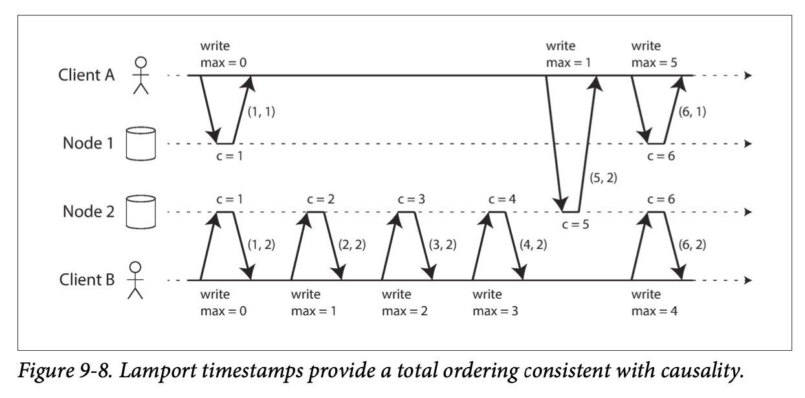
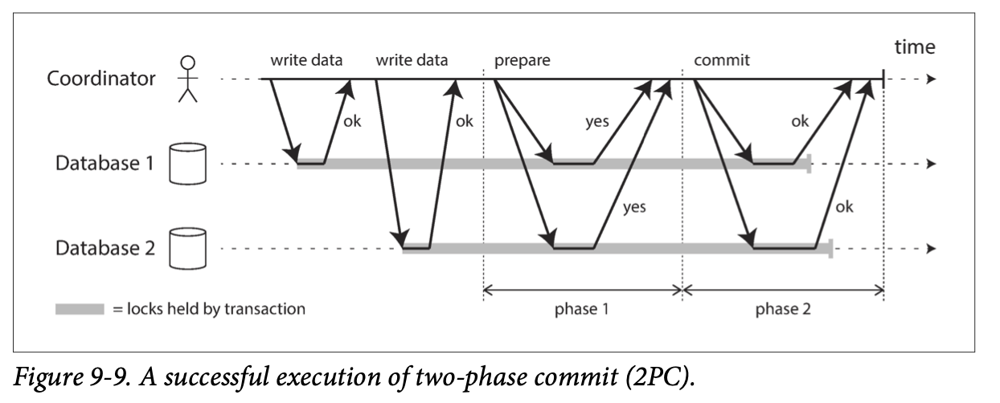
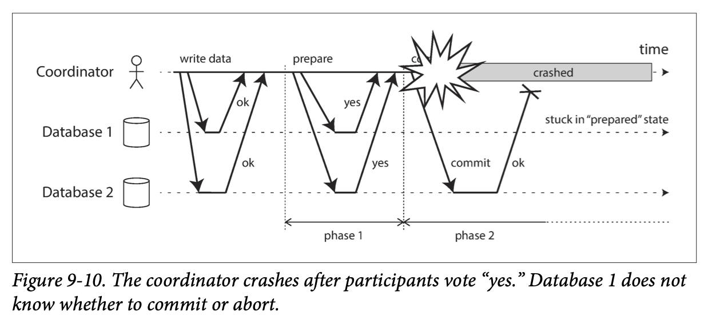

# 9. Consistency and Consensus

> Is it better to be alive and wrong or right and dead?
>
> —Jay Kreps, A Few Notes on Kafka and Jepsen (2013)

- [9. Consistency and Consensus](#9-consistency-and-consensus)
  - [Consistency Guarantees](#consistency-guarantees)
  - [Linearizability](#linearizability)
    - [What Makes a System Linearizable?](#what-makes-a-system-linearizable)
      - [Linearizability Versus Serializability](#linearizability-versus-serializability)
    - [Relying on Linearizability](#relying-on-linearizability)
      - [Locking and leader election](#locking-and-leader-election)
      - [Constraints and uniqueness guarantees](#constraints-and-uniqueness-guarantees)
      - [Cross-channel timing dependencies](#cross-channel-timing-dependencies)
    - [Implementing Linearizable Systems](#implementing-linearizable-systems)
      - [Linearizability and quorums](#linearizability-and-quorums)
    - [The Cost of Linearizability](#the-cost-of-linearizability)
      - [The CAP theorem](#the-cap-theorem)
      - [The Unhelpful CAP Theorem](#the-unhelpful-cap-theorem)
      - [Linearizability and network delays](#linearizability-and-network-delays)
  - [Ordering Guarantees](#ordering-guarantees)
    - [Ordering and Causality](#ordering-and-causality)
      - [The causal order is not a total order](#the-causal-order-is-not-a-total-order)
      - [Linearizability is stronger than causal consistency](#linearizability-is-stronger-than-causal-consistency)
      - [Capturing causal dependencies](#capturing-causal-dependencies)
    - [Sequence Number Ordering](#sequence-number-ordering)
      - [Noncausal sequence number generators](#noncausal-sequence-number-generators)
      - [Lamport timestamps](#lamport-timestamps)
      - [Timestamp ordering is not sufficient](#timestamp-ordering-is-not-sufficient)
    - [Total Order Broadcast](#total-order-broadcast)
      - [Scope of ordering guarantee](#scope-of-ordering-guarantee)
      - [Using total order broadcast](#using-total-order-broadcast)
      - [Implementing linearizable storage using total order broadcast](#implementing-linearizable-storage-using-total-order-broadcast)
      - [Implementing total order broadcast using linearizable storage](#implementing-total-order-broadcast-using-linearizable-storage)
  - [Distributed Transactions and Consensus](#distributed-transactions-and-consensus)
    - [The Impossibility of Consensus](#the-impossibility-of-consensus)
    - [Atomic Commit and Two-Phase Commit (2PC)](#atomic-commit-and-two-phase-commit-2pc)
      - [From single-node to distributed atomic commit](#from-single-node-to-distributed-atomic-commit)
      - [Introduction to two-phase commit](#introduction-to-two-phase-commit)
        - [Don’t confuse 2PC and 2PL](#dont-confuse-2pc-and-2pl)
      - [A system of promises](#a-system-of-promises)
      - [Coordinator failure](#coordinator-failure)
      - [Three-phase commit](#three-phase-commit)
    - [Distributed Transactions in Practice](#distributed-transactions-in-practice)
      - [Exactly-once message processing](#exactly-once-message-processing)
      - [XA transactions](#xa-transactions)
      - [Holding locks while in doubt](#holding-locks-while-in-doubt)
      - [Recovering from coordinator failure](#recovering-from-coordinator-failure)
      - [Limitations of distributed transactions](#limitations-of-distributed-transactions)

The simplest way of handling faults is to simply let the entire service fail,
and show the user an error message. If that solution is unacceptable, we need
to find ways of tolerating faults—that is, of keeping the service functioning
correctly, even if some internal component is faulty.

The best way of building fault-tolerant systems is to find some general-purpose
abstractions with useful guarantees, implement them once, and then let
applications rely on those guarantees. This is the same approach as we used
with transactions: by using a transaction, the application can pretend that
there are no crashes (`atomicity`), that nobody else is concurrently accessing
the database (`isolation`), and that storage devices are perfectly reliable
(`durability`). Even though crashes, race conditions, and disk failures do
occur, the transaction abstraction hides those problems so that the application
doesn’t need to worry about them.

One of the most important abstractions for distributed systems is consensus:
that is, getting all of the nodes to agree on something.

Once you have an implementation of consensus, applications can use it for
various purposes. For example, say you have a database with single-leader
replication. If the leader dies and you need to fail over to another node, the
remaining database nodes can use consensus to elect a new leader. If two nodes
both believe that they are the leader, that situation is called split brain,
and it often leads to data loss. Correct implementations of consensus help
avoid such problems.

## Consistency Guarantees

Most replicated databases provide at least ***eventual consistency***, which
means that if you stop writing to the database and wait for some unspecified
length of time, then eventually all read requests will return the same value.
In other words, the inconsistency is temporary, and it eventually resolves
itself. A better name for eventual consistency may be ***convergence***, as we
expect all replicas to eventually converge to the same value.

Systems with stronger guarantees may have worse performance or be less
fault-tolerant than systems with weaker guarantees. Nevertheless, stronger
guarantees can be appealing because they are easier to use correctly.

There is some similarity between distributed consistency models and the
hierarchy of transaction isolation levels. But while there is some overlap,
they are mostly independent concerns:

- Transaction isolation is primarily about avoiding race conditions due to
  concurrently executing transactions
- Distributed consistency is mostly about coordinating the state of replicas in
  the face of delays and faults.

## Linearizability

Wouldn’t it be a lot simpler if the database could give the illusion that there
is only one replica? Then every client would have the same view of the data.

This is the idea behind ***linearizability*** (also known as
***atomic consistency***, ***strong consistency***, ***immediate consistency***,
or ***external consistency***). The basic idea is to make a system appear as if
there were only one copy of the data, and all operations on it are atomic.

In a linearizable system, as soon as one client successfully completes a write,
all clients reading from the database must be able to see the value just
written. Maintaining the illusion of a single copy of the data means
guaranteeing that the value read is the most recent, up-to-date value, and
doesn’t come from a stale cache or replica. In other words, linearizability is
a ***recency guarantee***.

If Alice and Bob had hit reload at the same time, it would have been less
surprising if they had gotten two different query results, because they
wouldn’t know at exactly what time their respective requests were processed by
the server. However, Bob knows that he hit the reload button after he heard
Alice exclaim the final score, and therefore he expects his query result to be
at least as recent as Alice’s. The fact that his query returned a stale result
is a violation of linearizability.

### What Makes a System Linearizable?

The basic idea behind linearizability is simple: to make a system appear as if
there is only a single copy of the data.

In the distributed systems literature, `x` is called a ***register*** — in
practice, it could be one key in a key-value store, one row in a relational
database, or one document in a document database, for example.

The start of a bar is the time when the request was sent, and the end of a bar
is when the response was received by the client. Due to variable network
delays, a client doesn’t know exactly when the database processed its
request — it only knows that it must have happened sometime between the client
sending the request and receiving the response.

In this example, the `register` has two types of operations:

- `read(x) ⇒ v` means the client requested to read the value of register `x`,
  and the database returned the value `v`.
- `write(x, v) ⇒ r` means the client requested to set the register `x` to value
  `v`, and the database returned response `r` (which could be `ok` or `error`).

What are the possible responses that `A` and `B` might get for their read
requests?

1. The first read operation by `client A` completes before the write begins, so
  it must definitely return the old value `0`.
2. The last read by `client A` begins after the write has completed, so it must
  definitely return the new value `1` if the database is ***linearizable***: we
  know that the write must have been processed sometime between the start and
  end of the write operation, and the read must have been processed sometime
  between the start and end of the read operation. If the read started after
  the write ended, then the read must have been processed after the write, and
  therefore it must see the new value that was written.
3. Any read operations that overlap in time with the write operation might
  return either `0` or `1`, because we don’t know whether or not the write has
  taken effect at the time when the read operation is processed.

第三种情况不满足 linearizability: if reads that are concurrent with a write can
return either the old or the new value, then readers could see a value flip
back and forth between the old and the new value several times while a write is
going on. That is not what we expect of a system that emulates a “single copy
of the data.”

- A register in which reads may return either the old or the new value if they
  are concurrent with a write is known as a ***regular register***.

To make the system linearizable, we need to add another constraint:

In a linearizable system we imagine that there must be some point in time
(between the start and end of the write operation) at which the value of `x`
atomically flips from `0` to `1`. Thus, if one client’s read returns the new
value `1`, all subsequent reads must also return the new value, even if the
write operation has not yet completed.

`Client A` is the first to read the new value, `1`. Just after `A`’s read
returns, `B` begins a new read. Since `B`’s read occurs strictly after `A`’s
read, it must also return `1`, even though the write by `C` is still ongoing.

A more complex example of non-linearizability:

- `cas(x, v_old, v_new) ⇒ r` means the client requested an atomic
  compare-and-set operation. If the current value of the register `x` equals
  `v_old`, it should be atomically set to `v_new`. If `x ≠ v_old` then the
  operation should leave the register unchanged and return an error. `r` is the
  database’s response (`ok` or `error`).
  - 可以理解为原子性的自增操作，如果旧值已发生变化，则自增失败。

Each operation in Figure 9-4 is marked with a vertical line at the time when we
think the operation was executed. Those markers are joined up in a sequential
order, and the result must be a valid sequence of reads and writes for a
`register` (every read must return the value set by the most recent write).

***The requirement of linearizability*** is that the lines joining up the
operation markers always move forward in time, never backward. This requirement
ensures the recency guarantee: once a new value has been written or read, all
subsequent reads see the value that was written, until it is overwritten again.

- First `client B` sent a request to read `x`, then `client D` sent a request
  to set `x` to `0`, and then `client A` sent a request to set `x` to `1`.
  Nevertheless, the value returned to `B`’s read is `1` (the value written by
  `A`). This is okay: it means that the database first processed `D`’s write,
  then `A`’s write, and finally `B`’s read. Although this is not the order in
  which the requests were sent, it’s an acceptable order, because the three
  requests are concurrent. Perhaps `B`’s read request was slightly delayed in
  the network, so it only reached the database after the two writes.
- `Client B`’s read returned `1` before `client A` received its response from
  the database, saying that the write of the value `1` was successful. This is
  also okay: it doesn’t mean the value was read before it was written, it just
  means the `ok` response from the database to `client A` was slightly delayed
  in the network.
- This model doesn’t assume any transaction isolation: another client may
  change a value at any time. For example, `C` first reads `1` and then reads
  `2`, because the value was changed by `B` between the two reads. An atomic
  `compare-and-set (cas)` operation can be used to check the value hasn’t been
  concurrently changed by another client: `B` and `C`’s `cas` requests succeed,
  but `D`’s cas request fails (by the time the database processes it, the value
  of `x` is no longer `0`).
- The final read by client `B` is not linearizable. The operation is concurrent
  with `C`’s cas write, which updates `x` from `2` to `4`. In the absence of
  other requests, it would be okay for `B`’s read to return `2`. However,
  `client A` has already read the new value `4` before `B`’s read started, so
  `B` is not allowed to read an older value than `A`.

It is possible (though computationally expensive) to test whether a system’s
behavior is linearizable by recording the timings of all requests and
responses, and checking whether they can be arranged into a valid sequential
order.

#### Linearizability Versus Serializability

Both words seem to mean something like “can be arranged in a sequential order.”
However, they are two quite different guarantees, and it is important to
distinguish between them:

- `Serializability`: `Serializability` is an isolation property of
  transactions, where every transaction may read and write multiple objects
  (rows, documents, records) - “Single-Object and Multi-Object Operations”. It
  guarantees that transactions behave the same as if they had executed in some
  serial order (each transaction running to completion before the next
  transaction starts). It is okay for that serial order to be different from
  the order in which transactions were actually run.
  - 可串行化是针对多个对象上的多个操作组成的事务，所有事务都能够被串行执行，不过顺序不一定确定，即允许多种可能的顺序。
  - 可以理解为，在逻辑时间线上，所有的事务会坍缩成一个点（原子性），并且按照一定顺序进行排列，可能有多种排列方式，但它们一定是有序的。
  - 这其实是 ACID 中 I (Isolation，隔离性)，当初是为了保证数据库的正确性而引入的。
  - 如果数据库中所有单个事务都能保证正确性，即事务执行前后的一致性，ACID 中的 C，那么一组事务串行化执行后，数据库仍能保证正确性。
  - 非序列化的存在原因是数据对象本身的非原子性。
- `Linearizability`: `Linearizability` is a recency guarantee on reads and
  writes of a `register` (an individual object). It doesn’t group operations
  together into transactions, so it does not prevent problems such as write
  skew, unless you take additional measures such as materializing conflicts.
  - 可线性化针对单个对象上的单个操作（比如读或者写），所有操作都能够被原子的、全局有序的完成。
    一个值一旦被写入，后面的读都能读到此值，直到其再次被修改；一个值一旦被读到，后面的读都会读到同样的值，直到其被修改。
  - 可线性化其实是原子一致性 (**atomic consistency**) 的别称，也即 CAP 中的 C
    (Consistency，一致性)。
  - 无论是单机多核，还是多机，在物理上，本质上都是多个执行流，当其进行协作时，如果不进行通信，很难保证对某个对象操作的全局有序。但要保证严格线性化，势必会引入过多通信，导致大大降低性能。
  - 非线性化的存在原因是数据对象有多个副本。

A database may provide both `serializability` and `linearizability`, and this
combination is known as `strict serializability` or
`strong one-copy serializability (strong-1SR)`. Implementations of
serializability based on two-phase locking or actual serial execution are
typically `linearizable`.

However, serializable snapshot isolation (SSI) is not linearizable: by design,
it makes reads from a consistent snapshot, to avoid lock contention between
readers and writers. The whole point of a consistent snapshot is that it does
not include writes that are more recent than the snapshot, and thus reads from
the snapshot are not linearizable.

### Relying on Linearizability

In what circumstances is linearizability useful? A result that is outdated by a
few seconds is unlikely to cause any real harm in this situation. However,
there are a few areas in which linearizability is an important requirement for
making a system work correctly.

#### Locking and leader election

One way of electing a leader is to use a lock: every node that starts up tries
to acquire the lock, and the one that succeeds becomes the leader [14]. No
matter how this lock is implemented, it must be `linearizable`: all nodes must
agree which node owns the lock; otherwise it is useless.

Coordination services like Apache ZooKeeper and etcd are often used to
implement distributed locks and leader election. They use consensus algorithms
to implement `linearizable` operations in a fault-tolerant way. Libraries like
Apache Curator help by providing higher-level recipes on top of ZooKeeper.
However, a `linearizable` storage service is the basic foundation for these
coordination tasks.

Distributed locking is also used at a much more granular level in some
distributed databases, such as Oracle Real Application Clusters (RAC). RAC uses
a lock per disk page, with multiple nodes sharing access to the same disk
storage system. Since these linearizable locks are on the critical path of
transaction execution, RAC deployments usually have a dedicated cluster
interconnect network for communication between database nodes.

#### Constraints and uniqueness guarantees

A hard uniqueness constraint, such as the one you typically find in relational
databases, requires linearizability. Other kinds of constraints, such as
foreign key or attribute constraints, can be implemented without requiring
linearizability.

#### Cross-channel timing dependencies

The *linearizability violation* was only noticed because there was an
additional communication channel in the system (Alice’s voice to Bob’s ears).
Similar situations can arise in computer systems. For example, say you have a
website where users can upload a photo, and a background process resizes the
photos to lower resolution for faster download:

The image resizer needs to be explicitly instructed to perform a resizing job.
The photo is first written to a file storage service, and once the write is
complete, the instruction to the resizer is placed on the queue.

If the file storage service is linearizable, then this system should work fine.
If it is not linearizable, there is the risk of a race condition: the message
queue might be faster than the internal replication inside the storage service.
In this case, when the resizer fetches the image, it might see an old version
of the image, or nothing at all. If it processes an old version of the image,
the full-size and resized images in the file storage become permanently
inconsistent.

This situation is analogous to Figure 9-1, where there was also a race
condition between two communication channels: the database replication and the
real-life audio channel between Alice’s mouth and Bob’s ears.

*Linearizability* is not the only way of avoiding this race condition, but it’s
the simplest to understand. If you control the additional communication channel,
you can use alternative approaches similar to what we discussed in
“Reading Your Own Writes”, at the cost of additional complexity.

### Implementing Linearizable Systems

Since ***linearizability essentially means “behave as though there is only a
single copy of the data***, and all operations on it are atomic,” the simplest
answer would be to really only use a single copy of the data. However, that
approach would not be able to tolerate faults: if the node holding that one
copy failed, the data would be lost, or at least inaccessible until the node
was brought up again.

The most common approach to making a system fault-tolerant is to use
replication. Whether the replication methods can be made linearizable:

- **Single-leader replication (potentially linearizable)**
  - In a system with single-leader replication, the leader has the primary copy
    of the data that is used for writes, and the followers maintain backup
    copies of the data on other nodes. If you make reads from the leader, or
    from synchronously updated followers, they have the potential to be
    linearizable.
    - Partitioning (sharding) a single-leader database, so that there is a
      separate leader per partition, does not affect linearizability, since it
      is only a single-object guarantee. Cross-partition transactions are a
      different matter.
    - However, not every single-leader database is actually linearizable, either
      by design (e.g., because it uses snapshot isolation) or due to concurrency
      bugs.
  - Using the leader for reads relies on the assumption that you know for sure
    who the leader is. It is quite possible for a node to think that it is the
    leader, when in fact it is not — and if the delusional leader continues to
    serve requests, it is likely to violate linearizability. With asynchronous
    replication, failover may even lose committed writes, which violates both
    durability and linearizability.
- **Consensus algorithms (linearizable)**
  - Some consensus algorithms bear a resemblance to single-leader replication.
    However, consensus protocols contain measures to prevent split brain and
    stale replicas. Thanks to these details, consensus algorithms can implement
    linearizable storage safely. This is how ZooKeeper and etcd work, for
    example.
- **Multi-leader replication (not linearizable)**
  - Systems with multi-leader replication are generally not linearizable,
    because they concurrently process writes on multiple nodes and
    asynchronously replicate them to other nodes. For this reason, they can
    produce conflicting writes that require resolution. Such conflicts are an
    artifact of the lack of a single copy of the data.
- **Leaderless replication (probably not linearizable)**
  - For systems with leaderless replication (Dynamo-style), people sometimes
    claim that you can obtain “strong consistency” by requiring quorum reads
    and writes `(w + r > n)`. Depending on the exact configuration of the
    quorums, and depending on how you define strong consistency, this is not
    quite true.
  - “Last write wins” conflict resolution methods based on time-of-day clocks
    (e.g., in Cassandra) are almost certainly nonlinearizable, because clock
    timestamps cannot be guaranteed to be consistent with actual event ordering
    due to clock skew. Sloppy quorums (“Sloppy Quorums and Hinted Handoff”)
    also ruin any chance of linearizability. Even with strict quorums,
    nonlinearizable behavior is possible.

#### Linearizability and quorums

Intuitively, it seems as though strict quorum reads and writes should be
linearizable in a Dynamo-style model. However, when we have variable network
delays, it is possible to have race conditions.

The initial value of `x` is `0`, and a writer client is updating `x` to `1` by
sending the write to all three replicas (`n = 3`, `w = 3`). Concurrently,
`client A` reads from a quorum of two nodes (`r = 2`) and sees the new value `1`
on one of the nodes. Also concurrently with the write, `client B` reads from a
different quorum of two nodes, and gets back the old value `0` from both.

The quorum condition is met (`w + r > n`), but this execution is nevertheless
not linearizable: `B`’s request begins after `A`’s request completes, but `B`
returns the old value while `A` returns the new value.

It is possible to make Dynamo-style quorums linearizable at the cost of reduced
performance: a reader must perform read repair synchronously, before returning
results to the application, and a writer must read the latest state of a quorum
of nodes before sending its writes. However, Riak does not perform synchronous
read repair due to the performance penalty. Cassandra does wait for read repair
to complete on quorum reads, but it loses linearizability if there are multiple
concurrent writes to the same key, due to its use of last-write-wins conflict
resolution.

Moreover, only linearizable read and write operations can be implemented in
this way; a linearizable compare-and-set operation cannot, because it requires
a consensus algorithm.

In summary, it is safest to assume that a leaderless system with Dynamo-style
replication does not provide linearizability.

### The Cost of Linearizability

Consider what happens if there is a network interruption between the two
datacenters. Let’s assume that the network within each datacenter is working,
and clients can reach the datacenters, but the datacenters cannot connect to
each other.

With a multi-leader database, each datacenter can continue operating normally:
since writes from one datacenter are asynchronously replicated to the other,
the writes are simply queued up and exchanged when network connectivity is
restored.

On the other hand, if single-leader replication is used, then the leader must
be in one of the datacenters. Any writes and any linearizable reads must be
sent to the leader — thus, for any clients connected to a follower datacenter,
those read and write requests must be sent synchronously over the network to
the leader datacenter.

If the network between datacenters is interrupted in a single-leader setup,
clients connected to follower datacenters cannot contact the leader, so they
cannot make any writes to the database, nor any linearizable reads. They can
still make reads from the follower, but they might be stale (nonlinearizable).
If the application requires linearizable reads and writes, the network
interruption causes the application to become unavailable in the datacenters
that cannot contact the leader.

If clients can connect directly to the leader datacenter, this is not a
problem, since the application continues to work normally there. But clients
that can only reach a follower datacenter will experience an outage until the
network link is repaired.

#### The CAP theorem

This issue is not just a consequence of single-leader and multi-leader
replication: any linearizable database has this problem, no matter how it is
implemented. The issue also isn’t specific to multi-datacenter deployments, but
can occur on any unreliable network, even within one datacenter. The trade-off
is as follows:

- If your application requires linearizability, and some replicas are
  disconnected from the other replicas due to a network problem, then some
  replicas cannot process requests while they are disconnected: they must
  either wait until the network problem is fixed, or return an error (either
  way, they become unavailable).
  - This is known as **CP** (consistent but not available under network
    partitions)
- If your application does not require linearizability, then it can be written
  in a way that each replica can process requests independently, even if it is
  disconnected from other replicas (e.g., multi-leader). In this case, the
  application can remain available in the face of a network problem, but its
  behavior is not linearizable.
  - This is known as **AP** (available but not consistent under network
    partitions)

Thus, applications that don’t require linearizability can be more tolerant of
network problems. This insight is known as the CAP theorem, named by Eric Brewer
in 2000, although the trade-off has been known to designers of distributed
databases since the 1970s.

CAP was originally proposed as a rule of thumb, without precise definitions,
with the goal of starting a discussion about trade-offs in databases. At the
time, many distributed databases focused on providing linearizable semantics on
a cluster of machines with shared storage, and CAP encouraged database
engineers to explore a wider design space of distributed shared-nothing
systems, which were more suitable for implementing large-scale web services.
CAP deserves credit for this culture shift — witness the explosion of new
database technologies since the mid-2000s (known as NoSQL).

The CAP theorem as formally defined is of very narrow scope: it only considers
one consistency model (namely linearizability) and one kind of fault (network
partitions, or nodes that are alive but disconnected from each other). It
doesn’t say any‐thing about network delays, dead nodes, or other trade-offs.
Thus, although CAP has been historically influential, it has little practical
value for designing systems.

CAP has now been superseded by more precise results, so it is of mostly
historical interest today.

#### The Unhelpful CAP Theorem

CAP is sometimes presented as pick 2 out of the 3:

- Consistency
- Availability
- Partition tolerance
  - network partition 是一种网络故障，和数据 partitioning 是两回事。

Unfortunately, putting it this way is misleading because network partitions are
a kind of fault, so they aren’t something about which you have a choice: they
will happen whether you like it or not.

At times when the network is working correctly, a system can provide both
consistency (linearizability) and total availability. When a network fault
occurs, you have to choose between either `linearizability` or
`total availability`. Thus, a better way of phrasing CAP would be either
`Consistent` or `Available` when Partitioned. A more reliable network needs to
make this choice less often, but at some point the choice is inevitable.

In discussions of CAP there are several contradictory definitions of the term
`availability`, and the formalization as a theorem does not match its usual
meaning. Many so-called “highly available” (fault-tolerant) systems actually do
not meet CAP’s idiosyncratic definition of availability. All in all, there is a
lot of misunderstanding and confusion around CAP, and it does not help us
understand systems better, so CAP is best avoided.

#### Linearizability and network delays

Although linearizability is a useful guarantee, surprisingly few systems are
actually linearizable in practice. For example, even RAM on a modern multi-core
CPU is not linearizable: if a thread running on one CPU core writes to a memory
address, and a thread on another CPU core reads the same address shortly
afterward, it is not guaranteed to read the value written by the first thread
(unless a memory barrier or fence is used).

The reason for this behavior is that every CPU core has its own memory cache
and store buffer. Memory access first goes to the cache by default, and any
changes are asynchronously written out to main memory. Since accessing data in
the cache is much faster than going to main memory, this feature is essential
for good performance on modern CPUs. However, there are now several copies of
the data, and these copies are asynchronously updated, so linearizability is
lost.

Why make this trade-off? It makes no sense to use the CAP theorem to justify
the multi-core memory consistency model: within one computer we usually assume
reliable communication, and we don’t expect one CPU core to be able to continue
operating normally if it is disconnected from the rest of the computer.

- The reason for dropping linearizability is performance, not fault tolerance.

The same is true of many distributed databases that choose not to provide
linearizable guarantees: they do so primarily to increase performance, not so
much for fault tolerance. Linearizability is slow — and this is true all the
time, not only during a network fault.

Can’t we maybe find a more efficient implementation of linearizable storage? It
seems the answer is no: Attiya and Welch prove that if you want
linearizability, the response time of read and write requests is at least
proportional to the uncertainty of delays in the network. In a network with
highly variable delays, the response time of linearizable reads and writes is
inevitably going to be high. A faster algorithm for linearizability does not
exist, but weaker consistency models can be much faster, so this trade-off is
important for latency-sensitive systems.

## Ordering Guarantees

A linearizable register behaves as if there is only a single copy of the data,
and that every operation appears to take effect atomically at one point in
time. This definition implies that operations are executed in some well-defined
order.

Ordering suggests that it might be an important fundamental idea:

- The main purpose of the leader in single-leader replication is to determine
  the order of writes in the replication log — that is, the order in which
  followers apply those writes. If there is no single leader, conflicts can
  occur due to concurrent operations.
- Serializability is about ensuring that transactions behave as if they were
  executed in some sequential order. It can be achieved by literally executing
  transactions in that serial order, or by allowing concurrent execution while
  preventing serialization conflicts (by locking or aborting).
- The use of timestamps and clocks in distributed systems is another attempt to
  introduce order into a disorderly world, for example to determine which one
  of two writes happened later.

It turns out that there are deep connections between ordering, linearizability,
and consensus.

### Ordering and Causality

There are several reasons why ordering keeps coming up, and one of the reasons
is that it helps preserve causality:

- If a question is answered, then clearly the question had to be there first,
  because the person giving the answer must have seen the question. We say that
  there is a causal dependency between the question and the answer.
- In the replication between three leaders, some writes could “overtake” others
  due to network delays. From the perspective of one of the replicas it would
  look as though there was an update to a row that did not exist. Causality
  here means that a row must first be created before it can be updated.
- If you have two operations A and B, there are three possibilities: either A
  happened before B, or B happened before A, or A and B are concurrent. This
  happened before relationship is another expression of causality:
  - if A happened before B, that means B might have known about A, or built
    upon A, or depended on A.
  - If A and B are concurrent, there is no causal link between them; in other
    words, we are sure that neither knew about the other.
- In the context of snapshot isolation for transactions, a transaction reads
  from a consistent snapshot. But what does “consistent” mean in this context?
  It means consistent with causality: if the snapshot contains an answer, it
  must also contain the question being answered. Observing the entire database
  at a single point in time makes it consistent with causality: the effects of
  all operations that happened causally before that point in time are visible,
  but no operations that happened causally afterward can be seen.
  - Read skew (non-repeatable reads) means reading data in a state that
    violates causality.
- Write skew between transactions also demonstrated causal dependencies: Alice
  was allowed to go off call because the transaction thought that Bob was still
  on call, and vice versa. In this case, the action of going off call is
  causally dependent on the observation of who is currently on call.
  Serializable snapshot isolation detects write skew by tracking the causal
  dependencies between transactions.
- In the example of Alice and Bob watching football, the fact that Bob got a
  stale result from the server after hearing Alice exclaim the result is a
  causality violation: Alice’s exclamation is causally dependent on the
  announcement of the score, so Bob should also be able to see the score after
  hearing Alice.

Causality imposes an ordering on events:

- cause comes before effect;
- a message is sent before that message is received;
- the question comes before the answer.

If a system obeys the ordering imposed by causality, we say that it is
***causally consistent***. For example, `snapshot isolation` provides
`causal consistency`: when you read from the database, and you see some piece
of data, then you must also be able to see any data that causally precedes it.

#### The causal order is not a total order

A ***total order*** allows any two elements to be compared, so if you have two
elements, you can always say which one is greater and which one is smaller. For
example, natural numbers are totally ordered: you can tell that 13 is greater
than 5.

However, mathematical sets are not totally ordered: is `{a, b}` greater than
`{b, c}`? Well, you can’t really compare them, because neither is a subset of
the other. We say they are incomparable, and therefore mathematical sets are
***partially ordered***: in some cases one set is greater than another (if one
set contains all the elements of another), but in other cases they are
incomparable.

The difference between a `total order` and a `partial order` is reflected in
different database consistency models:

- **Linearizability**
  - In a linearizable system, we have a `total order` of operations: if the
    system behaves as if there is only a single copy of the data, and every
    operation is atomic, this means that for any two operations we can always
    say which one happened first.
- **Causality**
  - We said that two operations are concurrent if neither happened before the
    other. Put another way, two events are ordered if they are causally related
    (one happened before the other), but they are incomparable if they are
    concurrent. This means that causality defines a `partial order`, not a
    `total order`: some operations are ordered with respect to each other, but
    some are incomparable.

Therefore, according to this definition, there are no concurrent operations in
a linearizable datastore: there must be a single timeline along which all
operations are totally ordered. There might be several requests waiting to be
handled, but the datastore ensures that every request is handled atomically at
a single point in time, acting on a single copy of the data, along a single
timeline, without any concurrency.

Concurrency would mean that the timeline branches and merges again — and in
this case, operations on different branches are incomparable.

Git's version histories are very much like the graph of causal dependencies.
Often one commit happens after another, in a straight line, but sometimes you
get branches, and merges are created when those concurrently created commits
are combined.

#### Linearizability is stronger than causal consistency

What is the relationship between the causal order and linearizability?

Linearizability **implies** causality: any system that is linearizable will
preserve causality correctly. In particular, if there are multiple
communication channels in a system, linearizability ensures that causality is
automatically preserved without the system having to do anything special.

The fact that linearizability ensures causality is what makes linearizable
systems simple to understand and appealing. However, making a system
linearizable can harm its performance and availability, especially if the
system has significant network delays. For this reason, some distributed data
systems have abandoned linearizability, which allows them to achieve better
performance but can make them difficult to work with.

The good news is that a middle ground is possible. Linearizability is not the
only way of preserving causality. A system can be causally consistent without
incurring the performance hit of making it linearizable. In fact, ***causal
consistency is the strongest possible consistency model that does not slow
down*** due to network delays, and remains available in the face of network
failures.

In many cases, systems that appear to require linearizability in fact only
really require `causal consistency`, which can be implemented more efficiently.

#### Capturing causal dependencies

In order to maintain causality, you need to know which operation happened
before which other operation. This is a `partial order`: concurrent operations
may be processed in any order, but if one operation happened before another,
then they must be processed in that order on every replica. Thus, when a
replica processes an operation, it must ensure that all causally preceding
operations have already been processed; if some preceding operation is missing,
the later operation must wait until the preceding operation has been processed.

In order to determine causal dependencies, we need some way of describing the
“knowledge” of a node in the system. If a node had already seen the value `X`
when it issued the write `Y`, then `X` and `Y` may be causally related.

The techniques for determining which operation happened before which other
operation are similar to “Detecting Concurrent Writes”. In a leaderless
datastore, we need to detect concurrent writes to the same key in order to
prevent lost updates. Causal consistency goes further: it needs to track causal
dependencies across the entire database, not just for a single key. Version
vectors can be generalized to do this.

In order to determine the causal ordering, the database needs to know which
version of the data was read by the application. A similar idea appears in the
conflict detection of SSI (Serializable Snapshot Isolation): when a transaction
wants to commit, the database checks whether the version of the data that it
read is still up to date. To this end, the database keeps track of which data
has been read by which transaction.

### Sequence Number Ordering

Although causality is an important theoretical concept, actually keeping track
of all causal dependencies can become impractical. In many applications,
clients read lots of data before writing something, and then it is not clear
whether the write is causally dependent on all or only some of those prior
reads. Explicitly tracking all the data that has been read would mean a large
overhead.

However, there is a better way: we can use sequence numbers or timestamps to
order events. A timestamp need not come from a time-of-day clock. It can
instead come from a logical clock, which is an algorithm to generate a sequence
of numbers to identify operations, typically using counters that are
incremented for every operation.

Such sequence numbers or timestamps are compact, and they provide a total
order: every operation has a unique sequence number, and you can always compare
two sequence numbers to determine which is greater.

In particular, we can create sequence numbers in a total order that is
consistent with causality: we promise that if operation A causally happened
before B, then A occurs before B in the total order (A has a lower sequence
number than B). Concurrent operations may be ordered arbitrarily. Such a total
order captures all the causality information, but also imposes more ordering
than strictly required by causality.

In a database with single-leader replication, the replication log defines a
total order of write operations that is consistent with causality. The leader
can simply increment a counter for each operation, and thus assign a
monotonically increasing sequence number to each operation in the replication
log. If a follower applies the writes in the order they appear in the
replication log, the state of the follower is always causally consistent (even
if it is lagging behind the leader).

#### Noncausal sequence number generators

If there is not a single leader, it is less clear how to generate sequence
numbers for operations. Various methods are used in practice:

- Each node can generate its own independent set of sequence numbers. For
  example, if you have two nodes, one node can generate only odd numbers and
  the other only even numbers. In general, you could reserve some bits in the
  binary representation of the sequence number to contain a unique node
  identifier, and this would ensure that two different nodes can never generate the same sequence number.
- You can attach a timestamp from a physical clock to each operation. Such
  timestamps are not sequential, but if they have sufficiently high resolution,
  they might be sufficient to totally order operations. This fact is used in
  the `last write wins` conflict resolution method.
- You can preallocate blocks of sequence numbers. For example, `node A` might
  claim the block of sequence numbers from `1` to `1,000`, and `node B` might
  claim the block from `1,001` to `2,000`. Then each node can independently
  assign sequence numbers from its block, and allocate a new block when its
  supply of sequence numbers begins to run low.

These three options all perform better and are more scalable than pushing all
operations through a single leader that increments a counter. They generate a
unique, approximately increasing sequence number for each operation. However,
they all have a problem: the sequence numbers they generate are not consistent
with causality.

The causality problems occur because these sequence number generators do not
correctly capture the ordering of operations across different nodes:

- Each node may process a different number of operations per second. Thus, if
  one node generates even numbers and the other generates odd numbers, the
  counter for even numbers may lag behind the counter for odd numbers, or vice
  versa. If you have an odd-numbered operation and an even-numbered operation,
  you cannot accurately tell which one causally happened first.
- Timestamps from physical clocks are subject to clock skew, which can make
  them inconsistent with causality.
  - It is possible to make physical clock timestamps consistent with causality:
    Google’s Spanner, which estimates the expected clock skew and waits out the
    uncertainty interval before committing a write. This method ensures that a
    causally later transaction is given a greater timestamp. However, most
    clocks cannot provide the required uncertainty metric.
- In the case of the block allocator, one operation may be given a sequence
  number in the range from `1,001` to `2,000`, and a causally later operation
  may be given a number in the range from 1 to 1,000. Here, again, the sequence
  number is inconsistent with causality.

#### Lamport timestamps

Although the three sequence number generators are inconsistent with causality,
there is actually a simple method for generating sequence numbers that is
consistent with causality. It is called a ***Lamport timestamp***, proposed in
1978 by Leslie Lamport.

Each node has a unique identifier, and each node keeps a counter of the number
of operations it has processed. The Lamport timestamp is then simply a pair of
`(counter, node ID)`. Two nodes may sometimes have the same counter value, but
by including the node ID in the timestamp, each timestamp is made unique.

A Lamport timestamp provides total ordering: if you have two timestamps, the
one with a greater counter value is the greater timestamp; if the counter
values are the same, the one with the greater node ID is the greater timestamp.

So far this description is essentially the same as the even/odd counters. The
key idea about Lamport timestamps, which makes them consistent with causality,
is the following:

- every node and every client keeps track of the maximum `counter` value it has
  seen so far, and includes that maximum on every request. When a node receives
  a request or response with a maximum `counter` value greater than its own
  counter value, it immediately increases its own counter to that maximum.

`client A` receives a `counter` value of `5` from `node 2`, and then sends that
maximum of `5` to `node 1`. At that time, `node 1`’s counter was only 1, but it
was immediately moved forward to 5, so the next operation had an incremented
counter value of 6.

As long as the maximum `counter` value is carried along with every operation,
this scheme ensures that the ordering from the Lamport timestamps is consistent
with causality, because every causal dependency results in an increased
timestamp.

Lamport timestamps are sometimes confused with version vectors. Although there
are some similarities, they have a different purpose:

- version vectors can distinguish whether two operations are concurrent or
  whether one is causally dependent on the other
- Lamport timestamps always enforce a total ordering. From the total ordering
  of Lamport timestamps, you cannot tell whether two operations are concurrent
  or whether they are causally dependent.

The advantage of Lamport timestamps over version vectors is that they are more
compact.

#### Timestamp ordering is not sufficient

Although Lamport timestamps define a total order of operations that is
consistent with causality, they are not quite sufficient to solve many common
problems in distributed systems.

For example, consider a system that needs to ensure that a username uniquely
identifies a user account. If two users concurrently try to create an account
with the same username, one of the two should succeed and the other should
fail.

At first glance, it seems as though a total ordering of operations should be
sufficient to solve this problem: if two accounts with the same username are
created, pick the one with the lower timestamp as the winner, and let the one
with the greater timestamp fail. Since timestamps are totally ordered, this
comparison is always valid.

This approach works for determining the winner after the fact: once you have
collected all the username creation operations in the system, you can compare
their timestamps. However, it is not sufficient when a node has just received a
request from a user to create a username, and needs to decide right now whether
the request should succeed or fail. At that moment, the node does not know
whether another node is concurrently in the process of creating an account with
the same username, and what timestamp that other node may assign to the
operation.

You would have to check with every other node to see what it is doing. If one
of the other nodes has failed or cannot be reached due to a network problem,
this system would grind to a halt. This is not the kind of fault-tolerant
system that we need.

The problem here is that the total order of operations only emerges after you
have collected all of the operations. If another node has generated some
operations, but you don’t yet know what they are, you cannot construct the
final ordering of operations: the unknown operations from the other node may
need to be inserted at various positions in the total order.

To conclude: in order to implement something like a uniqueness constraint for
usernames, it’s not sufficient to have a `total ordering` of operations — you
also need to know when that order is finalized.

This idea of knowing when your total order is finalized is captured in the
topic of total order broadcast.

### Total Order Broadcast

In a distributed system, getting all nodes to agree on the same total ordering
of operations is tricky.

Single-leader replication determines a total order of operations by choosing
one node as the leader and sequencing all operations on a single CPU core on
the leader. The challenge then is how to scale the system if the throughput is
greater than a single leader can handle, and also how to handle failover if the
leader fails. In the distributed systems literature, this problem is known as
total order broadcast or atomic broadcast.

- The term ***atomic broadcast*** is traditional, but it is very confusing as
  it’s inconsistent with other uses of the word atomic: it has nothing to do
  with atomicity in ACID transactions and is only indirectly related to atomic
  operations (in the sense of multi-threaded programming) or atomic registers
  (linearizable storage). The term ***total order multicast*** is another
  synonym.

Total order broadcast is usually described as a protocol for exchanging
messages between nodes. Informally, it requires that two safety properties
always be satisfied:

- ***Reliable delivery***: No messages are lost: if a message is delivered to
  one node, it is delivered to all nodes.
- ***Totally ordered delivery***: Messages are delivered to every node in the
  same order.

A correct algorithm for `total order broadcast` must ensure that the
reliability and ordering properties are always satisfied, even if a node or the
network is faulty. Of course, messages will not be delivered while the network
is interrupted, but an algorithm can keep retrying so that the messages get
through when the network is eventually repaired.

#### Scope of ordering guarantee

Partitioned databases with a single leader per partition often maintain
ordering only per partition, which means they cannot offer consistency
guarantees (e.g., consistent snapshots, foreign key references) across
partitions. Total ordering across all partitions is possible, but requires
additional coordination.

#### Using total order broadcast

Consensus services such as ZooKeeper and etcd actually implement
`total order broadcast`. This fact is a hint that there is a strong connection
between `total order broadcast` and `consensus`.

`Total order broadcast` is exactly what you need for database replication: if
every message represents a write to the database, and every replica processes
the same writes in the same order, then the replicas will remain consistent
with each other. This principle is known as ***state machine replication***.

Similarly, `total order broadcast` can be used to implement serializable
transactions: if every message represents a deterministic transaction to be
executed as a stored procedure, and if every node processes those messages in
the same order, then the partitions and replicas of the database are kept
consistent with each other.

An important aspect of `total order broadcast` is that the order is fixed at
the time the messages are delivered: a node is not allowed to retroactively
insert a message into an earlier position in the order if subsequent messages
have already been delivered. This fact makes total order broadcast stronger
than timestamp ordering.

Another way of looking at `total order broadcast` is that it is a way of
creating a log (as in a replication log, transaction log, or write-ahead log):
delivering a message is like appending to the log. Since all nodes must deliver
the same messages in the same order, all nodes can read the log and see the
same sequence of messages.

`Total order broadcast` is also useful for implementing a lock service that
provides fencing tokens. Every request to acquire the lock is appended as a
message to the log, and all messages are sequentially numbered in the order
they appear in the log. The sequence number can then serve as a fencing token,
because it is monotonically increasing. In ZooKeeper, this sequence number is
called `zxid`.

#### Implementing linearizable storage using total order broadcast

In a linearizable system there is a total order of operations. That doesn't
mean linearizability is the same as `total order broadcast`. But there are
close links between the two.

- In a formal sense, a linearizable read-write register is an “easier” problem.
  `Total order broadcast` is equivalent to consensus, which has no
  deterministic solution in the asynchronous crash-stop model, whereas a
  linearizable read-write register can be implemented in the same system model.
  However, supporting atomic operations such as `compare-and-set` or
  `increment-and-get` in a register makes it equivalent to consensus. Thus, the
  problems of consensus and a linearizable register are closely related.

`Total order broadcast` is asynchronous: messages are guaranteed to be
delivered reliably in a fixed order, but there is no guarantee about when a
message will be delivered. By contrast, `linearizability` is a recency
guarantee: a read is guaranteed to see the latest value written.

However, if you have `total order broadcast`, you can build linearizable
storage on top of it. For example, you can ensure that usernames uniquely
identify user accounts.

Imagine that for every possible username, you can have a linearizable register
with an atomic `compare-and-set` operation. Every register initially has the
value `null` (indicating that the username is not taken). When a user wants to
create a username, you execute a `compare-and-set` operation on the register
for that username, setting it to the user account ID, under the condition that
the previous register value is `null`. If multiple users try to concurrently
grab the same username, only one of the `compare-and-set` operations will
succeed, because the others will see a value other than `null`.

You can implement such a linearizable `compare-and-set` operation as follows by
using `total order broadcast` as an append-only log:

1. Append a message to the log, tentatively indicating the username you want to
   claim.
2. Read the log, and wait for the message you appended to be delivered back to
   you.
    - If you don’t wait, but acknowledge the write immediately after it has been
      enqueued, you get something similar to the memory consistency model of
      multi-core x86 processors. That model is neither linearizable nor
      sequentially consistent.
3. Check for any messages claiming the username that you want. If the first
   message for your desired username is your own message, then you are
   successful: you can commit the username claim (perhaps by appending another
   message to the log) and acknowledge it to the client. If the first message
   for your desired username is from another user, you abort the operation.

Because log entries are delivered to all nodes in the same order, if there are
several concurrent writes, all nodes will agree on which one came first.
Choosing the first of the conflicting writes as the winner and aborting later
ones ensures that all nodes agree on whether a write was committed or aborted.
A similar approach can be used to implement serializable multi-object
transactions on top of a log.

While this procedure ensures linearizable writes, it doesn’t guarantee
linearizable reads — if you read from a store that is asynchronously updated
from the log, it may be stale. To make reads linearizable, there are a few
options:

- You can sequence reads through the log by appending a message, reading the
  log, and performing the actual read when the message is delivered back to
  you. The message’s position in the log thus defines the point in time at
  which the read happens. (Quorum reads in etcd work somewhat like this.)
- If the log allows you to fetch the position of the latest log message in a
  linearizable way, you can query that position, wait for all entries up to
  that position to be delivered to you, and then perform the read. (This is the
  idea behind ZooKeeper’s `sync()` operation.)
- You can make your read from a replica that is synchronously updated on
  writes, and is thus sure to be up to date. (This technique is used in chain
  replication.)

#### Implementing total order broadcast using linearizable storage

Assume that we have linearizable storage, how to build `total order broadcast`
from it?

The easiest way is to assume you have a linearizable register that stores an
integer and that has an atomic `increment-and-get` operation. Alternatively, an
atomic `compare-and-set` operation would also do the job.

The algorithm is simple: for every message you want to send through
`total order broadcast`, you `increment-and-get` the linearizable integer, and
then attach the value you got from the register as a sequence number to the
message. You can then send the message to all nodes, and the recipients will
deliver the messages consecutively by sequence number.

Note that unlike Lamport timestamps, the numbers you get from incrementing the
linearizable register form a sequence with no gaps. Thus, if a node has
delivered message `4` and receives an incoming message with a sequence number
of `6`, it knows that it must wait for message `5` before it can deliver
message `6`. The same is not the case with Lamport timestamps — in fact, this
is the key difference between `total order broadcast` and `timestamp ordering`.

How hard could it be to make a linearizable integer with an atomic
`increment-and-get` operation? As usual, if things never failed, it would be
easy: you could just keep it in a variable on one node. The problem lies in
handling the situation when network connections to that node are interrupted,
and restoring the value when that node fails. In general, if you think hard
enough about linearizable sequence number generators, you inevitably end up
with a consensus algorithm.

This is no coincidence: it can be proved that a linearizable `compare-and-set`
(or `increment-and-get`) register and `total order broadcast` are both
equivalent to consensus. That is, if you can solve one of these problems, you
can transform it into a solution for the others.

## Distributed Transactions and Consensus

Even in the academic research community, the understanding of consensus only
gradually crystallized over the course of decades, with many misunderstandings
along the way.

There are a number of situations in which it is important for nodes to agree:

- ***Leader election***:
  - In a database with single-leader replication, all nodes need to agree on
    which node is the leader.
  - The leadership position might become contested if some nodes can’t
    communicate with others due to a network fault. In this case, consensus is
    important to avoid a bad failover, resulting in a split brain situation in
    which two nodes both believe themselves to be the leader. If there were two
    leaders, they would both accept writes and their data would diverge,
    leading to inconsistency and data loss.
- ***Atomic commit***
  - In a database that supports transactions spanning several nodes or
    partitions, we have the problem that a transaction may fail on some nodes
    but succeed on others.
  - If we want to maintain transaction atomicity, we have to get all nodes to
    agree on the outcome of the transaction: either they all abort/roll back or
    they all commit. This instance of consensus is known as the atomic commit
    problem.
    - `Atomic commit` is formalized slightly differently from consensus: an
      atomic transaction can commit only if all participants vote to commit,
      and must abort if any participant needs to abort. Consensus is allowed to
      decide on any value that is proposed by one of the participants. However,
      `atomic commit` and `consensus` are reducible to each other. Nonblocking
      `atomic commit` is harder than consensus.

The two-phase commit (2PC) algorithm is the most common way of solving
`atomic commit` and which is implemented in various databases, messaging
systems, and application servers. It turns out that 2PC is a kind of consensus
algorithm — but not a very good one.

### The Impossibility of Consensus

FLP (named after the authors Fischer, Lynch, and Paterson) result proves that
there is no algorithm that is always able to reach consensus if there is a risk
that a node may crash. In a distributed system, we must assume that nodes may
crash, so reliable consensus is impossible.

The FLP result is proved in the asynchronous system model, a very restrictive
model that assumes a deterministic algorithm that cannot use any clocks or
timeouts. If the algorithm is allowed to use timeouts, or some other way of
identifying suspected crashed nodes, then consensus becomes solvable. Even just
allowing the algorithm to use random numbers is sufficient to get around the
impossibility result.

Thus, although the FLP result about the impossibility of consensus is of great
theoretical importance, distributed systems can usually achieve consensus in
practice.

### Atomic Commit and Two-Phase Commit (2PC)

Each secondary index is a separate data structure from the primary data — thus,
if you modify some data, the corresponding change needs to also be made in the
secondary index. Atomicity ensures that the secondary index stays consistent
with the primary data.

#### From single-node to distributed atomic commit

For transactions that execute at a single database node, atomicity is commonly
implemented by the storage engine. When the client asks the database node to
commit the transaction, the database makes the transaction’s writes durable
(typically in a `write-ahead log`) and then appends a commit record to the log
on disk. If the database crashes in the middle of this process, the transaction
is recovered from the log when the node restarts: if the commit record was
successfully written to disk before the crash, the transaction is considered
committed; if not, any writes from that transaction are rolled back.

Thus, on a single node, transaction commitment crucially depends on the order
in which data is durably written to disk: first the data, then the commit
record. The key deciding moment for whether the transaction commits or aborts
is the moment at which the disk finishes writing the commit record: before that
moment, it is still possible to abort, but after that moment, the transaction
is committed. Thus, it is a single device that makes the commit atomic.

However, what if multiple nodes are involved in a transaction? For example,
perhaps you have a multi-object transaction in a partitioned database, or a
term-partitioned secondary index (in which the index entry may be on a
different node from the primary data). Most “NoSQL” distributed datastores do
not support such distributed transactions, but various clustered relational
systems do.

In these cases, it is not sufficient to simply send a commit request to all of
the nodes and independently commit the transaction on each one. In doing so, it
could easily happen that the commit succeeds on some nodes and fails on other
nodes, which would violate the atomicity guarantee:

- Some nodes may detect a constraint violation or conflict, making an abort
  necessary, while other nodes are successfully able to commit.
- Some of the commit requests might be lost in the network, eventually aborting
  due to a timeout, while other commit requests get through.
- Some nodes may crash before the commit record is fully written and roll back
  on recovery, while others successfully commit.

If some nodes commit the transaction but others abort it, the nodes become
inconsistent with each other. And once a transaction has been committed on one
node, it cannot be retracted again if it later turns out that it was aborted on
another node. For this reason, a node must only commit once it is certain that
all other nodes in the transaction are also going to commit.

A transaction commit must be irrevocable. The reason for this rule is that once
data has been committed, it becomes visible to other transactions, and thus
other clients may start relying on that data; this principle forms the basis of
`read committed isolation`.

(It is possible for the effects of a committed transaction to later be undone
by another, compensating transaction. However, from the database’s point of
view this is a separate transaction, and thus any cross-transaction correctness
requirements are the application’s problem.)

#### Introduction to two-phase commit

***Two-phase commit*** is an algorithm for achieving atomic transaction commit
across multiple nodes. It is a classic algorithm in distributed databases. 2PC
is used internally in some databases and also made available to applications in
the form of ***XA transactions*** (which are supported by the Java Transaction
API) or via WSAtomicTransaction for SOAP web services.

Instead of a single commit request, as with a single-node transaction, the
commit/abort process in 2PC is split into two phases (hence the name):

2PC uses a new component that does not normally appear in single-node
transactions: a ***coordinator*** (also known as ***transaction manager***).
The `coordinator` is often implemented as a library within the same application
process that is requesting the transaction, but it can also be a separate
process or service. Examples of such coordinators include Narayana, JOTM, BTM,
or MSDTC.

A 2PC transaction begins with the application reading and writing data on
multiple database nodes, as normal. We call these database nodes participants
in the transaction. When the application is ready to commit, the coordinator
begins `phase 1`: it sends a prepare request to each of the nodes, asking them
whether they are able to commit. The coordinator then tracks the responses from
the participants:

- If all participants reply “yes,” indicating they are ready to commit, then
  the `coordinator` sends out a commit request in `phase 2`, and the commit
  actually takes place.
- If any of the participants replies “no,” the `coordinator` sends an abort
  request to all nodes in `phase 2`.

##### Don’t confuse 2PC and 2PL

`Two-phase commit (2PC)` and `two-phase locking` are two very different things.
2PC provides atomic commit in a distributed database, whereas 2PL provides
`serializable isolation`.

#### A system of promises

Surely the prepare and commit requests can just as easily be lost in the
two-phase case. What makes 2PC different?

To understand why it works, we have to break down the process in a bit more
detail:

1. When the application wants to begin a distributed transaction, it requests a
   transaction ID from the `coordinator`. This transaction ID is globally
   unique.
2. The application begins a single-node transaction on each of the
   participants, and attaches the globally unique transaction ID to the
   single-node transaction. All reads and writes are done in one of these
   single-node transactions. If anything goes wrong at this stage, the
   `coordinator` or any of the participants can abort.
3. When the application is ready to commit, the coordinator sends a prepare
   request to all participants, tagged with the global transaction ID. If any
   of these requests fails or times out, the coordinator sends an abort request
   for that transaction ID to all participants.
4. When a participant receives the prepare request, it makes sure that it can
   definitely commit the transaction under all circumstances. This includes
   writing all transaction data to disk, and checking for any conflicts or
   constraint violations. By replying “yes” to the coordinator, the node
   promises to commit the transaction without error if requested. In other
   words, the participant surrenders the right to abort the transaction, but
   without actually committing it.
5. When the `coordinator` has received responses to all prepare requests, it
   makes a definitive decision on whether to commit or abort the transaction.
   The coordinator must write that decision to its transaction log on disk so
   that it knows which way it decided in case it subsequently crashes. This is
   called the ***commit point***.
6. Once the `coordinator`’s decision has been written to disk, the commit or
   abort request is sent to all participants. If this request fails or times
   out, the coordinator must retry forever until it succeeds. There is no more
   going back: if the decision was to commit, that decision must be enforced,
   no matter how many retries it takes. If a participant has crashed in the
   meantime, the transaction will be committed when it recovers — since the
   participant voted “yes,” it cannot refuse to commit when it recovers.

Thus, the protocol contains two crucial “points of no return”:

- when a participant votes “yes,” it promises that it will definitely be able
  to commit later;
- and once the `coordinator` decides, that decision is irrevocable. Those
  promises ensure the atomicity of 2PC.
  - (Single-node atomic commit lumps these two events into one: writing the
    commit record to the transaction log.)

#### Coordinator failure

If the `coordinator` fails before sending the `prepare requests`, a participant
can safely abort the transaction. But once the participant has received a
`prepare request` and voted “yes,” it can no longer abort unilaterally — it
must wait to hear back from the `coordinator` whether the transaction was
committed or aborted. If the coordinator crashes or the network fails at this
point, the participant can do nothing but wait. A participant’s transaction in
this state is called ***in doubt or uncertain***.

In this particular example, the `coordinator` actually decided to commit, and
database 2 received the commit request. However, the coordinator crashed before
it could send the commit request to database 1, and so database 1 does not know
whether to commit or abort. Even a timeout does not help here: if `database 1`
unilaterally aborts after a timeout, it will end up inconsistent with
`database 2`, which has committed. Similarly, it is not safe to unilaterally
commit, because another participant may have aborted.

Without hearing from the `coordinator`, the participant has no way of knowing
whether to commit or abort. In principle, the participants could communicate
among themselves to find out how each participant voted and come to some
agreement, but that is not part of the 2PC protocol.

The only way 2PC can complete is by waiting for the `coordinator` to recover.
This is why the `coordinator` must write its commit or abort decision to a
transaction log on disk before sending commit or abort requests to
participants: when the coordinator recovers, it determines the status of all
in-doubt transactions by reading its transaction log. Any transactions that
don’t have a commit record in the coordinator’s log are aborted. Thus, the
commit point of 2PC comes down to a regular single-node atomic commit on the
coordinator.

#### Three-phase commit

Two-phase commit is called a blocking atomic commit protocol due to the fact
that 2PC can become stuck waiting for the coordinator to recover. In theory, it
is possible to make an atomic commit protocol nonblocking, so that it does not
get stuck if a node fails. However, making this work in practice is not so
straightforward.

As an alternative to 2PC, an algorithm called ***three-phase commit (3PC)***
has been proposed. However, 3PC assumes a network with bounded delay and nodes
with bounded response times; in most practical systems with unbounded network
delay and process pauses, it cannot guarantee atomicity.

In general, nonblocking atomic commit requires a perfect failure detector —
i.e., a reliable mechanism for telling whether a node has crashed or not. In a
network with unbounded delay a timeout is not a reliable failure detector,
because a request may time out due to a network problem even if no node has
crashed. For this reason, 2PC continues to be used, despite the known problem
with coordinator failure.

### Distributed Transactions in Practice

Distributed transactions, especially those implemented with two-phase commit,
have a mixed reputation. On the one hand, they are seen as providing an
important safety guarantee that would be hard to achieve otherwise; on the
other hand, they are criticized for causing operational problems, killing
performance, and promising more than they can deliver. Many cloud services
choose not to implement distributed transactions due to the operational
problems they engender.

Some implementations of distributed transactions carry a heavy performance
penalty — for example, distributed transactions in MySQL are reported to be
over 10 times slower than single-node transactions, so it is not surprising
when people advise against using them. Much of the performance cost inherent in
two-phase commit is due to the additional disk forcing (`fsync`) that is
required for crash recovery, and the additional network round-trips.

Two quite different types of distributed transactions are often conflated:

- ***Database-internal distributed transactions***
  - Some distributed databases (i.e., databases that use replication and
    partitioning in their standard configuration) support internal transactions
    among the nodes of that database. For example, VoltDB and MySQL Cluster’s
    NDB storage engine have such internal transaction support. In this case,
    all the nodes participating in the transaction are running the same
    database software.
- ***Heterogeneous distributed transactions***
  - In a heterogeneous transaction, the participants are two or more different
    technologies: for example, two databases from different vendors, or even
    nondatabase systems such as message brokers. A distributed transaction
    across these systems must ensure atomic commit, even though the systems may
    be entirely different under the hood.

Database-internal transactions do not have to be compatible with any other
system, so they can use any protocol and apply optimizations specific to that
particular technology. For that reason, database-internal distributed
transactions can often work quite well. On the other hand, transactions
spanning heterogeneous technologies are a lot more challenging.

#### Exactly-once message processing

Heterogeneous distributed transactions allow diverse systems to be integrated
in powerful ways. For example, a message from a message queue can be
acknowledged as processed if and only if the database transaction for
processing the message was successfully committed. This is implemented by
atomically committing the message acknowledgment and the database writes in a
single transaction. With distributed transaction support, this is possible,
even if the message broker and the database are two unrelated technologies
running on different machines.

If either the message delivery or the database transaction fails, both are
aborted, and so the message broker may safely redeliver the message later.
Thus, by atomically committing the message and the side effects of its
processing, we can ensure that the message is effectively processed exactly
once, even if it required a few retries before it succeeded. The abort discards
any side effects of the partially completed transaction.

Such a distributed transaction is only possible if all systems affected by the
transaction are able to use the same atomic commit protocol, however. For
example, say a side effect of processing a message is to send an email, and the
email server does not support two-phase commit: it could happen that the email
is sent two or more times if message processing fails and is retried. But if
all side effects of processing a message are rolled back on transaction abort,
then the processing step can safely be retried as if nothing had happened.

#### XA transactions

***X/Open XA (short for eXtended Architecture)*** is a standard for
implementing two-phase commit across heterogeneous technologies. XA is
supported by many traditional relational databases (including PostgreSQL,
MySQL, DB2, SQL Server, and Oracle) and message brokers (including ActiveMQ,
HornetQ, MSMQ, and IBM MQ).

XA is not a network protocol — it is merely a C API for interfacing with a
transaction coordinator.

XA assumes that your application uses a network driver or client library to
communicate with the participant databases or messaging services. If the driver
supports XA, that means it calls the XA API to find out whether an operation
should be part of a distributed transaction — and if so, it sends the necessary
information to the database server. The driver also exposes callbacks through
which the coordinator can ask the participant to prepare, commit, or abort.

The transaction coordinator implements the XA API. The standard does not
specify how it should be implemented, but in practice the coordinator is often
simply a library that is loaded into the same process as the application
issuing the transaction. It keeps track of the participants in a transaction,
collects partipants’ responses after asking them to prepare (via a callback
into the driver), and uses a log on the local disk to keep track of the
commit/abort decision for each transaction.

If the application process crashes, the coordinator goes with it. Any
participants with prepared but uncommitted transactions are then stuck in
doubt. Since the coordinator’s log is on the application server’s local disk,
that server must be restarted, and the coordinator library must read the log to
recover the commit/abort outcome of each transaction. Only then can the
coordinator use the database driver’s XA callbacks to ask participants to
commit or abort, as appropriate. The database server cannot contact the
coordinator directly, since all communication must go via its client library.

#### Holding locks while in doubt

Why do we care so much about a transaction being stuck in doubt? Can’t the rest
of the system just get on with its work, and ignore the in-doubt transaction
that will be cleaned up eventually?

The problem is with ***locking***. Database transactions usually take a
row-level exclusive lock on any rows they modify, to prevent dirty writes. In
addition, if you want serializable isolation, a database using two-phase
locking would also have to take a shared lock on any rows read by the
transaction.

The database cannot release those locks until the transaction commits or aborts.
Therefore, when using two-phase commit, a transaction must hold onto the locks
throughout the time it is in doubt. If the coordinator has crashed and takes 20
minutes to start up again, those locks will be held for 20 minutes. If the
coordinator’s log is entirely lost for some reason, those locks will be held
forever — or at least until the situation is manually resolved by an
administrator.

While those locks are held, no other transaction can modify those rows.
Depending on the database, other transactions may even be blocked from reading
those rows. Thus, other transactions cannot simply continue with their
business — if they want to access that same data, they will be blocked. This
can cause large parts of your application to become unavailable until the
in-doubt transaction is resolved.

#### Recovering from coordinator failure

>>>>> progress

In theory, if the coordinator crashes and is restarted, it should cleanly recover its state from the log and resolve any in-doubt transactions. However, in practice, orphaned in-doubt transactions do occur [89, 90]—that is, transactions for which the coordina‐ tor cannot decide the outcome for whatever reason (e.g., because the transaction log has been lost or corrupted due to a software bug). These transactions cannot be resolved automatically, so they sit forever in the database, holding locks and blocking other transactions.
Even rebooting your database servers will not fix this problem, since a correct imple‐ mentation of 2PC must preserve the locks of an in-doubt transaction even across restarts (otherwise it would risk violating the atomicity guarantee). It’s a sticky situation.
The only way out is for an administrator to manually decide whether to commit or roll back the transactions. The administrator must examine the participants of each in-doubt transaction, determine whether any participant has committed or aborted already, and then apply the same outcome to the other participants. Resolving the problem potentially requires a lot of manual effort, and most likely needs to be done under high stress and time pressure during a serious production outage (otherwise, why would the coordinator be in such a bad state?).
Many XA implementations have an emergency escape hatch called heuristic decisions: allowing a participant to unilaterally decide to abort or commit an in-doubt transac‐ tion without a definitive decision from the coordinator [76, 77, 91]. To be clear, heu‐ ristic here is a euphemism for probably breaking atomicity, since it violates the system of promises in two-phase commit. Thus, heuristic decisions are intended only for getting out of catastrophic situations, and not for regular use.

#### Limitations of distributed transactions
