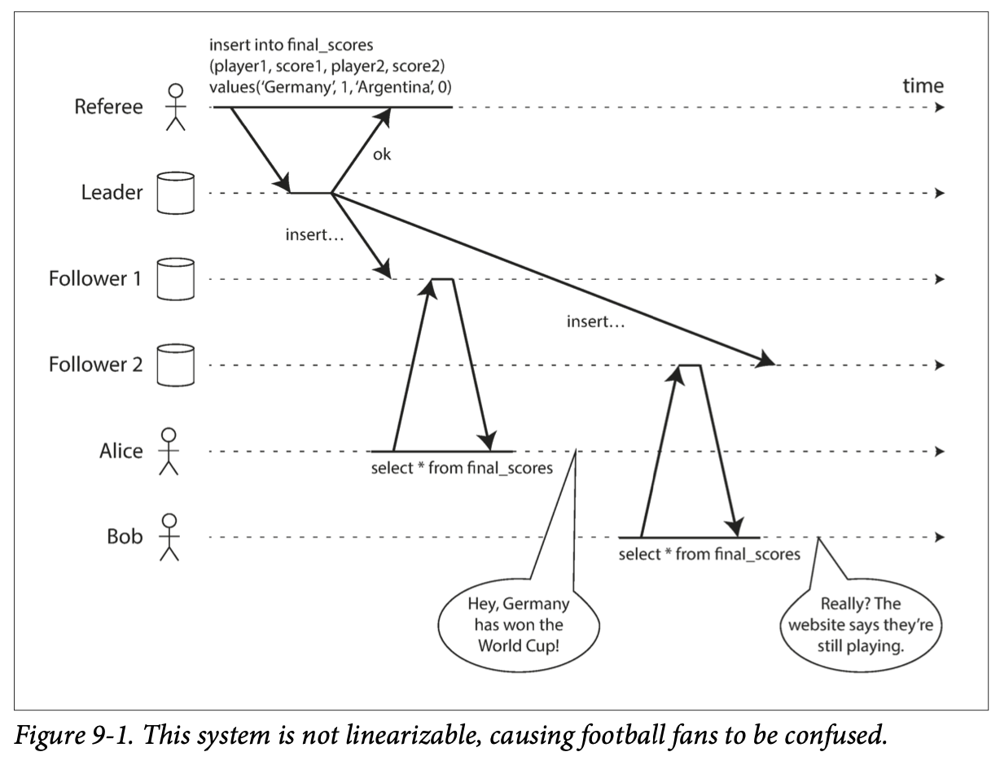
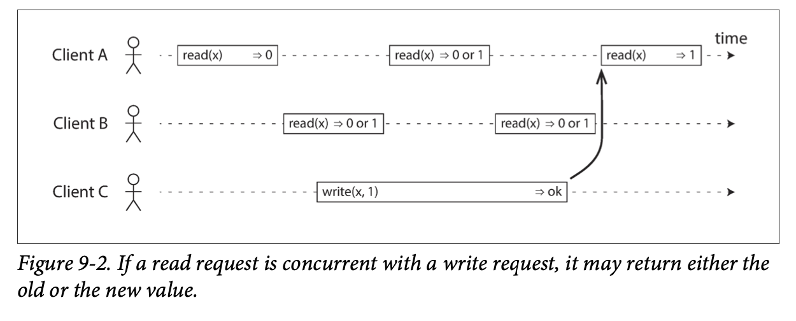
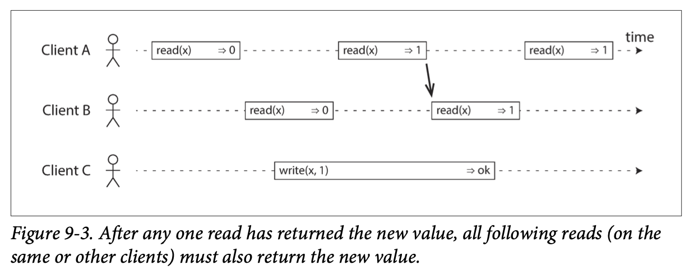
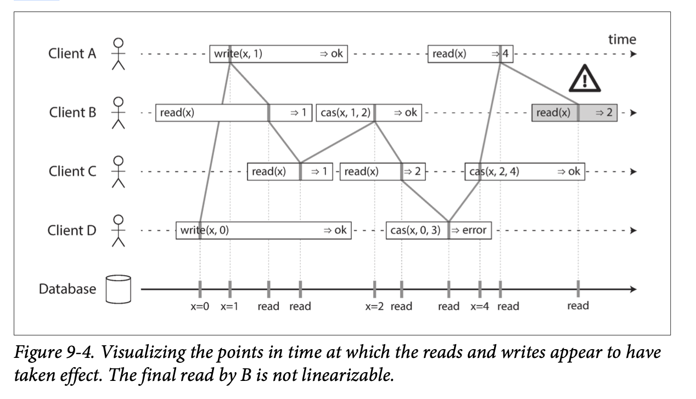
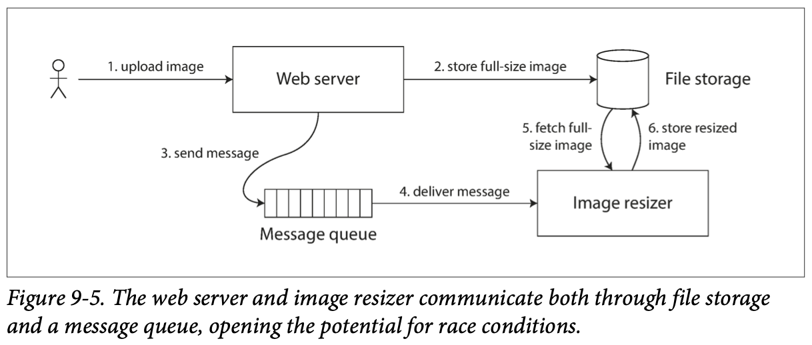
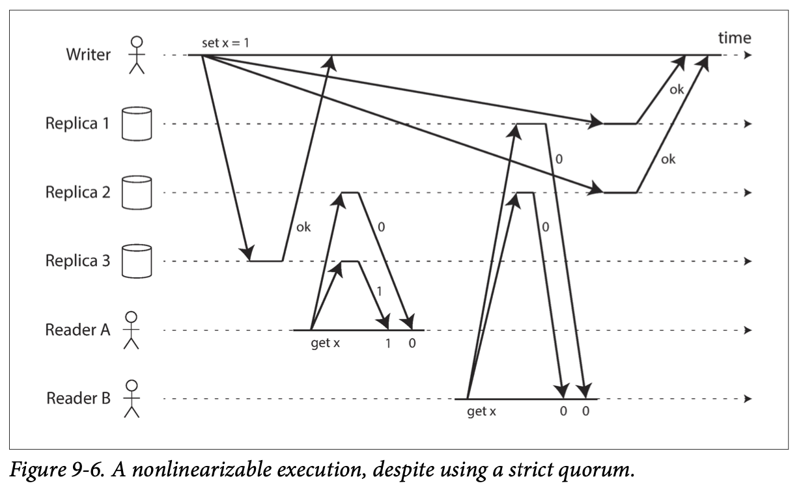
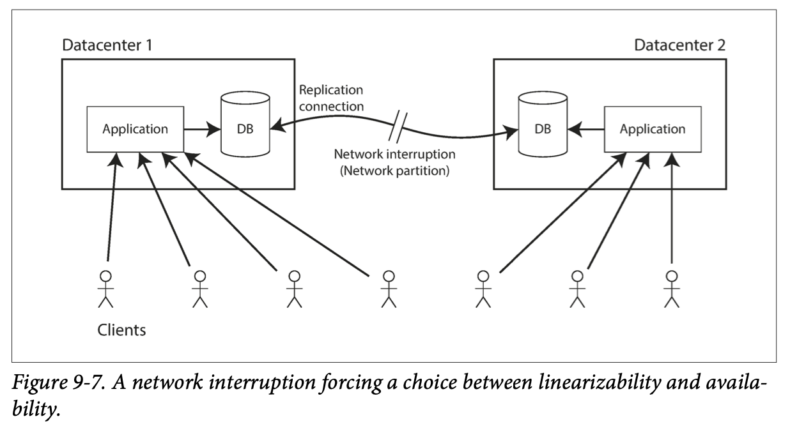

# 9. Consistency and Consensus

> Is it better to be alive and wrong or right and dead?
>
> —Jay Kreps, A Few Notes on Kafka and Jepsen (2013)

- [9. Consistency and Consensus](#9-consistency-and-consensus)
  - [Consistency Guarantees](#consistency-guarantees)
  - [Linearizability](#linearizability)
    - [What Makes a System Linearizable?](#what-makes-a-system-linearizable)
      - [Linearizability Versus Serializability](#linearizability-versus-serializability)
    - [Relying on Linearizability](#relying-on-linearizability)
      - [Locking and leader election](#locking-and-leader-election)
      - [Constraints and uniqueness guarantees](#constraints-and-uniqueness-guarantees)
      - [Cross-channel timing dependencies](#cross-channel-timing-dependencies)
    - [Implementing Linearizable Systems](#implementing-linearizable-systems)
      - [Linearizability and quorums](#linearizability-and-quorums)
    - [The Cost of Linearizability](#the-cost-of-linearizability)
      - [The CAP theorem](#the-cap-theorem)
      - [The Unhelpful CAP Theorem](#the-unhelpful-cap-theorem)
      - [Linearizability and network delays](#linearizability-and-network-delays)
  - [Ordering Guarantees](#ordering-guarantees)
    - [Ordering and Causality](#ordering-and-causality)
      - [The causal order is not a total order](#the-causal-order-is-not-a-total-order)
      - [Linearizability is stronger than causal consistency](#linearizability-is-stronger-than-causal-consistency)
      - [Capturing causal dependencies](#capturing-causal-dependencies)

The simplest way of handling faults is to simply let the entire service fail,
and show the user an error message. If that solution is unacceptable, we need
to find ways of tolerating faults—that is, of keeping the service functioning
correctly, even if some internal component is faulty.

The best way of building fault-tolerant systems is to find some general-purpose
abstractions with useful guarantees, implement them once, and then let
applications rely on those guarantees. This is the same approach as we used
with transactions: by using a transaction, the application can pretend that
there are no crashes (`atomicity`), that nobody else is concurrently accessing
the database (`isolation`), and that storage devices are perfectly reliable
(`durability`). Even though crashes, race conditions, and disk failures do
occur, the transaction abstraction hides those problems so that the application
doesn’t need to worry about them.

One of the most important abstractions for distributed systems is consensus:
that is, getting all of the nodes to agree on something.

Once you have an implementation of consensus, applications can use it for
various purposes. For example, say you have a database with single-leader
replication. If the leader dies and you need to fail over to another node, the
remaining database nodes can use consensus to elect a new leader. If two nodes
both believe that they are the leader, that situation is called split brain,
and it often leads to data loss. Correct implementations of consensus help
avoid such problems.

## Consistency Guarantees

Most replicated databases provide at least ***eventual consistency***, which
means that if you stop writing to the database and wait for some unspecified
length of time, then eventually all read requests will return the same value.
In other words, the inconsistency is temporary, and it eventually resolves
itself. A better name for eventual consistency may be ***convergence***, as we
expect all replicas to eventually converge to the same value.

Systems with stronger guarantees may have worse performance or be less
fault-tolerant than systems with weaker guarantees. Nevertheless, stronger
guarantees can be appealing because they are easier to use correctly.

There is some similarity between distributed consistency models and the
hierarchy of transaction isolation levels. But while there is some overlap,
they are mostly independent concerns:

- Transaction isolation is primarily about avoiding race conditions due to
  concurrently executing transactions
- Distributed consistency is mostly about coordinating the state of replicas in
  the face of delays and faults.

## Linearizability

Wouldn’t it be a lot simpler if the database could give the illusion that there
is only one replica? Then every client would have the same view of the data.

This is the idea behind ***linearizability*** (also known as
***atomic consistency***, ***strong consistency***, ***immediate consistency***,
or ***external consistency***). The basic idea is to make a system appear as if
there were only one copy of the data, and all operations on it are atomic.

In a linearizable system, as soon as one client successfully completes a write,
all clients reading from the database must be able to see the value just
written. Maintaining the illusion of a single copy of the data means
guaranteeing that the value read is the most recent, up-to-date value, and
doesn’t come from a stale cache or replica. In other words, linearizability is
a ***recency guarantee***.

If Alice and Bob had hit reload at the same time, it would have been less
surprising if they had gotten two different query results, because they
wouldn’t know at exactly what time their respective requests were processed by
the server. However, Bob knows that he hit the reload button after he heard
Alice exclaim the final score, and therefore he expects his query result to be
at least as recent as Alice’s. The fact that his query returned a stale result
is a violation of linearizability.

### What Makes a System Linearizable?

The basic idea behind linearizability is simple: to make a system appear as if
there is only a single copy of the data.

In the distributed systems literature, `x` is called a ***register*** — in
practice, it could be one key in a key-value store, one row in a relational
database, or one document in a document database, for example.

The start of a bar is the time when the request was sent, and the end of a bar
is when the response was received by the client. Due to variable network
delays, a client doesn’t know exactly when the database processed its
request — it only knows that it must have happened sometime between the client
sending the request and receiving the response.

In this example, the `register` has two types of operations:

- `read(x) ⇒ v` means the client requested to read the value of register `x`,
  and the database returned the value `v`.
- `write(x, v) ⇒ r` means the client requested to set the register `x` to value
  `v`, and the database returned response `r` (which could be `ok` or `error`).

What are the possible responses that `A` and `B` might get for their read
requests?

1. The first read operation by `client A` completes before the write begins, so
  it must definitely return the old value `0`.
2. The last read by `client A` begins after the write has completed, so it must
  definitely return the new value `1` if the database is ***linearizable***: we
  know that the write must have been processed sometime between the start and
  end of the write operation, and the read must have been processed sometime
  between the start and end of the read operation. If the read started after
  the write ended, then the read must have been processed after the write, and
  therefore it must see the new value that was written.
3. Any read operations that overlap in time with the write operation might
  return either `0` or `1`, because we don’t know whether or not the write has
  taken effect at the time when the read operation is processed.

第三种情况不满足 linearizability: if reads that are concurrent with a write can
return either the old or the new value, then readers could see a value flip
back and forth between the old and the new value several times while a write is
going on. That is not what we expect of a system that emulates a “single copy
of the data.”

- A register in which reads may return either the old or the new value if they
  are concurrent with a write is known as a ***regular register***.

To make the system linearizable, we need to add another constraint:

In a linearizable system we imagine that there must be some point in time
(between the start and end of the write operation) at which the value of `x`
atomically flips from `0` to `1`. Thus, if one client’s read returns the new
value `1`, all subsequent reads must also return the new value, even if the
write operation has not yet completed.

`Client A` is the first to read the new value, `1`. Just after `A`’s read
returns, `B` begins a new read. Since `B`’s read occurs strictly after `A`’s
read, it must also return `1`, even though the write by `C` is still ongoing.

A more complex example of non-linearizability:

- `cas(x, v_old, v_new) ⇒ r` means the client requested an atomic
  compare-and-set operation. If the current value of the register `x` equals
  `v_old`, it should be atomically set to `v_new`. If `x ≠ v_old` then the
  operation should leave the register unchanged and return an error. `r` is the
  database’s response (`ok` or `error`).
  - 可以理解为原子性的自增操作，如果旧值已发生变化，则自增失败。

Each operation in Figure 9-4 is marked with a vertical line at the time when we
think the operation was executed. Those markers are joined up in a sequential
order, and the result must be a valid sequence of reads and writes for a
`register` (every read must return the value set by the most recent write).

***The requirement of linearizability*** is that the lines joining up the
operation markers always move forward in time, never backward. This requirement
ensures the recency guarantee: once a new value has been written or read, all
subsequent reads see the value that was written, until it is overwritten again.

- First `client B` sent a request to read `x`, then `client D` sent a request
  to set `x` to `0`, and then `client A` sent a request to set `x` to `1`.
  Nevertheless, the value returned to `B`’s read is `1` (the value written by
  `A`). This is okay: it means that the database first processed `D`’s write,
  then `A`’s write, and finally `B`’s read. Although this is not the order in
  which the requests were sent, it’s an acceptable order, because the three
  requests are concurrent. Perhaps `B`’s read request was slightly delayed in
  the network, so it only reached the database after the two writes.
- `Client B`’s read returned `1` before `client A` received its response from
  the database, saying that the write of the value `1` was successful. This is
  also okay: it doesn’t mean the value was read before it was written, it just
  means the `ok` response from the database to `client A` was slightly delayed
  in the network.
- This model doesn’t assume any transaction isolation: another client may
  change a value at any time. For example, `C` first reads `1` and then reads
  `2`, because the value was changed by `B` between the two reads. An atomic
  `compare-and-set (cas)` operation can be used to check the value hasn’t been
  concurrently changed by another client: `B` and `C`’s `cas` requests succeed,
  but `D`’s cas request fails (by the time the database processes it, the value
  of `x` is no longer `0`).
- The final read by client `B` is not linearizable. The operation is concurrent
  with `C`’s cas write, which updates `x` from `2` to `4`. In the absence of
  other requests, it would be okay for `B`’s read to return `2`. However,
  `client A` has already read the new value `4` before `B`’s read started, so
  `B` is not allowed to read an older value than `A`.

It is possible (though computationally expensive) to test whether a system’s
behavior is linearizable by recording the timings of all requests and
responses, and checking whether they can be arranged into a valid sequential
order.

#### Linearizability Versus Serializability

Both words seem to mean something like “can be arranged in a sequential order.”
However, they are two quite different guarantees, and it is important to
distinguish between them:

- `Serializability`: `Serializability` is an isolation property of
  transactions, where every transaction may read and write multiple objects
  (rows, documents, records) - “Single-Object and Multi-Object Operations”. It
  guarantees that transactions behave the same as if they had executed in some
  serial order (each transaction running to completion before the next
  transaction starts). It is okay for that serial order to be different from
  the order in which transactions were actually run.
  - 可串行化是针对多个对象上的多个操作组成的事务，所有事务都能够被串行执行，不过顺序不一定确定，即允许多种可能的顺序。
  - 可以理解为，在逻辑时间线上，所有的事务会坍缩成一个点（原子性），并且按照一定顺序进行排列，可能有多种排列方式，但它们一定是有序的。
  - 这其实是 ACID 中 I (Isolation，隔离性)，当初是为了保证数据库的正确性而引入的。
  - 如果数据库中所有单个事务都能保证正确性，即事务执行前后的一致性，ACID 中的 C，那么一组事务串行化执行后，数据库仍能保证正确性。
  - 非序列化的存在原因是数据对象本身的非原子性。
- `Linearizability`: `Linearizability` is a recency guarantee on reads and
  writes of a `register` (an individual object). It doesn’t group operations
  together into transactions, so it does not prevent problems such as write
  skew, unless you take additional measures such as materializing conflicts.
  - 可线性化针对单个对象上的单个操作（比如读或者写），所有操作都能够被原子的、全局有序的完成。
    一个值一旦被写入，后面的读都能读到此值，直到其再次被修改；一个值一旦被读到，后面的读都会读到同样的值，直到其被修改。
  - 可线性化其实是原子一致性 (**atomic consistency**) 的别称，也即 CAP 中的 C
    (Consistency，一致性)。
  - 无论是单机多核，还是多机，在物理上，本质上都是多个执行流，当其进行协作时，如果不进行通信，很难保证对某个对象操作的全局有序。但要保证严格线性化，势必会引入过多通信，导致大大降低性能。
  - 非线性化的存在原因是数据对象有多个副本。

A database may provide both `serializability` and `linearizability`, and this
combination is known as `strict serializability` or
`strong one-copy serializability (strong-1SR)`. Implementations of
serializability based on two-phase locking or actual serial execution are
typically `linearizable`.

However, serializable snapshot isolation (SSI) is not linearizable: by design,
it makes reads from a consistent snapshot, to avoid lock contention between
readers and writers. The whole point of a consistent snapshot is that it does
not include writes that are more recent than the snapshot, and thus reads from
the snapshot are not linearizable.

### Relying on Linearizability

In what circumstances is linearizability useful? A result that is outdated by a
few seconds is unlikely to cause any real harm in this situation. However,
there are a few areas in which linearizability is an important requirement for
making a system work correctly.

#### Locking and leader election

One way of electing a leader is to use a lock: every node that starts up tries
to acquire the lock, and the one that succeeds becomes the leader [14]. No
matter how this lock is implemented, it must be `linearizable`: all nodes must
agree which node owns the lock; otherwise it is useless.

Coordination services like Apache ZooKeeper and etcd are often used to
implement distributed locks and leader election. They use consensus algorithms
to implement `linearizable` operations in a fault-tolerant way. Libraries like
Apache Curator help by providing higher-level recipes on top of ZooKeeper.
However, a `linearizable` storage service is the basic foundation for these
coordination tasks.

Distributed locking is also used at a much more granular level in some
distributed databases, such as Oracle Real Application Clusters (RAC). RAC uses
a lock per disk page, with multiple nodes sharing access to the same disk
storage system. Since these linearizable locks are on the critical path of
transaction execution, RAC deployments usually have a dedicated cluster
interconnect network for communication between database nodes.

#### Constraints and uniqueness guarantees

A hard uniqueness constraint, such as the one you typically find in relational
databases, requires linearizability. Other kinds of constraints, such as
foreign key or attribute constraints, can be implemented without requiring
linearizability.

#### Cross-channel timing dependencies

The *linearizability violation* was only noticed because there was an
additional communication channel in the system (Alice’s voice to Bob’s ears).
Similar situations can arise in computer systems. For example, say you have a
website where users can upload a photo, and a background process resizes the
photos to lower resolution for faster download:

The image resizer needs to be explicitly instructed to perform a resizing job.
The photo is first written to a file storage service, and once the write is
complete, the instruction to the resizer is placed on the queue.

If the file storage service is linearizable, then this system should work fine.
If it is not linearizable, there is the risk of a race condition: the message
queue might be faster than the internal replication inside the storage service.
In this case, when the resizer fetches the image, it might see an old version
of the image, or nothing at all. If it processes an old version of the image,
the full-size and resized images in the file storage become permanently
inconsistent.

This situation is analogous to Figure 9-1, where there was also a race
condition between two communication channels: the database replication and the
real-life audio channel between Alice’s mouth and Bob’s ears.

*Linearizability* is not the only way of avoiding this race condition, but it’s
the simplest to understand. If you control the additional communication channel,
you can use alternative approaches similar to what we discussed in
“Reading Your Own Writes”, at the cost of additional complexity.

### Implementing Linearizable Systems

Since ***linearizability essentially means “behave as though there is only a
single copy of the data***, and all operations on it are atomic,” the simplest
answer would be to really only use a single copy of the data. However, that
approach would not be able to tolerate faults: if the node holding that one
copy failed, the data would be lost, or at least inaccessible until the node
was brought up again.

The most common approach to making a system fault-tolerant is to use
replication. Whether the replication methods can be made linearizable:

- **Single-leader replication (potentially linearizable)**
  - In a system with single-leader replication, the leader has the primary copy
    of the data that is used for writes, and the followers maintain backup
    copies of the data on other nodes. If you make reads from the leader, or
    from synchronously updated followers, they have the potential to be
    linearizable.
    - Partitioning (sharding) a single-leader database, so that there is a
      separate leader per partition, does not affect linearizability, since it
      is only a single-object guarantee. Cross-partition transactions are a
      different matter.
    - However, not every single-leader database is actually linearizable, either
      by design (e.g., because it uses snapshot isolation) or due to concurrency
      bugs.
  - Using the leader for reads relies on the assumption that you know for sure
    who the leader is. It is quite possible for a node to think that it is the
    leader, when in fact it is not — and if the delusional leader continues to
    serve requests, it is likely to violate linearizability. With asynchronous
    replication, failover may even lose committed writes, which violates both
    durability and linearizability.
- **Consensus algorithms (linearizable)**
  - Some consensus algorithms bear a resemblance to single-leader replication.
    However, consensus protocols contain measures to prevent split brain and
    stale replicas. Thanks to these details, consensus algorithms can implement
    linearizable storage safely. This is how ZooKeeper and etcd work, for
    example.
- **Multi-leader replication (not linearizable)**
  - Systems with multi-leader replication are generally not linearizable,
    because they concurrently process writes on multiple nodes and
    asynchronously replicate them to other nodes. For this reason, they can
    produce conflicting writes that require resolution. Such conflicts are an
    artifact of the lack of a single copy of the data.
- **Leaderless replication (probably not linearizable)**
  - For systems with leaderless replication (Dynamo-style), people sometimes
    claim that you can obtain “strong consistency” by requiring quorum reads
    and writes `(w + r > n)`. Depending on the exact configuration of the
    quorums, and depending on how you define strong consistency, this is not
    quite true.
  - “Last write wins” conflict resolution methods based on time-of-day clocks
    (e.g., in Cassandra) are almost certainly nonlinearizable, because clock
    timestamps cannot be guaranteed to be consistent with actual event ordering
    due to clock skew. Sloppy quorums (“Sloppy Quorums and Hinted Handoff”)
    also ruin any chance of linearizability. Even with strict quorums,
    nonlinearizable behavior is possible.

#### Linearizability and quorums

Intuitively, it seems as though strict quorum reads and writes should be
linearizable in a Dynamo-style model. However, when we have variable network
delays, it is possible to have race conditions.

The initial value of `x` is `0`, and a writer client is updating `x` to `1` by
sending the write to all three replicas (`n = 3`, `w = 3`). Concurrently,
`client A` reads from a quorum of two nodes (`r = 2`) and sees the new value `1`
on one of the nodes. Also concurrently with the write, `client B` reads from a
different quorum of two nodes, and gets back the old value `0` from both.

The quorum condition is met (`w + r > n`), but this execution is nevertheless
not linearizable: `B`’s request begins after `A`’s request completes, but `B`
returns the old value while `A` returns the new value.

It is possible to make Dynamo-style quorums linearizable at the cost of reduced
performance: a reader must perform read repair synchronously, before returning
results to the application, and a writer must read the latest state of a quorum
of nodes before sending its writes. However, Riak does not perform synchronous
read repair due to the performance penalty. Cassandra does wait for read repair
to complete on quorum reads, but it loses linearizability if there are multiple
concurrent writes to the same key, due to its use of last-write-wins conflict
resolution.

Moreover, only linearizable read and write operations can be implemented in
this way; a linearizable compare-and-set operation cannot, because it requires
a consensus algorithm.

In summary, it is safest to assume that a leaderless system with Dynamo-style
replication does not provide linearizability.

### The Cost of Linearizability

Consider what happens if there is a network interruption between the two
datacenters. Let’s assume that the network within each datacenter is working,
and clients can reach the datacenters, but the datacenters cannot connect to
each other.

With a multi-leader database, each datacenter can continue operating normally:
since writes from one datacenter are asynchronously replicated to the other,
the writes are simply queued up and exchanged when network connectivity is
restored.

On the other hand, if single-leader replication is used, then the leader must
be in one of the datacenters. Any writes and any linearizable reads must be
sent to the leader — thus, for any clients connected to a follower datacenter,
those read and write requests must be sent synchronously over the network to
the leader datacenter.

If the network between datacenters is interrupted in a single-leader setup,
clients connected to follower datacenters cannot contact the leader, so they
cannot make any writes to the database, nor any linearizable reads. They can
still make reads from the follower, but they might be stale (nonlinearizable).
If the application requires linearizable reads and writes, the network
interruption causes the application to become unavailable in the datacenters
that cannot contact the leader.

If clients can connect directly to the leader datacenter, this is not a
problem, since the application continues to work normally there. But clients
that can only reach a follower datacenter will experience an outage until the
network link is repaired.

#### The CAP theorem

This issue is not just a consequence of single-leader and multi-leader
replication: any linearizable database has this problem, no matter how it is
implemented. The issue also isn’t specific to multi-datacenter deployments, but
can occur on any unreliable network, even within one datacenter. The trade-off
is as follows:

- If your application requires linearizability, and some replicas are
  disconnected from the other replicas due to a network problem, then some
  replicas cannot process requests while they are disconnected: they must
  either wait until the network problem is fixed, or return an error (either
  way, they become unavailable).
  - This is known as **CP** (consistent but not available under network
    partitions)
- If your application does not require linearizability, then it can be written
  in a way that each replica can process requests independently, even if it is
  disconnected from other replicas (e.g., multi-leader). In this case, the
  application can remain available in the face of a network problem, but its
  behavior is not linearizable.
  - This is known as **AP** (available but not consistent under network
    partitions)

Thus, applications that don’t require linearizability can be more tolerant of
network problems. This insight is known as the CAP theorem, named by Eric Brewer
in 2000, although the trade-off has been known to designers of distributed
databases since the 1970s.

CAP was originally proposed as a rule of thumb, without precise definitions,
with the goal of starting a discussion about trade-offs in databases. At the
time, many distributed databases focused on providing linearizable semantics on
a cluster of machines with shared storage, and CAP encouraged database
engineers to explore a wider design space of distributed shared-nothing
systems, which were more suitable for implementing large-scale web services.
CAP deserves credit for this culture shift — witness the explosion of new
database technologies since the mid-2000s (known as NoSQL).

The CAP theorem as formally defined is of very narrow scope: it only considers
one consistency model (namely linearizability) and one kind of fault (network
partitions, or nodes that are alive but disconnected from each other). It
doesn’t say any‐thing about network delays, dead nodes, or other trade-offs.
Thus, although CAP has been historically influential, it has little practical
value for designing systems.

CAP has now been superseded by more precise results, so it is of mostly
historical interest today.

#### The Unhelpful CAP Theorem

CAP is sometimes presented as pick 2 out of the 3:

- Consistency
- Availability
- Partition tolerance
  - network partition 是一种网络故障，和数据 partitioning 是两回事。

Unfortunately, putting it this way is misleading because network partitions are
a kind of fault, so they aren’t something about which you have a choice: they
will happen whether you like it or not.

At times when the network is working correctly, a system can provide both
consistency (linearizability) and total availability. When a network fault
occurs, you have to choose between either `linearizability` or
`total availability`. Thus, a better way of phrasing CAP would be either
`Consistent` or `Available` when Partitioned. A more reliable network needs to
make this choice less often, but at some point the choice is inevitable.

In discussions of CAP there are several contradictory definitions of the term
`availability`, and the formalization as a theorem does not match its usual
meaning. Many so-called “highly available” (fault-tolerant) systems actually do
not meet CAP’s idiosyncratic definition of availability. All in all, there is a
lot of misunderstanding and confusion around CAP, and it does not help us
understand systems better, so CAP is best avoided.

#### Linearizability and network delays

Although linearizability is a useful guarantee, surprisingly few systems are
actually linearizable in practice. For example, even RAM on a modern multi-core
CPU is not linearizable: if a thread running on one CPU core writes to a memory
address, and a thread on another CPU core reads the same address shortly
afterward, it is not guaranteed to read the value written by the first thread
(unless a memory barrier or fence is used).

The reason for this behavior is that every CPU core has its own memory cache
and store buffer. Memory access first goes to the cache by default, and any
changes are asynchronously written out to main memory. Since accessing data in
the cache is much faster than going to main memory, this feature is essential
for good performance on modern CPUs. However, there are now several copies of
the data, and these copies are asynchronously updated, so linearizability is
lost.

Why make this trade-off? It makes no sense to use the CAP theorem to justify
the multi-core memory consistency model: within one computer we usually assume
reliable communication, and we don’t expect one CPU core to be able to continue
operating normally if it is disconnected from the rest of the computer.

- The reason for dropping linearizability is performance, not fault tolerance.

The same is true of many distributed databases that choose not to provide
linearizable guarantees: they do so primarily to increase performance, not so
much for fault tolerance. Linearizability is slow — and this is true all the
time, not only during a network fault.

Can’t we maybe find a more efficient implementation of linearizable storage? It
seems the answer is no: Attiya and Welch prove that if you want
linearizability, the response time of read and write requests is at least
proportional to the uncertainty of delays in the network. In a network with
highly variable delays, the response time of linearizable reads and writes is
inevitably going to be high. A faster algorithm for linearizability does not
exist, but weaker consistency models can be much faster, so this trade-off is
important for latency-sensitive systems.

## Ordering Guarantees

A linearizable register behaves as if there is only a single copy of the data,
and that every operation appears to take effect atomically at one point in
time. This definition implies that operations are executed in some well-defined
order.

Ordering suggests that it might be an important fundamental idea:

- The main purpose of the leader in single-leader replication is to determine
  the order of writes in the replication log — that is, the order in which
  followers apply those writes. If there is no single leader, conflicts can
  occur due to concurrent operations.
- Serializability is about ensuring that transactions behave as if they were
  executed in some sequential order. It can be achieved by literally executing
  transactions in that serial order, or by allowing concurrent execution while
  preventing serialization conflicts (by locking or aborting).
- The use of timestamps and clocks in distributed systems is another attempt to
  introduce order into a disorderly world, for example to determine which one
  of two writes happened later.

It turns out that there are deep connections between ordering, linearizability,
and consensus.

### Ordering and Causality

There are several reasons why ordering keeps coming up, and one of the reasons
is that it helps preserve causality:

- If a question is answered, then clearly the question had to be there first,
  because the person giving the answer must have seen the question. We say that
  there is a causal dependency between the question and the answer.
- In the replication between three leaders, some writes could “overtake” others
  due to network delays. From the perspective of one of the replicas it would
  look as though there was an update to a row that did not exist. Causality
  here means that a row must first be created before it can be updated.
- If you have two operations A and B, there are three possibilities: either A
  happened before B, or B happened before A, or A and B are concurrent. This
  happened before relationship is another expression of causality:
  - if A happened before B, that means B might have known about A, or built
    upon A, or depended on A.
  - If A and B are concurrent, there is no causal link between them; in other
    words, we are sure that neither knew about the other.
- In the context of snapshot isolation for transactions, a transaction reads
  from a consistent snapshot. But what does “consistent” mean in this context?
  It means consistent with causality: if the snapshot contains an answer, it
  must also contain the question being answered. Observing the entire database
  at a single point in time makes it consistent with causality: the effects of
  all operations that happened causally before that point in time are visible,
  but no operations that happened causally afterward can be seen.
  - Read skew (non-repeatable reads) means reading data in a state that
    violates causality.
- Write skew between transactions also demonstrated causal dependencies: Alice
  was allowed to go off call because the transaction thought that Bob was still
  on call, and vice versa. In this case, the action of going off call is
  causally dependent on the observation of who is currently on call.
  Serializable snapshot isolation detects write skew by tracking the causal
  dependencies between transactions.
- In the example of Alice and Bob watching football, the fact that Bob got a
  stale result from the server after hearing Alice exclaim the result is a
  causality violation: Alice’s exclamation is causally dependent on the
  announcement of the score, so Bob should also be able to see the score after
  hearing Alice.

Causality imposes an ordering on events:

- cause comes before effect;
- a message is sent before that message is received;
- the question comes before the answer.

If a system obeys the ordering imposed by causality, we say that it is
***causally consistent***. For example, `snapshot isolation` provides
`causal consistency`: when you read from the database, and you see some piece
of data, then you must also be able to see any data that causally precedes it.

#### The causal order is not a total order

A ***total order*** allows any two elements to be compared, so if you have two
elements, you can always say which one is greater and which one is smaller. For
example, natural numbers are totally ordered: you can tell that 13 is greater
than 5.

However, mathematical sets are not totally ordered: is `{a, b}` greater than
`{b, c}`? Well, you can’t really compare them, because neither is a subset of
the other. We say they are incomparable, and therefore mathematical sets are
***partially ordered***: in some cases one set is greater than another (if one
set contains all the elements of another), but in other cases they are
incomparable.

The difference between a `total order` and a `partial order` is reflected in
different database consistency models:

- **Linearizability**
  - In a linearizable system, we have a `total order` of operations: if the
    system behaves as if there is only a single copy of the data, and every
    operation is atomic, this means that for any two operations we can always
    say which one happened first.
- **Causality**
  - We said that two operations are concurrent if neither happened before the
    other. Put another way, two events are ordered if they are causally related
    (one happened before the other), but they are incomparable if they are
    concurrent. This means that causality defines a `partial order`, not a
    `total order`: some operations are ordered with respect to each other, but
    some are incomparable.

Therefore, according to this definition, there are no concurrent operations in
a linearizable datastore: there must be a single timeline along which all
operations are totally ordered. There might be several requests waiting to be
handled, but the datastore ensures that every request is handled atomically at
a single point in time, acting on a single copy of the data, along a single
timeline, without any concurrency.

Concurrency would mean that the timeline branches and merges again — and in
this case, operations on different branches are incomparable.

Git's version histories are very much like the graph of causal dependencies.
Often one commit happens after another, in a straight line, but sometimes you
get branches, and merges are created when those concurrently created commits
are combined.

#### Linearizability is stronger than causal consistency

What is the relationship between the causal order and linearizability?

Linearizability **implies** causality: any system that is linearizable will
preserve causality correctly. In particular, if there are multiple
communication channels in a system, linearizability ensures that causality is
automatically preserved without the system having to do anything special.

The fact that linearizability ensures causality is what makes linearizable
systems simple to understand and appealing. However, making a system
linearizable can harm its performance and availability, especially if the
system has significant network delays. For this reason, some distributed data
systems have abandoned linearizability, which allows them to achieve better
performance but can make them difficult to work with.

The good news is that a middle ground is possible. Linearizability is not the
only way of preserving causality. A system can be causally consistent without
incurring the performance hit of making it linearizable. In fact, ***causal
consistency is the strongest possible consistency model that does not slow
down*** due to network delays, and remains available in the face of network
failures.

In many cases, systems that appear to require linearizability in fact only
really require `causal consistency`, which can be implemented more efficiently.

#### Capturing causal dependencies

>>>>> progress
