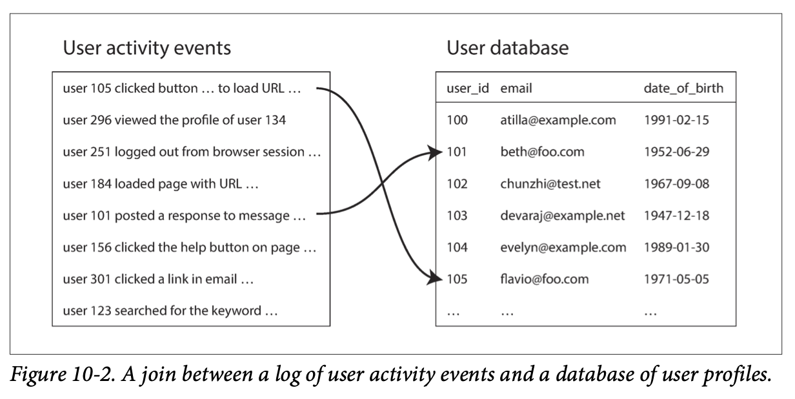
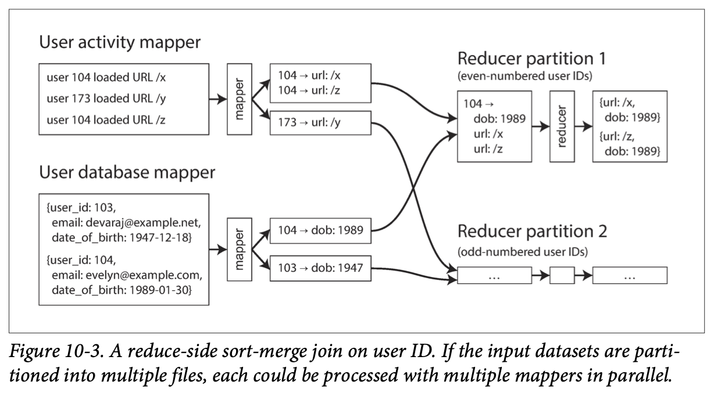

# 10. Batch Processing

> A system cannot be successful if it is too strongly influenced by a single
> person. Once the initial design is complete and fairly robust, the real test
> begins as people with many different viewpoints undertake their own
> experiments.
>
> —Donald Knuth

- [10. Batch Processing](#10-batch-processing)
  - [Batch Processing with Unix Tools](#batch-processing-with-unix-tools)
    - [Simple Log Analysis](#simple-log-analysis)
      - [Chain of commands versus custom program](#chain-of-commands-versus-custom-program)
      - [Sorting versus in-memory aggregation](#sorting-versus-in-memory-aggregation)
    - [The Unix Philosophy](#the-unix-philosophy)
      - [A uniform interface](#a-uniform-interface)
      - [Separation of logic and wiring](#separation-of-logic-and-wiring)
      - [Transparency and experimentation](#transparency-and-experimentation)
  - [MapReduce and Distributed Filesystems](#mapreduce-and-distributed-filesystems)
    - [MapReduce Job Execution](#mapreduce-job-execution)
      - [Distributed execution of MapReduce](#distributed-execution-of-mapreduce)
      - [MapReduce workflows](#mapreduce-workflows)
    - [Reduce-Side Joins and Grouping](#reduce-side-joins-and-grouping)
      - [Example: analysis of user activity events](#example-analysis-of-user-activity-events)
      - [Sort-merge joins](#sort-merge-joins)
      - [Bringing related data together in the same place](#bringing-related-data-together-in-the-same-place)
      - [GROUP BY](#group-by)
      - [Handling skew](#handling-skew)
    - [Map-Side Joins](#map-side-joins)
      - [Broadcast hash joins](#broadcast-hash-joins)

Three different types of systems:

- ***Services (online systems)***: A service waits for a request or instruction
  from a client to arrive. When one is received, the service tries to handle it
  as quickly as possible and sends a response back.
- ***Batch processing systems (offline systems)***: A batch processing system
  takes a large amount of input data, runs a job to process it, and produces
  some output data. Jobs often take a while (from a few minutes to several
  days). Batch jobs are often scheduled to run periodically. The primary
  performance measure of a batch job is usually throughput (the time it takes
  to crunch through an input dataset of a certain size).
- ***Stream processing systems (near-real-time systems)***: Stream processing
  is somewhere between online and offline/batch processing (so it is sometimes
  called ***near-real-time*** or ***nearline*** processing). Like a batch
  processing system, a stream processor consumes inputs and produces outputs.
  However, a stream job operates on events shortly after they happen, whereas a
  batch job operates on a fixed set of input data. This difference allows
  stream processing systems to have lower latency than the equivalent batch
  systems.

Batch processing is an important building block in our quest to build reliable,
scalable, and maintainable applications. For example, MapReduce, was called
“the algorithm that makes Google so massively scalable”. It was subsequently
implemented in various open source data systems, including Hadoop, CouchDB, and
MongoDB.

MapReduce is a fairly low-level programming model compared to the parallel
processing systems that were developed for data warehouses many years
previously, but it was a major step forward in terms of the scale of processing
that could be achieved on commodity hardware. It provides a clear picture of
why and how batch processing is useful.

The ideas and lessons from Unix carry over to large-scale, heterogeneous
distributed data systems.

## Batch Processing with Unix Tools

Say you have a web server that appends a line to a log file every time it
serves a request. For example, using the nginx default access log format, one
line of the log might look like this:

```log
216.58.210.78 - - [27/Feb/2015:17:55:11 +0000] "GET /css/typography.css HTTP/1.1"
200 3377 "http://martin.kleppmann.com/" "Mozilla/5.0 (Macintosh; Intel Mac OS X
10_9_5) AppleWebKit/537.36 (KHTML, like Gecko) Chrome/40.0.2214.115
Safari/537.36"
```

In order to interpret it, you need to look at the definition of the log format:

```log
$remote_addr - $remote_user [$time_local] "$request"
$status $body_bytes_sent "$http_referer" "$http_user_agent"
```

### Simple Log Analysis

Say you want to find the five most popular pages on your website:

```sh
cat /var/log/nginx/access.log | # 1.
  awk '{print $7}' |            # 2.
  sort             |            # 3.
  uniq -c          |            # 4.
  sort -r -n       |            # 5.
  head -n 5                     # 6.
```

1. Read the log file.
2. Split each line into fields by whitespace, and output only the seventh such
   field from each line, which happens to be the requested URL. In our example
   line, this request URL is `/css/typography.css`.
3. Alphabetically `sort` the list of requested URLs. If some URL has been
   requested `n` times, then after sorting, the file contains the same URL
   repeated `n` times in a row.
4. The `uniq` command filters out repeated lines in its input by checking
   whether two adjacent lines are the same. The `-c` option tells it to also
   output a counter: for every distinct URL, it reports how many times that URL
   appeared in the input.
5. The second `sort` sorts by the number (`-n`) at the start of each line,
   which is the number of times the URL was requested. It then returns the
   results in reverse (`-r`) order, i.e. with the largest number first.
6. Finally, `head` outputs just the first five lines (`-n 5`) of input, and
   discards the rest.

The preceding command line is incredibly powerful. It will process gigabytes of
log files in a matter of seconds, and you can easily modify the analysis to
suit your needs.

- For example, if you want to omit CSS files from the report, change the `awk`
  argument to `$7 !~ /\.css$/ {print $7}`.
- If you want to count top client IP addresses instead of top pages, change the
  `awk` argument to `{print $1}`.

#### Chain of commands versus custom program

You could write a simple program to do the same thing. For example, in Ruby, it
might look something like this:

```rb
counts = Hash.new(0) # 1.
File.open('/var/log/nginx/access.log') do |file|
  file.each do |line|
    url = line.split[6] # 2.
    counts[url] += 1 # 3.
  end
end

top5 = counts.map{|url, count| [count, url] }.sort.reverse[0...5] # 4.
top5.each{|count, url| puts "#{count} #{url}" } # 5.
```

This program is not as concise as the chain of Unix pipes, but it’s fairly
readable, and which of the two you prefer is partly a matter of taste. However,
besides the superficial syntactic differences between the two, there is a big
difference in the execution flow, which becomes apparent if you run this
analysis on a large file.

#### Sorting versus in-memory aggregation

The Ruby script keeps an in-memory hash table of URLs. The Unix pipeline
example does not have such a hash table, but instead relies on sorting a list
of URLs in which multiple occurrences of the same URL are simply repeated.

Which approach is better depends on how many different URLs you have.

If the job’s working set is larger than the available memory, the sorting
approach has the advantage that it can make efficient use of disks. The
principle: chunks of data can be sorted in memory and written out to disk as
segment files, and then multiple sorted segments can be merged into a larger
sorted file. **Mergesort** has sequential access patterns that perform well on
disks.

The `sort` utility in GNU Coreutils (Linux) automatically handles
larger-than-memory datasets by spilling to disk, and automatically parallelizes
sorting across multiple CPU cores. This means that the simple chain of Unix
commands easily scales to large datasets, without running out of memory. The
bottleneck is likely to be the rate at which the input file can be read from
disk.

### The Unix Philosophy

Using a chain of commands to do something complex was one of the key design
ideas of Unix, and it remains astonishingly relevant today.

Doug McIlroy, the inventor of Unix pipes, first described them like this: “We
should have some ways of connecting programs like [a] garden hose — screw in
another segment when it becomes necessary to massage data in another way. This
is the way of I/O also.” The idea of connecting pro grams with pipes became
part of what is now known as the Unix philosophy — a set of design principles:

1. Make each program do one thing well. To do a new job, build afresh rather
   than complicate old programs by adding new “features”.
2. Expect the output of every program to become the input to another, as yet
   unknown, program. Don’t clutter output with extraneous information. Avoid
   stringently columnar or binary input formats. Don’t insist on interactive
   input.
3. Design and build software, even operating systems, to be tried early,
   ideally within weeks. Don’t hesitate to throw away the clumsy parts and
   rebuild them.
4. Use tools in preference to unskilled help to lighten a programming task,
   even if you have to detour to build the tools and expect to throw some of
   them out after you’ve finished using them.

This approach — automation, rapid prototyping, incremental iteration, being
friendly to experimentation, and breaking down large projects into manageable
chunks — sounds remarkably like the Agile and DevOps movements of today.

#### A uniform interface

If you want to be able to connect any program’s output to any program’s input,
that means that all programs must use the same input/output interface.

In Unix, that interface is a file (more precisely, a file descriptor). A file
is just an ordered sequence of bytes. Because that is such a simple interface,
many different things can be represented using the same interface: an actual
file on the filesystem, a communication channel to another process (Unix
`socket`, `stdin`, `stdout`), a device driver (say `/dev/audio` or `/dev/lp0`),
a socket representing a TCP connection, and so on.

By convention, many Unix programs treat this sequence of bytes as ASCII text.

The parsing of each record is more vague. Unix tools commonly split a line into
fields by whitespace or tab characters, but CSV (comma-separated),
pipe-separated, and other encodings are also used.

The uniform interface of ASCII text mostly works, but it’s not exactly
beautiful.

Even databases with the same data model often don’t make it easy to get data
out of one and into the other. This lack of integration leads to Balkanization
of data.

#### Separation of logic and wiring

Another characteristic feature of Unix tools is their use of standard input
(`stdin`) and standard output (`stdout`). If you run a program and don’t
specify anything else, `stdin` comes from the keyboard and `stdout` goes to the
screen.

Separating the input/output wiring from the program logic makes it easier to
compose small tools into bigger systems.

However, there are limits to what you can do with `stdin` and `stdout`.
Programs that need multiple inputs or outputs are possible but tricky. You
can’t pipe a program’s output into a network connection.

- Except by using a separate tool, such as `netcat` or `curl`. Unix started out
  trying to represent everything as files, but the BSD sockets API deviated
  from that convention. The research operating systems Plan 9 and Inferno are
  more consistent in their use of files: they represent a TCP connection as a
  file in `/net/tcp`.

#### Transparency and experimentation

Part of what makes Unix tools so successful is that they make it quite easy to
see what is going on:

- The input files to Unix commands are normally treated as immutable. You can
  run the commands as often as you want, trying various command-line options,
  without damaging the input files.
- You can end the pipeline at any point, pipe the output into `less`, and look
  at it to see if it has the expected form.
- You can write the output of one pipeline stage to a file and use that file as
  input to the next stage. This allows you to restart the later stage without
  rerunning the entire pipeline.

However, the biggest limitation of Unix tools is that they run only on a single
machine — and that’s where tools like Hadoop come in.

## MapReduce and Distributed Filesystems

MapReduce is a bit like Unix tools, but distributed across potentially
thousands of machines. A single MapReduce job is comparable to a single Unix
process: it takes one or more inputs and produces one or more outputs.

As with most Unix tools, running a MapReduce job normally does not modify the
input and does not have any side effects other than producing the output. The
output files are written once, in a sequential fashion.

While Unix tools use `stdin` and `stdout` as input and output, MapReduce jobs
read and write files on a distributed filesystem. In Hadoop’s implementation of
MapReduce, that filesystem is called HDFS (Hadoop Distributed File System), an
open source reimplementation of the Google File System (GFS).

Various other distributed filesystems besides HDFS exist, such as GlusterFS and
the Quantcast File System (QFS). Object storage services such as Amazon S3,
Azure Blob Storage, and OpenStack Swift are similar in many ways.

- One difference is that with HDFS, computing tasks can be scheduled to run on
  the machine that stores a copy of a particular file, whereas object stores
  usually keep storage and computation separate. Reading from a local disk has
  a performance advantage if network bandwidth is a bottleneck. Note however
  that if erasure coding is used, the locality advantage is lost, because the
  data from several machines must be combined in order to reconstitute the
  original file.

HDFS is based on the ***shared-nothing*** principle, in contrast to the
shared-disk approach of ***Network Attached Storage*** (NAS) and
***Storage Area Network*** (SAN) architectures. Shared-disk storage is
implemented by a centralized storage appliance, often using custom hardware and
special network infrastructure such as Fibre Channel. On the other hand, the
shared-nothing approach requires no special hardware, only computers connected
by a conventional datacenter network.

HDFS consists of a daemon process running on each machine, exposing a network
service that allows other nodes to access files stored on that machine. A
central server called the ***NameNode*** keeps track of which file blocks are
stored on which machine. Thus, HDFS conceptually creates one big filesystem
that can use the space on the disks of all machines running the daemon.

In order to tolerate machine and disk failures, file blocks are replicated on
multiple machines. Replication may mean simply several copies of the same data
on multiple machines or an ***erasure coding*** scheme such as Reed–Solomon
codes, which allows lost data to be recovered with lower storage overhead than
full replication. The techniques are similar to RAID, which provides redundancy
across several disks attached to the same machine; the difference is that in a
distributed filesystem, file access and replication are done over a
conventional datacenter network without special hardware.

HDFS has scaled well: the biggest HDFS deployments run on tens of thousands of
machines, with combined storage capacity of hundreds of petabytes.

### MapReduce Job Execution

MapReduce is a programming framework with which you can write code to process
large datasets in a distributed filesystem like HDFS.

1. Read a set of input files, and break it up into records.
2. Call the mapper function to extract a key and value from each input record.
3. Sort all of the key-value pairs by key.
4. Call the reducer function to iterate over the sorted key-value pairs. If
   there are multiple occurrences of the same key, the sorting has made them
   adjacent in the list, so it is easy to combine those values without having
   to keep a lot of state in memory.

Those four steps can be performed by one MapReduce job. Steps 2 (map) and 4
(reduce) are where you write your custom data processing code. Step 1 (breaking
files into records) is handled by the input format parser. Step 3, the sort
step, is implicit in MapReduce — you don’t have to write it, because the output
from the mapper is always sorted before it is given to the reducer.

To create a MapReduce job, you need to implement two callback functions, the
`mapper` and `reducer`, which behave as follows:

- ***Mapper***: The mapper is called once for every input record, and its job
  is to extract the key and value from the input record. For each input, it may
  generate any number of key-value pairs (including none).
- ***Reducer***: The MapReduce framework takes the key-value pairs produced by
  the mappers, collects all the values belonging to the same key, and calls the
  reducer with an iterator over that collection of values. The reducer can
  produce output records.

In the web server log example, we had a second sort command in step 5, which
ranked URLs by number of requests. In MapReduce, if you need a second sorting
stage, you can implement it by writing a second MapReduce job and using the
output of the first job as input to the second job. Viewed like this, the role
of the mapper is to prepare the data by putting it into a form that is suitable
for sorting, and the role of the reducer is to process the data that has been
sorted.

#### Distributed execution of MapReduce

The main difference from pipelines of Unix commands is that MapReduce can
parallelize a computation across many machines, without you having to write
code to explicitly handle the parallelism. The mapper and reducer only operate
on one record at a time; they don’t need to know where their input is coming
from or their output is going to, so the framework can handle the complexities
of moving data between machines.

It is possible to use standard Unix tools as mappers and reducers in a
distributed computation, but more commonly they are implemented as functions in
a conventional programming language. In Hadoop MapReduce, the mapper and
reducer are each a Java class that implements a particular interface. In
MongoDB and CouchDB, mappers and reducers are JavaScript functions.

Figure 10-1 shows the dataflow in a Hadoop MapReduce job. Its parallelization
is based on partitioning: the input to a job is typically a directory in HDFS,
and each file or file block within the input directory is considered to be a
separate partition that can be processed by a separate map task (marked by
`m 1`, `m 2`, and `m 3` in Figure 10-1).

Each input file is typically hundreds of megabytes in size. The MapReduce
scheduler (not shown in the diagram) tries to run each mapper on one of the
machines that stores a replica of the input file, provided that machine has
enough spare resources to run the map task. This principle is known as
***putting the computation near the data***: it saves copying the input file
over the network, reducing network load and increasing locality.


In most cases, the application code that should run in the map task is not yet
present on the machine that is assigned the task of running it, so the
MapReduce framework first copies the code (e.g., JAR files in the case of a
Java program) to the appropriate machines. It then starts the map task and
begins reading the input file, passing one record at a time to the mapper
callback. The output of the mapper consists of key-value pairs.

The reduce side of the computation is also partitioned. While the number of map
tasks is determined by the number of input file blocks, the number of reduce
tasks is configured by the job author. To ensure that all key-value pairs with
the same key end up at the same reducer, the framework uses a hash of the key
to determine which reduce task should receive a particular key-value pair.

The key-value pairs must be sorted, but the dataset is likely too large to be
sorted with a conventional sorting algorithm on a single machine. Instead, the
sorting is performed in stages. First, each map task partitions its output by
reducer, based on the hash of the key. Each of these partitions is written to a
sorted file on the mapper’s local disk, using a technique similar to
“SSTables and LSM-Trees”.

Whenever a mapper finishes reading its input file and writing its sorted output
files, the MapReduce scheduler notifies the reducers that they can start
fetching the output files from that mapper. The reducers connect to each of the
mappers and download the files of sorted key-value pairs for their partition.
The process of partitioning by reducer, sorting, and copying data partitions
from mappers to reducers is known as the ***shuffle*** (a confusing term —
unlike shuffling a deck of cards, there is no randomness in MapReduce).

The reduce task takes the files from the mappers and merges them together,
preserving the sort order. Thus, if different mappers produced records with the
same key, they will be adjacent in the merged reducer input.

The reducer is called with a key and an iterator that incrementally scans over
all records with the same key (which may in some cases not all fit in memory).
The reducer can use arbitrary logic to process these records, and can generate
any number of output records. These output records are written to a file on the
distributed filesystem (usually, one copy on the local disk of the machine
running the reducer, with replicas on other machines).

#### MapReduce workflows

The range of problems you can solve with a single MapReduce job is limited.Thus,
it is very common for MapReduce jobs to be chained together into workflows,
such that the output of one job becomes the input to the next job. The Hadoop
MapReduce framework does not have any particular support for workflows, so this
chaining is done implicitly by directory name: the first job must be configured
to write its output to a designated directory in HDFS, and the second job must
be configured to read that same directory name as its input. From the MapReduce
framework’s point of view, they are two independent jobs.

Chained MapReduce jobs are therefore less like pipelines of Unix commands and
more like a sequence of commands where each command’s output is written to a
temporary file, and the next command reads from the temporary file. This design
has advantages and disadvantages.

A batch job’s output is only considered valid when the job has completed
successfully (MapReduce discards the partial output of a failed job).
Therefore, one job in a workflow can only start when the prior jobs have
completed successfully. To handle these dependencies between job executions,
various workflow schedulers for Hadoop have been developed, including Oozie,
Azkaban, Luigi, Airflow, and Pinball.

These schedulers also have management features that are useful when maintaining
a large collection of batch jobs. Workflows consisting of 50 to 100 MapReduce
jobs are common when building recommendation systems, and in a large
organization, many different teams may be running different jobs that read each
other’s output.

Various higher-level tools for Hadoop, such as Pig, Hive, Cascading, Crunch,
and FlumeJava, also set up workflows of multiple MapReduce stages that are
automatically wired together appropriately.

### Reduce-Side Joins and Grouping

In many datasets it is common for one record to have an association with
another record: a ***foreign key*** in a relational model, a
***document reference*** in a document model, or an ***edge*** in a graph
model. A join is necessary whenever you have some code that needs to access
records on both sides of that association. Denormalization can reduce the need
for joins but generally not remove it entirely.

- Some databases support more general types of joins, for example using a
  less-than operator instead of an equality operator.

In a database, if you execute a query that involves only a small number of
records, the database will typically use an index to quickly locate the records
of interest. If the query involves joins, it may require multiple index
lookups. However, MapReduce has no concept of indexes — at least not in the
usual sense.

When a MapReduce job is given a set of files as input, it reads the entire
content of all of those files; a database would call this operation a full
table scan. If you only want to read a small number of records, a full table
scan is outrageously expensive compared to an index lookup. However, in
analytic queries it is common to want to calculate aggregates over a large
number of records. In this case, scanning the entire input might be quite a
reasonable thing to do, especially if you can parallelize the processing across
multiple machines.

When we talk about joins in the context of batch processing, we mean resolving
all occurrences of some association within a dataset. For example, we assume
that a job is processing the data for all users simultaneously, not merely
looking up the data for one particular user.

#### Example: analysis of user activity events

You can think of this example as being part of a ***star schema***: the log of
events is the fact table, and the user database is one of the dimensions.



An analytics task may need to correlate user activity with user profile
information: for example, if the profile contains the user’s age or date of
birth, the system could determine which pages are most popular with which age
groups. However, the activity events contain only the user ID, not the full
user profile information. Therefore, the activity events need to be joined with
the user profile database.

The simplest implementation of this join would go over the activity events one
by one and query the user database for every user ID it encounters. This is
possible, but it would most likely suffer from very poor performance: the
processing throughput would be limited by the round-trip time to the database
server, the effectiveness of a local cache would depend very much on the
distribution of data, and running a large number of queries in parallel could
easily overwhelm the database.

In order to achieve good throughput in a batch process, the computation must be
local to one machine. Making random-access requests over the network for every
record you want to process is too slow. Moreover, querying a remote database
would mean that the batch job becomes nondeterministic, because the data in the
remote database might change.

Thus, a better approach would be to take a copy of the user database (for
example, extracted from a database backup using an ETL process) and to put it
in the same distributed filesystem. You would then have the user database in
one set of files in HDFS and the user activity records in another set of files,
and could use MapReduce to bring together all of the relevant records in the
same place and process them efficiently.

#### Sort-merge joins

In the case of Figure 10-2, the key extracted by the mapper would be the user
ID: one set of mappers would go over the activity events, while another set of
mappers would go over the user database (extracting the user ID as the key and
the user’s date of birth as the value).



When the MapReduce framework partitions the mapper output by key and then sorts
the key-value pairs, the effect is that all the activity events and the user
record with the same user ID become adjacent to each other in the reducer
input. The MapReduce job can even arrange the records to be sorted such that
the reducer always sees the record from the user database first, followed by
the activity events in timestamp order — this technique is known as a
***secondary sort***.

The reducer can then perform the actual join logic easily: the reducer function
is called once for every user ID, and thanks to the secondary sort, the first
value is expected to be the date-of-birth record from the user database. The
reducer stores the date of birth in a local variable and then iterates over the
activity events with the same user ID, outputting pairs of viewed-url and
viewer-age-in-years. Subsequent MapReduce jobs could then calculate the
distribution of viewer ages for each URL, and cluster by age group.

Since the reducer processes all of the records for a particular user ID in one
go, it only needs to keep one user record in memory at any one time, and it
never needs to make any requests over the network. This algorithm is known as a
***sort-merge join***, since mapper output is sorted by key, and the reducers
then merge together the sorted lists of records from both sides of the join.

#### Bringing related data together in the same place

In a sort-merge join, the mappers and the sorting process make sure that all
the necessary data to perform the join operation for a particular user ID is
brought together in the same place: a single call to the reducer. Having lined
up all the required data in advance, the reducer can be a fairly simple,
single-threaded piece of code that can churn through records with high
throughput and low memory overhead.

One way of looking at this architecture is that mappers “send messages” to the
reducers. When a mapper emits a key-value pair, the key acts like the
destination address to which the value should be delivered. Even though the key
is just an arbitrary string, it behaves like an address: all key-value pairs
with the same key will be delivered to the same destination (a call to the
reducer).

Using the MapReduce programming model has separated the physical network
communication aspects of the computation from the application logic (processing
the data once you have it). This separation contrasts with the typical use of
databases, where a request to fetch data from a database often occurs somewhere
deep inside a piece of application code. Since MapReduce handles all network
communication, it also shields the application code from having to worry about
partial failures, such as the crash of another node: MapReduce transparently
retries failed tasks without affecting the application logic.

#### GROUP BY

Besides joins, another common use of the “bringing related data to the same
place” pattern is grouping records by some key. All records with the same key
form a group, and the next step is often to perform some kind of aggregation
within each group — for example:

- Counting the number of records in each group (`COUNT(*)` in SQL)
- Adding up the values in one particular field (`SUM(fieldname)`) in SQL
- Picking the top `k` records according to some ranking function

The simplest way of implementing such a grouping operation with MapReduce is to
set up the mappers so that the key-value pairs they produce use the desired
grouping key. The partitioning and sorting process then brings together all the
records with the same key in the same reducer. Thus, grouping and joining look
quite similar when implemented on top of MapReduce.

Another common use for grouping is collating all the activity events for a
particular user session, in order to find out the sequence of actions that the
user took — a process called ***sessionization***. For example, such analysis
could be used to work out whether users who were shown a new version of your
website are more likely to make a purchase than those who were shown the old
version (A/B testing), or to calculate whether some marketing activity is
worthwhile.

If you have multiple web servers handling user requests, the activity events
for a particular user are most likely scattered across various different
servers’ log files. You can implement sessionization by using a session cookie,
user ID, or similar identifier as the grouping key and bringing all the
activity events for a particular user together in one place, while distributing
different users’ events across different partitions.

#### Handling skew

The pattern of “bringing all records with the same key to the same place”
breaks down if there is a very large amount of data related to a single key.
For example, in a social network, most users might be connected to a few
hundred people, but a small number of celebrities may have many millions of
followers. Such disproportionately active database records are known as
***linchpin objects*** or ***hot keys***.

Collecting all activity related to a celebrity in a single reducer can lead to
significant skew — that is, one reducer that must process significantly more
records than the others. Since a MapReduce job is only complete when all of its
mappers and reducers have completed, any subsequent jobs must wait for the
slowest reducer to complete before they can start.

If a join input has hot keys, there are a few algorithms you can use to
compensate. For example, the ***skewed join*** method in Pig first runs a
sampling job to determine which keys are hot. When performing the actual join,
the mappers send any records relating to a hot key to one of several reducers,
chosen at random (in contrast to conventional MapReduce, which chooses a
reducer deterministically based on a hash of the key). For the other input to
the join, records relating to the hot key need to be replicated to all reducers
handling that key.

This technique spreads the work of handling the hot key over several reducers,
which allows it to be parallelized better, at the cost of having to replicate
the other join input to multiple reducers. The ***sharded*** join method in
Crunch is similar, but requires the hot keys to be specified explicitly rather
than using a sampling job. This technique is also very similar to “Skewed
Workloads and Relieving Hot Spots”, using randomization to alleviate hot spots
in a partitioned database.

Hive’s skewed join optimization takes an alternative approach. It requires hot
keys to be specified explicitly in the table metadata, and it stores records
related to those keys in separate files from the rest. When performing a join
on that table, it uses a map-side join for the hot keys.

When grouping records by a hot key and aggregating them, you can perform the
grouping in two stages. The first MapReduce stage sends records to a random
reducer, so that each reducer performs the grouping on a subset of records for
the hot key and outputs a more compact aggregated value per key. The second
MapReduce job then combines the values from all of the first-stage reducers
into a single value per key.

### Map-Side Joins

The join algorithms described in the last section perform the actual join logic in the reducers, and are hence known as reduce-side joins. The mappers take the role of pre‐ paring the input data: extracting the key and value from each input record, assigning the key-value pairs to a reducer partition, and sorting by key.
The reduce-side approach has the advantage that you do not need to make any assumptions about the input data: whatever its properties and structure, the mappers can prepare the data to be ready for joining. However, the downside is that all that sorting, copying to reducers, and merging of reducer inputs can be quite expensive. Depending on the available memory buffers, data may be written to disk several times as it passes through the stages of MapReduce [37].
On the other hand, if you can make certain assumptions about your input data, it is possible to make joins faster by using a so-called map-side join. This approach uses a cut-down MapReduce job in which there are no reducers and no sorting. Instead, each mapper simply reads one input file block from the distributed filesystem and writes one output file to the filesystem—that is all.

#### Broadcast hash joins
