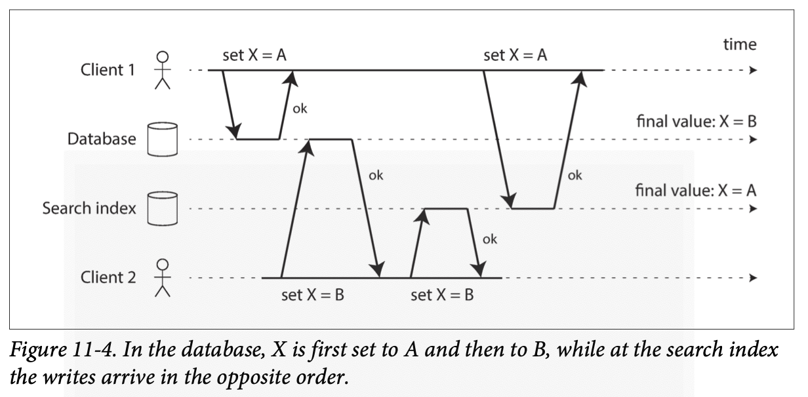
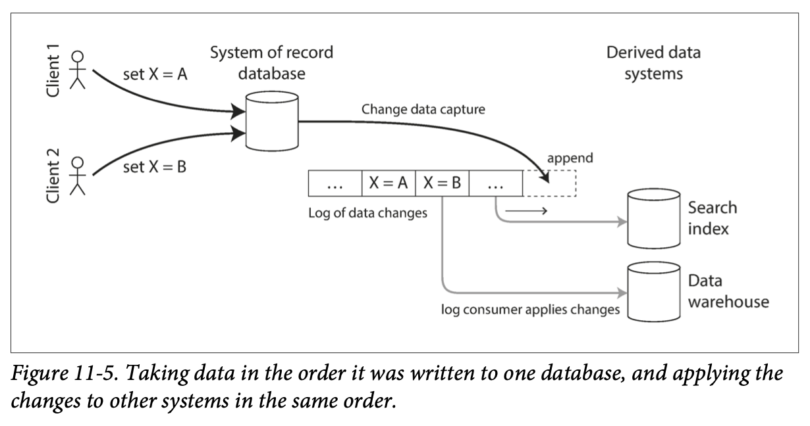

# 11. Stream Processing

> A complex system that works is invariably found to have evolved from a simple
> system that works. The inverse proposition also appears to be true: A complex
> system designed from scratch never works and cannot be made to work.
>
> —John Gall, Systemantics (1975)

- [11. Stream Processing](#11-stream-processing)
  - [Transmitting Event Streams](#transmitting-event-streams)
    - [Messaging Systems](#messaging-systems)
      - [Direct messaging from producers to consumers](#direct-messaging-from-producers-to-consumers)
      - [Message brokers](#message-brokers)
      - [Message brokers compared to databases](#message-brokers-compared-to-databases)
      - [Multiple consumers](#multiple-consumers)
      - [Acknowledgments and redelivery](#acknowledgments-and-redelivery)
    - [Partitioned Logs](#partitioned-logs)
      - [Using logs for message storage](#using-logs-for-message-storage)
      - [Logs compared to traditional messaging](#logs-compared-to-traditional-messaging)
      - [Consumer offsets](#consumer-offsets)
      - [Disk space usage](#disk-space-usage)
      - [When consumers cannot keep up with producers](#when-consumers-cannot-keep-up-with-producers)
      - [Replaying old messages](#replaying-old-messages)
  - [Databases and Streams](#databases-and-streams)
    - [Keeping Systems in Sync](#keeping-systems-in-sync)
    - [Change Data Capture](#change-data-capture)
      - [Implementing change data capture](#implementing-change-data-capture)
      - [Initial snapshot](#initial-snapshot)
      - [Log compaction](#log-compaction)
      - [API support for change streams](#api-support-for-change-streams)
    - [Event Sourcing](#event-sourcing)
      - [Deriving current state from the event log](#deriving-current-state-from-the-event-log)

Batch processing—techniques read a set of files as input and produce a new set
of output files. The output is a form of ***derived data***; that is, a dataset
that can be recreated by running the batch process again if necessary.

One big assumption remained throughout batch processing: namely, that the input
is bounded — i.e., of a known and finite size — so the batch process knows when
it has finished reading its input.

In reality, a lot of data is unbounded because it arrives gradually over time.
Thus, batch processors must artificially divide the data into chunks of fixed
duration: for example, processing a day’s worth of data at the end of every
day, or processing an hour’s worth of data at the end of every hour.

The problem with daily batch processes is that changes in the input are only
reflected in the output a day later, which is too slow for many impatient
users. To reduce the delay, we can run the processing more frequently — say,
processing a second’s worth of data at the end of every second — or even
continuously, abandoning the fixed time slices entirely and simply processing
every event as it happens. That is the idea behind ***stream processing***.

In general, a “stream” refers to data that is incrementally made available over
time. The concept appears in many places: in the `stdin` and `stdout` of Unix,
programming languages (lazy lists), filesystem APIs (such as Java’s
`FileInputStream`), TCP connections, delivering audio and video over the
internet, and so on.

***Event streams*** as a data management mechanism: the unbounded,
incrementally processed counterpart to the batch data.

## Transmitting Event Streams

In the batch processing world, the inputs and outputs of a job are files
(perhaps on a distributed filesystem). What does the streaming equivalent look
like?

When the input is a file (a sequence of bytes), the first processing step is
usually to parse it into a sequence of records. In a stream processing context,
a record is more commonly known as an ***event***, but it is essentially the
same thing: a small, self-contained, immutable object containing the details of
something that happened at some point in time. An event usually contains a
timestamp indicating when it happened according to a time-of-day clock.

For example, the thing that happened might be an action that a user took, such
as viewing a page or making a purchase. It might also originate from a machine,
such as a periodic measurement from a temperature sensor, or a CPU utilization
metric.

An event may be encoded as a text string, or JSON, or perhaps in some binary
form.

In batch processing, a file is written once and then potentially read by
multiple jobs. Analogously, in streaming terminology, an event is generated
once by a ***producer*** (***publisher*** or ***sender***), and then
potentially processed by multiple ***consumers*** (***subscribers*** or
***recipients***). In a filesystem, a filename identifies a set of related
records; in a streaming system, related events are usually grouped together
into a ***topic*** or ***stream***.

In principle, a file or database is sufficient to connect producers and
consumers: a producer writes every event that it generates to the datastore,
and each consumer periodically polls the datastore to check for events that
have appeared since it last ran. This is essentially what a batch process does
when it processes a day’s worth of data at the end of every day.

However, when moving toward continual processing with low delays, polling
becomes expensive if the datastore is not designed for this kind of usage. The
more often you poll, the lower the percentage of requests that return new
events, and thus the higher the overheads become. Instead, it is better for
consumers to be notified when new events appear.

Databases have traditionally not supported this kind of notification mechanism
very well: relational databases commonly have triggers, which can react to a
change, but they are very limited in what they can do and have been somewhat of
an afterthought in database design. Instead, specialized tools have been
developed for the purpose of delivering event notifications.

### Messaging Systems

A common approach for notifying consumers about new events is to use a
messaging system: a producer sends a message containing the event, which is
then pushed to consumers.

A direct communication channel like a Unix pipe or TCP connection between
producer and consumer would be a simple way of implementing a messaging system.
However, most messaging systems expand on this basic model. A messaging system
allows multiple producer nodes to send messages to the same topic and allows
multiple consumer nodes to receive messages in a topic.

Within this ***publish/subscribe*** model, different systems take a wide range
of approaches, and there is no one right answer for all purposes. To
differentiate the systems, it is particularly helpful to ask the following two
questions:

1. ***What happens if the producers send messages faster than the consumers can
   process them?***
    - Broadly speaking, there are three options:
      - the system can drop messages
      - buffer messages in a queue
      - apply backpressure (also known as flow control; i.e., blocking the
        producer from sending more messages). For example, Unix pipes and TCP
        use backpressure: they have a small fixed-size buffer, and if it fills
        up, the sender is blocked until the recipient takes data out of the
        buffer.
    - If messages are buffered in a queue, it is important to understand what
      happens as that queue grows. Does the system crash if the queue no longer
      fits in memory, or does it write messages to disk? If so, how does the
      disk access affect the performance of the messaging system?
2. ***What happens if nodes crash or temporarily go offline—are any messages
   lost?***
    - As with databases, durability may require some combination of writing to
      disk and/or replication, which has a cost. If you can afford to sometimes
      lose messages, you can probably get higher throughput and lower latency
      on the same hardware.

Whether message loss is acceptable depends very much on the application. For
example, with sensor readings and metrics that are transmitted periodically, an
occasional missing data point is perhaps not important, since an updated value
will be sent a short time later anyway. However, beware that if a large number
of messages are dropped, it may not be immediately apparent that the metrics
are incorrect. If you are counting events, it is more important that they are
delivered reliably, since every lost message means incorrect counters.

A nice property of the batch processing systems is that they provide a strong
reliability guarantee: failed tasks are automatically retried, and partial
output from failed tasks is automatically discarded. This means the output is
the same as if no failures had occurred, which helps simplify the programming
model.

#### Direct messaging from producers to consumers

A number of messaging systems use direct network communication between
producers and consumers without going via intermediary nodes:

- UDP multicast is widely used in the financial industry for streams such as
  stock market feeds, where low latency is important. Although UDP itself is
  unreliable, application-level protocols can recover lost packets (the
  producer must remember packets it has sent so that it can retransmit them on
  demand).
- Brokerless messaging libraries such as ZeroMQ and nanomsg take a similar
  approach, implementing publish/subscribe messaging over TCP or IP multicast.
- StatsD and Brubeck use unreliable UDP messaging for collecting metrics from
  all machines on the network and monitoring them. (In the StatsD protocol,
  counter metrics are only correct if all messages are received; using UDP
  makes the metrics at best approximate.)

If the consumer exposes a service on the network, producers can make a direct
HTTP or RPC request to push messages to the consumer. This is the idea behind
webhooks, a pattern in which a callback URL of one service is registered with
another service, and it makes a request to that URL whenever an event occurs.

Although these direct messaging systems work well in the situations for which
they are designed, they generally require the application code to be aware of
the possibility of message loss. The faults they can tolerate are quite
limited: even if the protocols detect and retransmit packets that are lost in
the network, they generally assume that producers and consumers are constantly
online.

If a consumer is offline, it may miss messages that were sent while it is
unreachable. Some protocols allow the producer to retry failed message
deliveries, but this approach may break down if the producer crashes, losing
the buffer of messages that it was supposed to retry.

#### Message brokers

A widely used alternative is to send messages via a ***message broker***
(***message queue***), which is essentially a kind of database that is
optimized for handling message streams.

By centralizing the data in the broker, these systems can more easily tolerate
clients that come and go, and the question of durability is moved to the broker
instead. Some message brokers only keep messages in memory, while others write
them to disk so that they are not lost in case of a broker crash. Faced with
slow consumers, they generally allow unbounded queueing (as opposed to dropping
messages or backpressure), although this choice may also depend on the
configuration.

A consequence of queueing is also that consumers are generally asynchronous:
when a producer sends a message, it normally only waits for the broker to
confirm that it has buffered the message and does not wait for the message to
be processed by consumers. The delivery to consumers will happen at some
undetermined future point in time — often within a fraction of a second, but
sometimes significantly later if there is a queue backlog.

#### Message brokers compared to databases

Some message brokers can even participate in two-phase commit protocols using
XA or JTA. This feature makes them quite similar in nature to databases,
although there are still important practical differences between message
brokers and databases:

- Databases usually keep data until it is explicitly deleted, whereas most
  message brokers automatically delete a message when it has been successfully
  delivered to its consumers. Such message brokers are not suitable for
  long-term data storage.
- Since they quickly delete messages, most message brokers assume that their
  working set is fairly small — i.e., the queues are short. If the broker needs
  to buffer a lot of messages because the consumers are slow (perhaps spilling
  messages to disk if they no longer fit in memory), each individual message
  takes longer to process, and the overall throughput may degrade.
- Databases often support secondary indexes and various ways of searching for
  data, while message brokers often support some way of subscribing to a subset
  of topics matching some pattern.
- When querying a database, the result is typically based on a point-in-time
  snapshot of the data; if another client subsequently writes something to the
  database that changes the query result, the first client does not find out
  that its prior result is now outdated. By contrast, message brokers do not
  support arbitrary queries, but they do notify clients when data changes.

This is the traditional view of message brokers, which is encapsulated in
standards like ***JMS (Java Message Service)*** and
***AMQP (Advanced Message Queuing Protocol)*** and implemented in software like
RabbitMQ, ActiveMQ, HornetQ, Qpid, TIBCO Enterprise Message Service, IBM MQ,
Azure Service Bus, and Google Cloud Pub/Sub.

#### Multiple consumers

When multiple consumers read messages in the same topic, two main patterns of
messaging are used:

- ***Load balancing***: Each message is delivered to one of the consumers, so
  the consumers can share the work of processing the messages in the topic. The
  broker may assign messages to consumers arbitrarily. This pattern is useful
  when the messages are expensive to process, and so you want to be able to add
  consumers to parallelize the processing. (In AMQP, you can implement load
  balancing by having multiple clients consuming from the same queue, and in
  JMS it is called a ***shared subscription***.)
- ***Fan-out***: Each message is delivered to all of the consumers. Fan-out
  allows several independent consumers to each “tune in” to the same broadcast
  of messages, without affecting each other — the streaming equivalent of
  having several different batch jobs that read the same input file. (This
  feature is provided by topic subscriptions in JMS, and exchange bindings in
  AMQP.)

The two patterns can be combined: for example, two separate groups of consumers
may each subscribe to a topic, such that each group collectively receives all
messages, but within each group only one of the nodes receives each message.

#### Acknowledgments and redelivery

Consumers may crash at any time, so it could happen that a broker delivers a
message to a consumer but the consumer never processes it, or only partially
processes it before crashing. In order to ensure that the message is not lost,
message brokers use acknowledgments: a client must explicitly tell the broker
when it has finished processing a message so that the broker can remove it from
the queue.

If the connection to a client is closed or times out without the broker
receiving an acknowledgment, it assumes that the message was not processed, and
therefore it delivers the message again to another consumer. (Note that it
could happen that the message actually was fully processed, but the
acknowledgment was lost in the network. Handling this case requires an atomic
commit protocol.)

When combined with load balancing, this redelivery behavior has an interesting
effect on the ordering of messages. The consumers generally process messages in
the order they were sent by producers. However, `consumer 2` crashes while
processing message `m3`, at the same time as `consumer 1` is processing message
`m4`. The unacknowledged message `m3` is subsequently redelivered to
`consumer 1`, with the result that `consumer 1` processes messages in the order
`m4, m3, m5`. Thus, `m3` and `m4` are not delivered in the same order as they
were sent by producer 1.

Even if the message broker otherwise tries to preserve the order of messages
(as required by both the JMS and AMQP standards), the combination of load
balancing with redelivery inevitably leads to messages being reordered. To
avoid this issue, you can use a separate queue per consumer (i.e., not use the
load balancing feature). Message reordering is not a problem if messages are
completely independent of each other, but it can be important if there are
causal dependencies between messages.

### Partitioned Logs

Sending a packet over a network or making a request to a network service is
normally a transient operation that leaves no permanent trace. Although it is
possible to record it permanently (using packet capture and logging), we
normally don’t think of it that way. Even message brokers that durably write
messages to disk quickly delete them again after they have been delivered to
consumers, because they are built around a transient messaging mindset.

This difference in mindset has a big impact on how derived data is created. A
key feature of batch processes is that you can run them repeatedly,
experimenting with the processing steps, without risk of damaging the input.
This is not the case with AMQP/JMS-style messaging: receiving a message is
destructive if the acknowledgment causes it to be deleted from the broker, so
you cannot run the same consumer again and expect to get the same result.

If you add a new consumer to a messaging system, it typically only starts
receiving messages sent after the time it was registered.

Why can we not have a hybrid, combining the durable storage approach of
databases with the low-latency notification facilities of messaging? This is
the idea behind ***log-based message brokers***.

#### Using logs for message storage

A log is simply an append-only sequence of records on disk.

The same structure can be used to implement a message broker: a producer sends
a message by appending it to the end of the log, and a consumer receives
messages by reading the log sequentially. If a consumer reaches the end of the
log, it waits for a notification that a new message has been appended. The Unix
tool `tail -f`, which watches a file for data being appended, essentially works
like this.

In order to scale to higher throughput than a single disk can offer, the log
can be partitioned. Different partitions can then be hosted on different
machines, making each partition a separate log that can be read and written
independently from other partitions. A topic can then be defined as a group of
partitions that all carry messages of the same type.

Within each partition, the broker assigns a monotonically increasing sequence
number, or ***offset***, to every message. Such a sequence number makes sense
because a partition is append-only, so the messages within a partition are
totally ordered. There is no ordering guarantee across different partitions.

Apache Kafka, Amazon Kinesis Streams, and Twitter’s DistributedLog are
log-based message brokers that work like this. Google Cloud Pub/Sub is
architecturally similar but exposes a JMS-style API rather than a log
abstraction. Even though these message brokers write all messages to disk, they
are able to achieve throughput of millions of messages per second by
partitioning across multiple machines, and fault tolerance by replicating
messages.

#### Logs compared to traditional messaging

The log-based approach trivially supports fan-out messaging, because several
consumers can independently read the log without affecting each other — reading
a message does not delete it from the log. To achieve load balancing across a
sgroup of consumers, instead of assigning individual messages to consumer
clients, the broker can assign entire partitions to nodes in the consumer group.

Each client then consumes *all* the messages in the partitions it has been
assigned. Typically, when a consumer has been assigned a log partition, it
reads the messages in the partition sequentially, in a straightforward
single-threaded manner. This coarse-grained load balancing approach has some
downsides:

- The number of nodes sharing the work of consuming a topic can be at most the
  number of log partitions in that topic, because messages within the same
  partition are delivered to the same node.
  - It’s possible to create a load balancing scheme in which two consumers
    share the work of processing a partition by having both read the full set
    of messages, but one of them only considers messages with even-numbered
    offsets while the other deals with the odd-numbered offsets. Alternatively,
    you could spread message processing over a thread pool, but that approach
    complicates consumer offset management. In general, single-threaded
    processing of a partition is preferable, and parallelism can be increased
    by using more partitions.
- If a single message is slow to process, it holds up the processing of
  subsequent messages in that partition (a form of head-of-line blocking).

Thus, in situations where messages may be expensive to process and you want to
parallelize processing on a message-by-message basis, and where message
ordering is not so important, the JMS/AMQP style of message broker is
preferable. On the other hand, in situations with high message throughput,
where each message is fast to process and where message ordering is important,
the log-based approach works very well.

#### Consumer offsets

Consuming a partition sequentially makes it easy to tell which messages have
been processed: all messages with an offset less than a consumer’s current
offset have already been processed, and all messages with a greater offset have
not yet been seen. Thus, the broker does not need to track acknowledgments for
every single message — it only needs to periodically record the consumer
offsets. The reduced bookkeeping overhead and the opportunities for batching
and pipelining in this approach help increase the throughput of log-based
systems.

This offset is in fact very similar to the log sequence number that is commonly
found in single-leader database replication. In database replication, the log
sequence number allows a follower to reconnect to a leader after it has become
disconnected, and resume replication without skipping any writes. Exactly the
same principle is used here: the message broker behaves like a leader database,
and the consumer like a follower.

If a consumer node fails, another node in the consumer group is assigned the
failed consumer’s partitions, and it starts consuming messages at the last
recorded offset. If the consumer had processed subsequent messages but not yet
recorded their offset, those messages will be processed a second time upon
restart.

#### Disk space usage

If you only ever append to the log, you will eventually run out of disk space.
To reclaim disk space, the log is actually divided into segments, and from time
to time old segments are deleted or moved to archive storage.

This means that if a slow consumer cannot keep up with the rate of messages,
and it falls so far behind that its consumer offset points to a deleted
segment, it will miss some of the messages. Effectively, the log implements a
bounded-size buffer that discards old messages when it gets full, also known as
a ***circular buffer*** or ***ring buffer***.

A typical large hard drive has a capacity of 6 TB and a sequential write
throughput of 150 MB/s. If you are writing messages at the fastest possible
rate, it takes about 11 hours to fill the drive. Thus, the disk can buffer 11
hours’ worth of messages, after which it will start overwriting old messages.
This ratio remains the same, even if you use many hard drives and machines. In
practice, deployments rarely use the full write bandwidth of the disk, so the
log can typically keep a buffer of several days’ or even weeks’ worth of
messages.

Regardless of how long you retain messages, the throughput of a log remains
more or less constant, since every message is written to disk anyway. This
behavior is in contrast to messaging systems that keep messages in memory by
default and only write them to disk if the queue grows too large: such systems
are fast when queues are short and become much slower when they start writing
to disk, so the throughput depends on the amount of history retained.

#### When consumers cannot keep up with producers

Three choices of what to do if a consumer cannot keep up with the producers:

- dropping messages
- buffering
- applying backpressure

In this taxonomy, the log-based approach is a form of buffering with a large
but fixed-size buffer (limited by the available disk space).

If a consumer falls so far behind that the messages it requires are older than
what is retained on disk, it will not be able to read those messages — so the
broker effectively drops old messages that go back further than the size of the
buffer can accommodate. You can monitor how far a consumer is behind the head
of the log, and raise an alert if it falls behind significantly. As the buffer
is large, there is enough time for a human operator to fix the slow consumer
and allow it to catch up before it starts missing messages.

Even if a consumer does fall too far behind and starts missing messages, only
that consumer is affected; it does not disrupt the service for other consumers.
This fact is a big operational advantage: you can experimentally consume a
production log for development, testing, or debugging purposes, without having
to worry much about disrupting production services. When a consumer is shut
down or crashes, it stops consuming resources — the only thing that remains is
its consumer offset.

This behavior also contrasts with traditional message brokers, where you need
to be careful to delete any queues whose consumers have been shut
down — otherwise they continue unnecessarily accumulating messages and taking
away memory from consumers that are still active.

#### Replaying old messages

With AMQP and JMS-style message brokers, processing and acknowledging messages
is a destructive operation, since it causes the messages to be deleted on the
broker. On the other hand, in a log-based message broker, consuming messages is
more like reading from a file: it is a read-only operation that does not change
the log.

The only side effect of processing, besides any output of the consumer, is that
the consumer offset moves forward. But the offset is under the consumer’s
control, so it can easily be manipulated if necessary: for example, you can
start a copy of a consumer with yesterday’s offsets and write the output to a
different location, in order to reprocess the last day’s worth of messages. You
can repeat this any number of times, varying the processing code.

This aspect makes log-based messaging more like the batch processes, where
derived data is clearly separated from input data through a repeatable
transformation process. It allows more experimentation and easier recovery from
errors and bugs, making it a good tool for integrating dataflows within an
organization.

## Databases and Streams

Message brokers and databases have traditionally been considered separate
categories of tools, but we saw that log-based message brokers have been
successful in taking ideas from databases and applying them to messaging. We
can also go in reverse: take ideas from messaging and streams, and apply them
to databases.

An event is a record of something that happened at some point in time. The
thing that happened may be a user action, or a sensor reading, but it may also
be ***a write to a database***. The fact that something was written to a
database is an event that can be captured, stored, and processed. This
observation suggests that the connection between databases and streams runs
deeper than just the physical storage of logs on disk.

In fact, a replication log is a stream of database write events, produced by
the leader as it processes transactions. The followers apply that stream of
writes to their own copy of the database and thus end up with an accurate copy
of the same data. The events in the replication log describe the data changes
that occurred.

The ***state machine replication principle*** states: if every event represents
a write to the database, and every replica processes the same events in the
same order, then the replicas will all end up in the same final state. It’s
just another case of event streams!

### Keeping Systems in Sync

In practice, most nontrivial applications need to combine several different
technologies in order to satisfy their requirements: for example, using an OLTP
database to serve user requests, a cache to speed up common requests, a
full-text index to handle search queries, and a data warehouse for analytics.
Each of these has its own copy of the data, stored in its own representation
that is optimized for its own purposes.

As the same or related data appears in several different places, they need to
be kept in sync with one another: if an item is updated in the database, it
also needs to be updated in the cache, search indexes, and data warehouse. With
data warehouses this synchronization is usually performed by ETL processes,
often by taking a full copy of a database, transforming it, and bulk-loading it
into the data warehouse — in other words, a batch process.

If periodic full database dumps are too slow, an alternative that is sometimes
used is dual writes, in which the application code explicitly writes to each of
the systems when data changes: for example, first writing to the database, then
updating the search index, then invalidating the cache entries (or even
performing those writes concurrently).

However, dual writes have some serious problems, one of which is a race
condition illustrated in Figure 11-4. In this example, two clients concurrently
want to update an item X: client 1 wants to set the value to A, and client 2
wants to set it to B. Both clients first write the new value to the database,
then write it to the search index. Due to unlucky timing, the requests are
interleaved: the database first sees the write from client 1 setting the value
to A, then the write from client 2 setting the value to B, so the final value
in the database is B. The search index first sees the write from client 2, then
client 1, so the final value in the search index is A. The two systems are now
permanently inconsistent with each other, even though no error occurred.

Unless you have some additional concurrency detection mechanism, such as the
version vectors in “Detecting Concurrent Writes”, you will not even notice that
concurrent writes occurred — one value will simply silently overwrite another
value.

Another problem with dual writes is that one of the writes may fail while the
other succeeds. This is a fault-tolerance problem rather than a concurrency
problem, but it also has the effect of the two systems becoming inconsistent
with each other. Ensuring that they either both succeed or both fail is a case
of the atomic commit problem, which is expensive to solve (“Atomic Commit and
Two-Phase Commit (2PC)”).

If you only have one replicated database with a single leader, then that leader
determines the order of writes, so the state machine replication approach works
among replicas of the database. However, in Figure 11-4 there isn’t a single
leader: the database may have a leader and the search index may have a leader,
but neither follows the other, and so conflicts can occur.

The situation would be better if there really was only one leader — for
example, the database — and if we could make the search index a follower of the
database.

### Change Data Capture

The problem with most databases’ replication logs is that they have long been
considered to be an internal implementation detail of the database, not a
public API. Clients are supposed to query the database through its data model
and query language, not parse the replication logs and try to extract data from
them.

For decades, many databases simply did not have a documented way of getting the
log of changes written to them.

More recently, there has been growing interest in ***change data capture***
(CDC), which is the process of observing all data changes written to a database
and extracting them in a form in which they can be replicated to other systems.
CDC is especially interesting if changes are made available as a stream,
immediately as they are written.

For example, you can capture the changes in a database and continually apply
the same changes to a search index. If the log of changes is applied in the
same order, you can expect the data in the search index to match the data in
the database. The search index and any other derived data systems are just
consumers of the change stream.

#### Implementing change data capture

We can call the log consumers ***derived data systems***: the data stored in
the search index and the data warehouse is just another view onto the data in
the system of record. Change data capture is a mechanism for ensuring that all
changes made to the system of record are also reflected in the derived data
systems so that the derived systems have an accurate copy of the data.

Essentially, change data capture makes one database the leader, and turns the
others into followers. A log-based message broker is well suited for
transporting the change events from the source database, since it preserves the
ordering of messages.

Database triggers can be used to implement change data capture by registering
triggers that observe all changes to data tables and add corresponding entries
to a changelog table. However, they tend to be fragile and have significant
performance overheads. Parsing the replication log can be a more robust
approach, although it also comes with challenges, such as handling schema
changes.

LinkedIn’s Databus, Facebook’s Wormhole, and Yahoo!’s Sherpa use this idea at
large scale. Bottled Water implements CDC for PostgreSQL using an API that
decodes the write-ahead log, Maxwell and Debezium do something similar for
MySQL by parsing the binlog, Mongoriver reads the MongoDB oplog, and GoldenGate
provides similar facilities for Oracle.

Like message brokers, change data capture is usually asynchronous: the system
of record database does not wait for the change to be applied to consumers
before committing it. This design has the operational advantage that adding a
slow consumer does not affect the system of record too much, but it has the
downside that all the issues of replication lag apply.

#### Initial snapshot

If you have the log of all changes that were ever made to a database, you can
reconstruct the entire state of the database by replaying the log. However, in
many cases, keeping all changes forever would require too much disk space, and
replaying it would take too long, so the log needs to be truncated.

Building a new full-text index, for example, requires a full copy of the entire
database — it is not sufficient to only apply a log of recent changes, since it
would be missing items that were not recently updated. Thus, if you don’t have
the entire log history, you need to start with a consistent snapshot.

The snapshot of the database must correspond to a known position or offset in
the change log, so that you know at which point to start applying changes after
the snapshot has been processed. Some CDC tools integrate this snapshot
facility, while others leave it as a manual operation.

#### Log compaction

If you can only keep a limited amount of log history, you need to go through
the snapshot process every time you want to add a new derived data system.
However, ***log compaction*** provides a good alternative.

In the context of log-structured storage engines the principle is simple: the
storage engine periodically looks for log records with the same key, throws
away any duplicates, and keeps only the most recent update for each key. This
compaction and merging process runs in the background.

In a log-structured storage engine, an update with a special `null` value (a
***tombstone***) indicates that a key was deleted, and causes it to be removed
during log compaction. But as long as a key is not overwritten or deleted, it
stays in the log forever. The disk space required for such a compacted log
depends only on the current contents of the database, not the number of writes
that have ever occurred in the database. If the same key is frequently
overwritten, previous values will eventually be garbage-collected, and only the
latest value will be retained.

The same idea works in the context of log-based message brokers and change data
capture. If the CDC system is set up such that every change has a primary key,
and every update for a key replaces the previous value for that key, then it’s
sufficient to keep just the most recent write for a particular key.

Now, whenever you want to rebuild a derived data system such as a search index,
you can start a new consumer from offset 0 of the log-compacted topic, and
sequentially scan over all messages in the log. The log is guaranteed to
contain the most recent value for every key in the database (and maybe some
older values) — in other words, you can use it to obtain a full copy of the
database contents without having to take another snapshot of the CDC source
database.

This log compaction feature is supported by Apache Kafka. It allows the message
broker to be used for durable storage, not just for transient messaging.

#### API support for change streams

Increasingly, databases are beginning to support change streams as a
first-class interface, rather than the typical retrofitted and
reverse-engineered CDC efforts. For example, RethinkDB allows queries to
subscribe to notifications when the results of a query change, Firebase and
CouchDB provide data synchronization based on a change feed that is also made
available to applications, and Meteor uses the MongoDB oplog to subscribe to
data changes and update the user interface.

VoltDB allows transactions to continuously export data from a database in the
form of a stream. The database represents an output stream in the relational
data model as a table into which transactions can insert tuples, but which
cannot be queried. The stream then consists of the log of tuples that committed
transactions have written to this special table, in the order they were
committed. External consumers can asynchronously consume this log and use it to
update derived data systems.

Kafka Connect is an effort to integrate change data capture tools for a wide
range of database systems with Kafka. Once the stream of change events is in
Kafka, it can be used to update derived data systems such as search indexes,
and also feed into stream processing systems.

### Event Sourcing

***Event sourcing***, a technique that was developed in the domain-driven design
(DDD) community, incorporates some useful and relevant ideas for streaming
systems.

Similarly to change data capture, event sourcing involves storing all changes
to the application state as a log of change events. The biggest difference is
that event sourcing applies the idea at a different level of abstraction:

- In change data capture, the application uses the database in a mutable way,
  updating and deleting records at will. The log of changes is extracted from
  the database at a low level, which ensures that the order of writes extracted
  from the database matches the order in which they were actually written,
  avoiding race condition. The application writing to the database does not
  need to be aware that CDC is occurring.
- In event sourcing, the application logic is explicitly built on the basis of
  immutable events that are written to an event log. In this case, the event
  store is append-only, and updates or deletes are discouraged or prohibited.
  Events are designed to reflect things that happened at the application level,
  rather than low-level state changes.

Event sourcing is a powerful technique for data modeling: from an application
point of view it is more meaningful to record the user’s actions as immutable
events, rather than recording the effect of those actions on a mutable
database. Event sourcing makes it easier to evolve applications over time,
helps with debugging by making it easier to understand after the fact why
something happened, and guards against application bugs.

For example, storing the event “student cancelled their course enrollment”
clearly expresses the intent of a single action in a neutral fashion, whereas
the side effects “one entry was deleted from the enrollments table, and one
cancellation reason was added to the student feedback table” embed a lot of
assumptions about the way the data is later going to be used. If a new
application feature is introduced — for example, “the place is offered to the
next person on the waiting list” — the event sourcing approach allows that new
side effect to easily be chained off the existing event.

Event sourcing is similar to the chronicle data model, and there are also
similarities between an event log and the fact table that you find in a star
schema.

Specialized databases such as Event Store have been developed to support
applications using event sourcing, but in general the approach is independent
of any particular tool. A conventional database or a log-based message broker
can also be used to build applications in this style.

#### Deriving current state from the event log

>>>>> progress
