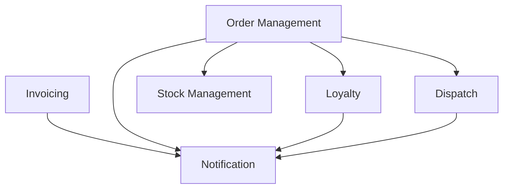
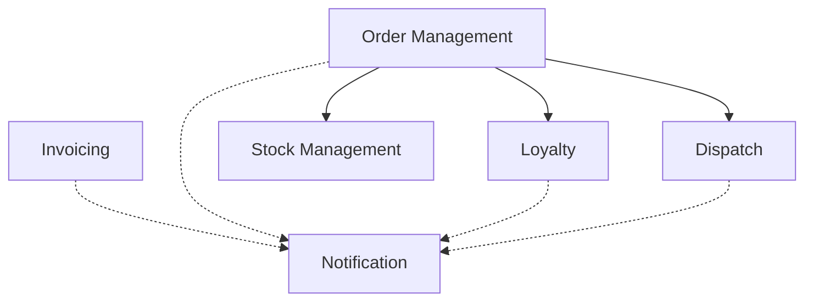
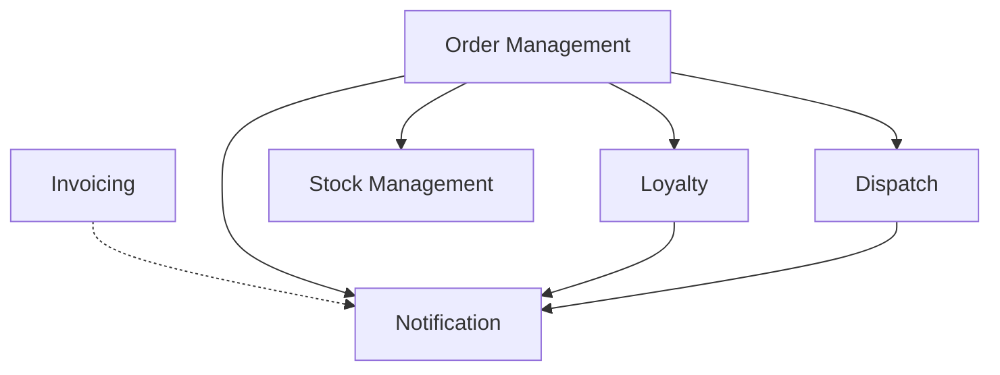
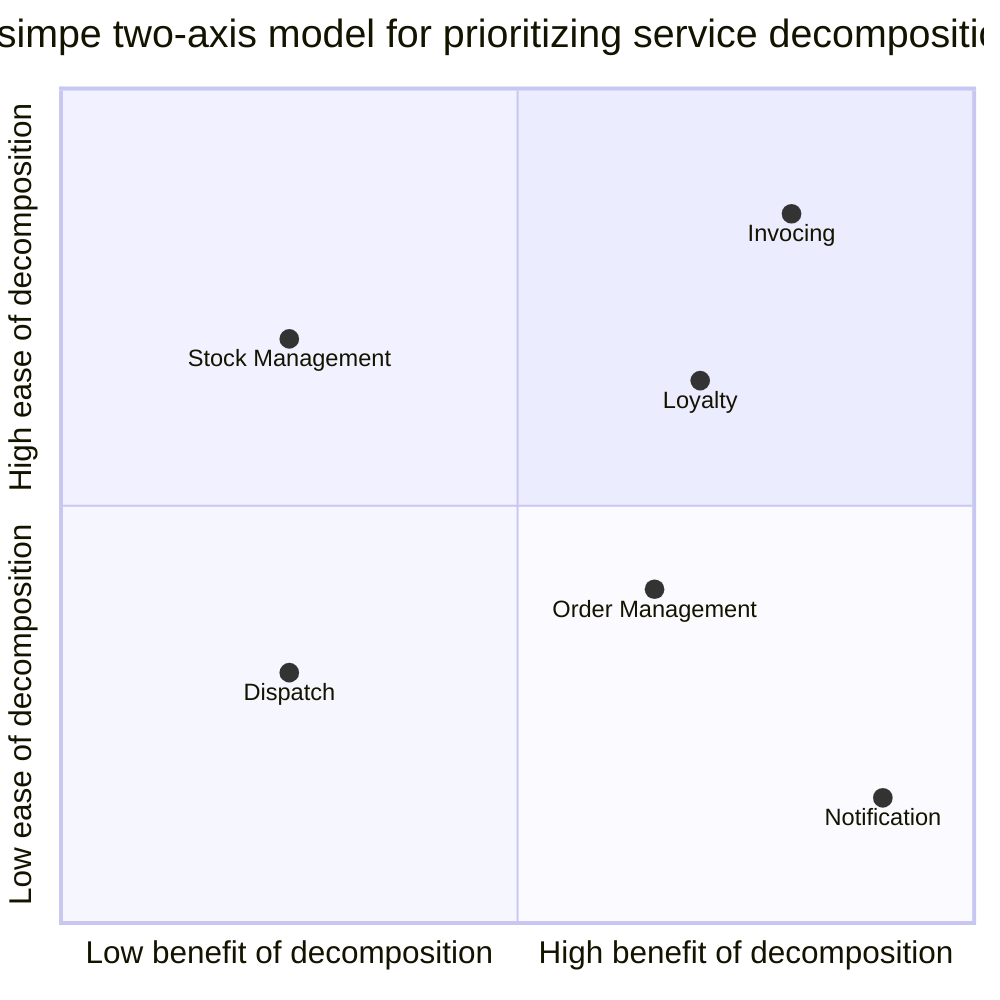
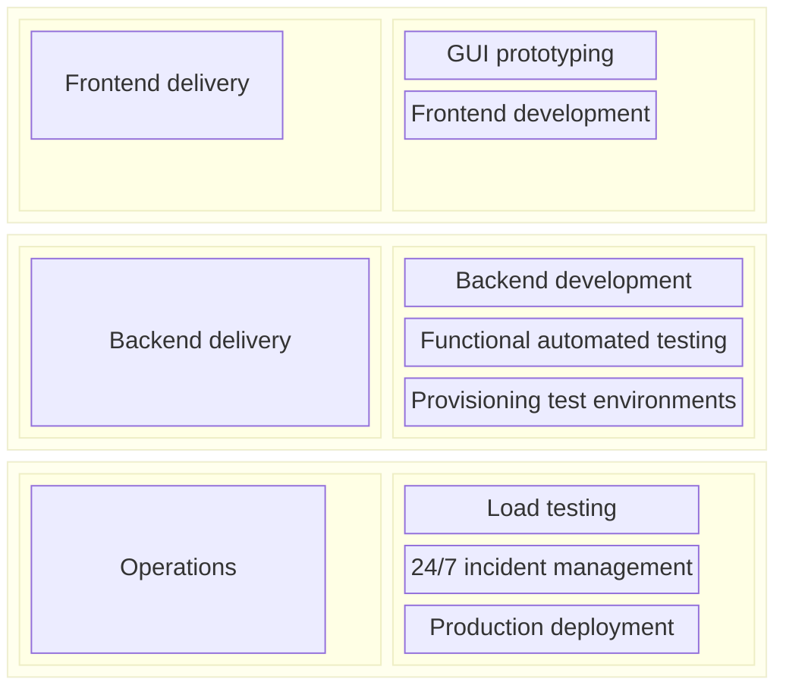

# CHAPTER 2: Planning a Migration

- [CHAPTER 2: Planning a Migration](#chapter-2-planning-a-migration)
  - [Understanding the Goal](#understanding-the-goal)
    - [A Common Failing](#a-common-failing)
    - [Three Key Questions](#three-key-questions)
  - [Why Might You Choose Microservices?](#why-might-you-choose-microservices)
    - [Improve Team Autonomy](#improve-team-autonomy)
    - [Reduce Time to Market](#reduce-time-to-market)
    - [Scale Cost-Effectively for Load](#scale-cost-effectively-for-load)
    - [Improve Robustness](#improve-robustness)
      - [Resilience Versus Robustness](#resilience-versus-robustness)
    - [Scale the Number of Developers](#scale-the-number-of-developers)
    - [Embrace New Technology](#embrace-new-technology)
      - [Reuse?](#reuse)
  - [When Might Microservices Be a Bad Idea?](#when-might-microservices-be-a-bad-idea)
    - [Unclear Domain](#unclear-domain)
    - [Startups](#startups)
    - [Customer-Installed and Managed Software](#customer-installed-and-managed-software)
    - [Not Having a Good Reason!](#not-having-a-good-reason)
  - [Trade-Offs](#trade-offs)
  - [Taking People on the Journey](#taking-people-on-the-journey)
  - [Changing Organizations](#changing-organizations)
    - [Establishing a Sense of Urgency](#establishing-a-sense-of-urgency)
    - [Creating the Guiding Coalition](#creating-the-guiding-coalition)
    - [Developing a Vision and Strategy](#developing-a-vision-and-strategy)
    - [Communicating the Change Vision](#communicating-the-change-vision)
    - [Empowering Employees for Broad-Based Action](#empowering-employees-for-broad-based-action)
    - [Generating Short-Term Wins](#generating-short-term-wins)
    - [Consolidating Gains and Producing More Change](#consolidating-gains-and-producing-more-change)
    - [Anchoring New Approaches in the Culture](#anchoring-new-approaches-in-the-culture)
  - [Importance of Incremental Migration](#importance-of-incremental-migration)
    - [It’s Production That Counts](#its-production-that-counts)
  - [Cost of Change](#cost-of-change)
    - [Reversible and Irreversible Decisions](#reversible-and-irreversible-decisions)
    - [Easier Places to Experiment](#easier-places-to-experiment)
  - [So Where Do We Start?](#so-where-do-we-start)
  - [Domain-Driven Design](#domain-driven-design)
    - [How Far Do You Have to Go?](#how-far-do-you-have-to-go)
    - [Event Storming](#event-storming)
    - [Using a Domain Model for Prioritization](#using-a-domain-model-for-prioritization)
  - [A Combined Model](#a-combined-model)
  - [Reorganizing Teams](#reorganizing-teams)
    - [Shifting Structures](#shifting-structures)
    - [It’s Not One Size Fits All](#its-not-one-size-fits-all)
      - [DevOps Doesn’t Mean NoOps!](#devops-doesnt-mean-noops)
    - [Making a Change](#making-a-change)
    - [Changing Skills](#changing-skills)
  - [How Will You Know if the Transition Is Working?](#how-will-you-know-if-the-transition-is-working)

## Understanding the Goal

You should be thinking of migrating to a microservice architecture in order to
achieve something that you can’t currently achieve with your existing system
architecture.

### A Common Failing

### Three Key Questions

- What are you hoping to achieve?
- Have you considered alternatives to using microservices?
- How will you know if the transition is working?

## Why Might You Choose Microservices?

### Improve Team Autonomy

Giving ownership to parts of the codebase to different teams could be one answer
(a modular monolith could still benefit you here): this could also be done by
identifying people empowered to make decisions for parts of the codebase on
functional grounds (e.g., Ryan knows display ads best, so he’s responsible for
that; Jane knows the most about tuning our query performance, so run anything in
that area past her first).

### Reduce Time to Market

### Scale Cost-Effectively for Load

### Improve Robustness

#### Resilience Versus Robustness

- ***Robustness*** is the ability to have a system that is able to react to
  expected variations.
  - For example, we are aware that a specific machine could die, so we might
    bring redundancy into our system by load balancing an instance. That is an
    example of addressing robustness.
- ***Resilience*** is having an organization capable of adapting to things that
  haven’t been thought of, which could well include creating a culture of
  experimentation through things like chaos engineering.
  - Resiliency is the process of an organization preparing itself for the fact
    that it cannot anticipate all potential problems.

### Scale the Number of Developers

As Frederick Brooks outlines in his now seminal book, The Mythical Man Month,”
adding more people will only continue to improve how quickly you can deliver,
if the work itself can be partitioned into separate pieces of work with limited
interactions between them. He gives the example of harvesting crops in a field —
it’s a simple task to have multiple people working in parallel, as the work
being done by each harvester doesn’t require interactions with other people.

Software rarely works like this, as the work being done isn’t all the same, and
often the output from one piece of work is needed as the input for another.

With clearly identified boundaries, and an architecture that has focused around
ensuring our microservices limit their coupling with each other, we come up with
pieces of code that can be worked on independently.

### Embrace New Technology

By isolating the technology change in one service boundary, we can understand
the benefits of the new technology in isolation, and limit the impact if the
technology turns out to have issues.

#### Reuse?

Reuse is one of the most oft-stated goals for microservice migration, and in my
opinion is a poor goal in the first place. Fundamentally, reuse is not a direct
outcome people want. Reuse is something people hope will lead to other benefits.
We hope that through reuse, we may be able to ship features more quickly, or
perhaps reduce costs, but if those things are your goals, track those things
instead, or you may end up optimizing the wrong thing.

We think that by optimizing our development process around reusing existing
code, we won’t have to write as much code — and with less work to do, we can get
our software out the door more quickly, right?

The Customer Services team in Music Corp needs to format a PDF in order to
provide customer invoices. Another part of the system already handles PDF
generation: we produce PDFs for printing purposes in the warehouse, to produce
packing slips for orders shipped to customers and to send order requests to
suppliers.

Following the goal of reuse, our team may be directed to use the existing PDF
generation capability. But that functionality is currently managed by a
different team, in a different part of the organization.

But we work out that we could actually just write our own implementation much
faster and ship the feature to the customer more quickly than if we spend the
time to adapt the existing code.

But if you optimize for reuse hoping you get faster time to market, you may end
up doing things that slow you down.

Measuring reuse in complex systems is difficult, and as I’ve outlined, it is
typically something we’re doing to achieve something else. Spend your time
focusing on the actual objective instead, and recognize that reuse may not
always be the right answer.

## When Might Microservices Be a Bad Idea?

### Unclear Domain

Getting service boundaries wrong can be expensive. It can lead to a larger
number of cross-service changes, overly coupled components, and in general could
be worse than just having a single monolithic system.

Prematurely decomposing a system into microservices can be costly, especially if
you are new to the domain. In many ways, having an existing codebase you want to
decompose into microservices is much easier than trying to go to microservices
from the beginning.

### Startups

If your initial idea is bad, it doesn’t matter whether you built it with
microservices or not.

It is much easier to partition an existing, “brownfield” system than to do so up
front with a new, greenfield system that a startup would create.

Decomposition into microservices can cause some nasty performance issues, for
example, but with a brownfield system you have a chance to establish a healthy
baseline before making potentially performance-impacting changes.

Only split around those boundaries that are clear at the beginning, and keep the
rest on the more monolithic side. This will also give you time to assess how
mature you are from an operational point of view — if you struggle to manage two
services, managing ten is going to be difficult.

### Customer-Installed and Managed Software

If you create software that is packaged and shipped to customers who then
operate it themselves, microservices may well be a bad choice.

### Not Having a Good Reason!

And finally, we have the biggest reason not to adopt microservices, and that is
if you don’t have a clear idea of what exactly it is that you’re trying to
achieve.

## Trade-Offs

Think of each of your desired outcomes as a slider. Each slider starts in the
middle. As you make one thing more important, you have to drop the priority of
another.

## Taking People on the Journey

## Changing Organizations

Dr. John Kotter’s eight-step process for implementing organizational change is
a staple of change managers the world over, partly as it does a good job of
distilling the required activities into discrete, comprehensible steps.

This model for change is typically used to institute large-scale organizational
shifts in behavior. As such, it may well be huge overkill if all you’re trying
to do is bring microservices to a team of 10 people.

Even in these smaller-scoped settings, though, this model is useful, especially
the earlier steps.

### Establishing a Sense of Urgency

What you’re trying to do is not say, “We should do microservices now!”
You’re trying to share a sense of urgency about what you want to achieve — and
microservices are not the goal!

### Creating the Guiding Coalition

You’ll need to make different trade-offs around how your system behaves during
failure modes, for example, or how you tackle latency. For example, caching
data to avoid making a service call is a good way to ensure you reduce the
latency of key operations in a distributed system, but the trade-off is that
this can result in users of your system seeing stale data.

### Developing a Vision and Strategy

Visions need to be realistic yet aspirational, and finding the balance between
the two is key. The more widely shared the vision, the more work will need to
go into packaging it up to get people onboard. But a vision can be a vague thing
and still work with smaller teams.

### Communicating the Change Vision

When it comes to sharing important messages of this sort, face-to-face
communication (ideally in person, but perhaps by video) will be significantly
more effective.

### Empowering Employees for Broad-Based Action

### Generating Short-Term Wins

If it takes too long for people to see progress being made, they’ll lose faith
in the vision. Focusing initially on small, easy, low-hanging fruit will help
build momentum.

When it comes to microservice decomposition, functionality that can easily be
extracted from our monolith should be high on your list. But as we’ve already
established, microservices themselves aren’t the goal — so you’ll need to
balance the ease of extraction of some piece of functionality versus the benefit
that will bring.

Of course, if you choose something you think is easy and end up having huge
problems with making it happen, that could be valuable insight into your
strategy, and may make you reconsider what you’re doing. This is totally OK!
The key thing is that if you focus something easy first, you’re likely to gain
this insight early.

Making mistakes is natural—all we can do is structure things to make sure we
learn from those mistakes as quickly as possible.

### Consolidating Gains and Producing More Change

Quick wins might be the only wins if you don’t continue to push on. It’s
important you pause and reflect after successes (and failures) so you can think
about how to keep driving the change.

### Anchoring New Approaches in the Culture

It’s all too often that once we’ve solved a hard problem, we just move on to the
next. For change to scale — and stick — continually finding ways to share
information inside your organization is essential.

## Importance of Incremental Migration

> If you do a big-bang rewrite, the only thing you’re guaranteed of is a big
> bang.
> —Martin Fowler

The issue is that the cost of an experiment to move a nontrivial monolithic
system over to a microservice architecture can be large, and if you’re doing
everything at once, it can be difficult to get good feedback about what is (or
isn’t) working well.

### It’s Production That Counts

It is really important to note that the extraction of a microservice can’t be
considered complete until it is in production and being actively used.

Microservice decomposition can cause issues with

- troubleshooting
- tracing flows
- latency
- referential integrity
- cascading failures
- and a host of other things...

## Cost of Change

One of the key drivers is to understand the impact of each alteration we make
and change course if required. This allows us to better mitigate the cost of
mistakes, but doesn’t remove the chance of mistakes entirely.

### Reversible and Irreversible Decisions

From Irreversible to Reversible:

- Irreversible:
  - Global buy-in required
  - High/impossible to change decision
  - Lots of careful thought needed.
  - e.g.
    - Switching hosting provider
    - Changing a public API
- Medium. e.g.
  - Adopting a new programming language across the org
  - Changing database
- Reversible
  - More localised decision making
  - Low cost to reverse decision
  - Ad hoc decision making appropriate
  - e.g.
    - Experimenting with a new programming language
    - Picking an open souce library

The reality is, the vast number of decisions you will make as part of a
microservice transition will be toward the Reversible end of the spectrum.
What you do need to take into account is the cost of changing your mind later.

### Easier Places to Experiment

Sketch out your proposed design. See what happens when you run use cases across
what you think your service boundaries will be.

Do you see two services that are overly chatty, which might indicate they should
be one thing?

## So Where Do We Start?

We need a view of what pieces of functionality we may want to extract into
services, so that we can start thinking rationally about what microservices we
might create next. When it comes to decomposing an existing monolithic system,
we need to have some form of logical decomposition to work with, and this is
where domain-driven design can come in handy.

## Domain-Driven Design

Domain-driven design is an important concept in helping define boundaries for
services. Developing a domain model also helps us when it comes to working out
how to prioritize our decomposition too.

In Figure 2-4, we have an example high-level domain model for Music Corp.

Each of these bounded contexts represents a potential unit of decomposition.
Bounded contexts make great starting points for defining microservice
boundaries.

Coming up with a domain model is a near-essential step that’s part of
structuring a microservice transition.

### How Far Do You Have to Go?

It’s important to understand that what we need from a domain model is ***just***
enough information to make a reasonable decision about where to start our
decomposition. There is always a danger that if you look only at part of the
system you may miss larger systemic issues that require addressing.

You can — and should — continuously refine your domain model as you learn more,
and keep it fresh to reflect new functionality as it’s rolled out.

### Event Storming

***Event Storming*** works from the bottom up. Participants start by defining
the “Domain Events” — things that happen in the system. Then these events are
grouped into aggregates, and the aggregates are then grouped into bounded
contexts.

Event Storming doesn’t mean you have to then build an event-driven system.
Instead, it focuses on understanding what (logical) events occur in the
system. These domain events can map to events fired as part of an event-driven
system, but they could be represented in different ways.

The output of this exercise isn’t just the model itself; it is the shared
understanding of the model.

### Using a Domain Model for Prioritization

Based on the number of upstream or downstream dependencies, we can extrapolate a
view regarding which functionality is likely to be easier — or harder — to
extract. For example, if we consider extracting Notification functionality, then
we can clearly see a number of inbound dependencies — lots of parts of our
system require the use of this behavior. If we want to extract out our new
Notification service, we’d therefore have a lot of work to do with the existing
code, changing calls from being local calls to the existing notification
functionality and making them service calls instead.

Notification functionality seems logically coupled from our domain model point
of view, so may be harder to extract.

So Notification may not be a good place to start. Invoicing may well represent a
much easier piece of system behavior to extract; it has no in-bound
dependencies, which would reduce the required changes we’d need to make to the
existing monolith. A pattern like the strangler fig could be effective in these
cases, as we can easily proxy these inbound calls before they hit the monolith.

There is no guarantee that the underlying code structure of our monolith is
structured in this way. This means that our logical model can help guide us in
terms of pieces of functionality that are likely to be more (or less) coupled,
but we may still need to look at the code itself to get a better assessment of
the degree of entanglement of the current functionality. A domain model like
this won’t show us which bounded contexts store data in a database. We might
find for that Invoicing manages lots of data, meaning we’d need to consider the
impact of database decomposition work.

But if our goal is to help improve time to market, then we need to combine our
view of what is easy and what is hard, together with our view of what benefits
microservice decomposition will bring.

## A Combined Model

For each candidate service to be extracted, you place it along the two axes
displayed. The x-axis represents the value that you think the decomposition
will bring. Along the y-axis, you order things based on their difficulty.

It’s important to revisit this prioritization exercise and replan as you learn
more.

## Reorganizing Teams

### Shifting Structures

Layered architectures could require multiple services to need to be changed when
rolling out simple changes. The same applies with organizational silos: the more
teams that need to be involved in creating or changing a piece of software, the
longer it can take.

### It’s Not One Size Fits All

Take inspiration from what other organizations have done, absolutely, but don’t
assume that what worked for someone else will work in your context. As Jessica
Kerr once put it, in relation to the Spotify model, “Copy the questions, not the
answers”.

#### DevOps Doesn’t Mean NoOps!

There is widespread confusion around DevOps, with some people assuming that it
means that developers do all the operations, and that operations people are not
needed. This is far from the case. Fundamentally, DevOps is a cultural movement
based on the concept of breaking down barriers between development and
operations. You may still want specialists in these roles, or you might not, but
whatever you want to do, you want to promote common alignment and understanding
across the people involved in delivering your software, no matter what their
specific responsibilities are.

### Making a Change

*Showing a subset of the delivery-related responsibilities, and how they map to
existing teams*.

- 💡 Six months to a year is probably as far forward as you’ll want to explore
  in detail.
- 💡 We may also want teams to be able to provision their own test environments.

### Changing Skills

## How Will You Know if the Transition Is Working?
