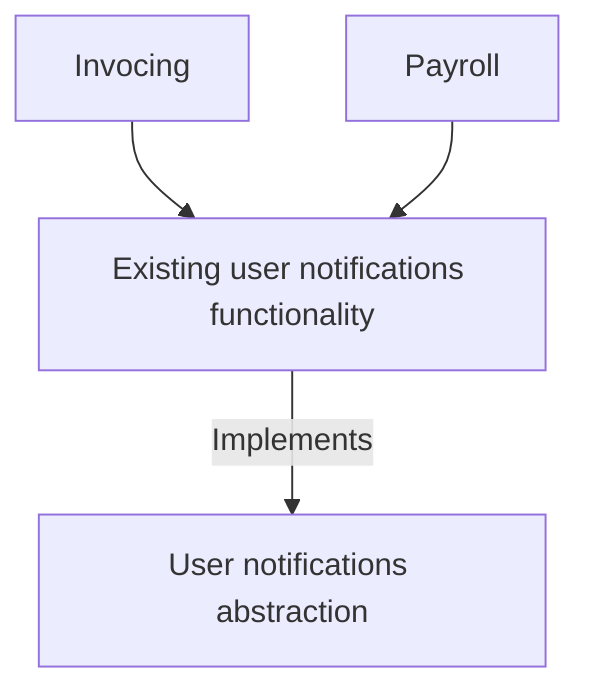
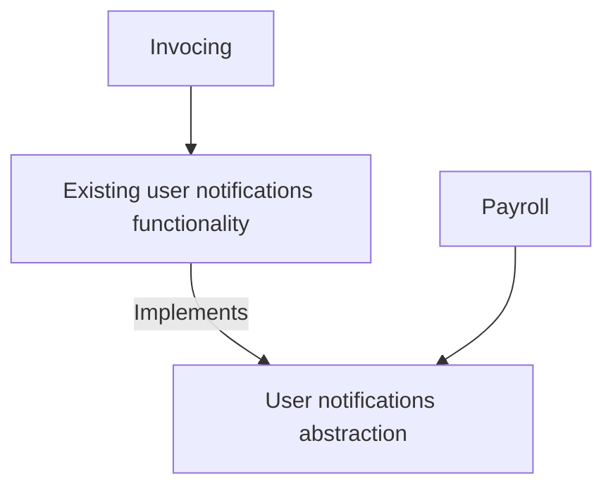

# CHAPTER: Splitting the Monolith

- [CHAPTER: Splitting the Monolith](#chapter-splitting-the-monolith)
  - [To Change the Monolith, or Not?](#to-change-the-monolith-or-not)
    - [Cut, Copy, or Reimplement?](#cut-copy-or-reimplement)
    - [Refactoring the Monolith](#refactoring-the-monolith)
      - [A modular monolith?](#a-modular-monolith)
      - [Incremental rewrites](#incremental-rewrites)
  - [Migration Patterns](#migration-patterns)
  - [Pattern: Strangler Fig Application](#pattern-strangler-fig-application)
    - [Pattern: Strangler Fig Application - How It Works](#pattern-strangler-fig-application---how-it-works)
    - [Example: HTTP Reverse Proxy](#example-http-reverse-proxy)
      - [Step 1: Insert proxy](#step-1-insert-proxy)
      - [Step 2: Migrate functionality](#step-2-migrate-functionality)
      - [Step 3: Redirect calls](#step-3-redirect-calls)
    - [Data?](#data)
    - [Proxy Options](#proxy-options)
      - [Incremental rollout](#incremental-rollout)
    - [Changing Protocols](#changing-protocols)
      - [And service meshes](#and-service-meshes)
    - [Example: FTP](#example-ftp)
    - [Example: Message Interception](#example-message-interception)
      - [Content-based routing](#content-based-routing)
      - [Selective consumption](#selective-consumption)
    - [Other Protocols](#other-protocols)
    - [Other Examples of the Strangler Fig Pattern](#other-examples-of-the-strangler-fig-pattern)
  - [Changing Behavior While Migrating Functionality](#changing-behavior-while-migrating-functionality)
  - [Pattern: UI Composition](#pattern-ui-composition)
    - [Example: Page Composition](#example-page-composition)
    - [Example: Widget Composition](#example-widget-composition)
      - [And mobile applications](#and-mobile-applications)
    - [Example: Micro Frontends](#example-micro-frontends)
  - [Pattern: Branch by Abstraction](#pattern-branch-by-abstraction)
    - [Pattern: Branch by Abstraction - How It Works](#pattern-branch-by-abstraction---how-it-works)
      - [Step 1: Create abstraction](#step-1-create-abstraction)
      - [Step 2: Use abstraction](#step-2-use-abstraction)
      - [Step 3: Create new implementation](#step-3-create-new-implementation)

## To Change the Monolith, or Not?

### Cut, Copy, or Reimplement?

The key thing here is to understand that we want to copy the code from the
monolith, and at this stage, at least, we don’t want to remove this
functionality from the monolith itself. Why? Because leaving the functionality
in the monolith for a period of time gives you more options. It can give us a
rollback point, or perhaps the opportunity to run both implementations in
parallel.

### Refactoring the Monolith

Often the biggest barrier to making use of existing code in the monolith in
your new microservices is that existing codebases are traditionally not
organized around business domain concepts. Technical categorizations are more
prominent (Model, View, Controller..., for example). When you’re trying to move
business domain functionality, this can be difficult: the existing codebase
doesn’t match that categorization, so even finding the code you’re trying to
move can be problematic!

A ***seam*** is a place where you can change the behavior of a program without
having to edit the existing behavior.

#### A modular monolith?

Once you’ve started to make sense of your existing codebase, an obvious next
step that is worth considering is to take your newly identified seams and start
to extract them as separate modules, making your monolith a modular monolith.

You still have a single unit of deployment, but that deployed unit consists of
multiple statically linked modules.

#### Incremental rewrites

Aren’t we in danger of repeating the problems associated with big bang rewrites
if we start reimplementing our functionality? The key is to ensure you’re
rewriting only small pieces of functionality at a time, and shipping this
reworked functionality to your customers regularly.

## Migration Patterns

## Pattern: Strangler Fig Application

- The key benefit to this pattern is that it supports our goal of allowing for
  incremental migration to a new system.
- Moreover, it gives us the ability to pause and even stop the migration
  altogether, while still taking advantage of the new system delivered so far.
- It does not only take incremental steps toward our new application
  architecture, but also ensures that each step is easily reversible, reducing
  the risk of each incremental step.

### Pattern: Strangler Fig Application - How It Works

If the functionality in question requires the persistence of state, then
consideration needs to be given to how that state can be migrated to the new
service, and potentially back again.

Implementing a strangler fig pattern relies on three steps:

1. First, identify parts of the existing system that you wish to migrate.
2. You then need to implement this functionality in your new microservice.
3. With your new implementation ready, you need to be able to reroute calls
   from the monolith over to your shiny new microservice.

💡 Separating the concepts of ***deployment*** from ***release*** is important.
Just because software is deployed into a given environment doesn’t mean it’s
actually being used by customers. By treating the two things as separate
concepts, you enable the ability to validate your software in the final
production environment before it is being used, allowing you to de-risk the
rollout of the new software.

### Example: HTTP Reverse Proxy

#### Step 1: Insert proxy

In this first step, the proxy will just allow any calls to pass through without
change.

This step will allow you to assess the impact of inserting an additional
network hop between the upstream calls and the downstream monolith, set up any
required monitoring of your new component, and basically, sit with it a while.

With a decent proxy and network, you’d expect a minimal impact on latency, but
if this turns out not to be the case, you have a chance to stop and investigate
the issue before you go any further.

#### Step 2: Migrate functionality

This step itself can be broken into multiple stages.

First, get a basic service up and running without any of the functionality
being implemented. Your service will need to accept the calls made to the
matching functionality, but at this stage you could just return a
`501 Not Implemented`. This allows you to get comfortable with the production
deployment process, and test the service in situ.

#### Step 3: Redirect calls

It’s only once you’ve completed movement of all the functionality that you
reconfigure the proxy to redirect the call. If this fails for whatever reason,
then you can switch the redirection back.

The use of a proxy to redirect the calls is also a great location to consider
incremental rollout of the new functionality through a canary rollout, or even
a full-blown parallel run.

### Data?

### Proxy Options

A dedicated proxy like NGINX, which has been created with exactly these sorts
of use cases in mind, can support a multitude of redirection mechanisms that
are tried and tested and likely to perform fairly well.

If, however, the existing system buries information about the nature of the
functionality being called somewhere in the request body (perhaps in a form
parameter), our redirection rule will need to be able to switch on a parameter
in the POST — something that is possible, but more complicated.

Adding custom behavior to a dedicated proxy — for example, NGINX allows you to
use code written in Lua to add custom behavior - is more recommended.

#### Incremental rollout

1. Insert proxy
2. Move functionality incrementally
3. Redirect calls

You can consider migrating only part of the functionality and diverting calls
appropriately — having some of the behavior implemented in the monolith, and
part in the microservice. This can cause issues if both the functionality in
the monolith and in the microservice need to see the same set of data, as this
will likely require a shared database.

### Changing Protocols

You could also use your proxy to transform the protocol. For example, you may
currently expose a SOAP-based HTTP interface, but your new microservice is
going to support a gRPC interface instead. You could then configure the proxy
to transform requests and responses accordingly.

But this approach will cause complexity and logic that starting to build up in
the proxy itself.

If you want to migrate the protocol being used, I’d much rather push the mapping
into the new service itself — with the service supporting both your old
communication protocol and the new protocol. Inside the new service, calls to
our old protocol could just get remapped internally to the new communication
protocol. This avoids the need to manage changes in proxy layers used by other
services and puts the service in full control over how this functionality
changes over time.

By pushing service-specific request and response mapping inside the service,
this keeps the proxy layer simple and much more generic. Additionally, by a
service providing both types of endpoints, you give yourself time to migrate
upstream consumers before potentially retiring the old API.

#### And service meshes

With a ***service mesh*** each service instance communicates with other service
instances via its own, dedicated local proxy. Each proxy instance can be
configured specifically for the service instance it is partnered with. You can
also provide centralized control and monitoring of these proxies by using a
control plane. As there is no central proxy layer, you avoid the pitfalls
regarding having a shared “smart” pipe — effectively, each service can own its
own piece of the service-to-service pipe if needed.

### Example: FTP

The company intercepted FTP uploads (by detecting changes in the FTP server
log), and directed newly uploaded files to an adapter that converted the
uploaded files into requests to the new REST API.

Later on, there is a plan to directly expose the new REST API to customers.

### Example: Message Interception

The main difference is the nature of the protocol itself.

#### Content-based routing

A simple approach would be to intercept all messages intended for the downstream
monolith, and filter the messages on to the appropriate location. This is
basically an implementation of the ***content-based router*** pattern, as
described in ***Enterprise Integration Patterns***.

But it could add additional latency and is another thing we need to manage.

- It’s arguable here that the content-based router is us implementing a “smart
  pipe” — adding complexity in terms of how calls are routed between the
  systems.

💡 Embrace the mantra of “smart endpoints, dumb pipes”.

- Keep the pipes dumb (simple), the endpoints smart.

#### Selective consumption

An alternative would be to change the monolith and have it ignore messages sent
which should be received by the new service.

This sort of filtering is quite a common requirement in message-based systems
and can be implemented using something like a Message Selector in JMS or using
equivalent technology on other platforms.

This filtering approach reduces the need to create an additional queue but has
a couple of challenges.

- First, your underlying messaging technology may or may not let you share a
  single queue subscription like this (although this is a common feature).
- Second, when you want to redirect the calls, it requires two changes to be
  fairly well coordinated. You need to stop your monolith from reading the
  calls meant for the new service, and then have the service pick them up.
- Likewise, reverting the call interception requires two changes to roll back.

The more types of consumers you have for the same queue, and the more complex
the filtering rules, the more problematic things can become.

A content-based routing approach is likely to make more sense as the number of
types of consumers increases, although beware of the potential downsides cited
previously, especially falling into the “smart pipes” problem.

The added complication with either this solution or content-based routing is
that if we are using an asynchronous request-response style of communication,
we’ll need to make sure we can route the request back to the client, hopefully
without them realizing anything has changed.

### Other Protocols

### Other Examples of the Strangler Fig Pattern

It alse can be used to help rebuild monolithic applications.

## Changing Behavior While Migrating Functionality

If the Payroll microservice had a few bug fixes applied to how it works that
hadn’t been back-ported to the equivalent functionality in the monolith, then a
rollback would also cause those bugs to reappear in the system. This can get
more problematic if you’d added new functionality to the Payroll microservice
— a rollback would then require removing features from your customers.

There is no easy fix here. It’s easier if you don’t allow for any changes until
the migration is complete.

💡 When migrating functionality, try to eliminate any changes in the behavior
being moved — delay new features or bug fixes until the migration is complete
if you can.

## Pattern: UI Composition

### Example: Page Composition

You can use a page-based migration in order to allow a brand-new look and feel
to go live. Visitors to the website during this transition time would have been
presented with a different look and feel when they went to the new parts of the
site. It needs to ensure that all old page links were redirected to the new
locations (where URLs had changed).

### Example: Widget Composition

- With a technique called Edge-Side Includes (ESI), using Apache, you define a
  template in your web page, and a web server splices in this content.

This has the further benefit that if one widget fails to load the other widgets
can still be rendered, allowing for only a partial, rather than total,
degradation of service.

#### And mobile applications

One of the challenges with deploying changes with native mobile applications is
that both the Apple App Store and Google Play store require applications to be
submitted and vetted prior to new versions being made available.

The app itself is also at this point a monolith: if you want to change one
single part of a native mobile application, the whole application still needs
to be deployed.

By deploying changes on the server side, client devices can immediately see the
new functionality without necessarily having to deploy a new version of the
native mobile application. This can be achieved simply using things like
embedded web views, although some companies use more sophisticated techniques.

Spotify’s UI across all platforms is heavily component-oriented, including its
iOS and Android applications. Pretty much everything you see is a separate
component, from a simple text header, to album artwork, or a playlist. Some of
these modules are, in turn, backed by one or more microservices. The
configuration and layout of these UI components is defined in a declarative
fashion on the server side; Spotify engineers are able to change the views that
users see and roll that change quickly, without needing to submit new versions
of their application to the app store. This allows them to much more rapidly
experiment and try out new features.

### Example: Micro Frontends

Many web-based user interfaces now make use of some form of single-page
application framework, which does away with the concept of an application
consisting of different web pages.

At first glance, ***Micro Frontends*** really are just about breaking down a
user interface into different components that can be worked on independently.
In that, they are nothing new compared to component-oriented software.

It’s worth noting that which techniques you can use will often depend on the
nature of the technology used to implement the user interface. A good
old-fashioned website makes UI composition easy, whereas single-page app
technology does add some complexity and an often bewildering array of
implementation approaches!

## Pattern: Branch by Abstraction

The ***branch by abstraction*** pattern instead relies on making changes to the
existing codebase to allow the implementations to safely coexist alongside each
other, in the same version of code, without causing too much disruption.

### Pattern: Branch by Abstraction - How It Works

Branch by abstraction consists of five steps:

1. Create an abstraction for the functionality to be replaced.
2. Change clients of the existing functionality to use the new abstraction.
3. Create a new implementation of the abstraction with the reworked
   functionality. In our case, this new implementation will call out to our new
   microservice.
4. Switch over the abstraction to use our new implementation.
5. Clean up the abstraction and remove the old implementation.

#### Step 1: Create abstraction

The first task is to create an abstraction that represents the interactions
between the code to be changed and the callers of that code.

#### Step 2: Use abstraction

It’s common that this will need to be an incremental process, involving
manually tracking inbound calls to the functionality in question.

#### Step 3: Create new implementation
