# CHAPTER 4: Decomposing the Database

- [CHAPTER 4: Decomposing the Database](#chapter-4-decomposing-the-database)
  - [Pattern: The Shared Database](#pattern-the-shared-database)
    - [Where to Use It](#where-to-use-it)
  - [But It Can’t Be Done!](#but-it-cant-be-done)
    - [Schemas and Databases](#schemas-and-databases)
  - [Pattern: Database View](#pattern-database-view)
    - [The Database as a Public Contract](#the-database-as-a-public-contract)
    - [Views to Present](#views-to-present)
    - [Limitations](#limitations)
    - [Ownership](#ownership)
    - [Pattern: Database View - Where to Use It](#pattern-database-view---where-to-use-it)
  - [Pattern: Database Wrapping Service](#pattern-database-wrapping-service)
    - [Pattern: Database Wrapping Service - Where to Use It](#pattern-database-wrapping-service---where-to-use-it)
  - [Pattern: Database-as-a-Service Interface](#pattern-database-as-a-service-interface)
    - [Reporting Database Pattern](#reporting-database-pattern)
    - [Implementing a Mapping Engine](#implementing-a-mapping-engine)
    - [Compared to Views](#compared-to-views)
    - [Pattern: Database-as-a-Service Interface - Where to Use It](#pattern-database-as-a-service-interface---where-to-use-it)
  - [Transferring Ownership](#transferring-ownership)
    - [Pattern: Aggregate Exposing Monolith](#pattern-aggregate-exposing-monolith)
      - [As a pathway to more services](#as-a-pathway-to-more-services)
      - [Pattern: Aggregate Exposing Monolith - Where to use it](#pattern-aggregate-exposing-monolith---where-to-use-it)
    - [Pattern: Change Data Ownership](#pattern-change-data-ownership)
  - [Data Synchronization](#data-synchronization)
  - [Pattern: Synchronize Data in Application](#pattern-synchronize-data-in-application)
    - [Step 1: Bulk Synchronize Data](#step-1-bulk-synchronize-data)
    - [Step 2: Synchronize on Write, Read from Old Schema](#step-2-synchronize-on-write-read-from-old-schema)
    - [Step 3: Synchronize on Write, Read from New Schema](#step-3-synchronize-on-write-read-from-new-schema)
    - [Where to Use This Pattern](#where-to-use-this-pattern)
    - [Pattern: Synchronize Data in Application - Where to Use It](#pattern-synchronize-data-in-application---where-to-use-it)
  - [Pattern: Tracer Write](#pattern-tracer-write)
    - [Pattern: Tracer Write - Data Synchronization](#pattern-tracer-write---data-synchronization)
    - [Example: Orders at Square](#example-orders-at-square)
      - [Creating the new service](#creating-the-new-service)
      - [Synchronizing the data](#synchronizing-the-data)
      - [Migrating consumers](#migrating-consumers)
    - [Pattern: Tracer Write - Where to Use It](#pattern-tracer-write---where-to-use-it)
  - [Splitting Apart the Database](#splitting-apart-the-database)
    - [Physical Versus Logical Database Separation](#physical-versus-logical-database-separation)
  - [Splitting the Database First, or the Code?](#splitting-the-database-first-or-the-code)
    - [Split the Database First](#split-the-database-first)
      - [A Note on Tooling](#a-note-on-tooling)
      - [Pattern: Repository per bounded context](#pattern-repository-per-bounded-context)
      - [Pattern: Database per bounded context](#pattern-database-per-bounded-context)
    - [Split the Code First](#split-the-code-first)
      - [Pattern: Monolith as data access layer](#pattern-monolith-as-data-access-layer)
      - [Pattern: Multischema storage](#pattern-multischema-storage)
    - [Split Database and Code Together](#split-database-and-code-together)
    - [So, Which Should I Split First?](#so-which-should-i-split-first)
  - [Schema Separation Examples](#schema-separation-examples)
    - [Relational Databases Versus NoSQL](#relational-databases-versus-nosql)
  - [Pattern: Split Table](#pattern-split-table)
    - [Pattern: Split Table - Where to Use It](#pattern-split-table---where-to-use-it)
  - [Pattern: Move Foreign-Key Relationship to Code](#pattern-move-foreign-key-relationship-to-code)
    - [Moving the Join](#moving-the-join)
    - [Data Consistency](#data-consistency)
      - [Check before deletion](#check-before-deletion)
      - [Handle deletion gracefully](#handle-deletion-gracefully)
      - [Don’t allow deletion](#dont-allow-deletion)
      - [So how should we handle deletion?](#so-how-should-we-handle-deletion)
    - [Pattern: Move Foreign-Key Relationship to Code - Where to Use It](#pattern-move-foreign-key-relationship-to-code---where-to-use-it)
    - [Example: Shared Static Data](#example-shared-static-data)
      - [Pattern: duplicate static reference data](#pattern-duplicate-static-reference-data)
      - [Pattern: Dedicated reference data schema](#pattern-dedicated-reference-data-schema)
      - [Pattern: Static reference data library](#pattern-static-reference-data-library)
      - [Pattern: Static reference data service](#pattern-static-reference-data-service)
      - [What would I do?](#what-would-i-do)
  - [Transactions](#transactions)
    - [ACID Transactions](#acid-transactions)
    - [Still ACID, but Lacking Atomicity?](#still-acid-but-lacking-atomicity)
    - [Two-Phase Commits](#two-phase-commits)
    - [Distributed Transactions—Just Say No](#distributed-transactionsjust-say-no)
  - [Sagas](#sagas)
    - [Saga Failure Modes](#saga-failure-modes)
      - [Saga rollbacks](#saga-rollbacks)
      - [Reordering steps to reduce rollbacks](#reordering-steps-to-reduce-rollbacks)
      - [Mixing fail-backward and fail-forward situations](#mixing-fail-backward-and-fail-forward-situations)
    - [Implementing Sagas](#implementing-sagas)
      - [Orchestrated sagas](#orchestrated-sagas)
        - [BPM Tools?](#bpm-tools)
      - [Choreographed sagas](#choreographed-sagas)
      - [Mixing styles](#mixing-styles)
      - [Should I use choreography or orchestration?](#should-i-use-choreography-or-orchestration)
    - [Sagas Versus Distributed Transactions](#sagas-versus-distributed-transactions)
  - [Summary](#summary)

Microservices work best when we practice information hiding, which in turn
typically leads us toward microservices totally encapsulating their own data
storage and retrieval mechanisms. This leads us to the conclusion that when
migrating toward a microservice architecture, we need to split our monolith’s
database apart if we want to get the best out of the transition.

We need to consider issues of data synchronization during transition, logical
versus physical schema decomposition, transactional integrity, joins, latency,
and more.

## Pattern: The Shared Database

Couplings:

- domain coupling
- temporal coupling
- implementation coupling
  - implementation coupling that often occupies us most when considering
    databases, because of the prevalence of people sharing a database among
    multiple schemas.

Issues:

- The major issue is that we deny ourselves the opportunity to decide what is
  shared and what is hidden.
- Another issue is that it becomes unclear as to who “controls” the data.

### Where to Use It

- The first is when considering read-only static reference data.
- When a service is directly exposing a database as a defined endpoint that is
  designed and managed in order to handle multiple consumers.

## But It Can’t Be Done!

### Schemas and Databases

## Pattern: Database View

In a situation where we want a single source of data for multiple services, a
view can be used to mitigate the concerns regarding coupling. With a view, a
service can be presented with a schema that is a limited projection from an
underlying schema.

### The Database as a Public Contract

[HashiCorp’s Vault](https://github.com/hashicorp/vault) is an excellent tool to
store secrets.

### Views to Present

For all those clients who wanted to read data, we created a dedicated schema
hosting views that looked like the old schema, and had clients point at that
schema instead. That allowed us to make changes in our own schema, as long as
we could maintain the view.

Before:

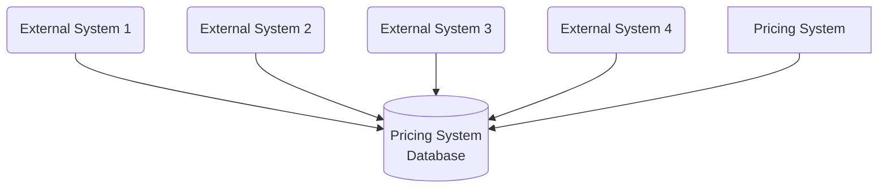

After:

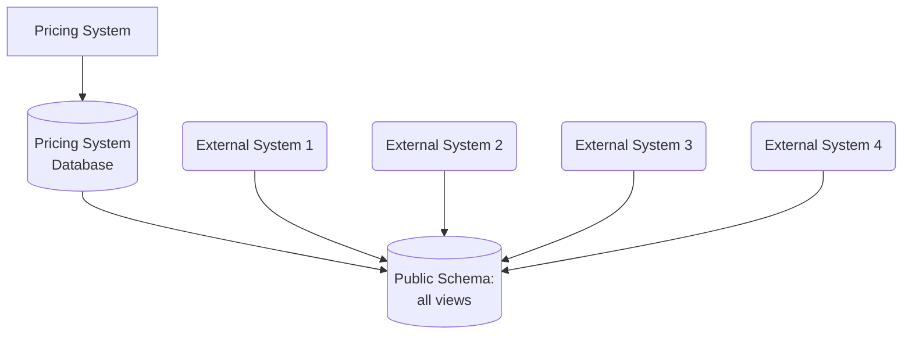

The ability of a view to project only limited information from the underlying
source allows us to implement a form of information hiding. It gives us control
over what is shared, and what is hidden. This is not a perfect solution,
however - there are restrictions with this approach.

Depending on the nature of the database, you may have the option to create a
materialized view. With a materialized view, the view is precomputed —
typically, through the use of a cache. This means a read from a view doesn’t
need to generate a read on the underlying schema, which can improve
performance. The trade-off then is around how this pre-computed view is
updated; it may well mean you could be reading a “stale” set of data from the
view.

### Limitations

The view itself is read-only. This immediately limits their usefulness. In
addition, while this is a common feature for relational databases, and many of
the more mature NoSQL databases support views, not all do. Even if your
database engine does support views, there will likely be other limitations,
such as the need for both the source schema and view to be in the same database
engine. This could increase your physical deployment coupling, leading to a
potential single point of failure.

### Ownership

Any published database views should be considered akin to any other service
interface, and therefore something that should be kept up-to-date by the team
looking after the source schema.

### Pattern: Database View - Where to Use It

- Where it is impractical to decompose the existing monolithic schema.
  - Ideally, you should try to avoid the need for a view if possible, if the
    end goal is to expose this information via a service interface.
- Instead, it’s better to push forward with proper schema decomposition.
- If you feel that the effort of full decomposition is too great, then this can
  be a step in the right direction.

## Pattern: Database Wrapping Service

With the ***database wrapping service pattern***: hide the database behind a
service that acts as a thin wrapper, moving database dependencies to become
service dependencies.

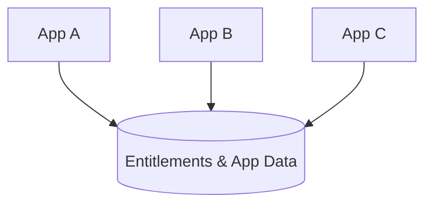

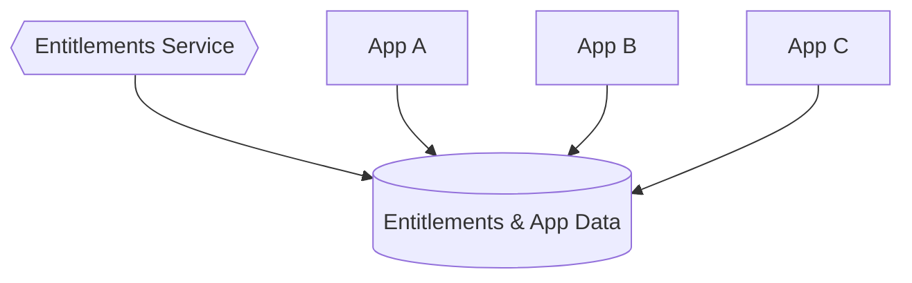

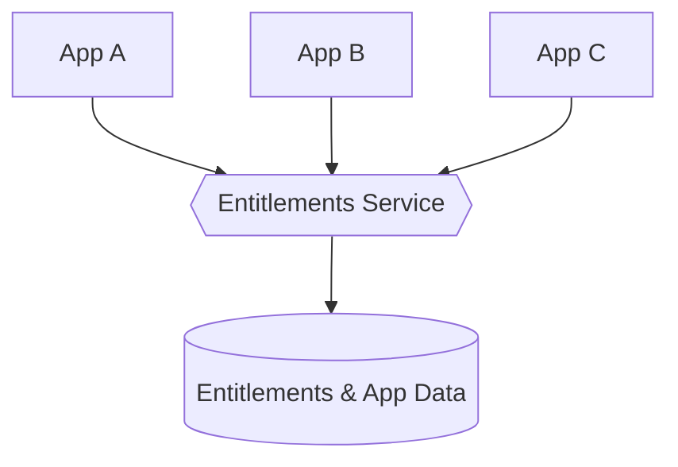

Just as with our use of database views, the use of a wrapping service allows us
to control what is shared and what is hidden. It presents an interface to
consumers that can be fixed, while changes are made under the hood to improve
the situation.

### Pattern: Database Wrapping Service - Where to Use It

This pattern works really well where the underlying schema is just too hard to
consider pulling apart. This approach also works best when you align ownership
of both the underlying schema and the service layer to the same team.

This pattern has advantages over the use of a simple database view. First, you
aren’t constrained to presenting a view that can be mapped to existing table
structures; you can write code in your wrapping service to present much more
sophisticated projections on the underlying data. The wrapping service can also
take writes (via API calls). Of course, adopting this pattern does require
upstream consumers to make changes; they have to shift from direct DB access to
API calls.

Ideally, using this pattern would be a stepping stone to more fundamental
changes, giving you time to break apart the schema underneath your API layer.

## Pattern: Database-as-a-Service Interface

Sometimes, clients just need a database to query. It could be because they need
to query or fetch large amounts of data, or perhaps because external parties
are already using tool chains that require a SQL endpoint to work against
(think about tools like Tableau, which are often used to gain insights into
business metrics). In these situations, allowing clients to view data that your
service manages in a database can make sense, but we should take care to
separate the database we expose from the database we use inside our service
boundary.

One approach that can work well is to create a dedicated database designed to be
exposed as a read-only endpoint, and have this database populated when the data
in the underlying database changes. In effect, in the same way that a service
could expose a stream of events as one endpoint, and a synchronous API as
another endpoint, it could also expose a database to external consumers.

- An example of this could be a service which exposes a read/write endpoint via
  an API, and a database as a read-only interface.

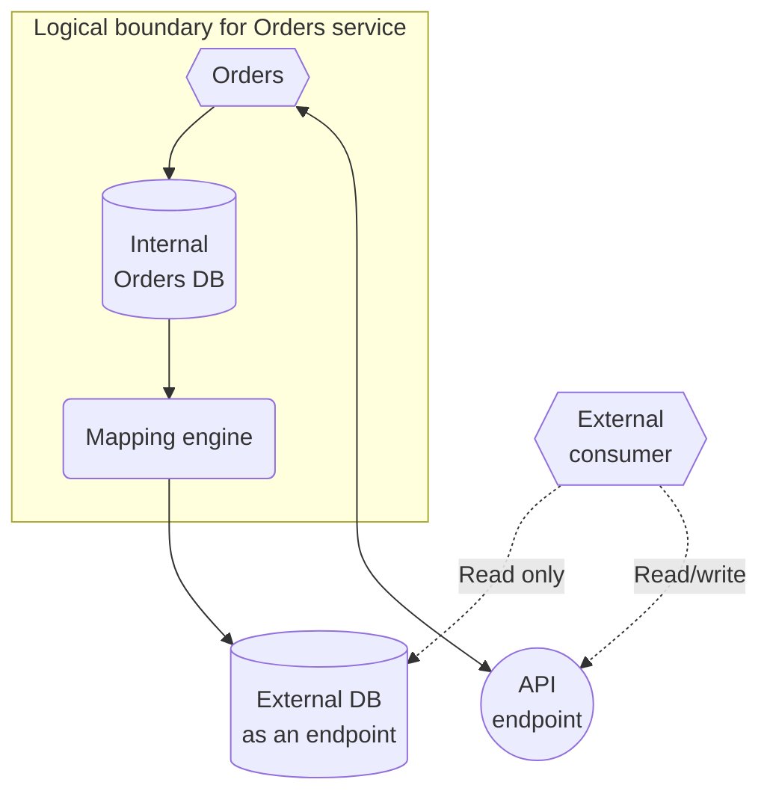

The mapping engine could ignore the changes entirely, expose the change
directly, or something in between. The key thing is that the mapping engine
acts as an abstraction layer between the internal and external databases. When
the internal database changes structure, the mapping engine will need to change
to ensure that the public-facing database remains consistent. In virtually all
cases, the mapping engine will lag behind writes made to the internal database;
typically, the choice of mapping engine implementation will determine this lag.
Clients reading from the exposed database need to understand that they are
therefore seeing potentially stale data, and you may find it appropriate to
programmatically expose information regarding when the external database was
last updated.

### Reporting Database Pattern

Martin Fowler has already documented this under the
***reporting database pattern***. Although reporting is a common application of
this pattern, it’s not the only reason people use this technique. The ability
to allow clients to define ad hoc queries has broader scope than traditional
batch-oriented workflows. So although this pattern is probably most widely used
to support these reporting use cases, a different name can better reflect the
fact that it may have wider applicability.

### Implementing a Mapping Engine

A change data capture system would be an excellent choice here. In fact, that
is likely to be the most robust solution while also providing the most
up-to-date view. Another option would be to have a batch process just copy the
data over, although this can be problematic as it is likely to lead to a longer
lag between internal and external databases, and determining which data
needs to be copied over can be difficult with some schemas. A third option
could be to listen to events fired from the service in question, and use that
to update the external database.

Nowadays, it is preferred to utilize a dedicated change data capture system,
perhaps something like Debezium. Batch processes has drawbacks like not running
or taking too long to run. With the world moving away from batch jobs, and
wanting data faster, batch is giving way to real time.

### Compared to Views

Database views are typically tied to a particular technology stack: if I want
to present a view of an Oracle database, both the underlying database and the
schema hosting the views both run on Oracle. With this approach, the database
we expose can be a totally different technology stack. We could use Cassandra
inside our service, but present a traditional SQL database as a public-facing
endpoint.

This pattern gives more flexibility than database views, but at an added cost.
You could start with the use of a database view and consider a shift to a
dedicated reporting database later on.

### Pattern: Database-as-a-Service Interface - Where to Use It

This is useful only for clients who need read-only access. It fits reporting
use cases very well — situations where your clients may need to join across
large amounts of data that a given service holds. This idea could be extended
to then import this database’s data into a larger data warehouse, allowing for
data from multiple services to be queried.

Don’t underestimate the work required to ensure that this external database
projection is kept properly up-to-date.

## Transferring Ownership

If we embrace the idea of a microservice encapsulating the logic associated
with one or more aggregates, we also need to move the management of their state
and associated data into the microservice’s own schema. On the other hand, if
our new microservice needs to interact with an aggregate that is still owned by
the monolith, we need to expose this capability via a well-defined interface.

### Pattern: Aggregate Exposing Monolith

By exposing information about our `Employees` via a service endpoint (it could
be an API or a stream of events) on the monolith itself, we make explicit what
information the `Invoice` service needs.

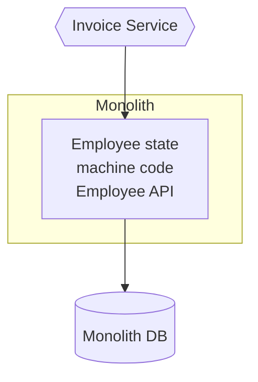

The monolith still “owns” the concept of what is and isn’t an allowable change
in state; we don’t want to treat it just like a wrapper around a database.

Beyond just exposing data, we’re exposing operations that allow external
parties to query the current state of an aggregate, and to make requests for
new state transitions. We can still decide to restrict what state of an
aggregate is exposed from our service boundary and to limit what state
transition operations can be requested from the outside.

#### As a pathway to more services

By defining the needs of the Invoice service, and explicitly exposing the
information needed in a well-defined interface, we’re on a path to potentially
discovering future service boundaries.

#### Pattern: Aggregate Exposing Monolith - Where to use it

When the data you want to access is still “owned” by the database, this pattern
works well to allow your new services the access they need. When extracting
services, having the new service call back to the monolith to access the data
it needs is likely little more work than directly accessing the database of the
monolith — but in the long term is a much better idea. I’d consider using a
database view over this approach ***only if*** the monolith in question cannot
be changed to expose these new endpoints. In such cases, a database view on the
monolith’s database could work, as could the change data capture pattern, or
creating a dedicated database wrapping service pattern on top of the monolith’s
schema.

### Pattern: Change Data Ownership

- Before: Invoice Service accesses data in the monolith's database
- After: Invoice data migrated into the service: the monolith now needs to
  access this data via the Invoice service's endpoint

We may have to consider the impact of breaking foreign-key constraints,
breaking transactional boundaries, and more. If the monolith can be changed
such that it needs only read access to Invoice-related data, you could consider
projecting a view from the Invoice service’s database. All the limitations of
database views will apply, however; changing the monolith to make calls to the
new Invoice service directly is greatly preferred.

## Data Synchronization

The problem occurs when the service in question manages data that will
need to be kept in sync between both the monolith and the new service.

To maintain the ability to switch between implementations, we need to ensure
that both sets of code can see the same data, and that this data can be
maintained in a consistent way.

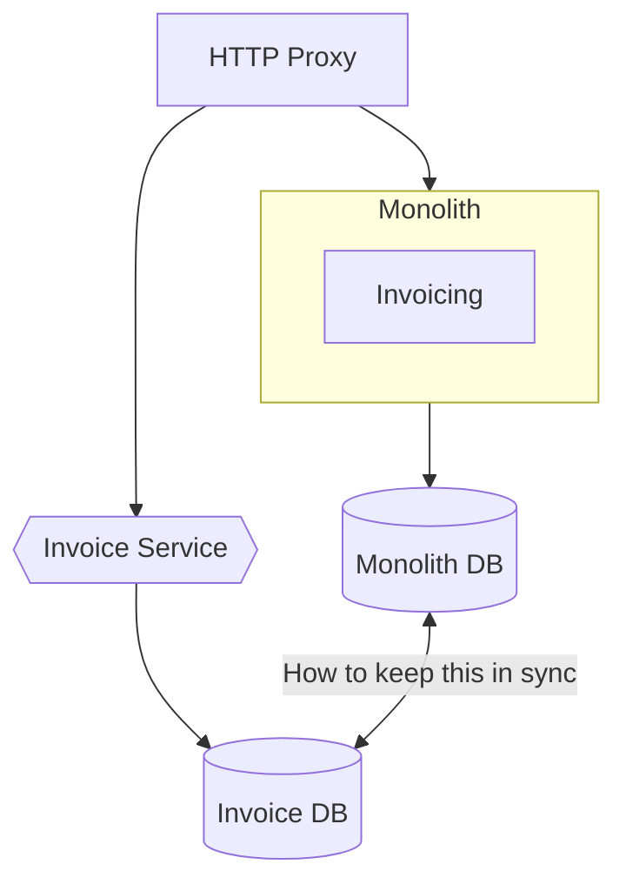

If either set of code needs to always see a totally consistent view of invoice
data, one of the most straightforward approaches would be to ensure the data is
kept in one place. This would lead us toward probably having our new Invoice
service read its data directly from the monolith for a short space of time,
perhaps making use of a view. Once we are happy that the switch has been
successful, we can then migrate the data. However, the concerns about using a
shared database cannot be overstated: you should consider this only as a very
short-term measure, as part of a more complete extraction; leaving a shared
database in place for too long can lead to significant long-term pain.

If we were doing a big-bang switchover (something I’d try to avoid), migrating
both the application code and the data at the same time, we could use a batch
process to copy the data over in advance of switching to the new microservice.
Once the invoice-related data has been copied over into our new microservice,
it can start serving traffic. However, what happens if we need to fall back to
using the functionality in the existing monolithic system? Data changed in the
microservices’ schema will not be reflected in the state of the monolithic
database, so we could end up losing state.

Another approach could be to consider keeping the two databases in sync via our
code. So we would have either the monolith or the new Invoice service make
writes to both databases.

## Pattern: Synchronize Data in Application

- e.g. The application itself would perform the synchronization between the two
  data sources. The idea is that initially the existing MySQL database would
  remain the source of truth, but for a period of time the application would
  ensure that data in MySQL and Riak were kept in sync. After a period of time,
  Riak would move to being the source of truth for the application, prior to
  MySQL being retired.

### Step 1: Bulk Synchronize Data

The first step is to get to the point where you have a copy of the data in the
new database. This involved doing a batch migration of data from the old system
into the new database. While the batch import was going on, the existing system
was kept running, so the source of data for the import was a snapshot of data
taken from the existing MySQL system. This causes a challenge, as when the
batch import finishes, the data in the source system could well have changed.
In this case, however, it wasn’t practical to take the source system off‐line.

*1. Prime the new DB with an initial import*.

*2. Synchronize new writes to the MySQL DB to the new DB*.

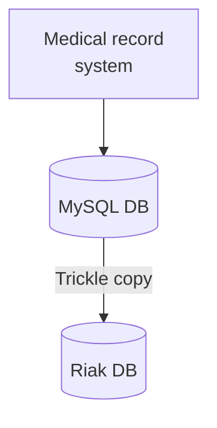

Once the batch import completed, a change data capture process was implemented
whereby changes since the import could be applied. This allowed Riak to be
brought in sync. Once this was achieved, it was time to deploy the new version
of the application.

### Step 2: Synchronize on Write, Read from Old Schema

With both databases now in sync, a new version of the application was deployed
that would write all data to both databases. At this stage, the goal was to
ensure that the application was correctly writing to both sources and make sure
that Riak was behaving within acceptable tolerances. By still reading all data
from MySQL, this ensured that even if Riak fell over in a heap, data could
still be retrieved from the existing MySQL database.

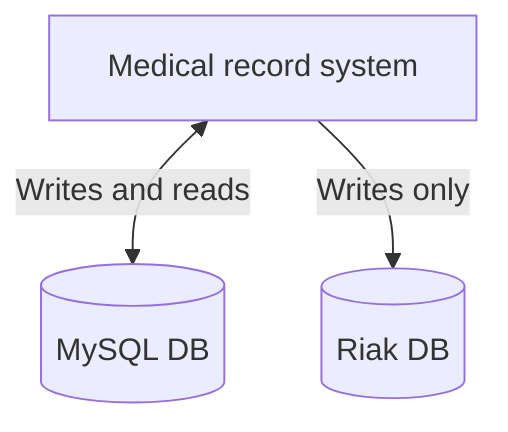

### Step 3: Synchronize on Write, Read from New Schema

A simple change to the application now has Riak as being the source of truth.
Note that we still write to both databases, so if there is an issue, you have a
fallback option.

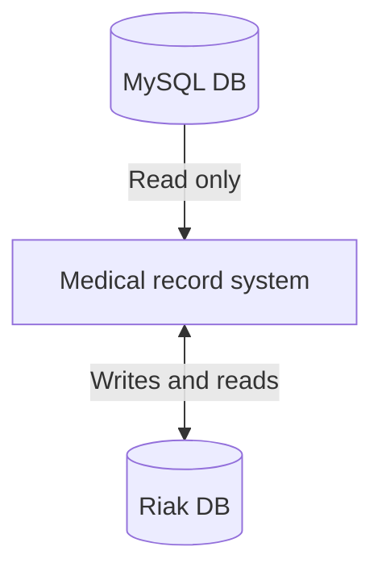

Once the new system has bedded in enough, the old schema could be safely
removed.

### Where to Use This Pattern

This pattern may make a lot of sense if you want to split the schema before
splitting out the application code.

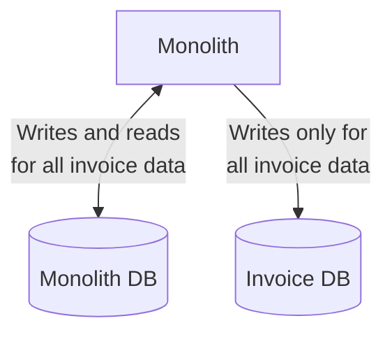

*Example of a monolith keeping two schemas in sync*.

### Pattern: Synchronize Data in Application - Where to Use It

Now you could consider using this pattern where you have both your monolith and
microservice accessing the data, but this gets extremely complicated. Both the
monolith and microservice have to ensure proper synchronization across the
databases for this pattern to work. If either one makes a mistake, you could be
in trouble. This complexity is greatly mitigated if you can be sure that at any
point in time either the Invoice service is making writes, or the monolith’s
Invoice functionality is — which would work well if using a simple switchover
technique. If, however, requests could hit either the monolith’s Invoice
functionality or the new Invoice functionality, perhaps as part of a canary,
then you may not want to use this pattern, as the resulting synchronization
will be tricky.

## Pattern: Tracer Write

With a tracer write, we move the source of truth for data in an incremental
fashion, tolerating there being two sources of truth during the migration. You
identify a new service that will host the relocated data. The current system
still maintains a record of this data locally, but when making changes also
ensures this data is written to the new service via its service interface.
Existing code can be changed to start accessing the new service, and once all
functionality is using the new service as the source of truth, the old source
of truth can be retired. Careful consideration needs to be given regarding how
data is synchronized between the two sources of truth.

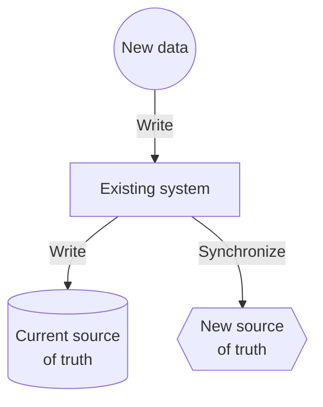

The problem is that if we insist on only ever having one source of truth for a
piece of data, then we are forced into a situation that changing where this
data lives becomes a single big switchover. Before the release, the monolith is
the source of truth. After the release, our new microservice is the source of
truth. A pattern like the ***tracer write*** allows for a phased switchover,
reducing the impact of each release, in exchange for being more tolerant of
having more than one source of truth.

The reason this pattern is called a tracer write is that you can start with a
small set of data being synchronized and increase this over time, while also
increasing the number of consumers of the new source of data.

- e.g. invoice-related data was being moved from the monolith over to the new
  Invoice microservice, we could first synchronize the basic invoice data, then
  migrate the contact information for the invoice, and finally synchronize
  payment records.

Other services that wanted invoice-related information would have a choice to
source this from either the monolith or the new service itself, depending on
what information they need. If they still needed information available only in
the monolith, they would have to wait until that data and the supporting
functionality was moved. Once the data and functionality are available in the
new microservice, the consumers can switch to the new source of truth.

As more data is synchronized, the monolith can use the new service as a source
of truth for more and more of the data. Once all the data is synchronized, and
the last consumer of the old source of truth has been switched over, we can
stop synchronizing the data.

### Pattern: Tracer Write - Data Synchronization

The biggest problem that needs to be addressed with the tracer write pattern is
the issue that plagues any situation where data is duplicated-inconsistency. To
resolve this, you have a few options:

- ***Write to one source***: All writes are sent to one of the sources of
  truth. Data is synchronized to the other source of truth after the write
  occurs.
- ***Send writes to both sources***: All write requests made by upstream
  clients are sent to both sources of truth. This occurs by making sure the
  client makes a call to each source of truth itself, or by relying on an
  intermediary to broadcast the request to each downstream service.
- ***Seed writes to either source***: Clients can send write requests to either
  source of truth, and behind the scenes the data is synchronized in a two-way
  fashion between the systems.

The two separate options of sending writes to both sources of truth, or sending
to one source of truth and relying on some form of background synchronization,
seem like workable solutions. However, although it’s technically an option,
this situation — where writes are made to either one source of truth or the
other — ***should be avoided***, as it requires two-way synchronization
(something that can be very difficult to achieve).

In all of these cases, there will be some delay in the data being consistent in
both sources of truth. The duration of this window of inconsistency will depend
on several factors. If you are constantly streaming updates from one system to
another, perhaps using a change data capture system, the windows of
inconsistency could be measured in seconds or less.

However long this window of inconsistency is, such synchronization gives us
what is called eventual consistency — eventually, both sources of truth will
have the same data. You will have to understand what period of inconsistency is
appropriate in your case, and use that to drive how you implement the
synchronization.

⚠️ It’s important that when maintaining two sources of truth like this that you
have some kind of reconciliation process to ensure that the synchronization is
working as intended. This may be something as simple as a couple of SQL queries
you can run against each database. But without checking that the
synchronization is working as expected, you may end up with inconsistencies
between the two systems and not realize it until it is too late. Running your
new source of truth for a period of time when it has no consumers until you are
satisfied with how things are working is very sensible.

### Example: Orders at Square

In the initial system, a single Order concept was used to manage multiple
workflows: one for customers ordering food, another for the restaurant
preparing the food, and a third workflow-managed state related to delivery
drivers picking up the food and dropping it off to customers. The needs of the
three stakeholders are different, and although all these stakeholders work with
the same Order, what that Order means to each of them is different. For the
customer, it’s something they have chosen to be delivered, and something they
need to pay for. For a restaurant it’s something that needs to be cooked and
picked up. And for the delivery driver, it’s something that needs to be taken
from the restaurant to the customer in a timely manner. Despite these different
needs, the code and associated data for the order was all bound together.

Having all these workflows bundled into this single Order concept was the
source of a great degree of delivery contention — different developers trying
to make changes for different use cases would get in each other’s way, as they
all needed to make changes in the same part of the codebase.

#### Creating the new service

The first step was to create a new Fulfillments service, which would manage the
Order data associated with restaurant and delivery drivers. This service would
become the new source of truth going forward for this subset of the Order data.
Initially, this service just exposed functionality to allow for
Fulfillments-related entities to be created. Once the new service was live, the
company had a background worker copy the Fulfillments-related data from the
existing system to the new Fulfillments service. This background worker just
made use of an API exposed by the Fulfillments service rather than doing a
direct insertion into the database, avoiding the need for direct database
access.

#### Synchronizing the data

Changes made to the existing system resulted in the fulfillment-related data
being written to the new Fulfillments service via its API. Square resolved this
by ensuring that all updates were made to both systems. Not all updates needed
to be made to both systems, however. Now that the Fulfillments service
represented only a subset of the Order concept, only changes made to the order
that delivery or restaurant clients cared about needed to be copied.

Any code that changed restaurant- or delivery-oriented information needed to be
changed to make two sets of API calls — one to the existing system, the other
to the same microservice. These upstream clients would also need to handle any
error conditions if the write to one worked but the other failed. These changes
to the two downstream systems were not done in an atomic fashion. This means
there could be a brief window in which a change would be visible in one system,
but not yet the other. Until both changes have been applied, you can see an
inconsistency between the two systems; this is a form of eventual consistency.

In terms of the eventual consistent nature of the Order information, this wasn’t
a problem for this particular use case. Data was synchronized quickly enough
between the two systems that it didn’t impact the users of the system.

If Square had been using an event-driven system for managing Order updates,
rather than making use of API calls, they could have considered an alternative
implementation. Both the existing system and the new Fulfillments service
receive the same messages. Upstream clients don’t need to know that there are
multiple consumers for these messages; this is something that could be handled
through the use of a pub-sub style broker.

If you are already making use of an event-based system, you may have an easier
time managing the synchronization process. It’s also worth noting that such an
architecture would still exhibit eventually consistent behavior, as you cannot
guarantee that both the existing system and Fulfillments service would process
the same event at the same time.

#### Migrating consumers

With the new Fulfillments service now holding all the required information for
the restaurant and delivery driver workflows, code that managed those workflows
could start switching over to use the new service. During this migration, more
functionality can be added to support these consumers’ needs; initially, the
Fulfillments service needed only to implement an API that enabled creation of
new records for the background worker. As new consumers migrate, their needs
can be assessed and new functionality can be added to the service to support
them.

### Pattern: Tracer Write - Where to Use It

Implementation of the synchronization is likely to be where most of the work
lies. If you can avoid the need for two-way synchronization, and instead use
some of the simpler options outlined here, you’ll likely find this pattern much
easier to implement. If you are already making use of an event-driven system,
or have a change data capture pipeline available, then you probably already
have a lot of the building blocks available to you to get the synchronization
working.

The shorter the window of acceptable inconsistency, the more difficult this
pattern will be to implement.

## Splitting Apart the Database

### Physical Versus Logical Database Separation

Logical decomposition allows for simpler independent change and information
hiding, whereas physical decomposition potentially improves system robustness,
and could help remove resource contention allowing for improved throughput or
latency.

Another consideration is that having multiple schemas sharing the same database
engine may be required if you want to expose views of your database. Both the
source database and the schemas hosting the views may need to be located on the
same database engine.

## Splitting the Database First, or the Code?

Extracting a microservice isn’t “done” until the application code is running in
its own service, and the data it controls is extracted into its own logically
isolated database. We have a few options:

- Split the database first, then the code.
- Split the code first, then the database.
- Split them both at once.

### Split the Database First

With a separate schema, we’ll be potentially increasing the number of database
calls to perform a single action. Whereas before we might have been able to
have all the data we wanted in a single `SELECT` statement, now we may need to
pull the data back from two locations and join in memory. Also, we end up
breaking transactional integrity when we move to two schemas, which could have
significant impact on our applications. By splitting the schemas out but
keeping the application code together, we give ourselves the ability to revert
our changes or continue to tweak things without impacting any consumers of our
service if we realize we’re heading down the wrong path. Once we are satisfied
that the DB separation makes sense, we could then think about splitting out the
application code into two services.

The flip side is that this approach is unlikely to yield much short-term
benefit. We still have a monolithic code deployment. Arguably, the pain of a
shared database is something you feel over time, so we’re spending time and
effort now to give us return in the long run, without getting enough of the
short-term benefit. For this reason, You would likely go this route only if
concerne about the potential performance or data consistency issues.

#### A Note on Tooling

#### Pattern: Repository per bounded context

A common practice is to have a repository layer, backed by some sort of
framework like Hibernate (ORM), to bind your code to the database, making it
easy to map objects or data structures to and from the database. Rather than
having a single repository layer for all data access concerns, there is value
in breaking down these repositories along the lines of bounded contexts.

Having the database mapping code colocated inside the code for a given context
can help us understand what parts of the database are used by what bits of
code. This can help us greatly understand what tables need to move as part of
any future decomposition.

A great place to start is to use a tool like the freely available SchemaSpy,
which can generate graphical representations of the relationships between
tables.

#### Pattern: Database per bounded context

Each bounded context had its own, totally separate databases. The idea was that
if there was a need to separate them into microservices later, this would be
much easier.

Keep schema separation where you think you may have service separation in the
future. That way, you get some of the benefits of decoupling these ideas, while
reducing the complexity of the system.

### Split the Code First

By splitting out the application tier, it becomes much easier to understand
what data is needed by the new service. You also get the benefit of having an
independently deployable code artifact earlier. The concerns with this approach
is that teams may get this far and then stop, leaving a shared database in play
on an ongoing basis. If this is the direction you take, you have to understand
that you’re storing up trouble for the future if you don’t complete the
separation into the data tier. The other potential challenge here is that you
may be delaying finding out nasty surprises caused by pushing join operations
up into the application tier.

If this is the direction you take, be honest with yourself: are you confident
that you will be able to make sure that any data owned by the microservice gets
split out as part of the next step?

#### Pattern: Monolith as data access layer

Rather than accessing the data from the monolith directly, we can just move to
a model in which we create an API in the monolith itself. Part of the reason
this isn’t used more widely is likely because people sort of have in their
minds the idea that the monolith is dead, and of no use. But the upsides here
are obvious: we don’t have to tackle data decomposition (yet) but get to hide
information, making it easier to keep our new service isolated from the
monolith.

It’s not too hard to see this pattern as a way of identifying other candidate
services. Extending this idea, we could see the Employee API splitting out from
the monolith to become a microservice in its own right.

This pattern works best when the code managing this data is still in the
monolith. As we talked about previously, one way to think of a microservice
when it comes to data is the encapsulation of the state and the code that
manages the transitions of that state. So if the state transitions of this data
are still provided in the monolith, it follows that the microservice that wants
to access (or change) that state needs to go via the state transitions in the
monolith.

If the data you’re trying to access in the monolith’s database should really be
“owned” by the microservice instead, I’m more inclined to suggest skipping this
pattern and instead looking to split the data out.

#### Pattern: Multischema storage

If you are still making direct use of the data in a database, it doesn’t mean
that new data stored by a microservice should go in there too.

We have to consider what happens when a foreign-key relationship effectively
spans a schema boundary.

As you manage to drag clear the rest of the data from the monolith, you can
migrate it a table at a time into your new schema.

This pattern works well when adding brand-new functionality to your
microservice that requires the storage of new data. It’s clearly not data the
monolith needs (the functionality isn’t there), so keep it separate from the
beginning. This pattern also makes sense as you start moving data out of the
monolith into your own schema — a process that may take some time.

If the data you are accessing in the monolith’s schema is data that you never
planned to move into your schema, I strongly recommend use of the monolith as
data access layer pattern in conjunction with this pattern.

### Split Database and Code Together

The concern here is that this is a much bigger step to take, and it will be
longer before you can assess the impact of your decision as a result. Avoid
this approach, and instead splitting either the schema or application tier
first.

### So, Which Should I Split First?

- If I’m able to change the monolith, and if I am concerned about the potential
  impact to performance or data consistency, I’ll look to split the schema apart
  first.
- Otherwise, I’ll split the code out, and use that to help understand how that
  impacts data ownership.
- But it’s important that you also think for yourself and take into account any
  factors that might impact the decision-making process in your particular
  situation.

## Schema Separation Examples

### Relational Databases Versus NoSQL

The nature of relational schemas of databases create additional challenges in
terms of pulling schemas apart. Many of you may well be using alternative types
of nonrelational databases. However, many of the following patterns may still
apply. You may have fewer constraints in how the changes can be made.

## Pattern: Split Table

In the spirit of incremental migration, it may make sense to split the tables
apart in the existing schema, before separating the schemas. However, because
we plan to move these tables ultimately into separate databases, we may not
gain much from this as we won’t have a single database enforcing the data
consistency.

It was easy to separate ownership of data on a column-by-column basis. But what
happens when multiple pieces of code update the same column?

Remember, we want, where possible, to keep the state machines for our domain
entities inside a single service boundary, and updating a Status certainly
feels like part of the state machine.

A big problem with splitting tables like this is that we lose the safety given
to us by database transactions.

### Pattern: Split Table - Where to Use It

When the table is owned by two or more bounded contexts in your current
monolith, you need to split the table along those lines. If you find specific
columns in that table that seem to be updated by multiple parts of your
codebase, you need to make a judgment call as to who should “own” that data. Is
it an existing domain concept you have in scope? That will help determine where
this data should go.

## Pattern: Move Foreign-Key Relationship to Code

These foreign-key relationships let the database engine carry out performance
optimizations to ensure that the join operation is as fast as possible.

### Moving the Join

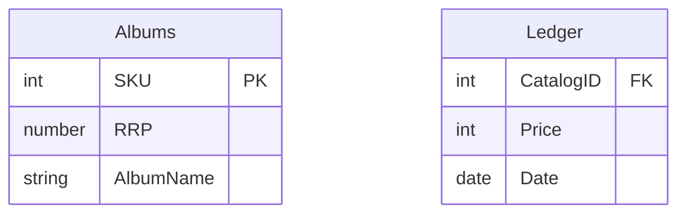

When generating the report, the `Finance` service first queries the `Ledger`
table, extracting the list of best-selling SKUs for the last month. At this
point, all we have is a list of SKUs, and the number of copies sold for each.

Next, we need to call the `Catalog` service, requesting information on each of
these SKUs. This request in turn would cause the `Catalog` service to make its
own local `SELECT` on its own database.

Logically, the join operation is still happening, but it is now happening
inside the `Finance` service, rather than in the database. Unfortunately, it
isn’t going to be anywhere near as efficient. We’ve gone from a world where we
have a single `SELECT` statement, to a new world where we have a `SELECT` query
against the `Ledger` table, followed by a service call to the `Catalog`
service, which in turn triggers a `SELECT` statement against the `Albums`
table.

This may not be a significant problem in this particular case, as this report
is generated monthly, and could therefore be aggressively cached. But if this
is a frequent operation, that could be more problematic. We can mitigate the
likely impact of this increase in latency by allowing for SKUs to be looked up
in the `Catalog` service in bulk, or perhaps even by caching the required album
information locally.

Ultimately, whether or not this increase in latency is a problem is something
only you can decide. You need to have an understanding of acceptable latency
for key operations, and be able to measure what the latency currently is.
Distributed systems like Jaeger can really help here, as they provide the
ability to get accurate timing of operations that span multiple services.
Making an operation slower may be acceptable if it is still fast enough,
especially if as a trade-off you gain some other benefits.

### Data Consistency

#### Check before deletion

Our first option might be to ensure that when removing a record from the
`Albums` table, we check with the `Finance` service to ensure that it doesn’t
already have a reference to the record. The problem here is that guaranteeing
we can do this correctly is difficult. Say we want to delete SKU 683. We send a
call to Finance saying, “Are you using 683?” It responds that this record is
not used. We then delete the record, but while we are doing it, a new reference
to 683 gets created in the Finance system. To stop this from happening, we’d
need to stop new references being created on record 683 until the deletion has
happened — something that would likely require locks, and all the challenges
that implies in a distributed system.

Another issue with checking if the record is already in use is that creates a
de facto reverse dependency from the `Catalog` service. Now we’d need to check
with any other service that uses our records. This is bad enough if we have
only one other service using our information, but becomes significantly worse
as we have more consumers.

I strongly urge you ***not to consider this option***, because of the
difficulty in ensuring that this operation is implemented correctly as well as
the high degree of service coupling that this introduces.

#### Handle deletion gracefully

A better option is just to have the `Finance` service handle the fact that the
`Catalog` service may not have information on the `Album` in a graceful way.
This could be as simple as having our report show “Album Information Not
Available” if we can’t look up a given SKU.

In this situation, the `Catalog` service could tell us when we request a SKU
that used to exist. This would be the good use of a `410 GONE` response code if
using HTTP, for example. A `410` response code differs from the commonly used
`404`. A `404` denotes that the requested resource is not found, whereas a
`410` means that the requested resource was available but isn’t any longer. The
distinction can be important, especially when tracking down data inconsistency
issues! Even if not using an HTTP-based protocol, consider whether or not you’d
benefit from supporting this sort of response.

If we wanted to get really advanced, we could ensure that our `Finance` service
is informed when a `Catalog` item is removed, perhaps by subscribing to events.
When we pick up a `Catalog` deletion event, we could decide to copy the now
deleted `Album` information into our local database. This feels like overkill
in this particular situation, but could be useful in other scenarios,
especially if you wanted to implement a distributed state machine to perform
something like a cascading deletion across service boundaries.

#### Don’t allow deletion

One way to ensure that we don’t introduce too much inconsistency into the
system could be to simply not allow records in the `Catalog` service to be
deleted. If in the existing system deleting an item was akin to ensuring it
wasn’t available for sale or something similar, we could just implement a soft
delete capability. We could do this by using a status column to mark that row
as being unavailable, or perhaps even moving the row into a dedicated
“graveyard” table. The album’s record could still be requested by the `Finance`
service in this situation.

- Maintaining historical data in a relational database like this can get
  complicated, especially if you need to programmatically reconstitute old
  versions of your entities. If you have heavy requirements in this space,
  exploring ***event sourcing*** as an alternative way of maintaining state
  would be worthwhile.

#### So how should we handle deletion?

In looking at ways to solve this, we must consider the needs of our users, as
different solutions could impact our users in different ways. Choosing the
right solution therefore requires an understanding of your specific context.

- by not allowing deletion of album information in the Catalog
- and by ensuring that the Finance service can handle a missing record.

You could argue that if a record can’t be removed from the `Catalog` service,
the lookup from `Finance` could never fail. However, there is a possibility
that, as a result of corruption, the `Catalog` service may be recovered to an
earlier state, meaning the record we are looking for no longer exists.

### Pattern: Move Foreign-Key Relationship to Code - Where to Use It

When you start considering effectively breaking foreign-key relationships, one
of the first things you need to ensure is that you aren’t breaking apart two
things that really want to be one. If you’re worried that you are breaking
apart an aggregate, pause and reconsider. Consider a different case: an `Order`
table, and lots of associated rows in an `Order Line` table containing details
of the items we have ordered. If we split out order lines into a separate
service, we’d have data integrity issues to consider. Really, the lines of an
order are part of the order itself. We should therefore see them as a unit, and
if we wanted to move them out of the monolith, they should be moved together.

Sometimes, by taking a bigger bite out of the monolithic schema, you may be
able to move both sides of a foreign-key relationship with you, making your
life much easier!

### Example: Shared Static Data

***Static reference data*** (which changes infrequently, yet is typically
critical) can create some interesting challenges.

Why small amounts of infrequently changing data like country codes need to
exist in databases?

#### Pattern: duplicate static reference data

Why not just have each service have its own copy of the data? It’s less crazy
than you’d think.

Concerns around duplication of data tend to come down to two things.

- First, each time I need to change the data, I have to do so in multiple
  places. But in this situation, how often does the data change?
- The bigger worry is, what happens if the data is inconsistent? For example,
  the `Finance` service knows that South Sudan is a country, but inexplicably,
  the ·Warehouse· service is living in the past and knows nothing about it.
  - Whether or not inconsistency is an issue comes down to how the data is
    used.
  - When the data is used only locally within each service, the inconsistency
    is not a problem.
  - If, on the other hand, the data is part of the communication between these
    services, then we have different concerns. If both `Warehouse` and
    `Finance` need the same view of country information, duplication of this
    nature is not a good idea.

We worry about the extra cost of managing duplicate copies of information, and
are even more concerned if this data diverges. But accepting some duplication
in data may be a sensible trade-off if it means we avoid introducing coupling.

***This pattern should be used only rarely***. It is sometimes useful for large
volumes of data, when it’s not essential for all services to see the exact same
set of data.

#### Pattern: Dedicated reference data schema

If you really want one source of truth for your country codes, you could
relocate this data to a dedicated schema, perhaps one set aside for all static
reference data.

It changes infrequently, and is simply structured, and therefore we could more
easily consider this Reference Data schema to be a ***defined interface***.
Making breaking changes to this schema is likely to be painful.

This option has a lot of merits. We avoid the concerns around duplication, and
the format of the data is highly unlikely to change, so some of our coupling
concerns are mitigated. For large volumes of data, or when you want the option
of cross-schema joins, it’s a valid approach. But any changes to the schema
format will likely cause significant impact across multiple services.

#### Pattern: Static reference data library

Obviously, if we have a mix of technology stacks, we may not be able to share a
single shared library. Also, we need to ensure that our microservices are
independently deployable. If we needed to update our country codes library, and
have all services pick up the new data immediately, we’d need to redeploy all
services at the moment the new library is available. This is a classic
lock-step release, and exactly what we’re trying to avoid with microservice
architectures.

If your microservices use shared libraries, remember that you have to accept
that you might have different versions of the library deployed in production!

In a simple variation of this pattern, the data in question is held in a
configuration file, perhaps a standard properties file or, if required, in a
more structured JSON format.

For small volumes of data, where you can be relaxed about different services
seeing different versions of this data, this is an excellent but often
overlooked option. The visibility regarding which service has what version of
data is especially useful.

#### Pattern: Static reference data service

Even better, a Country Code service would be a great fit for something like a
Function-as-a-Service platform like Azure Cloud Functions or AWS Lambda. The
lower operations cost for functions is attractive, and they’re a great fit for
simple services like the Country Code service.

Another concern cited is that by adding a service for country codes, we’d be
adding yet another networked dependency that could impact latency.

- this approach is no worse, and may be faster, than having a dedicated
  database for this information. Why? There are only 249 entries in this
  dataset. Our Country Code service could easily hold this in memory and serve
  it up directly.

This data can also be aggressively cached at the client side. We could also
consider using events to let consumers know when this data has changed. When
the data changes, interested consumers can be alerted via events and use this
to update their local caches. A traditional TTL-based client cache is likely to
be good enough in this scenario, given the low change frequency.

**Where to use it**. I’d reach for this option if I was managing the life cycle
of this data itself in code. This also makes sense if you want to emit events
when this data changes, or just where you want to provide a more convenient
contact against which to stub for testing purposes.

The major issue here always seems to come down to the cost of creating yet
another microservice. Does it add enough to justify the work, or would one of
these other approaches be a more sensible option?

#### What would I do?

- For small amounts of data, go with the static reference data library option.
- For more complex reference data or for larger volumes, put this into the
  local database for each service.
- If the data needs to be consistent between services, create a dedicated
  service (or perhaps serve up this data as part of a larger-scoped static
  reference service).
- The last resort is using a dedicated schema for this sort of data, only if it
  was difficult to justify the work to create a new service.

## Transactions

When we split data across databases, we lose the benefit of using a database
transaction to apply changes in state in an atomic fashion.

### ACID Transactions

ACID is an acronym outlining the key properties of database transactions that
lead to a system we can rely on to ensure the durability and consistency of
our data storage. ***ACID*** stands for ***atomicity***, ***consistency***,
***isolation***, and ***durability***:

- ***Atomicity***: Ensures that all operations completed within the transaction
  either all complete or all fail.
- ***Consistency***: When changes are made to our database, we ensure it is
  left in a valid, consistent state.
- ***Isolation***: Allows multiple transactions to operate at the same time
  without interfering. This is achieved by ensuring that any interim state
  changes made during one transaction are invisible to other transactions.
- ***Durability***: Makes sure that once a transaction has been completed, we
  are confident the data won’t get lost in the event of some system failure.

### Still ACID, but Lacking Atomicity?

e.g. We are keeping track of the process involved in onboarding a new customer
to our system. We’ve reached the end of the process, which involves changing
the `Status` of the customer from `PENDING` to `VERIFIED`. As the enrollment is
now complete, we also want to remove the matching row from the
`PendingEnrollments` table. With a single database, this is done in the scope
of a single ACID database transaction — either both the new rows are written,
or neither are written.

Compare this with microservices. We’re making exactly the same change, but now
each change is made in a different database. This means there are two
transactions to consider, each of which could work or fail independently of the
other.

We could decide to sequence these two transactions, of course, removing a row
from the `PendingEnrollments` table only if we were able to change the row in
the `Customer` table. But we’d still have to reason about what to do if the
deletion from the `PendingEnrollments` table then failed — all logic that we’d
need to implement ourselves. Being able to reorder steps to make handling these
use cases can be a really useful idea, though. But fundamentally by decomposing
this operation into two separate database transactions, we have to accept that
we’ve lost guaranteed atomicity of the operation as a whole.

This lack of atomicity can start to cause significant problems, especially if
we are migrating systems that previously relied on this property. Normally, the
first option that people start considering is distributed transactions.

### Two-Phase Commits

The ***two-phase commit*** algorithm (2PC) is frequently used to attempt to
give us the ability to make transactional changes in a distributed system,
where multiple separate processes may need to be updated as part of the overall
operation. But 2PCs have limitations. Distributed transactions, and two-phased
commits more specifically, are frequently raised by teams moving to
microservice architectures as a way of solving challenges they face. But they
may not solve your problems, and may bring even more confusion to your system.

The algorithm is broken into two phases: a ***voting phase*** and a
***commit phase***. During the voting phase, a central coordinator contacts all
the workers who are going to be part of the transaction, and asks for
confirmation as to whether or not some state change can be made.

e.g.

1. One to change a customer status to VERIFIED
2. another to remove a row from our `PendingEnrollments` table.

If all the workers agree that the state change they are asked for can take
place, the algorithm proceeds to the next phase. If any workers say the change
cannot take place, perhaps because the requested state change violates some
local condition, the entire operation aborts.

It’s important to highlight that the change does not take effect immediately
after a worker indicates that it can make the change. Instead, the worker is
guaranteeing that it will be able to make that change at some point in the
future.

How would the worker make such a guarantee?

For example, `Worker A` has said it will be able to change the state of the row
in the `Customer` table to update that specific customer’s status to be
`VERIFIED`. What if a different operation at some later point deletes the
row, or makes another smaller change that nonetheless means that a change to
`VERIFIED` later is invalid? To guarantee that this change can be made later,
`Worker A` will likely have to lock that record to ensure that such a change
cannot take place.

If any workers didn’t vote in factor of the commit, a rollback message needs to
be sent to all parties, to ensure that they can clean up locally, which allows
the workers to release any locks they may be holding. If all workers agreed to
make the change, we move to the commit phase. Here, the changes are actually
made, and associated locks are released.

It’s important to note that ***in such a system, we cannot in any way
guarantee*** that these commits will occur at exactly the same time. The
coordinator needs to send the commit request to all participants, and that
message could arrive at and be processed at different times. This means it’s
possible that we could see the change made to `Worker A`, but not yet see the
change to `Worker B`, if we allow for you to view the states of these workers
outside the transaction coordinator. The more latency there is between the
coordinator, and the slower it is for the workers to process the response, the
wider this window of inconsistency might be. Coming back to the definition of
ACID, ***isolation*** ensures that we don’t see intermediate states during a
transaction. But with this two-phase commit, we’ve lost that.

When two-phase commits work, at their heart they are very often just
***coordinating distributed locks***. The workers need to lock local resources
to ensure that the commit can take place during the second phase. Managing
locks, and avoiding deadlocks in a single-process system.

There are a host of failure modes associated with two-phase commits. Consider
the problem of a worker voting to proceed with the transaction, but then not
responding when asked to commit. Some of these failure modes can be handled
automatically, but some can leave the system in such a state that things need
to be manually unpicked.

The more participants you have, and the more latency you have in the system,
the more issues a two-phase commit will have. They can be a quick way to inject
huge amounts of latency into your system, especially if the scope of locking is
large, or the duration of the transaction is large. It’s for this reason
two-phase commits are typically used only for very short-lived operations. The
longer the operation takes, the longer you’ve got resources locked for!

### Distributed Transactions—Just Say No

Avoid the use of distributed transactions like the two-phase commit to
coordinate changes in state across your microservices.

The first option could be to just not split the data apart in the first place.
If you have pieces of state that you want to manage in a truly atomic and
consistent way, and you cannot work out how to sensibly get these
characteristics without an ACID-style transaction, then leave that state in a
single database, and leave the functionality that manages that state in a
single service (or in your monolith). If you’re in the process of working out
where to split your monolith, and working out what decompositions might be easy
(or hard), then you could well decide that splitting apart data that is
currently managed in a transaction is just too hard to handle right now. Work
on some other area of the system, and come back to this later.

## Sagas

Unlike a two-phase commit, a ***saga*** is by design an algorithm that can
coordinate multiple changes in state, but avoids the need for locking resources
for long periods of time. We do this by modeling the steps involved as discrete
activities that can be executed independently. It comes with the added benefit
of forcing us to explicitly model our business processes.

The core idea reflected on the challenges of how best to handle operations of
what they referred to as long lived transactions (LLTs). These transactions
might take a long time (minutes, hours, or perhaps even days), and as part of
that process require changes to be made to a database.

If you directly mapped an LLT to a normal database transaction, a single
database transaction would span the entire life cycle of the LLT. This could
result in multiple rows or even full tables being locked for long periods of
time while the LLT is taking place, causing significant issues if other
processes are trying to read or modify these locked resources.

Instead, we can break down these LLTs into a sequence of transactions, each of
which can be handled independently. The idea is that the duration of each of
these “sub” transactions will be shorter lived, and will modify only part of
the data affected by the entire LLT. As a result, there will be far less
contention in the underlying database as the scope and duration of locks is
greatly reduced.

While sagas were originally envisaged as a mechanism to help with LLTs acting
against a single database, the model works just as well for coordinating change
across multiple services. We can break a single business process into a set of
calls that will be made to collaborating services as part of a single saga.

⚠️ You need to understand that a saga does not give us atomicity in ACID terms
we are used to with a normal database transaction. As we break the LLT into
individual transactions, we don’t have atomicity at the level of the saga
itself. We do have atomicity for each subtransaction inside the LLT, as each
one of them can relate to an ACID transactional change if needed. What a saga
gives us is enough information to reason about which state it’s in; it’s up to
us to handle the implications of this.

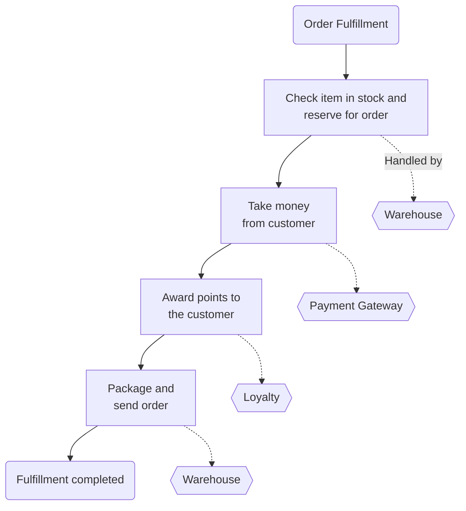

Here, the order fulfillment process is represented as a single saga, with each
step in this flow representing an operation that can be carried out by a
different service. Within each service, any state change can be handled within
a local ACID transaction.

### Saga Failure Modes

How to recover when a failure happens?

The original saga paper describes two types of recovery: backward recovery and
forward recovery.

***Backward recovery*** involves reverting the failure, and cleaning up
afterwards — a rollback. For this to work, we need to define compensating
actions that allow us to undo previously committed transactions.

***Forward recovery*** allows us to pick up from the point where the failure
occurred, and keep processing. For that to work, we need to be able to retry
transactions, which in turn implies that our system is persisting enough
information to allow this retry to take place.

Depending on the nature of the business process being modeled, you may consider
that any failure mode triggers a backward recovery, a forward recovery, or
perhaps a mix of the two.

#### Saga rollbacks

With our saga, we have multiple transactions involved, and some of those may
have already committed before we decide to roll back the entire operation. So
how can we roll back transactions after they have already been committed?

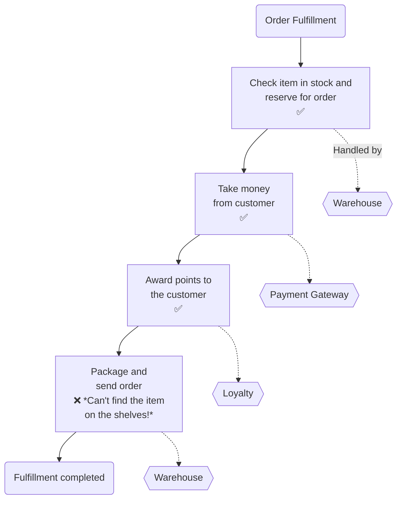

Let’s assume we decide we want to just roll back the entire order, rather than
giving the customer the option for the item to be placed on back order. The
problem is that we’ve already taken payment and awarded loyalty points for the
order.

There is no simple “rollback” for the entire operation. Instead, if you want to
implement a rollback, you need to implement a ***compensating transaction***. A
compensating transaction is an operation that undoes a previously committed
transaction. To roll back our order fulfillment process, we would trigger the
compensating transaction for each step in our saga that has already been
committed.

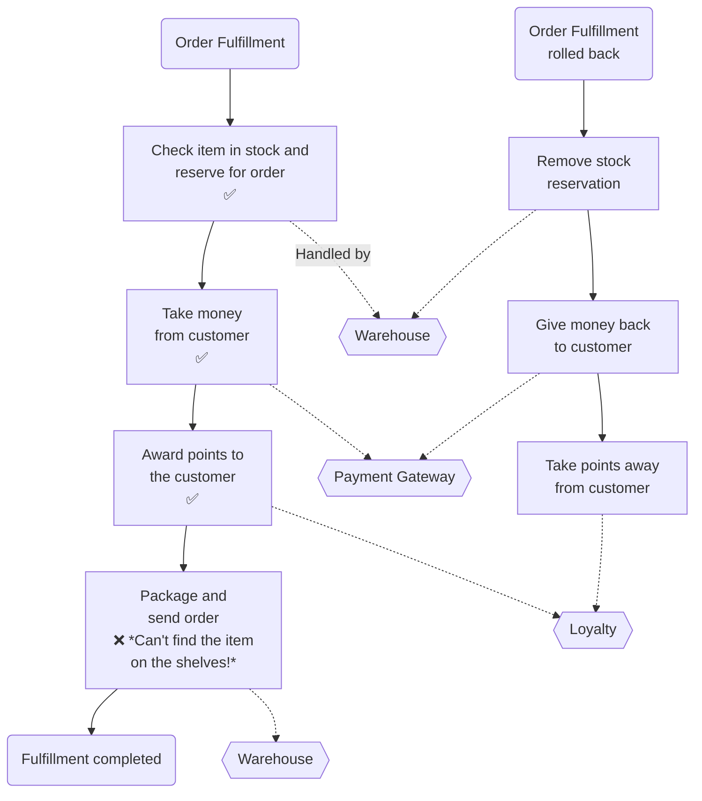

These compensating transactions can’t have exactly the same behavior as that of
a normal database rollback. A database rollback happens before the commit; and
after the rollback, it is as though the transaction never happened. We are
creating a new transaction that reverts the changes made by the original
transaction.

Because we cannot always cleanly revert a transaction, we say that these
compensating transactions are semantic rollbacks. We cannot always clean up
everything, but we do enough for the context of our saga. As an example, one of
our steps may have involved sending an email to a customer to tell them their
order was on the way. If we decide to roll that back, you can’t unsend an
email! Instead, your compensating transaction could cause a second email to be
sent to the customer, informing them that there had been a problem with the
order and it had been canceled.

It is totally ***appropriate*** for information related to the rollback saga to
persist in the system.

#### Reordering steps to reduce rollbacks

A simple change would be to award points only when the order was actually
dispatched. This way, we’d avoid having to worry about that stage being rolled
back if we had a problem while trying to package and send the order. Sometimes
you can simplify your rollback operations just by tweaking how the process is
carried out. By pulling forward those steps that are most likely to fail and
failing the process earlier, you avoid having to trigger later compensating
transactions as those steps weren’t even triggered in the first place.

This can be especially important if implementing a compensating transaction is
difficult.

#### Mixing fail-backward and fail-forward situations

It is totally appropriate to have a mix of failure recovery modes. Some
failures may require a rollback; others may be fail forward. For the order
processing, for example, once we’ve taken money from the customer, and the item
has been packaged, the only step left is to dispatch the package. If for
whatever reason we can’t dispatch the package, it seems very odd to roll the
whole order back. Instead, we’d probably just retry the dispatch, and if that
fails, require human intervention to resolve the situation.

### Implementing Sagas

***Orchestrated sagas*** more closely follow the original solution space and
rely primarily on centralized coordination and tracking. These can be compared
to ***choreographed sagas***, which avoid the need for centralized coordination
in favor of a more loosely coupled model, but which can make tracking the
progress of a saga more complicated.

#### Orchestrated sagas

Orchestrated sagas use a central coordinator (orchestrator) to define the order
of execution and to trigger any required compensating action. You can think of
orchestrated sagas as a command-and-control approach: the central orchestrator
controls what happens and when, and with that comes a good degree of visibility
as to what is happening with any given saga.

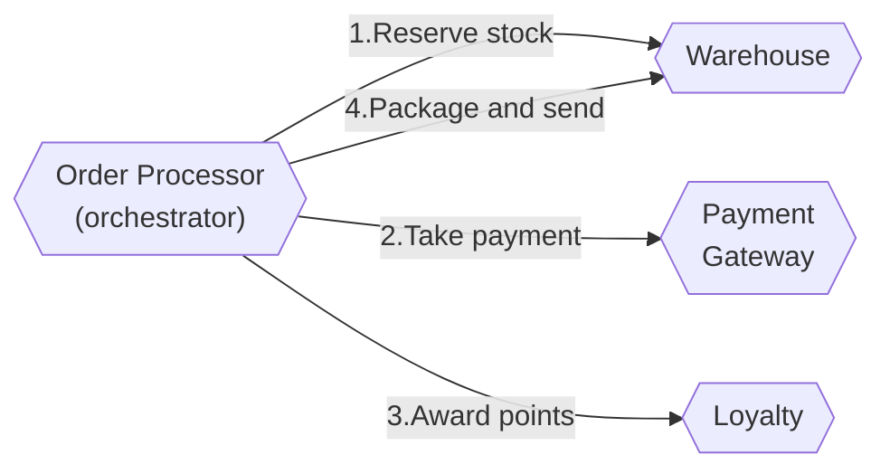

Here, the central `Order Processor`, playing the role of the orchestrator,
coordinates the fulfillment process. It knows what services are needed to carry
out the operation, and it decides when to make calls to those services. If the
calls fail, it can decide what to do as a result. These orchestrated processors
tend to make heavy use of request/response calls between services: the
`Order Processor` sends a request to services, and expects a response letting
it know if the request was successful and providing the results of the request.

Having the business process explicitly modeled inside the `Order Processor` is
extremely beneficial. It allows us to look at one place in the system and
understand how this process is supposed to work. That can make onboarding of
new people easier, and help impart a better understanding of the core parts of
the system.

There are a few downsides to consider, though.

1. This is a somewhat coupled approach. The `Order Processor` needs to know
   about all the associated services, resulting in a higher degree of domain
   coupling. While not inherently bad, we’d still like to keep domain coupling
   to a minimum if possible. Here, the `Order Processor` needs to know about
   and control so many things that this form of coupling is hard to avoid.
2. The other issue, which is more subtle, is that logic that should otherwise
   be pushed into the services can start to instead become absorbed in the
   orchestrator. If this starts happening, you may find your services becoming
   anemic, with little behavior of their own, just taking orders from
   orchestrators.

It’s important you still consider the services that make up these orchestrated
flows as entities that have their own local state and behavior. They are in
charge of their own local state machines.

⚠️ If logic has a place where it can be centralized, it will become centralized!

One of the ways to avoid too much centralization with orchestrated flows can be
to ensure you have different services playing the role of the orchestrator for
different flows. You might have an `Order Processor` service that handles
placing an order, a `Returns` service to handle the return and refund process,
a `Goods Receiving` service that handles new stock arriving at the warehouse
and being put on the shelves, and so on. Something like the `Warehouse` service
may be used by all those orchestrators; such a model makes it easier for you to
keep functionality in the `Warehouse` service itself to allow you to reuse
functionality across all those flows.

##### BPM Tools?

By and large, ***Business process modeling*** (BPM) tools are designed to allow
nondevelopers to define business process flows, often using visual
drag-and-drop tools. The idea is developers would create the building blocks of
these processes, and then nondevelopers would wire these building blocks
together into the larger process flows. The use of such tools seems to line up
really nicely as a way of implementing orchestrated sagas, and indeed process
orchestration is pretty much the main use case for BPM tools (or, in reverse,
the use of BPM tools results in you having to adopt orchestration).

But, BPM tools may not be your option. The main reason is that the central
conceit — that nondevelopers will define the business process — almost never
been true. The tooling aimed at nondevelopers ends up getting used by
developers, and they can have a host of issues.

If your developers are going to be implementing your business processes, let
them use tooling that they know and understand and is fit for their workflows.
If you need visibility as to how a business process has been implemented, or
how it is operating, then it is far easier to project a visual representation
of a workflow from code than it is to use a visual representation of your
workflow to describe how your code should work.

- Camunda
- Zeebe

#### Choreographed sagas

Choreographed sagas aim to distribute responsibility for the operation of the
saga among multiple collaborating services. If orchestration is
command-and-control, choreographed sagas represent a trust-but-verify
architecture. Choreographed sagas will often make heavy use of events for
collaboration between services.

First, these services are reacting to events being received. Conceptually,
events are broadcast in the system, and interested parties are able to receive
them. You don’t send events to a service; you just fire them out, and the
services that are interested in these events are able to receive them and act
accordingly. In our example, when the `Warehouse` service receives that first
`Order Placed` event, it knows its job to reserve the appropriate stock and
fire an event once that is done. If the stock couldn’t be received, the
`Warehouse` would need to raise an appropriate event (an `Insufficient Stock`
event perhaps), which might lead to the order being aborted.

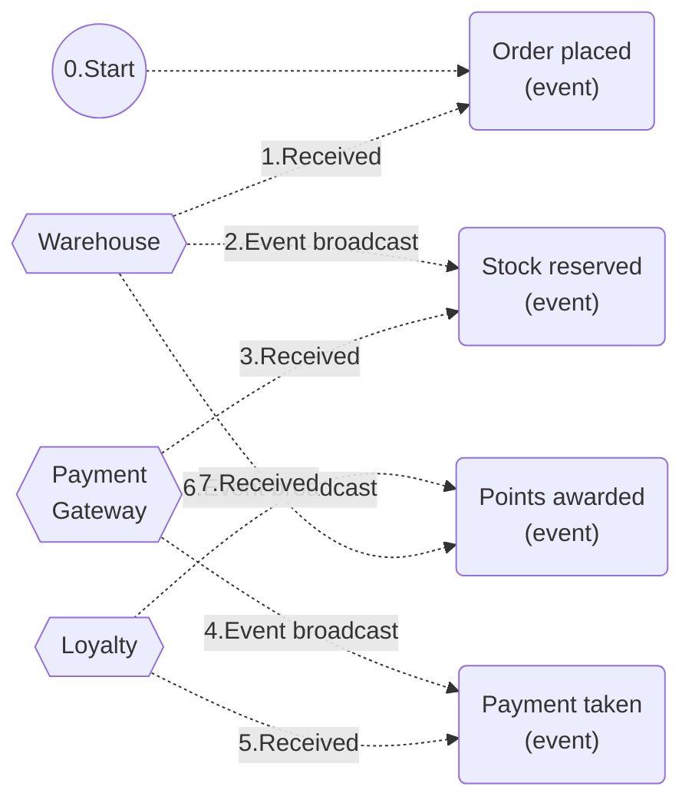

Typically, you’d use some sort of message broker to manage the reliable
broadcast and delivery of events. It’s possible that multiple services may
react to the same event, and that is where you would use a topic. Parties
interested in a certain type of event would subscribe to a specific topic
without having to worry about where these events came from, and the broker
ensures the durability of the topic and that the events on it are successfully
delivered to subscribers. As an example, we might have a `Recommendation`
service that also listens to `Order Placed` events and uses that to construct a
database of music choices you might like.

In the preceding architecture, no one service knows about any other service.
They only need to know what to do when a certain event is received. Inherently,
this makes for a much less coupled architecture. As the implementation of the
process is decomposed and distributed among the four services here, we also
avoid the concerns about centralization of logic.

💡 If you don’t have a place where logic can be centralized, then it won’t be
centralized!

The flip side of this is that it can now be harder to work out what is going
on. With orchestration, the process was explicitly modeled in our orchestrator.
Now, with this architecture as it is presented, how would you build up a mental
model of what the process is supposed to be? You’d have to look at the behavior
of each service in isolation and reconstitute this picture in your own head —
far from a straightforward process even with a simple business process like
this one.

The lack of an explicit representation of the business process is bad enough,
but we also lack a way of knowing what state a saga is in, which can also deny
us the chance to attach compensating actions when required. We can push some
responsibility to the individual services for carrying out compensating
actions, but fundamentally we need a way of knowing what state a saga is in for
some kinds of recovery. The lack of a central place to interrogate around the
status of a saga is a big problem.

One of the easiest ways of doing this is to project a view regarding the state
of a saga from the existing system by consuming the events being emitted. If we
generate a unique ID for the saga, we can put this into all of the events that
are emitted as part of this saga - this is what is known as a
***correlation ID***. We could then have a service whose job is to just vacuum
up all these events and present a view of what state each order is in, and
perhaps programmatically carry out actions to resolve issues as part of the
fulfillment process if the other services couldn’t do it themselves.

#### Mixing styles

You may have some business processes in your system that more naturally fit one
model or another. You may also have a single saga that has a mix of styles. In
the order fulfillment use case, for example, inside the boundary of the
`Warehouse` service, when managing the packaging and dispatch of a package, we
may use an orchestrated flow even if the original request was made as part of a
larger choreographed saga.

If you do decide to mix styles, it’s important that you still have a clear way
to understand what has happened as part of the saga. Without this,
understanding failure modes becomes complex, and recovery from failure
difficult.

#### Should I use choreography or orchestration?

Implementing choreographed sagas can bring with it ideas that may be unfamiliar
to you and your team. They typically assume heavy use of event-driven
collaboration, which isn’t widely understood. However, the extra complexity
associated with tracking the progress of a saga is almost always outweighed by
the benefits associated with having a more loosely coupled architecture.

In such a situation, the more inherently coupled architecture is much easier to
manage within the team boundary. If you have multiple teams involved, the more
decomposed choreographed saga is more preferred as it is easier to distribute
responsibility for implementing the saga to the teams, with the more loosely
coupled architecture allowing these teams to work more in isolation.

### Sagas Versus Distributed Transactions

> In most distributed transaction systems, the failure of a single node causes
> transaction commit to stall. This in turn causes the application to get
> wedged. In such systems, the larger it gets, the more likely the system is
> going to be down. When flying an airplane that needs all of its engines to
> work, adding an engine reduces the availability of the airplane.
>
> —Pat Helland, Life Beyond Distributed Transactions

Explicitly modeling business processes as a saga avoids many of the challenges
of distributed transactions, while at the same time has the added benefit of
making what might otherwise be implicitly modeled processes much more explicit
and obvious to your developers. Making the core business processes of your
system a first-class concept will have a host of benefits.

## Summary

We decompose our system by finding seams along which service boundaries can
emerge, and this can be an incremental approach.
