# CHAPTER 4: Decomposing the Database

- [CHAPTER 4: Decomposing the Database](#chapter-4-decomposing-the-database)
  - [Pattern: The Shared Database](#pattern-the-shared-database)
    - [Where to Use It](#where-to-use-it)
  - [But It Can’t Be Done!](#but-it-cant-be-done)
    - [Schemas and Databases](#schemas-and-databases)
  - [Pattern: Database View](#pattern-database-view)
    - [The Database as a Public Contract](#the-database-as-a-public-contract)
    - [Views to Present](#views-to-present)
    - [Limitations](#limitations)
    - [Ownership](#ownership)
    - [Pattern: Database View - Where to Use It](#pattern-database-view---where-to-use-it)
  - [Pattern: Database Wrapping Service](#pattern-database-wrapping-service)
    - [Pattern: Database Wrapping Service - Where to Use It](#pattern-database-wrapping-service---where-to-use-it)
  - [Pattern: Database-as-a-Service Interface](#pattern-database-as-a-service-interface)
    - [Reporting Database Pattern](#reporting-database-pattern)
    - [Implementing a Mapping Engine](#implementing-a-mapping-engine)
    - [Compared to Views](#compared-to-views)
    - [Pattern: Database-as-a-Service Interface - Where to Use It](#pattern-database-as-a-service-interface---where-to-use-it)
  - [Transferring Ownership](#transferring-ownership)
    - [Pattern: Aggregate Exposing Monolith](#pattern-aggregate-exposing-monolith)
      - [As a pathway to more services](#as-a-pathway-to-more-services)
      - [Pattern: Aggregate Exposing Monolith - Where to use it](#pattern-aggregate-exposing-monolith---where-to-use-it)
    - [Pattern: Change Data Ownership](#pattern-change-data-ownership)
  - [Data Synchronization](#data-synchronization)
  - [Pattern: Synchronize Data in Application](#pattern-synchronize-data-in-application)
    - [Step 1: Bulk Synchronize Data](#step-1-bulk-synchronize-data)
    - [Step 2: Synchronize on Write, Read from Old Schema](#step-2-synchronize-on-write-read-from-old-schema)
    - [Step 3: Synchronize on Write, Read from New Schema](#step-3-synchronize-on-write-read-from-new-schema)
    - [Where to Use This Pattern](#where-to-use-this-pattern)
    - [Pattern: Synchronize Data in Application - Where to Use It](#pattern-synchronize-data-in-application---where-to-use-it)
  - [Pattern: Tracer Write](#pattern-tracer-write)
    - [Pattern: Tracer Write - Data Synchronization](#pattern-tracer-write---data-synchronization)
    - [Example: Orders at Square](#example-orders-at-square)
      - [Creating the new service](#creating-the-new-service)
      - [Synchronizing the data](#synchronizing-the-data)
      - [Migrating consumers](#migrating-consumers)
    - [Pattern: Tracer Write - Where to Use It](#pattern-tracer-write---where-to-use-it)
  - [Splitting Apart the Database](#splitting-apart-the-database)
    - [Physical Versus Logical Database Separation](#physical-versus-logical-database-separation)
  - [Splitting the Database First, or the Code?](#splitting-the-database-first-or-the-code)
    - [Split the Database First](#split-the-database-first)
      - [A Note on Tooling](#a-note-on-tooling)
      - [Pattern: Repository per bounded context](#pattern-repository-per-bounded-context)
      - [Pattern: Database per bounded context](#pattern-database-per-bounded-context)
    - [Split the Code First](#split-the-code-first)
      - [Pattern: Monolith as data access layer](#pattern-monolith-as-data-access-layer)
      - [Pattern: Multischema storage](#pattern-multischema-storage)

Microservices work best when we practice information hiding, which in turn
typically leads us toward microservices totally encapsulating their own data
storage and retrieval mechanisms. This leads us to the conclusion that when
migrating toward a microservice architecture, we need to split our monolith’s
database apart if we want to get the best out of the transition.

We need to consider issues of data synchronization during transition, logical
versus physical schema decomposition, transactional integrity, joins, latency,
and more.

## Pattern: The Shared Database

Couplings:

- domain coupling
- temporal coupling
- implementation coupling
  - implementation coupling that often occupies us most when considering
    databases, because of the prevalence of people sharing a database among
    multiple schemas.

Issues:

- The major issue is that we deny ourselves the opportunity to decide what is
  shared and what is hidden.
- Another issue is that it becomes unclear as to who “controls” the data.

### Where to Use It

- The first is when considering read-only static reference data.
- When a service is directly exposing a database as a defined endpoint that is
  designed and managed in order to handle multiple consumers.

## But It Can’t Be Done!

### Schemas and Databases

## Pattern: Database View

In a situation where we want a single source of data for multiple services, a
view can be used to mitigate the concerns regarding coupling. With a view, a
service can be presented with a schema that is a limited projection from an
underlying schema.

### The Database as a Public Contract

[HashiCorp’s Vault](https://github.com/hashicorp/vault) is an excellent tool to
store secrets.

### Views to Present

For all those clients who wanted to read data, we created a dedicated schema
hosting views that looked like the old schema, and had clients point at that
schema instead. That allowed us to make changes in our own schema, as long as
we could maintain the view.

Before:

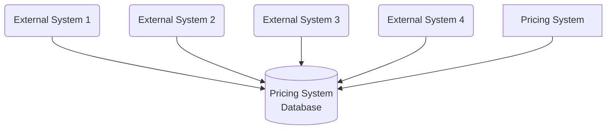

After:

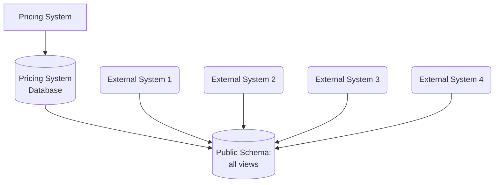

The ability of a view to project only limited information from the underlying
source allows us to implement a form of information hiding. It gives us control
over what is shared, and what is hidden. This is not a perfect solution,
however - there are restrictions with this approach.

Depending on the nature of the database, you may have the option to create a
materialized view. With a materialized view, the view is precomputed —
typically, through the use of a cache. This means a read from a view doesn’t
need to generate a read on the underlying schema, which can improve
performance. The trade-off then is around how this pre-computed view is
updated; it may well mean you could be reading a “stale” set of data from the
view.

### Limitations

The view itself is read-only. This immediately limits their usefulness. In
addition, while this is a common feature for relational databases, and many of
the more mature NoSQL databases support views, not all do. Even if your
database engine does support views, there will likely be other limitations,
such as the need for both the source schema and view to be in the same database
engine. This could increase your physical deployment coupling, leading to a
potential single point of failure.

### Ownership

Any published database views should be considered akin to any other service
interface, and therefore something that should be kept up-to-date by the team
looking after the source schema.

### Pattern: Database View - Where to Use It

- Where it is impractical to decompose the existing monolithic schema.
  - Ideally, you should try to avoid the need for a view if possible, if the
    end goal is to expose this information via a service interface.
- Instead, it’s better to push forward with proper schema decomposition.
- If you feel that the effort of full decomposition is too great, then this can
  be a step in the right direction.

## Pattern: Database Wrapping Service

With the ***database wrapping service pattern***: hide the database behind a
service that acts as a thin wrapper, moving database dependencies to become
service dependencies.

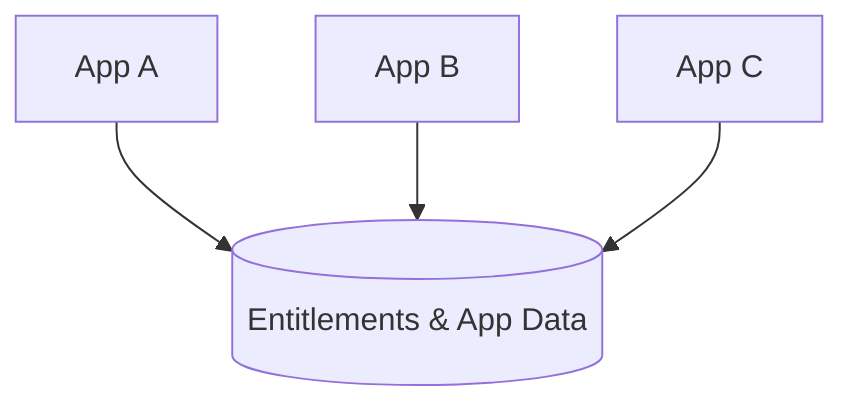

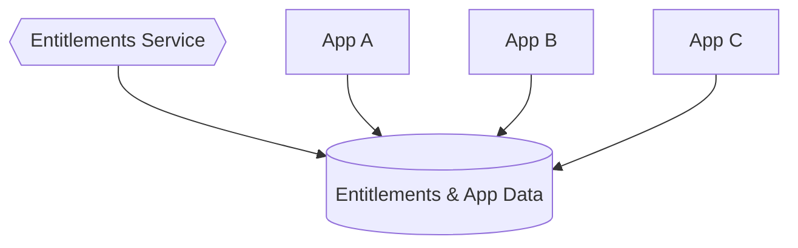

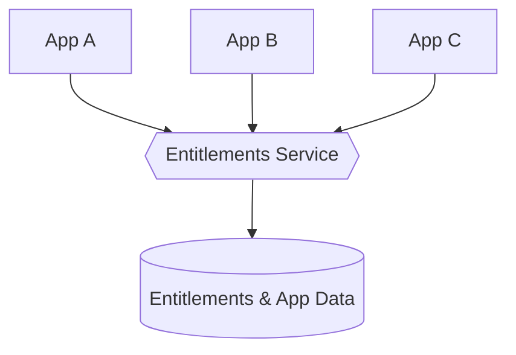

Just as with our use of database views, the use of a wrapping service allows us
to control what is shared and what is hidden. It presents an interface to
consumers that can be fixed, while changes are made under the hood to improve
the situation.

### Pattern: Database Wrapping Service - Where to Use It

This pattern works really well where the underlying schema is just too hard to
consider pulling apart. This approach also works best when you align ownership
of both the underlying schema and the service layer to the same team.

This pattern has advantages over the use of a simple database view. First, you
aren’t constrained to presenting a view that can be mapped to existing table
structures; you can write code in your wrapping service to present much more
sophisticated projections on the underlying data. The wrapping service can also
take writes (via API calls). Of course, adopting this pattern does require
upstream consumers to make changes; they have to shift from direct DB access to
API calls.

Ideally, using this pattern would be a stepping stone to more fundamental
changes, giving you time to break apart the schema underneath your API layer.

## Pattern: Database-as-a-Service Interface

Sometimes, clients just need a database to query. It could be because they need
to query or fetch large amounts of data, or perhaps because external parties
are already using tool chains that require a SQL endpoint to work against
(think about tools like Tableau, which are often used to gain insights into
business metrics). In these situations, allowing clients to view data that your
service manages in a database can make sense, but we should take care to
separate the database we expose from the database we use inside our service
boundary.

One approach that can work well is to create a dedicated database designed to be
exposed as a read-only endpoint, and have this database populated when the data
in the underlying database changes. In effect, in the same way that a service
could expose a stream of events as one endpoint, and a synchronous API as
another endpoint, it could also expose a database to external consumers.

- An example of this could be a service which exposes a read/write endpoint via
  an API, and a database as a read-only interface.

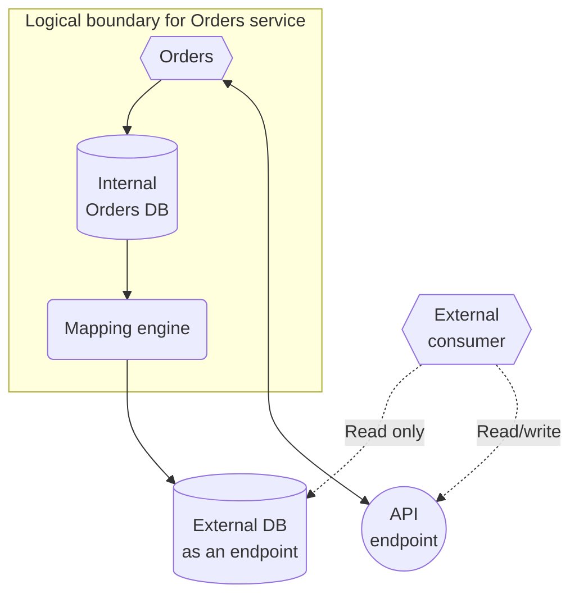

The mapping engine could ignore the changes entirely, expose the change
directly, or something in between. The key thing is that the mapping engine
acts as an abstraction layer between the internal and external databases. When
the internal database changes structure, the mapping engine will need to change
to ensure that the public-facing database remains consistent. In virtually all
cases, the mapping engine will lag behind writes made to the internal database;
typically, the choice of mapping engine implementation will determine this lag.
Clients reading from the exposed database need to understand that they are
therefore seeing potentially stale data, and you may find it appropriate to
programmatically expose information regarding when the external database was
last updated.

### Reporting Database Pattern

Martin Fowler has already documented this under the
***reporting database pattern***. Although reporting is a common application of
this pattern, it’s not the only reason people use this technique. The ability
to allow clients to define ad hoc queries has broader scope than traditional
batch-oriented workflows. So although this pattern is probably most widely used
to support these reporting use cases, a different name can better reflect the
fact that it may have wider applicability.

### Implementing a Mapping Engine

A change data capture system would be an excellent choice here. In fact, that
is likely to be the most robust solution while also providing the most
up-to-date view. Another option would be to have a batch process just copy the
data over, although this can be problematic as it is likely to lead to a longer
lag between internal and external databases, and determining which data
needs to be copied over can be difficult with some schemas. A third option
could be to listen to events fired from the service in question, and use that
to update the external database.

Nowadays, it is preferred to utilize a dedicated change data capture system,
perhaps something like Debezium. Batch processes has drawbacks like not running
or taking too long to run. With the world moving away from batch jobs, and
wanting data faster, batch is giving way to real time.

### Compared to Views

Database views are typically tied to a particular technology stack: if I want
to present a view of an Oracle database, both the underlying database and the
schema hosting the views both run on Oracle. With this approach, the database
we expose can be a totally different technology stack. We could use Cassandra
inside our service, but present a traditional SQL database as a public-facing
endpoint.

This pattern gives more flexibility than database views, but at an added cost.
You could start with the use of a database view and consider a shift to a
dedicated reporting database later on.

### Pattern: Database-as-a-Service Interface - Where to Use It

This is useful only for clients who need read-only access. It fits reporting
use cases very well — situations where your clients may need to join across
large amounts of data that a given service holds. This idea could be extended
to then import this database’s data into a larger data warehouse, allowing for
data from multiple services to be queried.

Don’t underestimate the work required to ensure that this external database
projection is kept properly up-to-date.

## Transferring Ownership

If we embrace the idea of a microservice encapsulating the logic associated
with one or more aggregates, we also need to move the management of their state
and associated data into the microservice’s own schema. On the other hand, if
our new microservice needs to interact with an aggregate that is still owned by
the monolith, we need to expose this capability via a well-defined interface.

### Pattern: Aggregate Exposing Monolith

By exposing information about our `Employees` via a service endpoint (it could
be an API or a stream of events) on the monolith itself, we make explicit what
information the `Invoice` service needs.

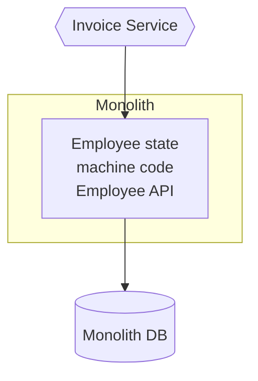

The monolith still “owns” the concept of what is and isn’t an allowable change
in state; we don’t want to treat it just like a wrapper around a database.

Beyond just exposing data, we’re exposing operations that allow external
parties to query the current state of an aggregate, and to make requests for
new state transitions. We can still decide to restrict what state of an
aggregate is exposed from our service boundary and to limit what state
transition operations can be requested from the outside.

#### As a pathway to more services

By defining the needs of the Invoice service, and explicitly exposing the
information needed in a well-defined interface, we’re on a path to potentially
discovering future service boundaries.

#### Pattern: Aggregate Exposing Monolith - Where to use it

When the data you want to access is still “owned” by the database, this pattern
works well to allow your new services the access they need. When extracting
services, having the new service call back to the monolith to access the data
it needs is likely little more work than directly accessing the database of the
monolith — but in the long term is a much better idea. I’d consider using a
database view over this approach ***only if*** the monolith in question cannot
be changed to expose these new endpoints. In such cases, a database view on the
monolith’s database could work, as could the change data capture pattern, or
creating a dedicated database wrapping service pattern on top of the monolith’s
schema.

### Pattern: Change Data Ownership

- Before: Invoice Service accesses data in the monolith's database
- After: Invoice data migrated into the service: the monolith now needs to
  access this data via the Invoice service's endpoint

We may have to consider the impact of breaking foreign-key constraints,
breaking transactional boundaries, and more. If the monolith can be changed
such that it needs only read access to Invoice-related data, you could consider
projecting a view from the Invoice service’s database. All the limitations of
database views will apply, however; changing the monolith to make calls to the
new Invoice service directly is greatly preferred.

## Data Synchronization

The problem occurs when the service in question manages data that will
need to be kept in sync between both the monolith and the new service.

To maintain the ability to switch between implementations, we need to ensure
that both sets of code can see the same data, and that this data can be
maintained in a consistent way.

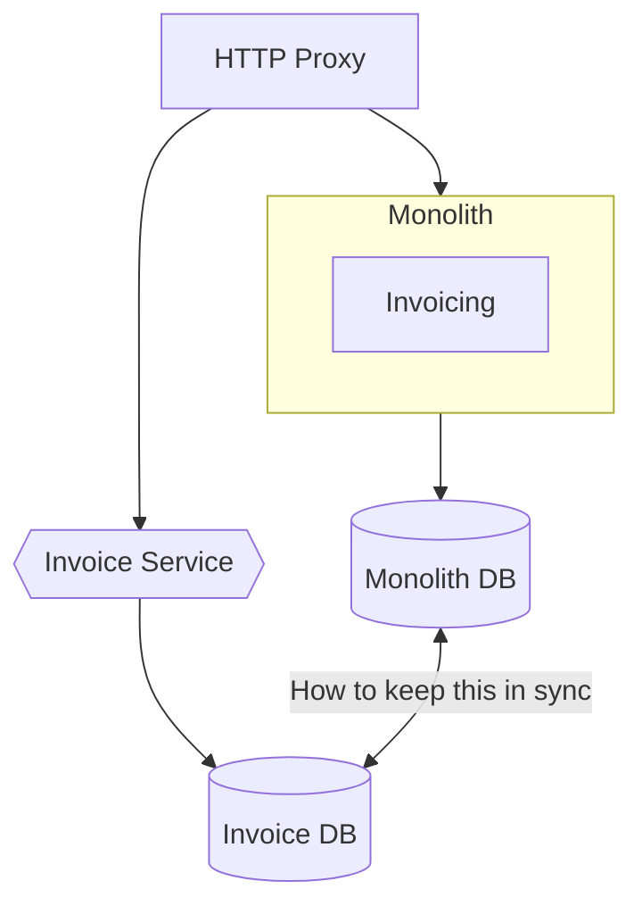

If either set of code needs to always see a totally consistent view of invoice
data, one of the most straightforward approaches would be to ensure the data is
kept in one place. This would lead us toward probably having our new Invoice
service read its data directly from the monolith for a short space of time,
perhaps making use of a view. Once we are happy that the switch has been
successful, we can then migrate the data. However, the concerns about using a
shared database cannot be overstated: you should consider this only as a very
short-term measure, as part of a more complete extraction; leaving a shared
database in place for too long can lead to significant long-term pain.

If we were doing a big-bang switchover (something I’d try to avoid), migrating
both the application code and the data at the same time, we could use a batch
process to copy the data over in advance of switching to the new microservice.
Once the invoice-related data has been copied over into our new microservice,
it can start serving traffic. However, what happens if we need to fall back to
using the functionality in the existing monolithic system? Data changed in the
microservices’ schema will not be reflected in the state of the monolithic
database, so we could end up losing state.

Another approach could be to consider keeping the two databases in sync via our
code. So we would have either the monolith or the new Invoice service make
writes to both databases.

## Pattern: Synchronize Data in Application

- e.g. The application itself would perform the synchronization between the two
  data sources. The idea is that initially the existing MySQL database would
  remain the source of truth, but for a period of time the application would
  ensure that data in MySQL and Riak were kept in sync. After a period of time,
  Riak would move to being the source of truth for the application, prior to
  MySQL being retired.

### Step 1: Bulk Synchronize Data

The first step is to get to the point where you have a copy of the data in the
new database. This involved doing a batch migration of data from the old system
into the new database. While the batch import was going on, the existing system
was kept running, so the source of data for the import was a snapshot of data
taken from the existing MySQL system. This causes a challenge, as when the
batch import finishes, the data in the source system could well have changed.
In this case, however, it wasn’t practical to take the source system off‐line.

*1. Prime the new DB with an initial import*.

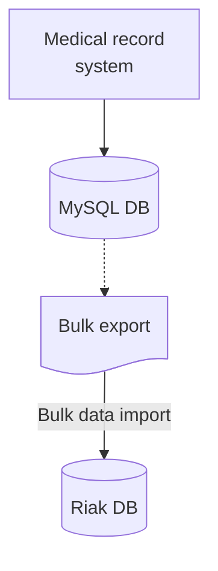

*2. Synchronize new writes to the MySQL DB to the new DB*.

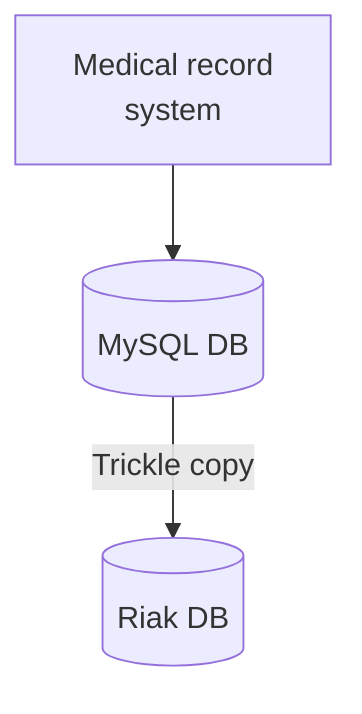

Once the batch import completed, a change data capture process was implemented
whereby changes since the import could be applied. This allowed Riak to be
brought in sync. Once this was achieved, it was time to deploy the new version
of the application.

### Step 2: Synchronize on Write, Read from Old Schema

With both databases now in sync, a new version of the application was deployed
that would write all data to both databases. At this stage, the goal was to
ensure that the application was correctly writing to both sources and make sure
that Riak was behaving within acceptable tolerances. By still reading all data
from MySQL, this ensured that even if Riak fell over in a heap, data could
still be retrieved from the existing MySQL database.

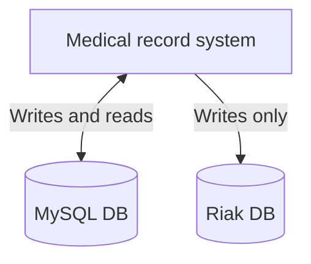

### Step 3: Synchronize on Write, Read from New Schema

A simple change to the application now has Riak as being the source of truth.
Note that we still write to both databases, so if there is an issue, you have a
fallback option.

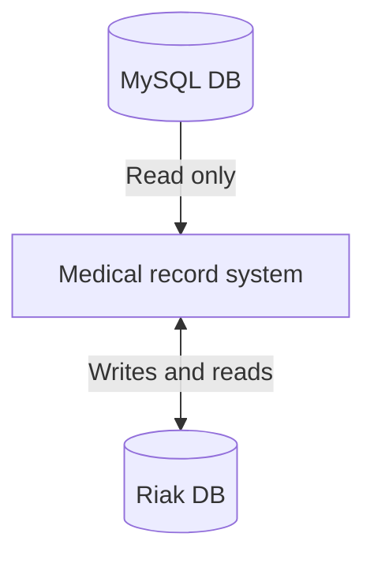

Once the new system has bedded in enough, the old schema could be safely
removed.

### Where to Use This Pattern

This pattern may make a lot of sense if you want to split the schema before
splitting out the application code.

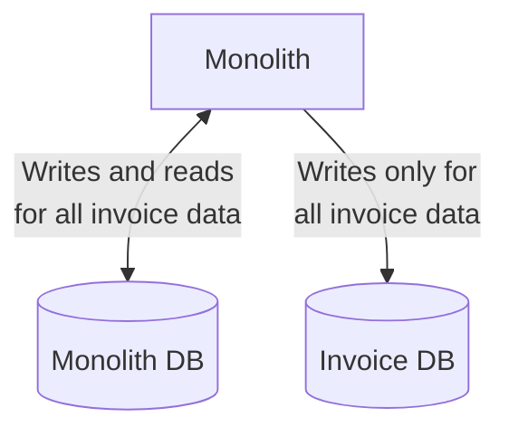

*Example of a monolith keeping two schemas in sync*.

### Pattern: Synchronize Data in Application - Where to Use It

Now you could consider using this pattern where you have both your monolith and
microservice accessing the data, but this gets extremely complicated. Both the
monolith and microservice have to ensure proper synchronization across the
databases for this pattern to work. If either one makes a mistake, you could be
in trouble. This complexity is greatly mitigated if you can be sure that at any
point in time either the Invoice service is making writes, or the monolith’s
Invoice functionality is — which would work well if using a simple switchover
technique. If, however, requests could hit either the monolith’s Invoice
functionality or the new Invoice functionality, perhaps as part of a canary,
then you may not want to use this pattern, as the resulting synchronization
will be tricky.

## Pattern: Tracer Write

With a tracer write, we move the source of truth for data in an incremental
fashion, tolerating there being two sources of truth during the migration. You
identify a new service that will host the relocated data. The current system
still maintains a record of this data locally, but when making changes also
ensures this data is written to the new service via its service interface.
Existing code can be changed to start accessing the new service, and once all
functionality is using the new service as the source of truth, the old source
of truth can be retired. Careful consideration needs to be given regarding how
data is synchronized between the two sources of truth.

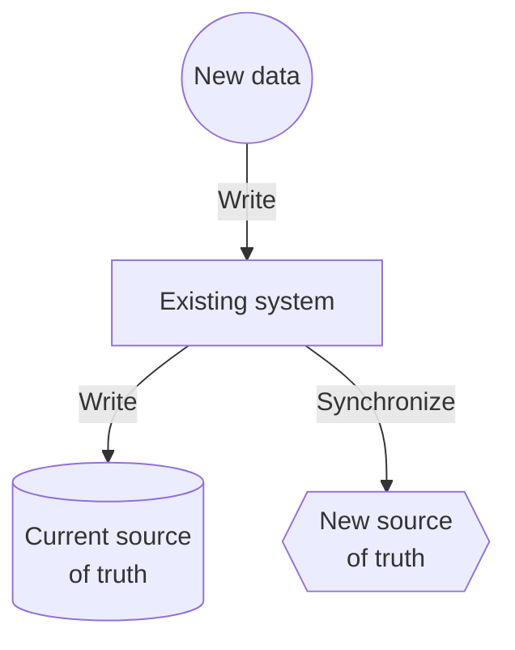

The problem is that if we insist on only ever having one source of truth for a
piece of data, then we are forced into a situation that changing where this
data lives becomes a single big switchover. Before the release, the monolith is
the source of truth. After the release, our new microservice is the source of
truth. A pattern like the ***tracer write*** allows for a phased switchover,
reducing the impact of each release, in exchange for being more tolerant of
having more than one source of truth.

The reason this pattern is called a tracer write is that you can start with a
small set of data being synchronized and increase this over time, while also
increasing the number of consumers of the new source of data.

- e.g. invoice-related data was being moved from the monolith over to the new
  Invoice microservice, we could first synchronize the basic invoice data, then
  migrate the contact information for the invoice, and finally synchronize
  payment records.

Other services that wanted invoice-related information would have a choice to
source this from either the monolith or the new service itself, depending on
what information they need. If they still needed information available only in
the monolith, they would have to wait until that data and the supporting
functionality was moved. Once the data and functionality are available in the
new microservice, the consumers can switch to the new source of truth.

As more data is synchronized, the monolith can use the new service as a source
of truth for more and more of the data. Once all the data is synchronized, and
the last consumer of the old source of truth has been switched over, we can
stop synchronizing the data.

### Pattern: Tracer Write - Data Synchronization

The biggest problem that needs to be addressed with the tracer write pattern is
the issue that plagues any situation where data is duplicated-inconsistency. To
resolve this, you have a few options:

- ***Write to one source***: All writes are sent to one of the sources of
  truth. Data is synchronized to the other source of truth after the write
  occurs.
- ***Send writes to both sources***: All write requests made by upstream
  clients are sent to both sources of truth. This occurs by making sure the
  client makes a call to each source of truth itself, or by relying on an
  intermediary to broadcast the request to each downstream service.
- ***Seed writes to either source***: Clients can send write requests to either
  source of truth, and behind the scenes the data is synchronized in a two-way
  fashion between the systems.

The two separate options of sending writes to both sources of truth, or sending
to one source of truth and relying on some form of background synchronization,
seem like workable solutions. However, although it’s technically an option,
this situation — where writes are made to either one source of truth or the
other — ***should be avoided***, as it requires two-way synchronization
(something that can be very difficult to achieve).

In all of these cases, there will be some delay in the data being consistent in
both sources of truth. The duration of this window of inconsistency will depend
on several factors. If you are constantly streaming updates from one system to
another, perhaps using a change data capture system, the windows of
inconsistency could be measured in seconds or less.

However long this window of inconsistency is, such synchronization gives us
what is called eventual consistency — eventually, both sources of truth will
have the same data. You will have to understand what period of inconsistency is
appropriate in your case, and use that to drive how you implement the
synchronization.

⚠️ It’s important that when maintaining two sources of truth like this that you
have some kind of reconciliation process to ensure that the synchronization is
working as intended. This may be something as simple as a couple of SQL queries
you can run against each database. But without checking that the
synchronization is working as expected, you may end up with inconsistencies
between the two systems and not realize it until it is too late. Running your
new source of truth for a period of time when it has no consumers until you are
satisfied with how things are working is very sensible.

### Example: Orders at Square

In the initial system, a single Order concept was used to manage multiple
workflows: one for customers ordering food, another for the restaurant
preparing the food, and a third workflow-managed state related to delivery
drivers picking up the food and dropping it off to customers. The needs of the
three stakeholders are different, and although all these stakeholders work with
the same Order, what that Order means to each of them is different. For the
customer, it’s something they have chosen to be delivered, and something they
need to pay for. For a restaurant it’s something that needs to be cooked and
picked up. And for the delivery driver, it’s something that needs to be taken
from the restaurant to the customer in a timely manner. Despite these different
needs, the code and associated data for the order was all bound together.

Having all these workflows bundled into this single Order concept was the
source of a great degree of delivery contention — different developers trying
to make changes for different use cases would get in each other’s way, as they
all needed to make changes in the same part of the codebase.

#### Creating the new service

The first step was to create a new Fulfillments service, which would manage the
Order data associated with restaurant and delivery drivers. This service would
become the new source of truth going forward for this subset of the Order data.
Initially, this service just exposed functionality to allow for
Fulfillments-related entities to be created. Once the new service was live, the
company had a background worker copy the Fulfillments-related data from the
existing system to the new Fulfillments service. This background worker just
made use of an API exposed by the Fulfillments service rather than doing a
direct insertion into the database, avoiding the need for direct database
access.

#### Synchronizing the data

Changes made to the existing system resulted in the fulfillment-related data
being written to the new Fulfillments service via its API. Square resolved this
by ensuring that all updates were made to both systems. Not all updates needed
to be made to both systems, however. Now that the Fulfillments service
represented only a subset of the Order concept, only changes made to the order
that delivery or restaurant clients cared about needed to be copied.

Any code that changed restaurant- or delivery-oriented information needed to be
changed to make two sets of API calls — one to the existing system, the other
to the same microservice. These upstream clients would also need to handle any
error conditions if the write to one worked but the other failed. These changes
to the two downstream systems were not done in an atomic fashion. This means
there could be a brief window in which a change would be visible in one system,
but not yet the other. Until both changes have been applied, you can see an
inconsistency between the two systems; this is a form of eventual consistency.

In terms of the eventual consistent nature of the Order information, this wasn’t
a problem for this particular use case. Data was synchronized quickly enough
between the two systems that it didn’t impact the users of the system.

If Square had been using an event-driven system for managing Order updates,
rather than making use of API calls, they could have considered an alternative
implementation. Both the existing system and the new Fulfillments service
receive the same messages. Upstream clients don’t need to know that there are
multiple consumers for these messages; this is something that could be handled
through the use of a pub-sub style broker.

If you are already making use of an event-based system, you may have an easier
time managing the synchronization process. It’s also worth noting that such an
architecture would still exhibit eventually consistent behavior, as you cannot
guarantee that both the existing system and Fulfillments service would process
the same event at the same time.

#### Migrating consumers

With the new Fulfillments service now holding all the required information for
the restaurant and delivery driver workflows, code that managed those workflows
could start switching over to use the new service. During this migration, more
functionality can be added to support these consumers’ needs; initially, the
Fulfillments service needed only to implement an API that enabled creation of
new records for the background worker. As new consumers migrate, their needs
can be assessed and new functionality can be added to the service to support
them.

### Pattern: Tracer Write - Where to Use It

Implementation of the synchronization is likely to be where most of the work
lies. If you can avoid the need for two-way synchronization, and instead use
some of the simpler options outlined here, you’ll likely find this pattern much
easier to implement. If you are already making use of an event-driven system,
or have a change data capture pipeline available, then you probably already
have a lot of the building blocks available to you to get the synchronization
working.

The shorter the window of acceptable inconsistency, the more difficult this
pattern will be to implement.

## Splitting Apart the Database

### Physical Versus Logical Database Separation

Logical decomposition allows for simpler independent change and information
hiding, whereas physical decomposition potentially improves system robustness,
and could help remove resource contention allowing for improved throughput or
latency.

Another consideration is that having multiple schemas sharing the same database
engine may be required if you want to expose views of your database. Both the
source database and the schemas hosting the views may need to be located on the
same database engine.

## Splitting the Database First, or the Code?

Extracting a microservice isn’t “done” until the application code is running in
its own service, and the data it controls is extracted into its own logically
isolated database. We have a few options:

- Split the database first, then the code.
- Split the code first, then the database.
- Split them both at once.

### Split the Database First

With a separate schema, we’ll be potentially increasing the number of database
calls to perform a single action. Whereas before we might have been able to
have all the data we wanted in a single `SELECT` statement, now we may need to
pull the data back from two locations and join in memory. Also, we end up
breaking transactional integrity when we move to two schemas, which could have
significant impact on our applications. By splitting the schemas out but
keeping the application code together, we give ourselves the ability to revert
our changes or continue to tweak things without impacting any consumers of our
service if we realize we’re heading down the wrong path. Once we are satisfied
that the DB separation makes sense, we could then think about splitting out the
application code into two services.

The flip side is that this approach is unlikely to yield much short-term
benefit. We still have a monolithic code deployment. Arguably, the pain of a
shared database is something you feel over time, so we’re spending time and
effort now to give us return in the long run, without getting enough of the
short-term benefit. For this reason, You would likely go this route only if
concerne about the potential performance or data consistency issues.

#### A Note on Tooling

#### Pattern: Repository per bounded context

A common practice is to have a repository layer, backed by some sort of
framework like Hibernate (ORM), to bind your code to the database, making it
easy to map objects or data structures to and from the database. Rather than
having a single repository layer for all data access concerns, there is value
in breaking down these repositories along the lines of bounded contexts.

Having the database mapping code colocated inside the code for a given context
can help us understand what parts of the database are used by what bits of
code. This can help us greatly understand what tables need to move as part of
any future decomposition.

A great place to start is to use a tool like the freely available SchemaSpy,
which can generate graphical representations of the relationships between
tables.

#### Pattern: Database per bounded context

Each bounded context had its own, totally separate databases. The idea was that
if there was a need to separate them into microservices later, this would be
much easier.

Keep schema separation where you think you may have service separation in the
future. That way, you get some of the benefits of decoupling these ideas, while
reducing the complexity of the system.

### Split the Code First

By splitting out the application tier, it becomes much easier to understand
what data is needed by the new service. You also get the benefit of having an
independently deployable code artifact earlier. The concerns with this approach
is that teams may get this far and then stop, leaving a shared database in play
on an ongoing basis. If this is the direction you take, you have to understand
that you’re storing up trouble for the future if you don’t complete the
separation into the data tier. The other potential challenge here is that you
may be delaying finding out nasty surprises caused by pushing join operations
up into the application tier.

If this is the direction you take, be honest with yourself: are you confident
that you will be able to make sure that any data owned by the microservice gets
split out as part of the next step?

#### Pattern: Monolith as data access layer

Rather than accessing the data from the monolith directly, we can just move to
a model in which we create an API in the monolith itself. Part of the reason
this isn’t used more widely is likely because people sort of have in their
minds the idea that the monolith is dead, and of no use. But the upsides here
are obvious: we don’t have to tackle data decomposition (yet) but get to hide
information, making it easier to keep our new service isolated from the
monolith.

It’s not too hard to see this pattern as a way of identifying other candidate
services. Extending this idea, we could see the Employee API splitting out from
the monolith to become a microservice in its own right.

This pattern works best when the code managing this data is still in the
monolith. As we talked about previously, one way to think of a microservice
when it comes to data is the encapsulation of the state and the code that
manages the transitions of that state. So if the state transitions of this data
are still provided in the monolith, it follows that the microservice that wants
to access (or change) that state needs to go via the state transitions in the
monolith.

If the data you’re trying to access in the monolith’s database should really be
“owned” by the microservice instead, I’m more inclined to suggest skipping this
pattern and instead looking to split the data out.

#### Pattern: Multischema storage
