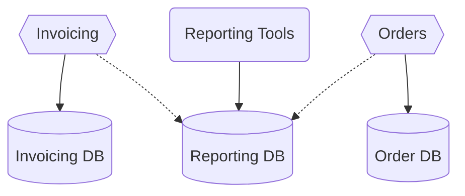
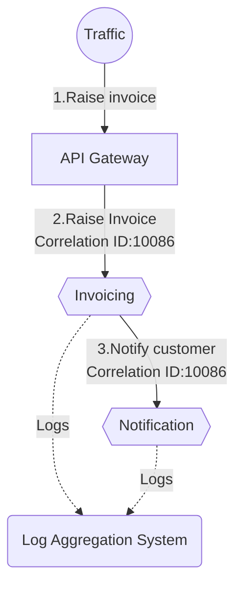

# CHAPTER 5: Growing Pains

- [CHAPTER 5: Growing Pains](#chapter-5-growing-pains)
  - [More Services, More Pain](#more-services-more-pain)
  - [Ownership at Scale](#ownership-at-scale)
    - [Ownership at Scale - How Can This Problem Show Itself?](#ownership-at-scale---how-can-this-problem-show-itself)
    - [Ownership at Scale - When Might This Problem Occur?](#ownership-at-scale---when-might-this-problem-occur)
    - [Ownership at Scale - Potential Solutions](#ownership-at-scale---potential-solutions)
  - [Breaking Changes](#breaking-changes)
    - [Breaking Changes - How Can This Problem Show Itself?](#breaking-changes---how-can-this-problem-show-itself)
    - [Breaking Changes - When Might This Problem Occur?](#breaking-changes---when-might-this-problem-occur)
    - [Breaking Changes - Potential Solutions](#breaking-changes---potential-solutions)
      - [Eliminate accidental breaking changes](#eliminate-accidental-breaking-changes)
      - [Think twice before making a breaking change](#think-twice-before-making-a-breaking-change)
      - [Give consumers time to migrate](#give-consumers-time-to-migrate)
  - [Reporting](#reporting)
    - [Reporting - When Might This Problem Occur?](#reporting---when-might-this-problem-occur)
    - [Reporting - Potential Solutions](#reporting---potential-solutions)
  - [Monitoring and Troubleshooting](#monitoring-and-troubleshooting)
    - [Monitoring and Troubleshooting - When Might These Problems Occur?](#monitoring-and-troubleshooting---when-might-these-problems-occur)
    - [Monitoring and Troubleshooting - How Can These Problems Occur?](#monitoring-and-troubleshooting---how-can-these-problems-occur)
    - [Monitoring and Troubleshooting - Potential Solutions](#monitoring-and-troubleshooting---potential-solutions)
      - [Log aggregation](#log-aggregation)
      - [Tracing](#tracing)
      - [Test in production](#test-in-production)
      - [Toward observability](#toward-observability)
  - [Local Developer Experience](#local-developer-experience)
    - [Local Developer Experience - How Can This Problem Show Itself?](#local-developer-experience---how-can-this-problem-show-itself)
    - [Local Developer Experience - When Might This Occur?](#local-developer-experience---when-might-this-occur)
    - [Local Developer Experience - Potential Solutions](#local-developer-experience---potential-solutions)
  - [Running Too Many Things](#running-too-many-things)
    - [Running Too Many Things - How Might This Problem Show Itself?](#running-too-many-things---how-might-this-problem-show-itself)
    - [Running Too Many Things - When Might This Problem Occur?](#running-too-many-things---when-might-this-problem-occur)
    - [Running Too Many Things - Potential Solutions](#running-too-many-things---potential-solutions)
  - [End-to-End Testing](#end-to-end-testing)
    - [End-to-End Testing - How Can This Problem Show Itself?](#end-to-end-testing---how-can-this-problem-show-itself)
    - [End-to-End Testing - When Might This Problem Occur?](#end-to-end-testing---when-might-this-problem-occur)
    - [End-to-End Testing - Potential Solutions](#end-to-end-testing---potential-solutions)
      - [Limit scope of functional automated tests](#limit-scope-of-functional-automated-tests)
      - [Use consumer-driven contracts](#use-consumer-driven-contracts)
      - [Use automated release remediation and progressive delivery](#use-automated-release-remediation-and-progressive-delivery)
      - [Continually refine your quality feedback cycles](#continually-refine-your-quality-feedback-cycles)
  - [Global Versus Local Optimization](#global-versus-local-optimization)
    - [Global Versus Local Optimization - How Can This Problem Show Itself?](#global-versus-local-optimization---how-can-this-problem-show-itself)
    - [Global Versus Local Optimization - When Might This Problem Occur?](#global-versus-local-optimization---when-might-this-problem-occur)
    - [Global Versus Local Optimization - Potential Solutions](#global-versus-local-optimization---potential-solutions)
  - [Robustness and Resiliency](#robustness-and-resiliency)
    - [Robustness and Resiliency - How Can This Problem Show Itself?](#robustness-and-resiliency---how-can-this-problem-show-itself)
    - [Robustness and Resiliency - When Might This Problem Occur?](#robustness-and-resiliency---when-might-this-problem-occur)
    - [Robustness and Resiliency - Potential Solutions](#robustness-and-resiliency---potential-solutions)
  - [Orphaned Services](#orphaned-services)
    - [Orphaned Services - How Can This Problem Show Itself?](#orphaned-services---how-can-this-problem-show-itself)
    - [Orphaned Services - When Might This Problem Occur?](#orphaned-services---when-might-this-problem-occur)
    - [Orphaned Services - Potential Solutions](#orphaned-services---potential-solutions)
  - [Summary](#summary)

## More Services, More Pain

The complexity of service interactions, size of the organization, number of
services, technology choices, latency, and uptime requirements are just a
subset of the forces that can bring forth pain, suffering, excitement, and
stress.

The number of services seems to be as good a measure as any for indicating when
certain issues are most likely to manifest themselves.

One factor in particular that may change when these issues will strike is how
coupled your architecture ends up being. With a more coupled architecture,
issues around robustness, testing, tracing, and the like may manifest
themselves earlier.

## Ownership at Scale

Here, primarily we’re looking at ownership from a point of view of making code
changes, not ownership in terms of who handles deployments, first-line support,
and so on.

- ***Strong code ownership***: All services have owners. If someone outside
  that ownership group wants to make a change, they have to submit that change
  to the owners, who decide whether it is allowed.
- ***Weak code ownership***: Most, if not all, services are owned by someone,
  but anyone can still directly change their modules without resorting to the
  need for things like pull requests. Effectively, source control is set up to
  still allow anyone to change anything, but there is the expectation that if
  you change someone else’s service, you’ll speak to them first.
- ***Collective code ownership***: No one owns anything, and anyone can change
  anything they want.

### Ownership at Scale - How Can This Problem Show Itself?

For collective ownership to work, the collective needs to be well-connected
enough to have a common shared understanding of what a good change looks like,
and in which direction you want to take a specific service from a technical
point of view.

### Ownership at Scale - When Might This Problem Occur?

For teams experiencing fast growth, a collective ownership model is
problematic. The issue is that for collective ownership to work, you need time
and space for the consensus to emerge, and be updated as new things are
learned.

### Ownership at Scale - Potential Solutions

Strong code ownership is almost universally the model adopted by organizations
implementing large-scale microservice architectures consisting of multiple
teams and over 100 developers. It becomes easier for the rules of what
constitutes a good change to be decided by each team; you can view each team as
adopting collective code ownership locally.

## Breaking Changes

### Breaking Changes - How Can This Problem Show Itself?

If you start seeing people try to orchestrate simultaneous deployments of
multiple services together (sometimes called a lock-step release). This could
also be a sign that this is happening due to trying to manage contract changes
between client and server.

### Breaking Changes - When Might This Problem Occur?

Over time, as teams become more mature, they get more diligent about making
changes to avoid breakages in the first place, and also put mechanisms in place
to catch problems early.

### Breaking Changes - Potential Solutions

Rules for managing breaking contracts:

1. Eliminate accidental breaking changes.
2. Think twice before making a breaking change — can you possibly avoid it?
3. If you need to make a breaking change, give your consumers time to migrate.

#### Eliminate accidental breaking changes

Having an explicit schema for your microservice can quickly detect structural
breakages in your contract. Making this schema explicit to developers can help
with early detection of this sort of thing; if they have to go in and make a
change to the schema by hand, that becomes an explicit step that will hopefully
cause them to pause for a moment and think about a change. If you have a formal
schema format, there is the option to handle this programmatically too (e.g.
`protolock`).

The default choice for many people is to use schema-less interchange formats,
with JSON being the most common example. Although theoretically you can define
explicit schemas for JSON, these aren’t used in practice.

You also have semantic breakages to consider. In practice, testing is one of
the best ways of detecting this.

💡 Make it as obvious to developers as possible when they make changes to the
external contract. Making it hard to change a service contract is better than
constantly breaking consumers.

#### Think twice before making a breaking change

If possible, prefer expansion changes to your contract if you can.

Remember, if you decide to break a contract, it’s on you to handle the
implications of that.

#### Give consumers time to migrate

The first option is to run two versions of your microservice: two builds of the
`Notifications` service are available at the same time, each one exposing
different incompatible endpoints that consumers can choose between. The primary
challenges with this approach are that you have to have more infrastructure to
run the extra services, you probably have to maintain data compatibility
between the service versions, and bug fixes may need to be made to all running
versions, which inevitably requires source code branching. These issues are
somewhat mitigated if you are only coexisting the two versions for short
periods of time, which is the only situation where this approach should be
considered.

The second option, which is more preferred, is to have one running version of
your microservice, but have it support both contracts. This could involve
exposing two APIs on different ports, for example. This pushes complexity into
your microservices implementation, but avoids the challenges of the earlier
approach.

🔔 Treat consumers of your service like customers!

## Reporting

A monolithic database means that stakeholders who want to analyze all of the
data together, often involving large join operations across data, have a
ready-made schema against which to run their reports. A microservice
architecture made it much more difficult.

### Reporting - When Might This Problem Occur?

All too often, the needs for downstream reporting are not considered early
enough, as it happens outside the realm of normal software development and
system maintenance.

You may be able to sidestep this problem if your monolith already uses a
dedicated data source for reporting purposes, like a data warehouse or data
lake. Then all you need to ensure is that your microservices are able to copy
the appropriate data to the existing data sources.

### Reporting - Potential Solutions

For many situations, the stakeholders who care about having access to all your
data in one place probably also have an investment in a tool chain and
processes that expect direct access to the database, normally making use of
SQL. It also follows that their reporting is likely tied to the schema design
of your monolithic database.

The most straightforward approach for solving this problem is to first separate
the need for a single database to store data for reporting purposes, from the
databases your microservices use to store and retrieve data. This allows the
content and design of your reporting database to be decoupled from the design
and evolution of each service’s data storage requirements. This also allows for
this new reporting database to be changed with the specific requirements of
reporting users in mind. All you then need to do is to work out how your
microservices can “push” data into your new schema.

A change data capture system is an obvious potential solution for solving this,
but techniques like views can also be useful, as you may be able to project a
single reporting schema from views exposed from the schemas of multiple
microservice databases. You may also consider the use of other techniques, like
having the data copied to your reporting schema programmatically as part of the
code of your microservices, or perhaps having intermediary components that may
populate the reporting database by listening to events of upstream services.

## Monitoring and Troubleshooting

> We replaced our monolith with microservices so that every outage could be
> more like a murder mystery.
> —Honest Status Page (@honest_update), <http://bit.ly/2mldxqH>

With a microservice architecture, we can have the failure of just one service
instance, or just one type of instance to consider.

### Monitoring and Troubleshooting - When Might These Problems Occur?

You should prioritize implementing some basic improvements ahead of time.

### Monitoring and Troubleshooting - How Can These Problems Occur?

### Monitoring and Troubleshooting - Potential Solutions

#### Log aggregation

A ***log aggregation system*** will allow you to capture all your logs and
forward them to a central location where they can be searched, and in some
cases can even be used to generate alerts. Many options exist, from the open
source `ELK stack` (`Elastic search`, `Logstash/Fluent D`, and `Kibana`) to
`Humio`.

Log aggregation is one of the simplest mechanisms to implement, and it’s
something you should do early on. In fact, it’s the first thing you should do
when implementing a microservice architecture. This is partly because it’s so
useful right from the start. In addition, if your organization struggles to
implement a suitable log aggregation system, you might want to reconsider
whether you’re ready for microservices.

#### Tracing

As a starting point, generate correlation IDs for all calls coming into your
system. When the `Invoice` service receives a call, it is given a correlation
ID. When it dispatches a call to the `Notification` microservice, it passes
that correlation ID along — this could be done via an HTTP header, or a field
in a message payload, or some other mechanism. Typically, it needs an API
gateway or service mesh to generate the initial correlation ID.

When the `Notification` service handles the call, it can log information about
what it is doing in conjunction with that same correlation ID, allowing you to
use a log aggregation system to query for all logs associated with a given
correlation ID (assuming you put the correlation ID in a standard place in your
log format).

Taking this idea further, we can use tools to also trace the time taken for
calls. Due to the way log aggregation systems work, where logs are batched and
forwarded to a central agent on a regular basis, it isn’t possible to get
accurate information to allow you to determine exactly where time may be
getting spent during a chain of calls. Distributed tracing systems like the
open source `Jaeger` can help.

The more latency sensitive your application is, the sooner you would be looking
to implement a distributed tracing tool like Jaeger. The use of a service mesh
can also help, as it can at least handle inbound and outbound tracing for you,
even if it can’t do much about instrumenting calls inside individual
microservices.

#### Test in production

Even if a given feature worked once in production, a new service deployment or
environmental change could break that functionality later on.

By injecting fake user behavior into our system, in the form of what is often
called ***synthetic transactions***, we can define the behavior we expect, and
alert accordingly if this isn’t the case. You can consider use scripted
enrollment of fake customers. On a regular basis you can trigger a sign-up
process for one of these fake customers, which scripted the whole process end
to end. When this failed, it was often a sign that something was wrong in the
systems and it was much better catching this with a “fake” user than a real one!

A good starting point for testing in production could be to take existing
end-to-end test cases and rework them for use in a production environment. An
important consideration is to ensure that these “tests” don’t cause unforeseen
impact in production.

#### Toward observability

With traditional monitoring and alerting processes, we think about what might
go wrong, collect information to tell us when this is the case, and use this to
fire off alerts. So we are primarily setting ourselves up to handle known
causes of problems — disk space running out, a service instance not responding,
or perhaps a spike in latency.

## Local Developer Experience

### Local Developer Experience - How Can This Problem Show Itself?

More services have to be stood up.

### Local Developer Experience - When Might This Occur?

collective ownership of multiple services are more susceptible to this problem.
They are more likely to require the ability to switch between different
services during their development. Teams with strong ownership of a few
services will mostly focus only on their own services, and will be more likely
to develop mechanisms for stubbing out services that are outside their control.

### Local Developer Experience - Potential Solutions

If you want to develop locally but reduce the number of services that have to
be run, a common technique is to “stub out” those services that you don’t want
to run, or else have a way to point them against instances running elsewhere. A
pure remote developer setup allows for you to develop against lots of services
hosted on more capable infrastructure. However, with that comes associated
challenges of needing connectivity (which can be a problem for remote workers),
potentially having slower feedback cycles with the need to deploy software
remotely before you can see it working, and a potential explosion in resources
needed for developer environments.

You can develop your service locally, and tools like Telepresence can proxy
calls to other services to a remote cluster, allowing you the best of both
worlds.

> by myself:
> Local development can connect to remote services + local resources that the
> developing service owns.

## Running Too Many Things

***Desired state management*** is the ability for you to specify the number and
location of service instances that you require, and ensure that this is
maintained over time.

### Running Too Many Things - How Might This Problem Show Itself?

### Running Too Many Things - When Might This Problem Occur?

The more microservices you have, and the more instances you have of those
microservices, the more manual processes or more traditional automated
configuration management tools like `Chef` and `Puppet` no longer fit the bill.

### Running Too Many Things - Potential Solutions

For microservices, Kubernetes has emerged as the tool of choice in this space.
It requires that you containerize your services, but once you do, you can use
Kubernetes to manage the deployment of your service instances across multiple
machines, ensuring you can scale to improve robustness and handle load.

You can consider to adopt a packaged version of Kubernetes, such as `OpenShift`
from RedHat, which bundles Kubernetes with tooling that makes it easier to work
with within a corporate environment — perhaps handling corporate identity and
access management controls.

For teams who are already on the public cloud, serverless could be the
preferred choice because of the reduction in operational work, if serverless
products are available to you. If you’re already on the public cloud, you may
not always need the complexity of a container-based platform like Kubernetes.

💡 You might find that you need only five microservices, and that you can
happily handle this with your existing solutions. Don’t adopt a Kubernetes-based
platform just because you see everyone else doing it, which can also be said
for microservices!

## End-to-End Testing

The more functionality a test executes — the broader the scope of the test —
the more confidence you have in your application. On the other hand, the larger
the scope of the test, the longer it can take to run, and the harder it can be
to work out what is broken when it fails.

End-to-end tests for any type of system are at the extreme end of the scale in
terms of functionality they cover, and we are used to them being more
problematic to write and maintain than smaller-scoped unit tests.

But with a microservice architecture, the “scope” of our end-to-end tests gets
very large.

### End-to-End Testing - How Can This Problem Show Itself?

### End-to-End Testing - When Might This Problem Occur?

The more isolated each team is in its work, the easier it is for them to manage
their own tests locally. The more you need to test cross-team flows, the more
problematic end-to-end, large scoped tests become.

### End-to-End Testing - Potential Solutions

#### Limit scope of functional automated tests

If you are going to write test cases that cover multiple services, try to
ensure that these tests are kept inside the team that manages these services —
in other words, avoid larger-scoped tests that cross team boundaries. Keeping
ownership of tests within a single team makes it easier to understand what
scenarios are properly covered, ensures that developers can run and debug the
tests, and more clearly articulates responsibility for who should make sure the
tests run and pass.

#### Use consumer-driven contracts

You may want to consider the use of ***consumer-driven contracts*** (CDCs) to
replace the need for cross-service test cases. With CDCs, you have the consumer
of your microservice define their expectations of how your service should
behave in terms of an executable specification — a test. When you change your
service, you ensure that these tests still pass.

As these tests are defined from the consumer point of view, we get good
coverage for picking up accidental contract breakage. We can also understand
our consumer requirements from their point of view, and importantly understand
how different consumers might want different things from us.

#### Use automated release remediation and progressive delivery

An example of a ***progressive delivery*** technique could be a
***canary release***.

As a simple example, you might define an acceptable threshold for 95th
percentile latencies and error rates, and continue the rollout only if these
measures are met. Otherwise, you may automatically roll back the latest
release, giving you time to analyze what happened.

You may end up with a far more robust system by putting some work into catching
problems if they do occur, rather than just focusing on stopping problems from
happening in the first place.

Even manually controlling progressive delivery can be a big step up from just
rolling the new software out to everyone.

#### Continually refine your quality feedback cycles

You need people who have the context to look holistically across the
development process to adapt how and where you are testing your application.

## Global Versus Local Optimization

### Global Versus Local Optimization - How Can This Problem Show Itself?

The most common way is when someone suddenly realizes that multiple teams have
solved the same problem in different ways, but were never aware that they were
all trying to fix the same issue.

You can spot these problems much earlier if you have some sort of cross-team
technical group, such as a community of practice.

### Global Versus Local Optimization - When Might This Problem Occur?

If you practice collective ownership of services, that will likely help avoid
or at least limit these problems, as collective ownership of services requires
a degree of consistency in terms of how problems are solved. Put another way,
if you want collective ownership, you have to solve this problem; otherwise,
your collective ownership won’t scale.

### Global Versus Local Optimization - Potential Solutions

They’ll need a network where they can surface these issues and get involvement
from their colleagues in other teams.

As a simple mechanism, having at least one technical leader from each team
being part of a technical cross-cutting group where these concerns can be
addressed is a sensible approach.

Fundamentally, each organization needs to find the right balance between global
and local decision-making.

## Robustness and Resiliency

Network packets can get lost, network calls can time out, machines can die or
stop responding.

### Robustness and Resiliency - How Can This Problem Show Itself?

During traditional development and test cycles, we’re re-creating
production-like circumstances only for short periods of time. Those rare
occurrences are less likely to emerge, and when they do, they often get
dismissed.

### Robustness and Resiliency - When Might This Problem Occur?

I’ll be honest here—if I could tell you in advance when your system will suffer from
instability I wouldn’t be writing this book, as I’d likely be spending my time on a
beach somewhere drinking mojitos. All I can say is that as the number of services
increases, and the number of service calls increase, you’ll become more and more vul‐
nerable to resiliency issues. The more interconnected your services are, the more
likely you’ll suffer from things like cascading failures and back pressure.

### Robustness and Resiliency - Potential Solutions

- First, do I know the way in which this call might fail?
- Second, if the call does fail, do I know what I should do?

Isolating services more from each other can help, perhaps including the
introduction of asynchronous communication to avoid temporal coupling. Using
sensible time-outs can avoid resource contention with slow downstream services,
and in conjunction with patterns like circuit breakers, you can start failing
fast to avoid problems with back pressure.

Running multiple copies of services can help with instances dying, as can a
platform that can implement desired state management (which can ensure that
services get restarted if they crash).

Resiliency is more than just implementing a few patterns. It’s about a whole
way of working — building an organization that not only is ready to handle the
unforeseeable problems that will inevitably crop up, but also evolves working
practices as necessary.

## Orphaned Services

Fundamentally no one in the company is taking ownership or responsibility for
them.

### Orphaned Services - How Can This Problem Show Itself?

### Orphaned Services - When Might This Problem Occur?

### Orphaned Services - Potential Solutions

Organizations that practice collective ownership of services might be less
prone to this problem, primarily because they will already have to have
implemented mechanisms to allow developers to move from service to service and
make changes.

Creating simple in-house registries can help collate metadata around services.
Some of these registries simply crawl source code repositories, looking for
metadata files to build up a list of services out there. This information can
be merged with real data coming from service discovery systems like `consul` or
`etcd` to build up a richer picture of what is running, and who you could speak
to about it.

- ***System Operability Score***: The idea is that there are certain things
  that services and their teams should do to ensure the service can be
  easily operated. This can go from making sure the teams have provided the
  correct information in the registry to ensuring the services have proper
  health checks.

What happens if your orphaned service predates your registry? The key thing is
to bring these newly discovered “orphaned” services into line with how other
services are managed, and that requires you to either assign ownership to an
existing team (if practicing strong ownership), or raise work items for the
service to be improved (if practicing collective ownership).

## Summary

💡 What is more challenging is finding the right balance between fixing problems
before they occur versus spending time fixing problems you’ll never have.
