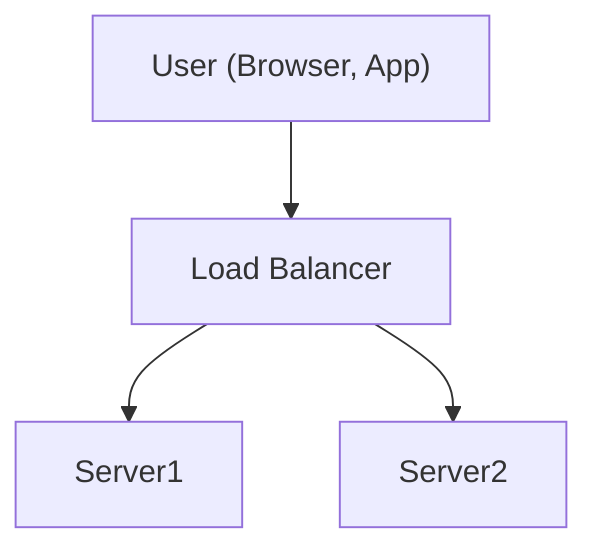
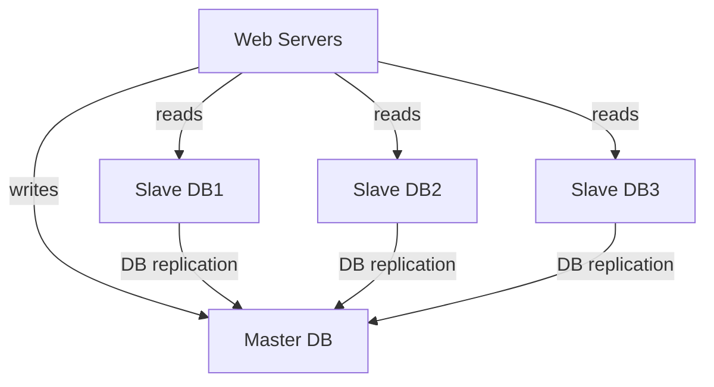
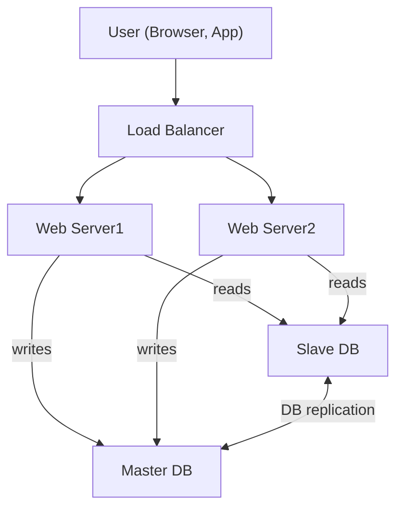
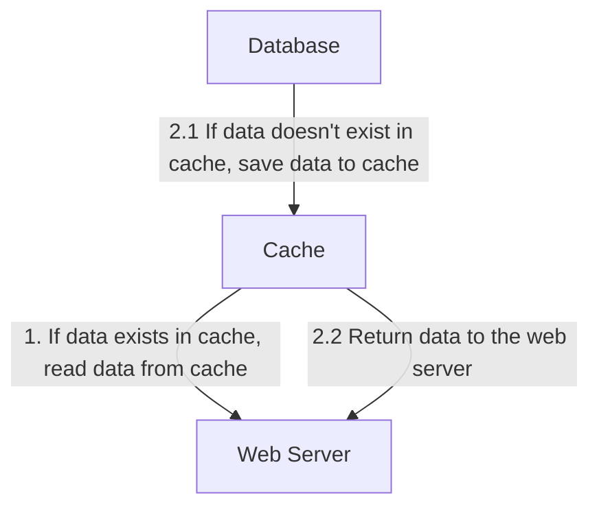
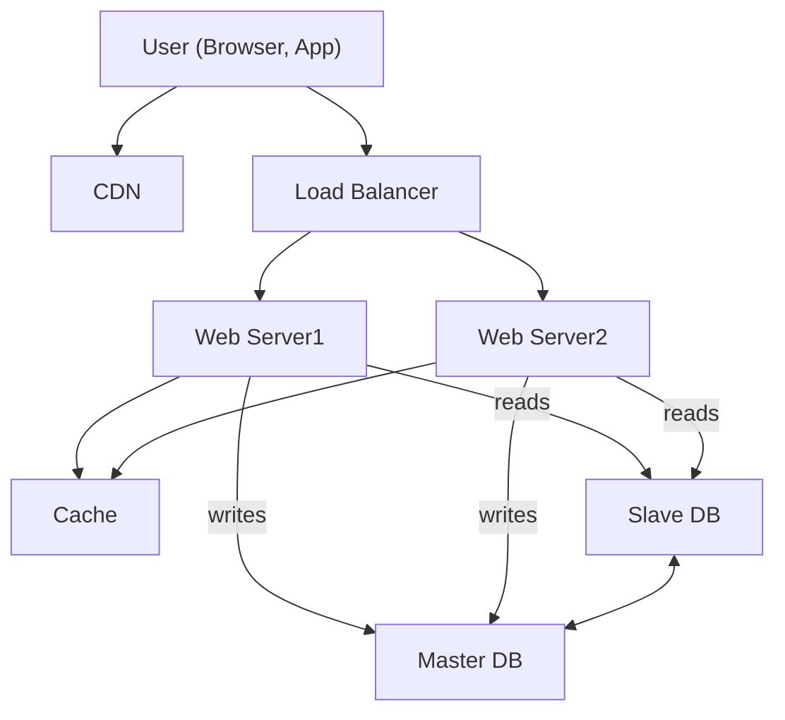
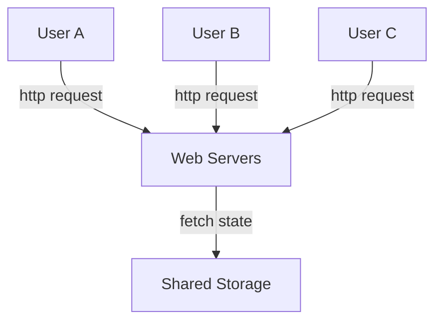
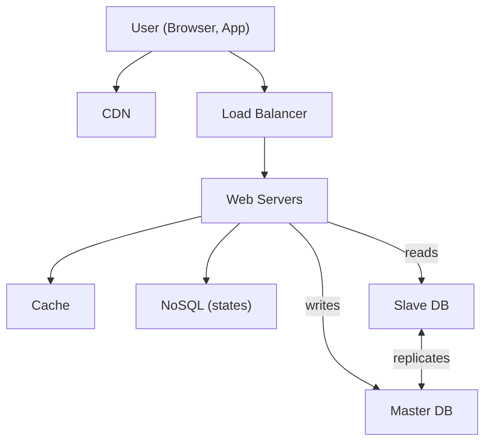
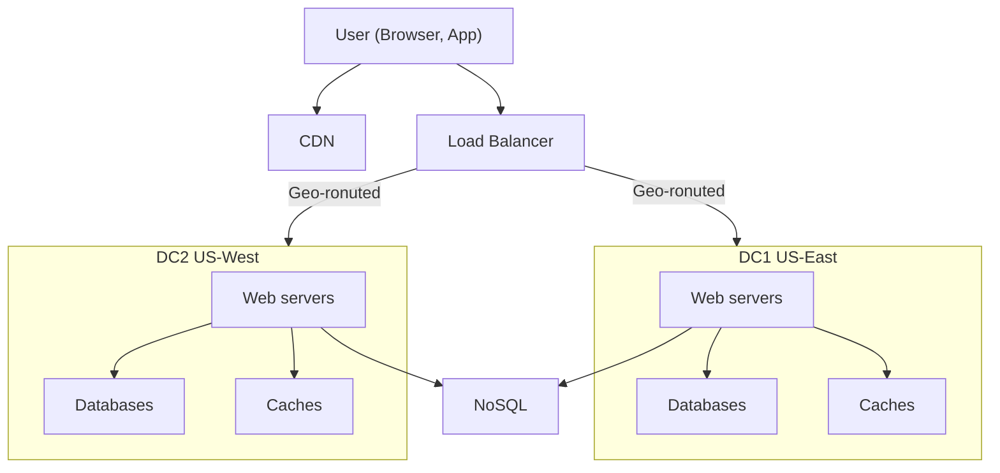
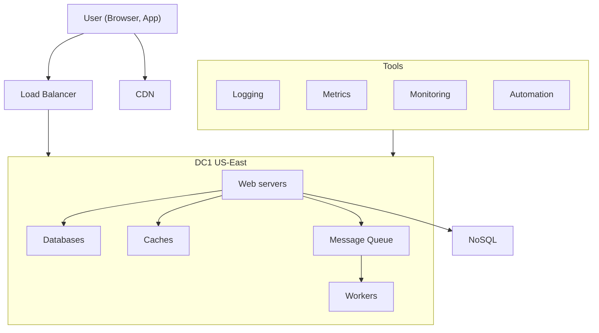

# CHAPTER 1: SCALE FROM ZERO TO MILLIONS OF USERS

- [CHAPTER 1: SCALE FROM ZERO TO MILLIONS OF USERS](#chapter-1-scale-from-zero-to-millions-of-users)
  - [Single server setup](#single-server-setup)
  - [Database](#database)
    - [Which databases to use?](#which-databases-to-use)
  - [Vertical scaling vs horizontal scaling](#vertical-scaling-vs-horizontal-scaling)
  - [Load balancer](#load-balancer)
  - [Database replication](#database-replication)
  - [Cache](#cache)
    - [Cache tier](#cache-tier)
    - [Considerations for using cache](#considerations-for-using-cache)
  - [Content delivery network (CDN)](#content-delivery-network-cdn)
    - [Considerations of using a CDN](#considerations-of-using-a-cdn)
  - [Stateless web tier](#stateless-web-tier)
    - [Stateful architecture](#stateful-architecture)
    - [Stateless architecture](#stateless-architecture)
  - [Data centers](#data-centers)
  - [Message queue](#message-queue)
  - [Logging, metrics, automation](#logging-metrics-automation)
    - [Adding message queues and different tools](#adding-message-queues-and-different-tools)
  - [Database scaling](#database-scaling)
    - [Vertical scaling](#vertical-scaling)
    - [Horizontal scaling](#horizontal-scaling)
  - [Millions of users and beyond](#millions-of-users-and-beyond)

## Single server setup

First, everything is running on one server: web app, database, cache, etc.

## Database

Separating web/mobile traffic (web tier) and database (data tier) servers allows
them to be scaled independently.

### Which databases to use?

You can choose between a traditional relational database and a non-relational
database.

The most popular relational databases are

- MySQL
- Oracle database
- PostgreSQL
- ...

Non-Relational databases are also called NoSQL databases. Popular ones are

- CouchDB
- Neo4j
- Cassandra
- HBase
- Amazon DynamoDB
- ...

These databases are grouped into four categories:

- key-value stores
- graph stores
- column stores
- document stores

Join operations are generally not supported in non-relational databases.

For most developers, relational databases are the best option, they have worked
well. However, if relational databases are not suitable for your specific use
cases, it is critical to explore beyond relational databases. Non-relational
databases might be the right choice if:

- Your application requires super-low latency.
- Your data are unstructured, or you do not have any relational data.
- You only need to serialize and deserialize data (JSON, XML, YAML, etc.).
- You need to store a massive amount of data.

## Vertical scaling vs horizontal scaling

- Vertical scaling (or *scale up*) means the process of adding more power (CPU,
  RAM, etc.) to your servers.
- Horizontal scaling (or *scale-out*) allows you to scale by adding more
  servers into your pool of resources.

When traffic is low, vertical scaling is a great option, and the simplicity of
vertical scaling is its main advantage. It comes with serious limitations:

- Vertical scaling has a hard limit.
- Vertical scaling does not have failover and redundancy.

## Load balancer

A load balancer evenly distributes incoming traffic among web servers that are
defined in a load-balanced set.



With the load balancer, web servers are unreachable directly by clients
anymore. For better security, private IPs are used for communication between
servers.

- A private IP is an IP address reachable only between servers in the same
  network.

The load balancer communicates with web servers through private IPs.

- If server 1 goes offline, all the traffic will be routed to server 2.
- If the website traffic grows rapidly, and two servers are not enough to
  handle the traffic, the load balancer can handle this problem gracefully. You
  only need to add more servers to the web server pool, and the load balancer
  automatically starts to send requests to them.

The curent design has one database, so it does not support failover and
redundancy. Database replication is a common technique to address those
problems.

## Database replication

Database replication can be used in many database management systems, usually
with a master/slave relationship between the original (master) and the copies
(slaves)”.

A master database generally only supports write operations. A slave database
gets copies of the data from the master database and only supports read
operations. All the data-modifying commands like `insert`, `delete`, or `update`
must be sent to the master database. Most applications require a much higher
ratio of reads to writes; thus, the number of slave databases in a system is
usually larger than the number of master databases.



Advantages of database replication:

- **Better performance**: In the master-slave model, all writes and updates
  happen in master nodes; whereas, read operations are distributed across slave
  nodes.
- **Reliability**: If one of your database servers is destroyed, data is still
  preserved.
- **High availability**: By replicating data across different locations, your
  website remains in operation even if a database is offline as you can access
  data stored in another database server.

What if one of the databases goes offline?

- If only one slave database is available and it goes offline, read operations
  will be directed to the master database temporarily. As soon as the issue is
  found, a new slave database will replace the old one. In case multiple slave
  databases are available, read operations are redirected to other healthy
  slave databases. A new database server will replace the old one.
- If the master database goes offline, a slave database will be promoted to be
  the new master. All the database operations will be temporarily executed on
  the new master database. A new slave database will replace the old one for
  data replication immediately. In production systems, promoting a new master
  is more complicated as the data in a slave database might not be up to date.
  The missing data needs to be updated by running data recovery scripts.
  Although some other replication methods like multi-masters and circular
  replication could help, those setups are more complicated. Interested readers
  should refer to the listed reference materials.
  - <https://en.wikipedia.org/wiki/Multi-master_replication>
  - <https://dev.mysql.com/doc/refman/8.0/en/group-replication-multi-primary-mode.html>



It is time to improve the load/response time. This can be done by adding a
cache layer and shifting static content (JavaScript/CSS/image/video files) to
the **content delivery network (CDN)**.

## Cache

A cache is a temporary storage area that stores the result of expensive
responses or frequently accessed data in memory so that subsequent requests are
served more quickly. Every time a new web page loads, one or more database
calls are executed to fetch data. The application performance is greatly
affected by calling the database repeatedly. The cache can mitigate this
problem.

### Cache tier

The cache tier is a temporary data store layer, much faster than the database.
The benefits of having a separate cache tier include better system performance,
ability to reduce database workloads, and the ability to scale the cache tier
independently.



After receiving a request, a web server first checks if the cache has the
available response. If it has, it sends data back to the client. If not, it
queries the database, stores the response in cache, and sends it back to the
client. This caching strategy is called a ***read-through cache***. Other
caching strategies are available depending on the data type, size, and access
patterns. A previous study explains how different caching strategies work.

- <https://codeahoy.com/2017/08/11/caching-strategies-and-how-to-choose-the-right-one/>

The following code snippet shows typical Memcached APIs:

```py
SECONDS = 1
cache.set('myKey', 'hi there', 3600 * SECONDS)
cache.get('myKey')
```

### Considerations for using cache

Here are a few considerations for using a cache system:

- **Decide when to use cache**. Consider using cache when data is read
  frequently but modified infrequently. Since cached data is stored in volatile
  memory, a cache server is not ideal for persisting data. Important data
  should be saved in persistent data stores.
- **Expiration policy**. It is a good practice to implement an expiration
  policy. Once cached data is expired, it is removed from the cache. When there
  is no expiration policy, cached data will be stored in the memory permanently.
  - It is advisable not to make the expiration date too short as this will
    cause the system to reload data from the database too frequently.
  - Meanwhile, it is advisable not to make the expiration date too long as the
    data can become stale.
- **Consistency**: This involves keeping the data store and the cache in sync.
  Inconsistency can happen because data-modifying operations on the data store
  and cache are not in a single transaction. When scaling across multiple
  regions, maintaining consistency between the data store and cache is
  challenging. For further details, refer to the paper titled “Scaling Memcache
  at Facebook” published by Facebook.
  - <https://www.usenix.org/system/files/conference/nsdi13/nsdi13-final170_update.pdf>
- **Mitigating failures**: A single cache server represents a potential single
  point of failure (SPOF). As a result, multiple cache servers across different
  data centers are recommended to avoid SPOF. Another recommended approach is
  to overprovision the required memory by certain percentages. This provides a
  buffer as the memory usage increases.
- **Eviction Policy**: Once the cache is full, any requests to add items to the
  cache might cause existing items to be removed. This is called cache
  eviction. **Least-recently-used (LRU)** is the most popular cache eviction
  policy. Other eviction policies, such as the **Least Frequently Used (LFU)**
  or **First in First Out (FIFO)**, can be adopted to satisfy different use
  cases.

## Content delivery network (CDN)

A CDN is a network of geographically dispersed servers used to deliver static
content. CDN servers cache static content like images, videos, CSS, JavaScript
files, etc.

1. User A tries to get `image.png` by using an image URL. The URL’s domain is
   provided by the CDN provider.
2. If the CDN server does not have `image.png` in the cache, the CDN server
   requests the file from the origin, which can be a web server or online
   storage like Amazon S3.
3. The origin returns `image.png` to the CDN server, which includes optional
   HTTP header `Time-to-Live (TTL)` which describes how long the image is
   cached.
4. The CDN caches the image and returns it to User A. The image remains cached
   in the CDN until the TTL expires.
5. User B sends a request to get the same image.
6. The image is returned from the cache as long as the TTL has not expired.

### Considerations of using a CDN

- **Cost**: Caching infrequently used assets provides no significant benefits so
  you should consider moving them out of the CDN.
- **Setting an appropriate cache expiry**: For time-sensitive content, setting
  a cache expiry time is important. The cache expiry time should neither be too
  long nor too short.
- **CDN fallback**: You should consider how your website/application copes with
  CDN failure. If there is a temporary CDN outage, clients should be able to
  detect the problem and request resources from the origin.
- **Invalidating files**: You can remove a file from the CDN before it expires
  by performing one of the following operations:
  - Invalidate the CDN object using APIs provided by CDN vendors.
  - Use object versioning to serve a different version of the object. To
    version an object, you can add a parameter to the URL, such as a version
    number. For example, version number `2` is added to the query string:
    `image.png?v=2`.



## Stateless web tier

Now it is time to consider scaling the web tier horizontally. For this, we need
to move state (for instance user session data) out of the web tier. A good
practice is to store session data in the persistent storage such as relational
database or NoSQL. Each web server in the cluster can access state data from
databases. This is called **stateless web tier**.

### Stateful architecture

A stateful server and stateless server has some key differences.

- A stateful server remembers client data (state, e.g. session data) from one
  request to the next.
- A stateless server keeps no state information.

User A’s session data and profile image are stored in Server 1. To authenticate
User A, HTTP requests must be routed to Server 1. If a request is sent to other
servers like Server 2, authentication would fail because Server 2 does not
contain User A’s session data. Similarly, all HTTP requests from User B must be
routed to Server 2; all requests from User C must be sent to Server 3.

The issue is that every request from the same client must be routed to the same
server. This can be done with **sticky sessions** in most load balancers.

- <https://docs.aws.amazon.com/elasticloadbalancing/latest/classic/elb-sticky-sessions.html>

However, this adds the overhead. Adding or removing servers is much more
difficult with this approach. It is also challenging to handle server failures.

### Stateless architecture



In this stateless architecture, HTTP requests from users can be sent to any web
servers, which fetch state data from a shared data store. A stateless system is
simpler, more robust, and scalable.



We move the session data out of the web tier and store them in the persistent
data store. The shared data store could be a relational database,
Memcached/Redis, NoSQL, etc. The NoSQL data store is chosen as it is easy to
scale. Autoscaling means adding or removing web servers automatically based on
the traffic load. After the state data is removed out of web servers,
auto-scaling of the web tier is easily achieved by adding or removing servers
based on traffic load.

To improve availability and provide a better user experience across wider
geographical areas, supporting multiple data centers is crucial.

## Data centers

In normal operation, users are geoDNS-routed, also known as geo-routed, to the
closest data center, with a split traffic of `x%` in US-East and `(100 – x)%`
in US-West. geoDNS is a DNS service that allows domain names to be resolved to
IP addresses based on the location of a user.



Several technical challenges must be resolved to achieve multi-data center
setup:

- **Traffic redirection**: Effective tools are needed to direct traffic to the
  correct data center. **GeoDNS** can be used to direct traffic to the nearest
  data center depending on where a user is located.
- **Data synchronization**: Users from different regions could use different
  local databases or caches. In failover cases, traffic might be routed to a
  data center where data is unavailable. A common strategy is to replicate data
  across multiple data centers. A previous study shows how Netflix implements
  asynchronous multi-data center replication.
  - <https://netflixtechblog.com/active-active-for-multi-regional-resiliency-c47719f6685b?gi=ed63edccb0fc>
- **Test and deployment**: With multi-data center setup, it is important to
  test your website/application at different locations. Automated deployment
  tools are vital to keep services consistent through all the data centers.

To further scale our system, we need to decouple different components of the
system so they can be scaled independently. Messaging queue is a key strategy
employed by many real-world distributed systems to solve this problem.

## Message queue

A message queue is a durable component, stored in memory, that supports
**asynchronous** communication. It serves as a **buffer** and distributes
asynchronous requests. Input services, called **producers/publishers**, create
messages, and publish them to a message queue. Other services or servers,
called **consumers/subscribers**, connect to the queue, and perform actions
defined by the messages.

Decoupling makes the message queue a preferred architecture for building a
scalable and reliable application. With the message queue, the producer can
post a message to the queue when the consumer is unavailable to process it. The
consumer can read messages from the queue even when the producer is unavailable.

Consider the following use case: your application supports photo customization.
Those customization tasks take time to complete. Web servers publish photo
processing jobs to the message queue. Photo processing workers pick up jobs
from the message queue and asynchronously perform photo customization tasks. The
producer and the consumer can be scaled independently. When the size of the
queue becomes large, more workers are added to reduce the processing time.
However, if the queue is empty most of the time, the number of workers can be
reduced.

## Logging, metrics, automation

- **Logging**: Monitoring error logs is important because it helps to identify
  errors and problems in the system. You can monitor error logs at per server
  level or use tools to aggregate them to a centralized service for easy search
  and viewing.
- **Metrics**: Collecting different types of metrics help us to gain business
  insights and understand the health status of the system. Some of the
  following metrics are useful:
  - **Host level metrics**: CPU, Memory, disk I/O, etc.
  - **Aggregated level metrics**: for example, the performance of the entire
    database tier, cache tier, etc.
  - **Key business metrics**: daily active users, retention, revenue, etc.
- **Automation**: Continuous integration is a good practice, in which each code
  check-in is verified through automation, allowing teams to detect problems
  early.

### Adding message queues and different tools

1. The design includes a message queue, which helps to make the system more
   loosely coupled and failure resilient.
2. Logging, monitoring, metrics, and automation tools are included.



As the data grows every day, your database gets more overloaded. It is time to
scale the data tier.

## Database scaling

### Vertical scaling

There are some powerful database servers. According to Amazon Relational
Database Service (RDS), you can get a database server with 24 TB of RAM. This
kind of powerful database server could store and handle lots of data. For
example, stackoverflow.com in 2013 had over 10 million monthly unique visitors,
but it only had 1 master database. However, vertical scaling comes with
some serious drawbacks:

> <https://nickcraver.com/blog/2013/11/22/what-it-takes-to-run-stack-overflow/>

- There are hardware limits.
- Greater risk of single point of failures.
- The overall cost of vertical scaling is high. Powerful servers are much more
  expensive.

### Horizontal scaling

Horizontal scaling, also known as **sharding**, is the practice of adding more
servers.

Sharding separates large databases into smaller, more easily managed parts
called shards. Each shard shares the same schema, though the actual data on
each shard is unique to the shard.

For example, user data could be allocated to a database server based on user
IDs. Anytime you access data, a hash function is used to find the corresponding
shard. In our example, `user_id % 4` is used as the hash function. If the
result equals to `0`, `shard 0` is used to store and fetch data. If the result
equals to `1`, `shard 1` is used. The same logic applies to other shards.

The most important factor to consider when implementing a sharding strategy is
the choice of the sharding key. Sharding key (known as a partition key)
consists of one or more columns that determine how data is distributed. A
sharding key allows you to retrieve and modify data efficiently by routing
database queries to the correct database.

- When choosing a sharding key, one of the most important criteria is to choose
  a key that can evenly distributed data.

Sharding is a great technique to scale the database but it is far from a
perfect solution. It introduces complexities and new challenges to the system:

- **Resharding data**: Resharding data is needed when
  - a single shard could no longer hold more data due to rapid growth.
  - Certain shards might experience shard exhaustion faster than others due to
    uneven data distribution. When shard exhaustion happens, it requires
    updating the sharding function and moving data around. Consistent hashing
    is a commonly used technique to solve this problem.
- **Celebrity problem**: This is also called a hotspot key problem. Excessive
  access to a specific shard could cause server overload. To solve this
  problem, we may need to allocate a shard for each celebrity. Each shard might
  even require further partition.
- **Join and de-normalization**: Once a database has been sharded across
  multiple servers, it is hard to perform join operations across database
  shards. A common workaround is to denormalize the database so that queries
  can be performed in a single table.

Some of the non-relational functionalities can be moved to a NoSQL data store
to reduce the database load. Here is an article that covers many use cases of NoSQL: <https://highscalability.com/what-the-heck-are-you-actually-using-nosql-for/>

## Millions of users and beyond

Scaling a system is an iterative process. More fine-tuning and new strategies
are needed to scale beyond millions of users. For example, you might need to
optimize your system and decouple the system to even smaller services. How we
scale our system to support millions of users:

- Keep web tier stateless
- Build redundancy at every tier
- Cache data as much as you can
- Support multiple data centers
- Host static assets in CDN
- Scale your data tier by sharding
- Split tiers into individual services
- Monitor your system and use automation tools
