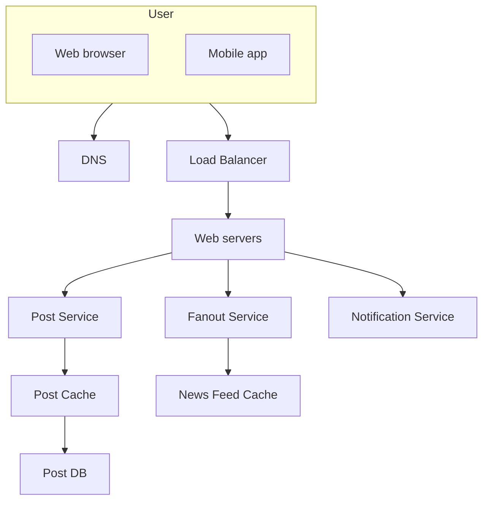
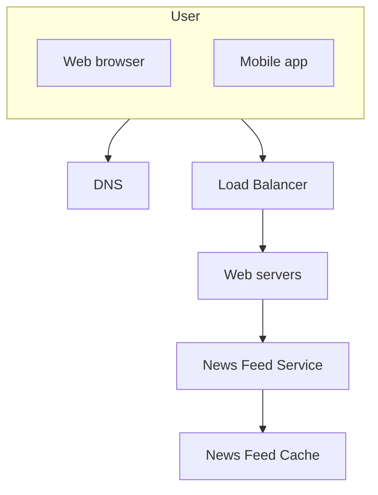
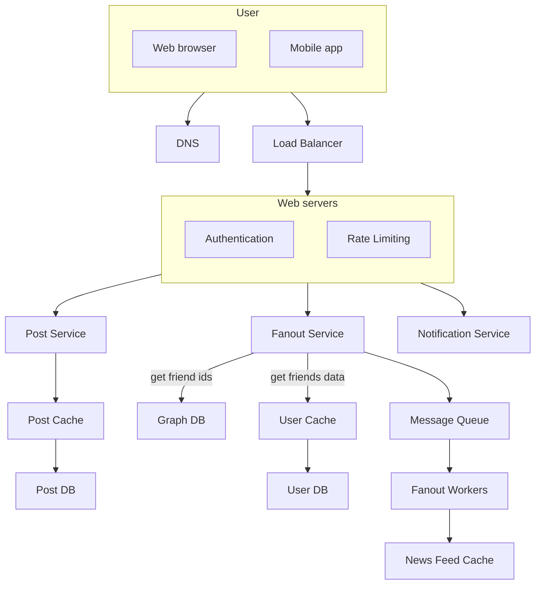
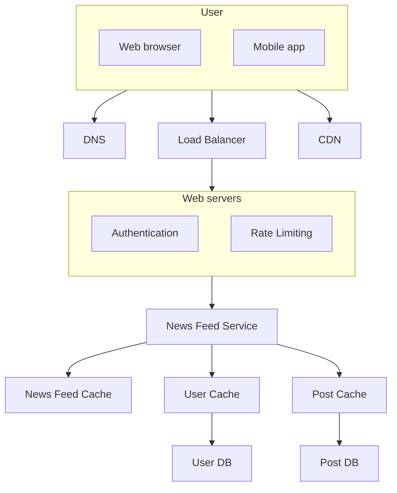

# CHAPTER 3: A FRAMEWORK FOR SYSTEM DESIGN INTERVIEWS

- [CHAPTER 3: A FRAMEWORK FOR SYSTEM DESIGN INTERVIEWS](#chapter-3-a-framework-for-system-design-interviews)
  - [A 4-step process for effective system design interview](#a-4-step-process-for-effective-system-design-interview)
  - [Step 1 - Understand the problem and establish design scope](#step-1---understand-the-problem-and-establish-design-scope)
    - [Example: Step 1](#example-step-1)
  - [Step 2 - Propose high-level design and get buy-in](#step-2---propose-high-level-design-and-get-buy-in)
    - [Example: Step 2](#example-step-2)
  - [Step 3 - Design deep dive](#step-3---design-deep-dive)
    - [Example: Step 3](#example-step-3)
  - [Step 4 - Wrap up](#step-4---wrap-up)
    - [Dos](#dos)
    - [Don’ts](#donts)
    - [Time allocation on each step](#time-allocation-on-each-step)

The system design interview simulates real-life problem solving where two
co-workers collaborate on an ambiguous problem and come up with a solution that
meets their goals. The final design is less important compared to the work you
put in the design process. This allows you to demonstrate your design skill,
defend your design choices, and respond to feedback in a constructive manner.

The primary goal of the interviewer is to accurately assess your abilities. The
last thing she wants is to give an inconclusive evaluation because the session
has gone poorly and there are not enough signals. What is an interviewer
looking for in a system design interview?

Many think that system design interview is all about a person's technical
design skills. It is much more than that. An effective system design interview
gives strong signals about a person's ability to collaborate, to work under
pressure, and to resolve ambiguity constructively. The ability to ask good
questions is also an essential skill, and many interviewers specifically look
for this skill.

A good interviewer also looks for red flags. Over-engineering is a real disease
of many engineers as they delight in design purity and ignore tradeoffs. They
are often unaware of the compounding costs of over-engineered systems, and many
companies pay a high price for that ignorance. You certainly do not want to
demonstrate this tendency in a system design interview. Other red flags include
narrow mindedness, stubbornness, etc.

## A 4-step process for effective system design interview

A great system design interview is open-ended and there is no one-size-fits-all
solution. However, there are steps and common ground to cover in every system
design interview.

## Step 1 - Understand the problem and establish design scope

In a system design interview, giving out an answer quickly without thinking
gives you no bonus points. Answering without a thorough understanding of the
requirements is a huge red flag as the interview is not a trivia contest.

So, do not jump right in to give a solution. Slow down. Think deeply and ask
questions to clarify requirements and assumptions. This is extremely important.

One of the most important skills as an engineer is to ask the right questions,
make the proper assumptions, and gather all the information needed to build a
system. So, do not be afraid to ask questions.

When you ask a question, the interviewer either answers your question directly
or asks you to make your assumptions. If the latter happens, write down your
assumptions. You might need them later.

What kind of questions to ask? Ask questions to understand the exact
requirements:

- What specific features are we going to build?
- How many users does the product have?
- How fast does the company anticipate to scale up? What are the anticipated
  scales in 3 months, 6 months, and a year?
- What is the company’s technology stack? What existing services you might
  leverage to simplify the design?

### Example: Step 1

If you are asked to design a news feed system, you want to ask questions that
help you clarify the requirements:

- Is this a mobile app? Or a web app? Or both?
- What are the most important features for the product?
- Is the news feed sorted in reverse chronological order or a particular order?
  The particular order means each post is given a different weight. For
  instance, posts from your close friends are more important than posts from a
  group.
- How many friends can a user have?
- What is the traffic volume?
- Can feed contain images, videos, or just text?

It is important to understand the requirements and clarify ambiguities.

## Step 2 - Propose high-level design and get buy-in

In this step, we aim to develop a high-level design and reach an agreement with
the interviewer on the design.

- Come up with an initial blueprint for the design. Ask for feedback. Treat
  your interviewer as a teammate and work together. Many good interviewers love
  to talk and get involved.
- Draw box diagrams with key components on the whiteboard or paper. This might
  include clients (mobile/web), APIs, web servers, data stores, cache, CDN,
  message queue, etc.
- Do back-of-the-envelope calculations to evaluate if your blueprint fits the
  scale constraints. Think out loud. Communicate with your interviewer if
  back-of-the-envelope is necessary before diving into it.

If possible, go through a few concrete use cases. This will help you frame the
high-level design. It is also likely that the use cases would help you discover
edge cases you have not yet considered.

Should we include API endpoints and database schema here? This depends on the
problem. For large design problems like “Design Google search engine”, this is
a bit of too low level. For a problem like designing the backend for a
multi-player poker game, this is a fair game. Communicate with your interviewer.

### Example: Step 2

Let us use “Design a news feed system” to demonstrate how to approach the
high-level design.

At the high level, the design is divided into two flows: feed publishing and
news feed building.

- **Feed publishing**: when a user publishes a post, corresponding data is
  written into cache/database, and the post will be populated into friends’
  news feed.
- **Newsfeed building**: the news feed is built by aggregating friends’ posts
  in a reverse chronological order.

Feed publishing flow:

News feed building flow:

## Step 3 - Design deep dive

At this step, you and your interviewer should have already achieved the
following objectives:

- Agreed on the overall goals and feature scope
- Sketched out a high-level blueprint for the overall design
- Obtained feedback from your interviewer on the high-level design
- Had some initial ideas about areas to focus on in deep dive based on her
  feedback

In most cases, the interviewer may want you to dig into details of some system
components.

- For URL shortener, it is interesting to dive into the hash function design
  that converts a long URL to a short one.
- For a chat system, how to reduce latency and how to support online/offline
  status are two interesting topics.

Try not to get into unnecessary details. For example, talking about the
EdgeRank algorithm of Facebook feed ranking in detail is not ideal during a
system design interview as this takes much precious time and does not prove
your ability in designing a scalable system.

### Example: Step 3

Next, we will investigate two of the most important use cases:

1. Feed publishing
2. News feed retrieval

Feed publishing use case:

News feed retrieval use case:

## Step 4 - Wrap up

In this final step, the interviewer might ask you a few follow-up questions or
give you the freedom to discuss other additional points:

- The interviewer might want you to identify the system bottlenecks and discuss
  potential improvements. There is always something to improve upon. This is a
  great opportunity to show your critical thinking and leave a good final
  impression.
- It could be useful to give the interviewer a recap of your design. This is
  particularly important if you suggested a few solutions. Refreshing your
  interviewer’s memory can be helpful after a long session.
- Error cases (server failure, network loss, etc.) are interesting to talk
  about.
- Operation issues are worth mentioning. How do you monitor metrics and error
  logs? How to roll out the system?
- How to handle the next scale curve is also an interesting topic. For example,
  if your current design supports 1 million users, what changes do you need to
  make to support 10 million users?
- Propose other refinements you need if you had more time.

### Dos

- Always ask for clarification. Do not assume your assumption is correct.
- Understand the requirements of the problem.
- There is neither the right answer nor the best answer. A solution designed to
  solve the problems of a young startup is different from that of an
  established company with millions of users.
- Let the interviewer know what you are thinking. Communicate with your
  interviewer.
- Suggest multiple approaches if possible.
- Once you agree with your interviewer on the blueprint, go into details on
  each component. Design the most critical components first.
- Bounce ideas off the interviewer. A good interviewer works with you as a
  teammate.
- Never give up.

### Don’ts

- Don't be unprepared for typical interview questions.
- Don’t jump into a solution without clarifying the requirements and
  assumptions.
- Don’t go into too much detail on a single component in the beginning. Give
  the high-level design first then drills down.
- If you get stuck, don't hesitate to ask for hints.
- Again, communicate. Don't think in silence.
- Don’t think your interview is done once you give the design. You are not done
  until your interviewer says you are done. Ask for feedback early and often.

### Time allocation on each step

Time management is essential. How much time should you spend on each step? The
following is a very rough guide on distributing your time in a 45-minute
interview session.

- Step 1 Understand the problem and establish design scope: 3 - 10 minutes
- Step 2 Propose high-level design and get buy-in: 10 - 15 minutes
- Step 3 Design deep dive: 10 - 25 minutes
- Step 4 Wrap: 3 - 5 minutes
