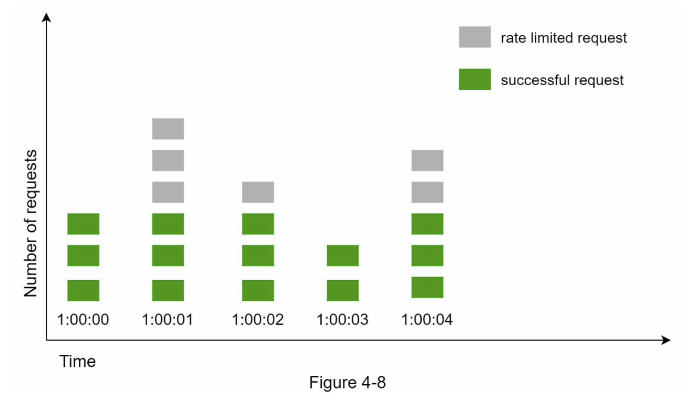
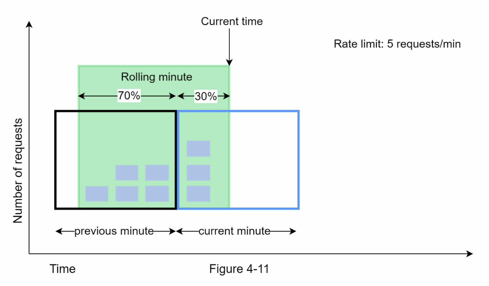
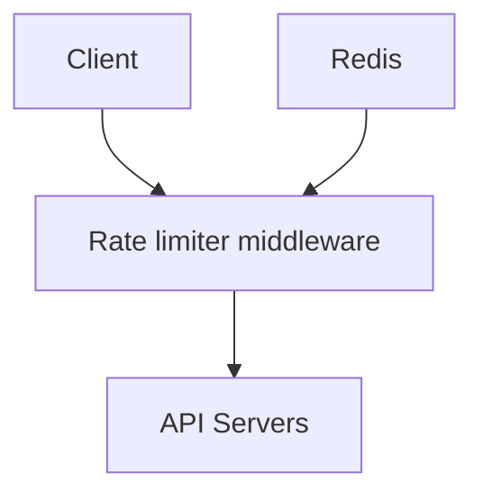
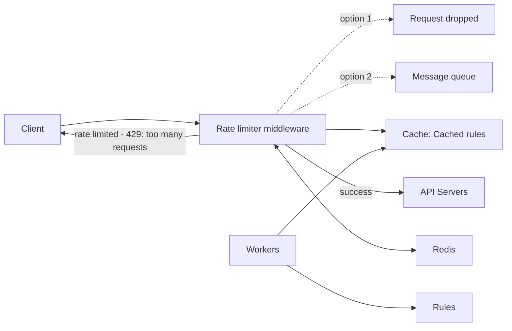
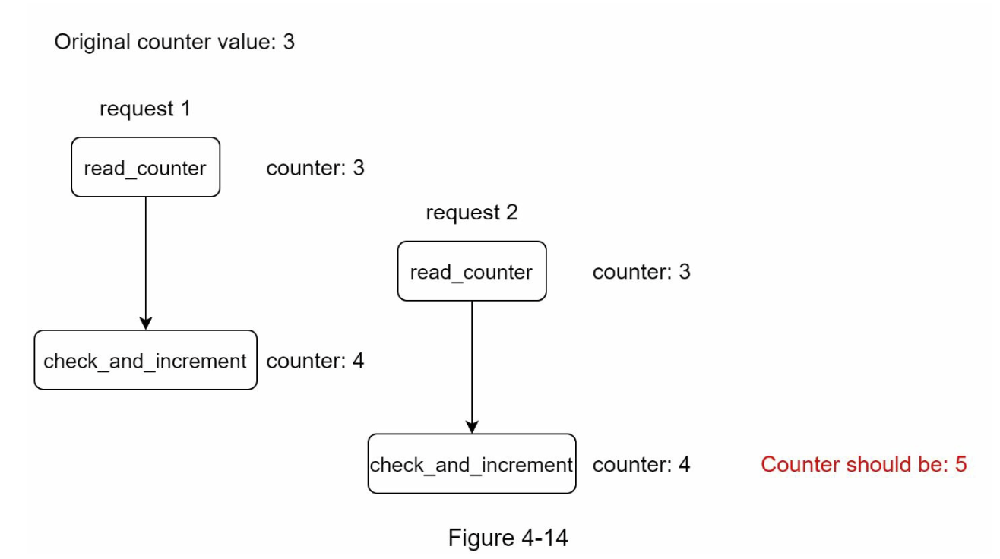
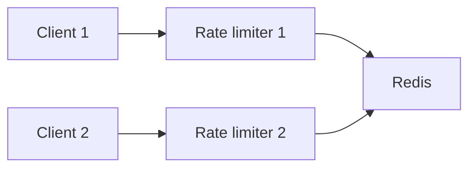

# CHAPTER 4: DESIGN A RATE LIMITER

- [CHAPTER 4: DESIGN A RATE LIMITER](#chapter-4-design-a-rate-limiter)
  - [Step 1 - Understand the problem and establish design scope](#step-1---understand-the-problem-and-establish-design-scope)
    - [Requirements](#requirements)
  - [Step 2 - Propose high-level design and get buy-in](#step-2---propose-high-level-design-and-get-buy-in)
    - [Where to put the rate limiter?](#where-to-put-the-rate-limiter)
    - [Algorithms for rate limiting](#algorithms-for-rate-limiting)
      - [Token bucket algorithm](#token-bucket-algorithm)
      - [Leaking bucket algorithm](#leaking-bucket-algorithm)
      - [Fixed window counter algorithm](#fixed-window-counter-algorithm)
      - [Sliding window log algorithm](#sliding-window-log-algorithm)
      - [Sliding window counter algorithm](#sliding-window-counter-algorithm)
    - [High-level architecture](#high-level-architecture)
  - [Step 3 - Design deep dive](#step-3---design-deep-dive)
    - [Rate limiting rules](#rate-limiting-rules)
    - [Exceeding the rate limit](#exceeding-the-rate-limit)
      - [Rate limiter headers](#rate-limiter-headers)
    - [Detailed design](#detailed-design)
    - [Rate limiter in a distributed environment](#rate-limiter-in-a-distributed-environment)
      - [Race condition](#race-condition)
      - [Synchronization issue](#synchronization-issue)
    - [Performance optimization](#performance-optimization)
    - [Monitoring](#monitoring)
  - [Step 4 - Wrap up](#step-4---wrap-up)

In a network system, a rate limiter is used to control the rate of traffic sent
by a client or a service. In the HTTP world, a rate limiter limits the number
of client requests allowed to be sent over a specified period. If the API
request count exceeds the threshold defined by the rate limiter, all the excess
calls are blocked. Here are a few examples:

- A user can write no more than 2 posts per second.
- You can create a maximum of 10 accounts per day from the same IP address.
- You can claim rewards no more than 5 times per week from the same device.

The benefits of using an API rate limiter:

- Prevent resource starvation caused by Denial of Service (DoS) attack. Almost
  all APIs published by large tech companies enforce some form of rate
  limiting. A rate limiter prevents DoS attacks, either intentional or
  unintentional, by blocking the excess calls.
  - For example, Twitter limits the number of tweets to 300 per 3 hours.
  - Google docs APIs have the following default limit: 300 per user per 60
    seconds for read requests.
- Reduce cost. Limiting excess requests means fewer servers and allocating more
  resources to high priority APIs. Rate limiting is extremely important for
  companies that use paid third party APIs. Limiting the number of calls is essential to reduce costs.
  - For example, you are charged on a per-call basis for the following external
    APIs: check credit, make a payment, retrieve health records, etc.
- Prevent servers from being overloaded. To reduce server load, a rate limiter
  is used to filter out excess requests caused by bots or users’ misbehavior.

## Step 1 - Understand the problem and establish design scope

The interactions between an interviewer and a candidate help to clarify the
type of rate limiters we are trying to build.

- **Candidate**: What kind of rate limiter are we going to design? Is it a
  client-side rate limiter or server-side API rate limiter?
- **Interviewer**: Great question. We focus on the server-side API rate limiter.
- **Candidate**: Does the rate limiter throttle API requests based on IP, the
  user ID, or other properties?
- **Interviewer**: The rate limiter should be flexible enough to support
  different sets of throttle rules.
- **Candidate**: What is the scale of the system? Is it built for a startup or
  a big company with a large user base?
- **Interviewer**: The system must be able to handle a large number of requests.
- **Candidate**: Will the system work in a distributed environment?
- **Interviewer**: Yes.
- **Candidate**: Is the rate limiter a separate service or should it be
  implemented in application code?
- **Interviewer**: It is a design decision up to you.
- **Candidate**: Do we need to inform users who are throttled?
- **Interviewer**: Yes.

### Requirements

Summary of the requirements for the system:

- Accurately limit excessive requests.
- Low latency. The rate limiter should not slow down HTTP response time.
- Use as little memory as possible.
- Distributed rate limiting. The rate limiter can be shared across multiple
  servers or processes.
- Exception handling. Show clear exceptions to users when their requests are
  throttled.
- High fault tolerance. If there are any problems with the rate limiter (for
  example, a cache server goes offline), it does not affect the entire system.

## Step 2 - Propose high-level design and get buy-in

### Where to put the rate limiter?

Intuitively, you can implement a rate limiter at either the client or
server-side.

- Client-side implementation. Generally speaking, client is an unreliable place
  to enforce rate limiting because client requests can easily be forged by
  malicious actors. Moreover, we might not have control over the client
  implementation.
- Server-side implementation.
- Besides the client and server-side implementations, there is an alternative
  way. Instead of putting a rate limiter at the API servers, we create a rate
  limiter middleware, which throttles requests to your APIs.

Let us use an middleware example to illustrate how rate limiting works in this
design. Assume our API allows 2 requests per second, and a client sends 3
requests to the server within a second. The first two requests are routed to
API servers. However, the rate limiter middleware throttles the third request
and returns a HTTP status code 429. The HTTP 429 response status code indicates
a user has sent too many requests.

Cloud microservices have become widely popular and rate limiting is usually
implemented within a component called **API gateway**. API gateway is a fully
managed service that supports rate limiting, SSL termination, authentication,
IP whitelisting, servicing static content, etc. The API gateway is a middleware
that supports rate limiting.

While designing a rate limiter, an important question to ask ourselves is:
where should the rater limiter be implemented, on the server-side or in a
gateway? There is no absolute answer. It depends on your company’s current
technology stack, engineering resources, priorities, goals, etc.

- Evaluate your current technology stack, such as programming language, cache
  service, etc. Make sure your current programming language is efficient to
  implement rate limiting on the server-side.
- Identify the rate limiting algorithm that fits your business needs. When you
  implement everything on the server-side, you have full control of the
  algorithm. However, your choice might be limited if you use a third-party
  gateway.
- If you have already used microservice architecture and included an API
  gateway in the design to perform authentication, IP whitelisting, etc., you
  may add a rate limiter to the API gateway.
- Building your own rate limiting service takes time. If you do not have enough
  engineering resources to implement a rate limiter, a commercial API gateway
  is a better option.

### Algorithms for rate limiting

Rate limiting can be implemented using different algorithms:

- Token bucket
- Leaking bucket
- Fixed window counter
- Sliding window log
- Sliding window counter
- ...

#### Token bucket algorithm

The token bucket algorithm is widely used by internet companies. Both Amazon
and Stripe use this algorithm to throttle their API requests.

The token bucket algorithm work as follows:

- A token bucket is a container that has pre-defined capacity. Tokens are put
  in the bucket at preset rates periodically. Once the bucket is full, no more
  tokens are added. As shown in the Figure 4-4, the token bucket capacity is 4.
  The refiller puts 2 tokens into the bucket every second. Once the bucket is
  full, extra tokens will overflow.
- Each request consumes one token. When a request arrives, we check if there
  are enough tokens in the bucket.
  - If there are enough tokens, we take one token out for each request, and the
    request goes through.
  - If there are not enough tokens, the request is dropped.

In this example, the token bucket size is 4, and the refill rate is 4 per 1
minute.

The token bucket algorithm takes two parameters:

- `Bucket size`: the maximum number of tokens allowed in the bucket
- `Refill rate`: number of tokens put into the bucket every second

How many buckets do we need? This varies, and it depends on the rate-limiting
rules:

- It is usually necessary to have different buckets for different API
  endpoints. For instance, if a user is allowed to make 1 post per second, add
  150 friends per day, and like 5 posts per second, 3 buckets are required for
  each user.
- If we need to throttle requests based on IP addresses, each IP address
  requires a bucket.
- If the system allows a maximum of 10,000 requests per second, it makes sense
  to have a global bucket shared by all requests.

Pros:

- The algorithm is easy to implement.
- Memory efficient.
- Token bucket allows a burst of traffic for short periods. A request can go
  through as long as there are tokens left.

Cons:

- Two parameters in the algorithm are `bucket size` and token `refill rate`.
  However, it might be challenging to tune them properly.

#### Leaking bucket algorithm

The leaking bucket algorithm is similar to the token bucket except that
**requests are processed at a fixed rate**. It is usually implemented with a
first-in-first-out (FIFO) queue. The algorithm works as follows:

- When a request arrives, the system checks if the queue is full. If it is not
  full, the request is added to the queue.
- Otherwise, the request is dropped.
- Requests are pulled from the queue and processed at regular intervals.

Leaking bucket algorithm takes the following two parameters:

- `Bucket size`: it is equal to the queue size. The queue holds the requests to
  be processed at a fixed rate.
- `Outflow rate`: it defines how many requests can be processed at a fixed
  rate, usually in seconds.

Shopify, an ecommerce company, uses leaky buckets for rate-limiting.

Pros:

- Memory efficient given the limited queue size.
- Requests are processed at a fixed rate therefore it is suitable for use cases
  that a stable outflow rate is needed.

Cons:

- A burst of traffic fills up the queue with old requests, and if they are not
  processed in time, recent requests will be rate limited.
- There are two parameters in the algorithm. It might not be easy to tune them
  properly.

#### Fixed window counter algorithm

Fixed window counter algorithm works as follows:

- The algorithm divides the timeline into fix-sized time windows and assign a
  counter for each window.
- Each request increments the counter by one.
- Once the counter reaches the pre-defined threshold, new requests are dropped
  until a new time window starts.



In Figure 4-8, the time unit is 1 second and the system allows a maximum of 3
requests per second. In each second window, if more than 3 requests are
received, extra requests are dropped.

A major problem with this algorithm is that a burst of traffic at the edges of
time windows could cause more requests than allowed quota to go through.
Consider the following case:

The system allows a maximum of 5 requests per minute, and the available quota
resets at the human-friendly round minute. There are five requests between
2:00:00 and 2:01:00 and five more requests between 2:01:00 and 2:02:00. For the
one-minute window between 2:00:30 and 2:01:30, 10 requests go through. That is
twice as many as allowed requests.

Pros:

- Memory efficient.
- Easy to understand.
- Resetting available quota at the end of a unit time window fits certain use
  cases.

Cons:

- Spike in traffic at the edges of a window could cause more requests than the
  allowed quota to go through.

#### Sliding window log algorithm

The fixed window counter algorithm has a major issue: it allows more requests
to go through at the edges of a window. The sliding window log algorithm fixes
the issue. It works as follows:

- The algorithm keeps track of request timestamps. Timestamp data is usually
  kept in cache, such as sorted sets of Redis.
- When a new request comes in, remove all the outdated timestamps. Outdated
  timestamps are defined as those older than the start of the current time
  window.
- Add timestamp of the new request to the log.
- If the log size is the same or lower than the allowed count, a request is
  accepted. Otherwise, it is rejected.

In this example, the rate limiter allows 2 requests per minute. Usually, Linux
timestamps are stored in the log.

- The log is empty when a new request arrives at 1:00:01. Thus, the request is
  allowed.
- A new request arrives at 1:00:30, the timestamp 1:00:30 is inserted into the
  log. After the insertion, the log size is 2, not larger than the allowed
  count. Thus, the request is allowed.
- A new request arrives at 1:00:50, and the timestamp is inserted into the log.
  After the insertion, the log size is 3, larger than the allowed size 2.
  Therefore, this request is rejected even though the timestamp remains in the
  log.
- A new request arrives at 1:01:40. Requests in the range `[1:00:40,1:01:40)`
  are within the latest time frame, but requests sent before 1:00:40 are
  outdated. Two outdated timestamps, 1:00:01 and 1:00:30, are removed from the
  log. After the remove operation, the log size becomes 2; therefore, the
  request is accepted.

Pros:

- Rate limiting implemented by this algorithm is very accurate. In any rolling
  window, requests will not exceed the rate limit.

Cons:

- The algorithm consumes a lot of memory because even if a request is rejected,
  its timestamp might still be stored in memory.

#### Sliding window counter algorithm



The sliding window counter algorithm is a hybrid approach that combines the
fixed window counter and sliding window log. The algorithm can be implemented
by two different approaches. Figure 4-11 illustrates how this algorithm works.

Assume the rate limiter allows a maximum of 7 requests per minute, and there
are 5 requests in the previous minute and 3 in the current minute. For a new
request that arrives at a 30% position in the current minute, the number of
requests in the rolling window is calculated using the following formula:

- `Requests in current window + requests in the previous window * overlap
  percentage of the rolling window and previous window`
- Using this formula, we get `3 + 5 * 0.7% = 6.5` request. Depending on the use
  case, the number can either be rounded up or down. In our example, it is
  rounded down to 6.

Since the rate limiter allows a maximum of 7 requests per minute, the current
request can go through. However, the limit will be reached after receiving one
more request.

The other implementation: [System Design — Rate limiter and Data modelling](https://medium.com/@saisandeepmopuri/system-design-rate-limiter-and-data-modelling-9304b0d18250).

This algorithm is not perfect. It has pros and cons.

Pros

- It smooths out spikes in traffic because the rate is based on the average
  rate of the previous window.
- Memory efficient.

Cons

- It only works for not-so-strict look back window. It is an approximation of
  the actual rate because it assumes requests in the previous window are evenly
  distributed. However, this problem may not be as bad as it seems. According
  to experiments done by Cloudflare, only 0.003% of requests are wrongly
  allowed or rate limited among 400 million requests.

### High-level architecture

The basic idea of rate limiting algorithms is simple. At the high-level, we
need a counter to keep track of how many requests are sent from the same user,
IP address, etc. If the counter is larger than the limit, the request is
disallowed.

Where shall we store counters? Using the database is not a good idea due to
slowness of disk access. In-memory cache is chosen because it is fast and
supports time-based expiration strategy. For instance, Redis is a popular
option to implement rate limiting. It is an in-memory store that offers two
commands: `INCR` and `EXPIRE`.

- `INCR`: It increases the stored counter by 1.
- `EXPIRE`: It sets a timeout for the counter. If the timeout expires, the
  counter is automatically deleted.



The figure above works as follows:

- The client sends a request to rate limiting middleware.
- Rate limiting middleware fetches the counter from the corresponding bucket in
  Redis and checks if the limit is reached or not.
- If the limit is reached, the request is rejected.
- If the limit is not reached, the request is sent to API servers. Meanwhile,
  the system increments the counter and saves it back to Redis.

## Step 3 - Design deep dive

The high-level design does not answer the following questions:

- How are rate limiting rules created? Where are the rules stored?
- How to handle requests that are rate limited?

### Rate limiting rules

Lyft open-sourced their [rate-limiting component](https://github.com/envoyproxy/ratelimit).
Some examples of rate limiting rules:

```yml
domain: messaging
descriptors:
  - key: message_type
    Value: marketing
    rate_limit:
      unit: day
      requests_per_unit: 5
```

In the above example, the system is configured to allow a maximum of 5
marketing messages per day. Here is another example:

```yml
domain: auth
descriptors:
  - key: auth_type
    Value: login
    rate_limit:
      unit: minute
      requests_per_unit: 5
```

This rule shows that clients are not allowed to login more than 5 times in 1 minute. Rules are generally written in configuration files and saved on disk.

### Exceeding the rate limit

In case a request is rate limited, APIs return a HTTP response code 429 to the
client. Depending on the use cases, we may enqueue the rate-limited requests to
be processed later. For example, if some orders are rate limited due to system
overload, we may keep those orders to be processed later.

#### Rate limiter headers

How does a client know whether it is being throttled? And how does a client
know the number of allowed remaining requests before being throttled? The
answer lies in HTTP response headers. The rate limiter returns the following
HTTP headers to clients:

- `X-Ratelimit-Remaining`: The remaining number of allowed requests within the
  window.
- `X-Ratelimit-Limit`: It indicates how many calls the client can make per time
  window.
- `X-Ratelimit-Retry-After`: The number of seconds to wait until you can make a
  request again without being throttled.

When a user has sent too many requests, a 429 too many requests error and
`X-Ratelimit-Retry-After` header are returned to the client.

### Detailed design



- Rules are stored on the disk. Workers frequently pull rules from the disk and
  store them in the cache.
- When a client sends a request to the server, the request is sent to the rate
  limiter middleware first.
- Rate limiter middleware loads rules from the cache. It fetches counters and
  last request timestamp from Redis cache. Based on the response, the rate
  limiter decides:
  - if the request is not rate limited, it is forwarded to API servers.
  - if the request is rate limited, the rate limiter returns 429 too many
    requests error to the client. In the meantime, the request is either
    dropped or forwarded to the queue.

### Rate limiter in a distributed environment

Building a rate limiter that works in a single server environment is not
difficult. However, scaling the system to support multiple servers and
concurrent threads is a different story. There are two challenges:

- Race condition
- Synchronization issue

#### Race condition

Rate limiter works as follows at the high-level:

- Read the counter value from Redis.
- Check if ( `counter + 1` ) exceeds the threshold.
- If not, increment the counter value by 1 in Redis.



Race conditions can happen in a highly concurrent environment as shown in
Figure 4-14.

Assume the `counter` value in Redis is 3. If two requests concurrently read the
`counter` value before either of them writes the value back, each will
increment the `counter` by one and write it back without checking the other
thread. Both requests (threads) believe they have the correct `counter` value
`4`. However, the correct `counter` value should be `5`.

Locks are the most obvious solution for solving race condition. However, locks
will significantly slow down the system. Two strategies are commonly used to
solve the problem: [Lua script](https://gist.github.com/ptarjan/e38f45f2dfe601419ca3af937fff574d#request-rate-limiter)
and [sorted sets data structure in Redis](https://engineering.classdojo.com/blog/2015/02/06/rolling-rate-limiter/).

#### Synchronization issue

Synchronization is another important factor to consider in a distributed
environment. To support millions of users, one rate limiter server might not be
enough to handle the traffic. When multiple rate limiter servers are used,
synchronization is required. For example, client 1 sends requests to rate
limiter 1, and client 2 sends requests to rate limiter 2. As the web tier is
stateless, clients can send requests to a different rate limiter. If no
synchronization happens, rate limiter 1 does not contain any data about
client 2. Thus, the rate limiter cannot work properly.

One possible solution is to use sticky sessions that allow a client to send
traffic to the same rate limiter. This solution is **not advisable** because it
is neither scalable nor flexible. A better approach is to use centralized data
stores like Redis.



### Performance optimization

First, multi-data center setup is crucial for a rate limiter because latency is
high for users located far away from the data center. Most cloud service
providers build many edge server locations around the world. For example, as of
5/20 2020, Cloudflare has 194 geographically distributed edge servers. Traffic
is automatically routed to the closest edge server to reduce latency.

Second, synchronize data with an eventual consistency model.

### Monitoring

After the rate limiter is put in place, it is important to gather analytics
data to check whether the rate limiter is effective. Primarily, we want to make
sure:

- The rate limiting algorithm is effective.
- The rate limiting rules are effective.

For example, if rate limiting rules are too strict, many valid requests are
dropped. In this case, we want to relax the rules a little bit. In another
example, we notice our rate limiter becomes ineffective when there is a sudden
increase in traffic like flash sales. In this scenario, we may replace the
algorithm to support burst traffic. **Token bucket is a good fit here**.

## Step 4 - Wrap up

Algorithms discussed include:

- Token bucket
- Leaking bucket
- Fixed window
- Sliding window log
- Sliding window counter

There are additional talking points you can mention if time allows:

- Hard vs soft rate limiting.
  - Hard: The number of requests cannot exceed the threshold.
  - Soft: Requests can exceed the threshold for a short period.
- Rate limiting at different levels. We only talked about rate limiting at the
  application level (HTTP: layer 7). It is possible to apply rate limiting at
  other layers.
  - For example, you can [apply rate limiting by IP addresses using Iptables](https://blog.programster.org/rate-limit-requests-with-iptables)
    (IP: layer 3).
  - Note: The Open Systems Interconnection model (OSI model) has 7 layers:
    - Layer 1: Physical layer
    - Layer 2: Data link layer
    - Layer 3: Network layer
    - Layer 4: Transport layer
    - Layer 5: Session layer
    - Layer 6: Presentation layer
    - Layer 7: Application layer
- Avoid being rate limited. Design your client with best practices:
  - Use client cache to avoid making frequent API calls.
  - Understand the limit and do not send too many requests in a short time
    frame.
  - Include code to catch exceptions or errors so your client can gracefully
    recover from exceptions.
  - Add sufficient back off time to retry logic.
