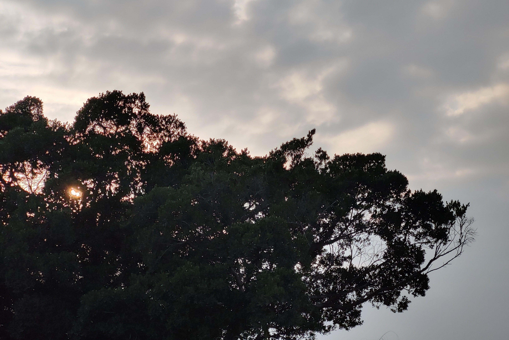

# 纪念我的二姑丈

> 深圳, 2022 年 1 月 8 日

去年（2021）十一月参加小学同学的婚礼回了趟老家，我爸妈才跟我说二姑丈确诊癌症晚期了。
在潮汕话里我们用“二丈”称呼，尽管有些奇怪，下文我还是用二丈来指代他。

二丈是我们老一辈亲戚里面书生气最重的人，尽管学历不高，也在村里教了 11 年书。
每年过年前几天，他都要写好新年的春联，挨个送给我们同村的几家亲戚，直到后来年纪大了腿脚不便，
慢慢变成我二姑送过来。

二丈不教书之后主要是个农民，小时候我经常跟着他去田里玩。
其实这部分记忆已经模糊到我想不起来他耕作的那块地在哪，只记得少数几个画面。
菜地里种的可能是芥蓝、包菜、空心菜跟韭菜，潮州人没有不吃这几个菜的。从我有记忆起到中学那些年里，
家里经常吃他们送的蔬菜，以至于有一段时间我妈说，吃我二姑二丈家的韭菜花多到有些“恶心”
（潮州话里恶心的语气没有那么不好，但我想不起好的替代词）。

每年盛夏跟晚秋是收割稻谷的季节，谷子收割后要晒干再存起来。由于我家里天台刚好差不多够用，
他们会把谷子搬到我家里晒。小时候最痛苦的事情之一就是傍晚要帮忙收谷子，
因为盛夏里太阳好不容易快下山了，正是我要出去玩的时候，这就很耽误事儿，特别耽误事儿。
总之耽误我出去玩的事儿都曾经使我痛苦。谷子晒到后期还要用簸箕人工分拣，一簸箕一簸箕抬高过头顶，
借着傍晚的风把空粒吹开。在晚秋的时候这个过程甚至有些萧瑟，秋风卷着秕谷与尘土飞扬，
而我心里只惦记福建卫视的动画片。再后来有了收割机，收割机会把杂草茎跟少量水稻叶一并收割起来，
于是又给我多了一道人工挑拣茎叶的工序，苦不堪言。到最最后，村里全体亲戚都不种水稻了，
而我已经过了下午会跑出去玩的年纪，屏幕也从电视机变成电脑显示器。这些画面已经变得极其不具体，
我只记得童年的很多个傍晚，我带着不怎么愉快的心情帮二丈家，也包括自己家收谷子。

二丈知识分子的一面体现在，小时候去他家里玩，他会给我跟我姐姐说一些历史。我第一次知道
*那个学潮*，就是在小学的时候听他讲的。我那个年纪懂什么，根本不知道那是什么东西，意味着什么，更不感兴趣。到了高一我第一次被提醒网络上还有一些其他地方，去这些地方要钻狗洞。
好奇心驱使我了解那部分历史，后来我很想找二丈聊聊那件事，但很遗憾，岁月匆匆而我不以为意，
这个机会永远地消失了。当然，很多潮式脏话我也是从他那里学来的。太脏的我就不说了，
我认为经典而又最不失风雅的一句是 "gai nia yi ge"，这句话在去年跟我司的几位 HR MM
进行文化交流时意外小范围传递成功了。

上周三晚上，我爸在家庭微信群里通知我们二丈去世的消息。我并不意外，二丈本身也已经八十多岁了，
到这个年纪算是长寿的。十一月那次回家的另一个原因是，我爸的手在前两天摔断了小臂，
我也就趁机回家慰问一下。听我妈说我回家的前一天，二丈还来看望我爸。
那个时候他的精神面貌还没什么问题，能走动，神智也清醒。我回家的第二天去他家里看望他，
除了说话没以前有力，其他都很正常。聊的东西还离不开催婚，对于例行催婚我并不反感，
老一辈的关怀方式陈旧无力却真实，我从来都保持积极回应。二丈入睡后我又跟表哥聊了一会儿，
他说着说着红了眼眶。到这个阶段住院治疗确实已经没用了，平时我看的医学科普传达的是这样的信息：
老年人癌症晚期建议姑息治疗，因为常规的治疗手段对于老年人来说很难再有体力恢复，
治疗往往是平添痛苦。我为了宽慰他，把这些都跟他讲了，希望确实有让他好受一些，
至少二丈最后的生命里并没有太多痛苦。

昨天（一月 7 号）举行葬礼见到了很多长辈，以前我并不喜欢寒暄场面，一方面感觉跟长辈没什么话好说，
另一方面我也曾经是选择性孤僻的人。但现在不这样了，我并没有刻意去改变这一点，而是很自然而然地，
很可能是宗族纽带显灵了。也见到了很多更年轻的一代，
家族里年轻的一代我跟二丈的孙女孙子/外孙女外孙感情最好，在我还不能把自己照顾好的年纪，
二丈二姑就常常带着我表外甥女外甥/侄女侄子，也就是他们的孙/外孙来我家玩。现在我都快三十岁了，
还能和这几个 00 后保持联系。

每年二丈二姑生日，只要我们姐弟几个在家，都会叫上我们过去一起吃饭。2019 年有一次印象很深的谈话，
那年外甥女高三，因为学习一般注定只能上个非常一般的学校。在我们潮汕地区，在潮州的农村，
在经济条件一般的潮州农村，在不甚重视教育的潮州农村家庭里，学习不好的女生自然不会被支持去上学。
虽然我表姐表姐夫并没有反对，但显然也没有十分支持。二丈作为我外甥女的外公，
吃饭的时候明确说要支持她去上学，
要用自己曾经当教师而得来的每个月几百块钱的补助金作为她生活费的一部分。他会这么说我一点也不意外，
但我觉得值得铭记。在更久更久以前，我大姐上大学时因为家里建房子没钱交学费，也是跟我表哥借的学费，
由他的父亲也就是二丈送到我家里。

举行葬礼那天二姑一直待在家里，一方面是潮汕的习俗，一方面大家也怕她承受不了，轮流安排人去陪伴她。
去年九月份我大舅妈去世举行葬礼的时候，我舅舅也要待在家里。舅妈也是我比较喜欢的长辈之一，
但那个时候我还没有记录下来的想法，也许以后会写点什么纪念她吧。

在去火化场的路上，我爸跟我们讲了二丈去世当天说的一些话。那天二丈一宿没睡，一大早跟我表姐说
“赶紧把你二伯（早已去世多年）叫来”，我表姐一听就知道事情不对，赶紧出门求救长辈。
路上刚好遇到我爸所以我爸就赶过去了。二丈对我爸说的是“赶紧把我二哥叫过来”，“叫他来干什么”
（我爸也知道他二哥早就去世了），“叫他来给我带带路”。

当天下午四点回到墓园安葬骨灰，我看着墓碑问我爸，为什么上面没有写二丈的名字？
“墓碑写的是他的字”。我才知道二丈的书面名字叫“林立以”。

这棵树长在举行送别仪式的村中心小广场旁，在我小时候它就已经这么高大了，也许有不止百年的历史，
在这里它也送别了一个又一个的老人。

